```{r setup, include=FALSE}
library(learnr)     # 0.10.1.9006 (github)
library(gradethis)  # 0.1.0.9004  (github)
library(testthat)   # 3.0.0 
library(tidyverse)  # 1.3.0

# configuration
knitr::opts_chunk$set(echo = FALSE)
gradethis::gradethis_setup()
# knitr::opts_chunk$set(message=FALSE,warning=FALSE, cache=TRUE)

colorize <- function(x, color) {
  #' can be used as inline code, eg: `r colorize("Additional Ideas:", "red")`
  if (knitr::is_latex_output()) {
    sprintf("\\textcolor{%s}{%s}", color, x)
  } else if (knitr::is_html_output()) {
    sprintf("<span style='color: %s;'>%s</span>", color, 
      x)
  } else x
}
```

## Introduction
This is the computer practical for the [Functional Genomics 1](https://www.ru.nl/courseguides/science/vm/osirislinks/bb/nwi-bb064b/) course. It builds upon R programming skills taught in the first year during [Genomics and Big Data](https://www.ru.nl/courseguides/science/vm/osirislinks/bp/nwi-bp031/) and a basic understanding of the R programming language is required. We will also use statistics from the course [Statistics 1](https://www.ru.nl/courseguides/science/vm/osirislinks/bp/nwi-bp012c/).  

The purpose of this practical is to teach you common bio-informatics analyses performed to analyse epigenomics data. You may already be familiar with the output of these analyses from scientific publications or lectures. We will focus on **how to detect, quantify, annotate and visualise epigenetic marks**. At the end of our analyses, we will also relate epigenetic markings to gene activity as well as candidate TFs that might establish them.  

For this practical, we will use **data of white blood cells** from the [the BLUEPRINT project](http://dcc.blueprint-epigenome.eu/#/home), namely: monocytes, T cells, B cells and natural killer cells. We have chosen these datasets because they are well-documented and easy to find through the BLUEPRINT data portal, and not because we want to teach you the hematopoietic system.  
<br>  

> ### Global learning objectives  
  1. Explain how to process raw reads from a ChIP-sequencing experiment.   
  2. Display and browse genomics data in the UCSC Genome Browser.  
  3. Distinguish different genomic datasets based on their coverage profile in the UCSC Genome Browser.   
  4. Quantify the overlap among histone ChIP-seq peaks and promoters.    
  5. Visually summarize this quantification in a venn diagram.  
  6. Statistically test for enrichment of this histone marks in promoters.   
  7. Identify the nearest TSS to a histone ChIP-seq peak.  
  8. Plot the distribution of distances to the TSS.  
  9. Summarize the signal signal strength of a histone ChIP-seq dataset around a genomic feature like the TSS or across gene body.  
  10. Visualize the distribution of signal strength in a density plot.  
  11. Visualize the signal strength around the TSS in a clustered heatmap.   
  12. Check hypotheses about the epigenetic landscape based on single-cell RNA-seq data with actual epigenomics data, and vice versa (check hypotheses on gene activity in single-cel RNA-seq data).   
  
<br>  

### Structure of this practical  
We have divided these global learning objectives into 4 parts:  

**Week 1**: Raw ChIP-seq data processing and visualize epigenomics data in the UCSC Genome browser.  
Global learning objectives #1-3.  
  
**Week 2**: Quantify the (co-)occurrences of epigenetic marks and use this to annotate genomic regions.   
Global learning objectives #4-5.  
  
**Week 3**: Compare epigenetic profiles among different cell types.   
Global learning objectives #5-6.  
  
**Week 4**: Synthesis: epigenomics and scRNA-seq.  
Global learning objectives #12.  
<br>  

#### Tutorial specs  

- You will run a different tutorial for each week.    
- Answers will be saved for each of your sessions.  
- Exercises vary from multiple choice, to selecting correct statements, completing the code to calculating a particular value.  
- Refreshers, background information, tips, hints and optional checks are often formatted in gray boxes and are not obligatory. In most cases you should collapse the box before you can read it's content. This is an example:    

> #### Optional check:  
<details><summary>Click on this sentence to see an example drop-down box.</summary>  
**Well done! Applause for you!** 
**Collapse the box by clicking the sentence again.**  
<br>
<iframe src="https://giphy.com/embed/srg19CG0cKMuI" width="480" height="270" frameBorder="0" class="giphy-embed" allowFullScreen></iframe><p><a href="https://giphy.com/gifs/applause-clapping-oscars-srg19CG0cKMuI">via GIPHY</a></p>  
<br>
</details>  

#### Need help?  
Use the virtual classroom space in Brightspace/Zoom meeting when you need advice. A lecturer will be present there during practical hours.  

## 1.1 Learning Objectives  
<br>
**This week's focus will be on how sequencing data is processed and acquint ourselves with the UCSC Genome browser as a tool to visually inspect (epi-)genomics data.**   
<br>

> At the end of week 1 you are able to  
>  
1. Explain the steps taken to go from a ChIP-seq experiment, to raw data, and finally to data usable for analysis.  
2. Recognize the following elements in the UCSC genome browser: chromosome, centromere, telomere, gene, exon, intron, utr, promoter, and (candidate) enhancer/repressors.  
3. Go to regions of interest in the genome browser.  
4. Explain the difference between 'uptream' and 'downstream'.  
5. Identify peaks in the coverage tracks of a histone ChIP-seq experiment in the genome browser.  
6. Identify tracks of H3K27ac, H3K27me3, H3K36me3, H3K4me1, H3K4me3 and H3K9me3 histone ChIP-seq and DNaseI-seq signal (and ChIP-seq input) based on their coverage profile and their location with respect to genes and other annotated genomic/chromosomal elements.  
- These refer to Global learning objectives #1-3.   

## 1.2 Sample to raw data  {data-progressive=TRUE}  
Briefly review ChIP-seq, library preperation for next-generation sequencing and analysis of the resulting data with the following video:   
<br>
**ChIP-seq by Statquest**, duration of 8:30:  
  
<br>  

>#### **Refresher**: Illumina technology   
><br>
<details><summary>Click here for a Illumina sequencing technology refresher.</summary>
There are several manufacturers of sequencing machines and reagents. **Illumina** is a common one. The Illumina technology is summarized in the following videos (optional):  
> 
- [Introduction to Illumina Sequencing, Rob Edwards, duration 2:45](https://www.youtube.com/watch?v=mLZqS0RYqCk&ab_channel=RobEdwards)  
- [Illumina Sequencing Technology, Illumina, duration 5:03](https://www.youtube.com/watch?reload=9&v=womKfikWlxM&ab_channel=Illumina) 
>
> In summary, Illumina sequencing involves:  
>
>1. Library preperation (also called sample preperation):  
>    i) Extract DNA from your sample.  
>    ii) Fragment this DNA.  
>    iii) Ligate **adapters** to the fragment these contain a sample specific sequence (= **barcode** or **index**), regions complementary to oligo's that are found on the flow cell (these oligo's are called P5 and P7) and primer bindings sites for sequencing (Rd1 SP and Rd2 SP):  
    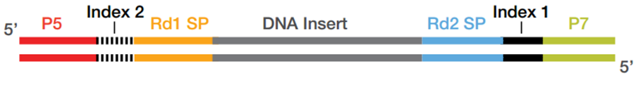{width=80%}  
>2. Load library on the **flow cell**:    
>    i) The flow cell is a glass slide with P5 and P7 oligo's attached to the surface.  
>    ii) The DNA fragments are denatures and single stranded fragments anneal to P5 and P7 oligo's present on the flow cell.    
>3. **Cluster** growth:    
>    i) Fragments are amplified, the P5 and P7 oligo's are used as the primer for this process ensuring that the final molecule is attached to the flow cell.    
>    ii) Multiple amplification cycles result in a cluster of fragments.    
>    iii) This procedure occurs for millions of fragments resulting in millions of clusters.    
>    iv) The reverse strands are cleaved, ensuring that the same strand is used for sequencing within each cluster.    
>4. Sequencing by synthesis:    
>    i) Sequencing primer (Rd1 SP) is added and 4 fluorescently labelled nucleotides compete for incorporation in the growing strand.     
>    ii) Image acquisition: A laser excites the clusters and the signal from the incorporated nt is measured.     
>    iii) The emmission wave length and signal intensity determine the **base call** and the **quality** of the reading.    
>    iv) A special index read primer is used to sequence the barcode.    
>    v) For paired-end sequencing, the above procedure is repeated with the reverse strand.    
<a href = "https://hbctraining.github.io/Intro-to-ChIPseq/lessons/02_QC_FASTQC.html">
{width=80%}    
</a>
</details>

<!--Currently Illumina also has the nextSeq 500 series (besides MiSeq and HiSeq mentioned in the video). One of the main difference being that the MiSeq and HiSeq use four fluorescent colors (G = blue ,C = green, A = yellow and T = red) while the nextSeq series use 2-color chemistry (green and red). The effect being that with each cycle for the NextSeq, only two images need to be taken, As ar read as clusters appearing in both images and Gs are read as clusters that are not present in either of the two.-->    

<br>
The **sequencer** analyzes a set number of bases, eg 42, 50 or 100 bp, called a **read**. The resulting **base calls** and their **quality scores** are stored in **fastq files** which have the .fq or .fastq extension (or compressed as .fq.gz or .fastq.gz). These are always organized in the same manner with 4 lines per read. This is an example with 2 DNA sequences (8 lines):  
<br>
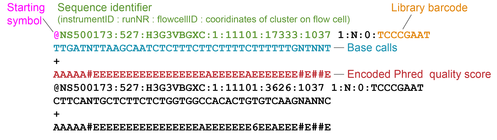{width=100%}     
<br>

1.  Header starts with '@'-sign and contains a unique sequence ID (the element up to the fist space). This header often follows a set substructure. Element after the space often includes the sample barcode.    
2. Called bases in ACGTN-alphabet   
3. Midline, can be empty or hold '+'  
4. Quality score for each nucleotide, also called **Phred score**. 

<br> 
The Phred scores represents the probability (p) that the reported call is incorrect. You do not need to learn this encoding by heart but they will come back in the Quality Control step of our analysis, therefore we discuss briefly how they are encoded:    

Phred quality score | Probability of incorrect base call | Accuracy | Characterer     
:--:|:--:|:--:|:--:|:--      
0 | 1 in 1 | 0% | !  
10 | 1 in 10 | 90% | +  
20 | 1 in 100 | 99% | 5  
30 | 1 in 1000 | 99.9% | ?  
40 | 1 in 10000 | 99.99% | J  

Here's another visualization of how Phred scores are encoded :   
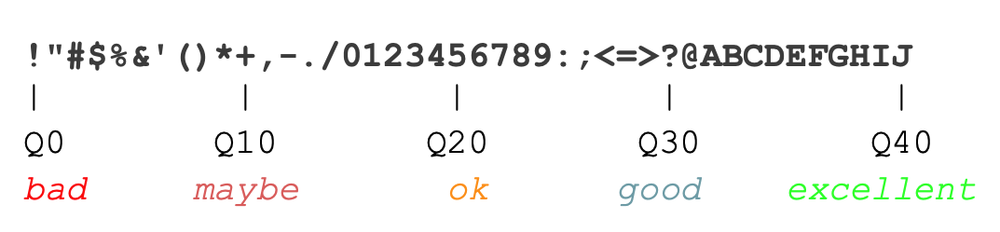{width=80%}   

<details><summary>Here's the complete encoding of Phred scrores 0-40.</summary>
> *Background*:  
{width=80%}   
<!--ref: Amixon TRAINING, Bioinformatics for beginners - File formats Part 2. - Short reads, written on 01/07/2013, visited on 29/11/2020, through: https://www.omixon.com/bioinformatics-for-beginners-file-formats-part-2-short-reads/-->

</details>

<br>
Before we can start our data analysis and identify for example regions marked by activating and repressing histone marks, we need to process the raw data. This includes cleaning up, mapping, visualizing the sequenced reads and identifying genomic regions where reads tend to pile up (in other words "peaks"). Which is what we will discuss next.   
<br>  

## 1.3 Raw data to science  {data-progressive=TRUE}  
### 1.3.1 Post-sequencer processing      
The sequencer determines the sequence of the DNA molecules in your sample and produces massive amounts of data. In an ideal world, these data would 100% reflect reality. But..... It doesn't and it is often your or a bio-informaticians task to discriminate valuable signal from artefacts and noise, the latter being accumulations of reads in regions that don't actually contain binding sites of the protein or mofidified histone of interest.   
<br>
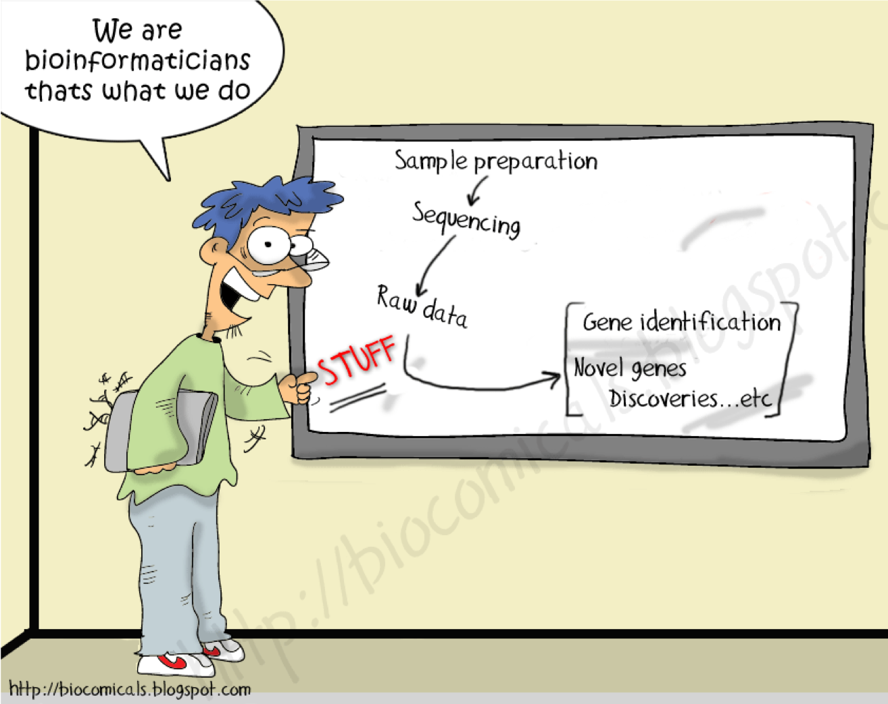{width=60%}\    
<br>
A general analysis workflow for ChIP sequencing data involves the steps discussed below. In theory, all of them can be performed in R but the first steps are commonly performed by tools outside R (often on Linux server). The resulting peakfiles, files with read depth and/or read counts are then imported in R.  
<br>
Visually depicting the analysis:  
  
<!--ref: http://www4.utsouthwestern.edu/mcdermottlab/NGS/analysis/analysis-chipseq.html -->  
  
<!--ref: http://www4.utsouthwestern.edu/mcdermottlab/NGS/analysis/analysis-chipseq.html -->  

<br>
Here we will discuss the steps that are necessary to turn the raw  before we can start our analyses in R:  
<br> 

#### 1. Run a quality check on the raw data  
We run the raw fastq files through [FASTQC](https://www.bioinformatics.babraham.ac.uk/projects/fastqc/) software to get a quick impression of whether our data has any technical problems of which we should be aware before doing any further analysis. This tools outputs a HTML report with  graphs and tables summarizing, among others the base call accuracy, library base composition, duplication levels and the presence of overrepresented sequences.    

The **Per base sequence quality** plot is one of the most important plots generated. It summarizes the base call accuracy (Y-axis) for each cycle (X-axis) across the library. See this example:  
 <br>
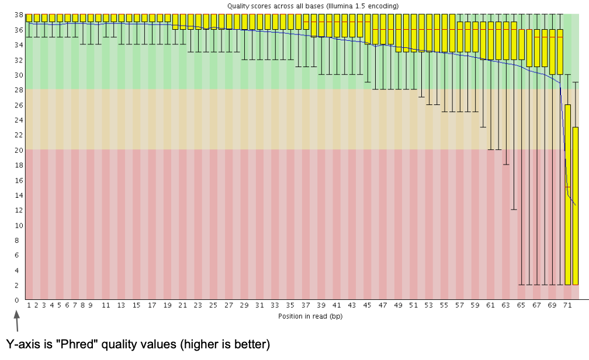{width=80%}  

This exmaple shows the average Phred quality for a library sequenced to 72 bp. The majority of bases have a good quality, the quality drops for the last two bases and we should (in this case) remove these from the end of the read. 

For most runs, quality should be good for most reads through the whole run. If quality is low, we can use the other plots and tables to try to understand why this is.

- Good (Illumina) quality is generally Phred > 28 - 30    
- Concerning (Illumina) quality is Phred < 20  

If the QC does not support major technical problems like a systematic base bias that occured during sequencing or contamination during sample prep with foreign DNA, we can continue.  

> **Exercise 1**  
> Use the following two FASTQC reports to answer the following questions.  
> 
- [FASTQC report 1](https://ctoen.github.io/FunctGen/example1_sequence_short_fastqc.html)  
- [FASTQC report 2](https://ctoen.github.io/FunctGen/example2_sequence_short_fastqc.html)

```{r quiz_fastqc}
quiz(
    question("What is the sequence length?",
             answer("45"),
             answer("40", correct = T),   
             answer("Can't be answered using these reports"), 
             allow_retry = TRUE,
             random_answer_order = TRUE),
    question("Which shows the **best per base sequence quality**?",
             answer("report 1", correct = T),
             answer("report 2"),
             allow_retry = TRUE))
```
<br>

> *Background*: For detailed discussion on FASTQC reports see the FASTQC website of the Babraham institute, and their tutorial on Quality Control in Sequencing Experiments [ref](https://www.bioinformatics.babraham.ac.uk/training.html#sequenceqc).  

<br>

#### 2. Trim and quality-filter reads  
In this cleaning step we predominantly:  

- Remove reads composed solely of adapters without insert.  
- Remove reads with an overall low-quality.  
- Remove or mask low-quality bases within predominantly high quality reads (if these occur, they are often the last one or two bases for Illumina sequencing). This can result in the complete removal of some reads because of their overall low quality or short length.   

<br>

#### 3. Align reads to the genome  
Next Generation Sequence (NGS) alignment means that we identify the likely location in the reference genome where the original DNA molecule came from. This process is called **aligning** and is performed by **alignment tools**, also called **read mappers**. Well known examples include STAR, BWA and bowtie2. In essence, these tools perform the same tasks but with different algorithms/strategies.  
<br>
Since the publication of the human genome, successive versions have been released (also called **assemblies** or **builds**). The improvements in quality are thanks to technological advancements as well as improvements in the representativeness of the genome with respect to the genetic diversity found in the human population. We will work with (one of) the latests relaese referred to as **GRCh38** or **hg38** (Genome Reference Consortium Human Build 38).  
<br>
The aligner thus requires as input the quality-filtered and trimmed fastq files together with the reference genome.  
<br>
The outputted alignment is stored in (*huge!* ) TAB-delimited text Sequence Alignment Map files, **SAM files**. The compressed version of SAM files are called **BAM files** (Binary Alginment Map).  
<br>

<details><summary>Click here for additional information about SAM/BAM file format.</summary>
> *Background*: The SAM/BAM files contains a header with information about the mapping procedure. This is followed by the read alignments with 1 line per read. The latter contains information about the read sequence, how much of it was mapped to the reference genome (eg. the whole read or only part of it), how well it alinged, and lots of other information, dependent on the aligner.  
<br>
To give you a feel for how SAM files looks like, here's an example of the header and one record:  
{width=100%}     
<!-- ref: Simon Andrews, Babraham Bioinformatics, Quality control for Sequencing Experiments pdf, v2019-11 --> 
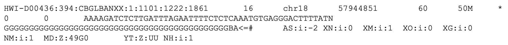{width=100%}     
<!-- ref: Simon Andrews, Babraham Bioinformatics, Quality control for Sequencing Experiments pdf, v2019-11 --> 
This example tells you among others that the library was mapped with [hisat2](http://daehwankimlab.github.io/hisat2/manual/) to the mouse reference genome GRCm38 with certain additional settings. The single displayed read is mapping to chr18, starting at position 57944851.    
<br>
In summary:  
{width=100%}   
Each record holds at least 11 columns (exact number depends on the aligner and post-alignment analytics performed on the file):  
>
ColumnNR | Description | Example  
:--|:--|:--  
1. | Read name | HWI-D00436:394:CBGLBANXX:1:1101:1222:1861    
2. | 12 "bits" flag summarizing of the alignment. Webtools to explain the meaning of each flag: [samformat](https://www.samformat.info/sam-format-flag), or [Broad Institute](https://broadinstitute.github.io/picard/explain-flags.html) | 16  
3. | Chromosome in the reference genome the read aligns | chr18
4. | Position within the chromosome the read aligns | 5794485  
5. | Mapping quality score, different programs use different scores | 60    
6. | CIGAR string, is a summary of the alignment per nt | 50M 
7. | Chromosome where the paired read aligns | chr18 (if there is no paired read 0 or *)   
8. | Position within where the paried read aligns |  5794685 (or 0 if there is no paired read)  
9. | Length of the complete fragment, from the first mapped base of read 1 to the last mapped base of read 2. | 200 (0 if there is no pair)   
10. | Called bases | AAAAGATCTCTTGAT...   
11. | Phred quality score of the read | GGGGGGGGGGGGGGG...    

</details>

<br>

#### 4. Filter artefacts and reads aligning to multiple regions  
From the initial alignment we often identify and remove PCR artefacts, reads aligning with a low mapping quality (column 5) and optionally remove reads aligning non-uniquely. These actions can be performed with various tools. Commonly used ones are [SAMtools](http://samtools.sourceforge.net/) and [Picard tools](https://broadinstitute.github.io/picard/). The input and output of these steps are both BAM files.    
<br>

#### 5. Visualize read depth    
Files are created that count how many reads align to each nucleotide in the reference genome. Nucleotides with a relative high score pinpoint the likely locations of the ChIPped factor or histone PTM; to a region of accessible chromatin in ATAC-seq; or to the region that was likely transcribed and detected in RNA-seq.  
<br>
These files can be uploaded to the UCSC Genome Browser which we will look at in more detail today as well. Various file types can store this kind of data. We wil use bigwig files (.bw file extension), these are fast and relatively small but we can't view them.    
<br>
<details><summary>A fictional example of alignment and a read depth graph</summary>  
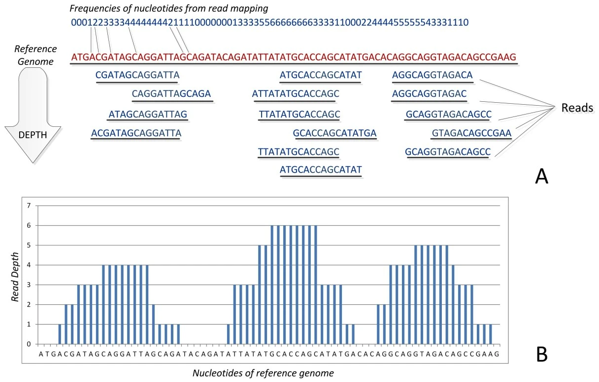{width=80%}  
<!-- ref: Pavlopoulos et al (2013) BioData Mining 6, Article number: 13 (2013), figure 6 -->
</details> 
<br>

#### 6. Call peaks  
Reads are scattered through the genome but locations where the used antibody recognizes its target (eg. DNA-binding TF, histone, histone variant or histone PTM) will collect more reads. **Peak calling** is the computational process to identify these regions, often with respect to a control dataset where no antibody or no specific antibody was used, resp.  **input control** and **IgG control** . A commonly used tool for this step is [MACS2](10.1186/gb-2008-9-9-r137). MACS2 was also used to call peaks in the datasets that we will be using.  
<br>
Peak calling is a statistical procedure and never black and white. It depends among others on thresholds used (p-value, false-discovery rate) and the control sample. It is always wise to visually inspect the resulting peaks in the UCSC genome browser. If the called peaks do not correspond to the sites with high read coverage, you may need to adjust the settings for peak calling.    
<br>
Peaks are repored as regions, or **genomic intervals** with their genomic coordinates: **chr start end**. As well as a **score** that indicates the strength of the signal observed for this peak. We will look at these files more closesly in week 2.  
<br>

#### 7. Read counting  
Count reads that fall within genes, other genomic elements or peak regions. These counts and the actual peak locations are used for eg. differential gene expression analyses in RNA-seq or differential TF-binding in ChIP-seq (comparing differentiated vs undifferentiated or control vs treatment). A well-known, widely used tool for this purpose is DESeq2.   
<br>
Sample clustering can be included here as additional QC. It should identify which samples are closely related and if they don't, this might point to a label swap or more severe issue like not-working stimulus in one of the replicates.  
<br>
Here's an example of such a clustering, showing how different each sample is. Samples 15754-56 should be moslty similar and different from 15757-59, and vice versa:  
`r colorize("Siebren: what's the color legend representing?", "red")`  
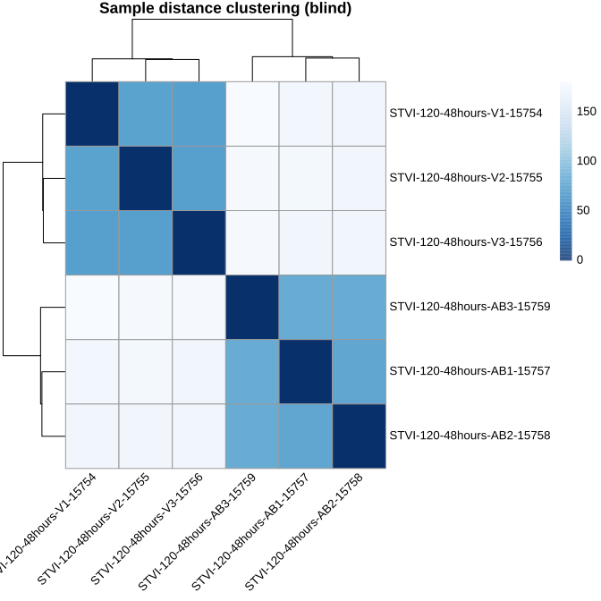{width=60%}    

> #### 8. Optionally: DNaseI footprinting, variant calling, novel gene identification and more     
Depending on your experimental set up additional steps are performed outside R. For DNaseI-seq, we can identify small depleted regions within peaks that correspond to the nucleotides that interact with the TF. This interaction protects these nucleotides from DNaseI attacks. These so-called footprints can be used to identify TF motifs and predict the likely TF bound. Although this sounds simple, and for a stable binding factor like CTCF it may be the case, it is not always that simple in reality.    

<br>

### 1.3.2 Common causes of noise and artefacts  
Artefact and noise in your data can arise from various causes. Here's a list of common **causes**:    

1. Synthetic DNA sequences  
2. Poor base call accuracy  
3. Amplification bias during library preparation   
4. Genomic repeats and Low complexity regions  

> **Exercise 2**: 
Below is a list of descriptions and methods to handle these arefacts. Read these carefully and combine what you think is the most likely description and method to handle the above mentioned artefacts.  

**Descriptions**:  

A.  The amount of nucleic acids you generally obtain from your cells is often too low to be directly analyzed and one or more steps of PCR are needed (unless you use special, amplification-free protocols and sequencing methods). Not all DNA or RNA molecules behave the same in this reaction. Some are amplified more than others.  
B.  These include adapters ligated to the DNA molecules to allow their amplification with uniform primers during library prep and in the sequencer. These adapter sequences come with the kit or are designed by the researcher self.  
C.  Short tandem repeats and interspersed repeats make up roughly 50% of the human genome. Reads produced by sequencers are generally shorter than these sequences, thus mapping them becomes ambiguous. 
D.  The chemical reaction and quality of the optical measurement that occur in the sequencer are not perfect and depend among others on the nucleotide composition of all samples, the length of the DNA molecules and the concentration of the samples. Each nt is therefore given a quality score that reflects the accuracy of the measurement.   


**Methods**:  

a. We can control for this by using the input sample as the control during peak calling, paired-end sequencing and remove all fragments with exactly the same coordinates for read 1 and read 2, and/or the use of a unique molecular identifier (UMI) appended to our adapters that labels each DNA fragment uniquely.  
b. There are usually 3 choices: (1) Discard them; (2) Take the best alignment, if there are multiple best hits take one randomly; (3) Report all alignments or report up to a certain number. The strategy you choose depends on the sample, the technology, your research question and the reference species you work with.  
c. Filter these out of our dataset right after we get our data from the sequencer.  
d. Remove low-quality nt's from reads or remove reads altoghether if all their nt's are of low quality. 


```{r quiz_artefacts}
quiz(caption = "Which answers summarize the appropriate combinations of artefact - description - method?",
    question("For (1) *Synthetic DNA sequences*",
             answer("Description B; Method c", correct = T),
             answer("Description D; Method d"), 
             answer("Description A; Method b"),
             answer("Description C; Method a"), 
             allow_retry = TRUE,
             random_answer_order = TRUE),
    question("For (2) *Base call accuracy*",
             answer("Description B; Method a"), 
             answer("Description C; Method b"),
             answer("Description D; Method d", correct = T),
             answer("Description A; Method c"), 
             allow_retry = TRUE,
             random_answer_order = TRUE),
    question("For (3) *Amplification bias during library preparation*",
             answer("Description D; Method b"),
             answer("Description C; Method d"),
             answer("Description B; Method c"),
             answer("Description A; Method a", correct = T),
             allow_retry = TRUE,
             random_answer_order = TRUE),
    question("For (4) *Genomic repeats and Low complexity regions*",
             answer("Description D; Method a"),
             answer("Description C; Method b", correct = T),
             answer("Description B; Method c"),
             answer("Description A; Method d"),
             allow_retry = TRUE,
             random_answer_order = TRUE)   )
```
<br>

`r colorize("Exercise 2: Choose the right order of steps that is used for ChIP-seq data analysis from the following list of options", "red")`    

{width=80%}\   
[Furay, 2012, Nat Rev](https://pubmed.ncbi.nlm.nih.gov/23090257/)  

<!--
- **Amplification bias during the library preparation:** The amount of nucleic acids you generally obtain from your cells is often too low to be directly analyzed and one or more steps of PCR are needed (unless you use special, amplification-free protocols and sequencing methods). Not all DNA or RNA molecules behave the same in this reaction. Some are amplified more than others and this can generate a bias. We can control for amplification bias with:  
  
  + Use input sample, for example as control in peak calling  
  + Paired-end sequencing 
  + Add a Unique Molecular Identifier, UMI, to the barcodes, to 

  
- **Synthetic DNA sequence:** These include adapters ligated to the DNA molecules to allow their amplification with uniform primers during library prep and in the sequencer. These adapter sequences come with the kit or are designed by the researcher self. Whether they are custom or commercial, they should be removed because they were not part of the original DNA or RNA material.    
- **Base call accuracy:** The chemical reaction and quality of the optical measurement that occur in the sequencer are not perfect and depend among others on the nucleotide composition of all samples, the length of the DNA molecules and the concentration of the samples. Each nt is therefore given a quality score that reflects the accuracy of the measurement or base call accuracyas it is also called.  
- Lastly, when trying to pinpoint the location in the reference genome where the DNA mo lececule most likely was derived off, we are confronted with:  
  
  * **Genomic repeats.** The origin of reads coming from these reigons is difficult to pinpoint. But also, the reference genome might contain more or less number of repeats than the original sample.  
  * **Low complexity regions**. These are regions that contain a lot of sequence similarity, eg telomeres. Because of this the quality of the reference genome is generally low in these regions. -->
 
<br> 

### 1.3.3 Alternatively: use Publicy available data   
Multiple public databases are available to download Genomics data from. Often various data types are available (e.g., fastq, bam, bigwig, and peak files). These ...


In 2014 a core set of principles were drafted in order to optimize the reusability of research data, the resulting  **FAIR principles** were [published](https://www.nature.com/articles/sdata201618) in 2016. They represent a set of guidelines and best practices to ensure that data or any digital object are **Findable**, **Accessible**, **Interoperable** and **Re-usable** with special emphasis on enhancing the ability of machines to automatically find and use data.  

{width=80%}    
 <!--The Open Science Training Handbook, via https://book.fosteropenscience.eu/en/,-->  

- **Findable**: The first thing to be in place to make data reusable is the possibility to find them. It should be easy to find the data and the metadata for both humans and computers. Automatic and reliable discovery of datasets and services depends on machine-readable persistent identifiers and metadata.

- **Accessible**: The (meta)data should be retrievable by their identifier using a standardized and open communications protocol, possibly including authentication and authorisation. Also, metadata should be available even when the data are no longer available.

- **Interoperable**: The data should be able to be combined with and used with other data or tools. The format of the data should therefore be open and interpretable for various tools, including other data records. The concept of interoperability applies both at the data and metadata level. For instance, the (meta)data should use vocabularies that follow FAIR principles.

- **Re-usable**: Ultimately, FAIR aims at optimizing the reuse of data. To achieve this, metadata and data should be well-described so that they can be replicated and/or combined in different settings. Also, the reuse of the (meta)data should be stated with (a) clear and accessible license(s).

An extensive list of databases for genomics research can be found [here](https://sites.google.com/site/anshulkundaje/idataset).  

<br>  

## 1.4 UCSC Genome Browser     
### 1.4.1 UCSC Genome browser intro   
Genome browsers are great tools to display genomics data. You can walk, or **browse**, through all chromosomes, look at the location of genes, extract DNA sequences, examine pre-loaded data or upload your own data. The latter comes in quite handy when you want to, for example, have a visual (personal) confirmation of data quality, evaluate the effect of different settings for processing the raw reads, and/or confirm as computationally detected associations.  
<br>

Watch the following youtube video's to get familiar with the UCSC Genome Browser:  

1. UCSC Genome Browser Basics (duration: 08.40):     
2. UCSC Genome Browser Tracks (duration: 09.14):    

<br>

**Checklist**:  

* Watching video 1 you should be able to:  
    + Access your genome & assembly of interest in the UCSC Genome Browser.  
    + Find the chromosomal coordinates of the region currently in view or of a region you just selected (with click+drag).   
    + Go to a gene or region of interest.  
    + Zoom in and out.  
    + Recognize UTRs, exons, introns, and the direction of transcription.  
    + Find the length of a region or gene.  
* After watching video 2 you should be able to:  
    + Define what we mean with a track.  
    + Adjust the display of tracks: eg. full, pack, hide etc.  
    + Display tracks from the list of preloaded tracks below the browser (important: hit `refresh`).  

<br>
Additional important actions and terms that were not explicitly discussed in the videos:  
  
- **Selecting a region in the genome browser**: hold shift-key and click/drag with your left mouse key over the region. A pop-up appears to 'Zoom in', 'Add highlight' or 'Cancel' (cancel = do nothing).  
  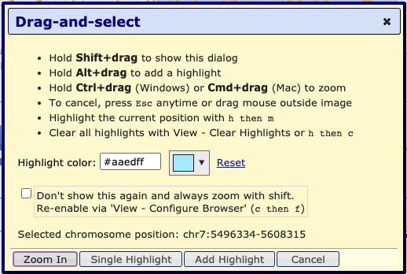{width=60%}  

- **Upstream** and **downstream** refer to a position relative to the coding strand of a gene. Upstream means to the 5' end and beyond. Downstream means to the 3' end and beyond. Thus, depending on the orientation of the gene, upstream can mean that you move in the direction of the start of the chromosome or to the end of the chromosome.  
    {width=80%}  
<!--https://www.mun.ca/biology/scarr/iGen3_05-03.html--> 

<!-- *Optional videos*: finding the coordinates of a sequence using blat, handy for eg. primers, and using the Table Browser to, among others, obtain DNA, RNA or protein sequences:  
1. [UCSC Genome Browser Blat, 9m39s](https://www.youtube.com/watch?v=E6DDNGDXH8A)   
2. [UCSC Genome Browser Table Browser, 7m19s](https://www.youtube.com/watch?v=Ueqt5Wgre9c&ab) -->  

<br> 

### 1.4.2 Go to the UCSC Genome browser  
**Let's go to the UCSC genome browser....**  

<span style="color: goldenrod; font-family: Arial; font-size:16px;">**Action**: Go to the [UCSC Genome Browser](https://genome.ucsc.edu/index.html) (blue text is a link, use right-mouse click to open in new window).</span>   
<br> 
The starting page has been updated since the video was made but still holds the same blue bar at the top with **Genomes**, **Tools**, etc.:  
{width=80%}\     

<br>

> *Tip*: In case you have been here before, it is wise to reset user settings such that you don't continue with settings from a previous project. For this, hover over "Genome Browser" and select "Reser All User Settings".  

> *Tip*: A pop-up may appear now or one stap later, redirected you to the official European mirror site if those servers are geographically closer, that's ok.  

<br>
<span style="color: goldenrod; font-family: Arial; font-size:16px;">**Action**: To access the human genome, select the "Genomes" tab.</span>     
<br>
On the left you can browse and select the genome you are interested in (not a drop-down menu anymore as in the video). By default, the human genome is selected.   
<br>
We can go to a position of our choice by entering the gene or chromosomal coordinates under **Position/Search Term** or immediatly go to the 'Current position' by clicking on `GO` on the right-hand side or **Genome Browser** in the menu bar on top.  
<br>
<span style="color: goldenrod; font-family: Arial; font-size:16px;">**Action**: Ensure that "Human" is selected in the REPRESENTED SPECIES tree and "Dec. 2013 (GRCh38/hg38)" is selected under Human Assembly (red arrows in image below).</span>     
<br>
<span style="color: goldenrod; font-family: Arial; font-size:16px;">**Action**: Go to *ACTB* gene (gene coding for non-muscular actin part of cytoskeleton).</span>    
<br>
*Genomes page, ready to go to ACTB gene in Human genome GRCh38*:  
{width=90%}\    

>#### **Tip**:    
<details><summary>To change the width of the browser (to fit your screen): </summary>
> Go to "Genome Browser" > "Configure". And adjust the "image width:" .. pixels. Hit `submit` to apply the changed settings and return to the browser:  
> 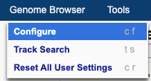   
> 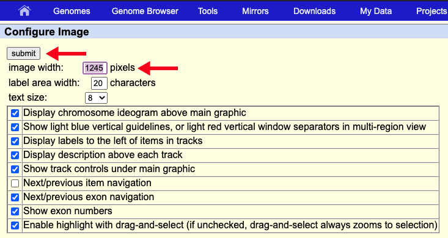{width=80%}  
</details>

>#### **Optional check**:    
<details><summary>Your browser should be showing genomic region:</summary>  
<br>
> chr7:5,527,148-5,530,601      
</details>

<br>
As discussed in the video, in the top of the window we have navigation and zoom bottons. Right below we can read the chromosomal coordinates and length of the regions we are currently viewing (in this case the complete *ACTB* gene). Below that we see a miniature chromosome with the characteristic gray/black pattern from karyotyping. A red `r colorize("|", "red")`-sign gives us an idea of our current positioning in the chromosome.   
<br>
```{r q3_actin_location}
question("What chromosome is ACTB located on? And is it located on the short or long arm of this chromosome?",
  answer("chr7, short arm", correct = TRUE, message = "The *ACTB* gene is indeed located on the short arm of chromosome 7. In the coordinates bar and in the 'ruler' track we can see that we are looking at chromosome 7. By looking at the red |-sign in the chroosomal idiogram, we see that this gene is located to the left of the centromere (red diabolo within the idiogram) and thus ont the short arm."),
  answer("chr7, long arm", message = "Where do you see the red |-sign in the miniature chromosome on top?"),
  answer("chr17, short arm", message = "Review the UCSC Genome Browser Basics video, or find *chr#* in the browser window"),
  answer("chr17, long arm", message = "Review the UCSC Genome Browser Basics video, or find *chr#* in the browser window"),
  allow_retry = TRUE)
```
<br>
The data window displays various **tracks** or **track sets**. Tracks runs the complete length of the chromosome. Data includes most often:   

- **Positional information**, of a gene, SNP or cir-regulatory element for example, often displayed as horizontal bars the thickness and color of which can hold additional information depending on the type of track.  
- **Signal information**, of gene expression, detection of histone marks or degree of conservation. Often displayed as histograms but can also be summarized in vertical bars with different levels of color intensity encoding the signal intensity.   

<br>

>#### **Refresher**:     
<details><summary>Adjusting the display of tracks by:   </summary>  
>
>1. Right-mouse click on the grey, vertical bar at the left-most area of the Genome Browser shows you options `hide`, `dense`, `squish`, `pack` and `full`. Additional adjustments to the track can be made by selecting `Configure [track name]` in this menu.  
> 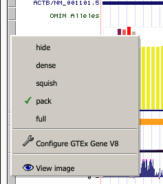{width=40%}  
> 2. Scroll to the area below the data window, here you see a possibly overwhelming list of potential tracks, most are `hidden`. Using the pull down menu you can change display settings of multiple tracks at once. Always make sure to hit the `refresh` button below the browser window to ensure all changes are performed.  
</details>

<br>
<span style="color: goldenrod; font-family: Arial; font-size:16px;">**Action**: hide all tracks and tracksets except for the ruler and GENCODE v32 tracks.</span>   
<br>
<span style="color: goldenrod; font-family: Arial; font-size:16px;">**Action**: for GENCODE v32, via "Configure GENCODE v32", make sure the option "splice variants" is unchecked.</span>     
<br>

>#### **Optional check**:   
<details><summary>In case you want to check your settings, these screenshots could help you:</summary>  
<br>
Configuration window for GECODE v32 gene track with splice variants unselected:   
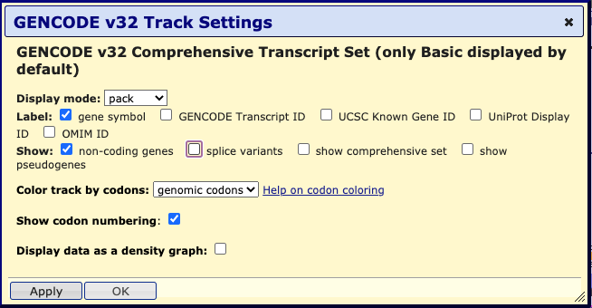{width=90%}\    
</details>
<br>
<details><summary>Your GB session should look like this:</summary>   
{width=90%}\  
</details>


We see the complete *ACTB* gene with exons as horizontally stretched rectangles and **introns** as horintal lines with arrowheads in them indicating the **direction of transcription**. The exons have different heights. The highest regions correspond to  **coding exons**, the other regions are the **5-** and **3UTR**.  
<br>
More information about *ACTB* can be obtained by clicking on the gene in the browser. Doing that brings you to a gene page like:  
{width=80%}\       
<br>

```{r q4_ACTB_exons}
question("How many exons does the *ACTB* gene have?",
          answer("5", message = "exons are displayed as thicker lines in the gene, introns as lines with arrows in them."),
          answer("6", correct = TRUE),
          answer("7", message = "one exon can contain coding and non-coding (UTR) elements" ),
          answer("8", message = "one exon can contain coding and non-coding (UTR) elements"),
           allow_retry = TRUE)
```

*Figure for the following two questions*:   
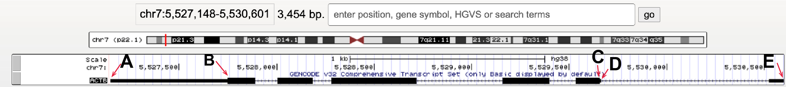{width=100%}\   
```{r q5_ACTB_start}
quiz(caption = "", 
     question("Which letter points to the TSS?",
     answer("A", message = "Pay attention to how directionality is visualized in the UCSC Genome Browser, discussed in video 1 at 4:30"),
     answer("B", message = "Pay attention to how directionality is visualized in the UCSC Genome Browser, discussed in video 1 at 4:30"),
     answer("C", message = "Pay attention to the visualization of UTRs, discussed in video 1 at 5:10"),
     answer("D", message = "Pay attention to the visualization of UTRs, discussed in video 1 at 5:10"),
      answer("E", correct = T),
         allow_retry = TRUE),
     question("What statement about the *ACTB* gene is correct? (Select ALL that apply.) ",
              answer("ACTB gene is encoded on the minus-strand", correct = TRUE),
              answer("The TTS of ACTB gene has a higher coordinate than its TSS", message = "Look at the direction of arrows in the introns."),
              answer("The *ACTB* nascent RNA is appr 1.9kb", message = "The nascent RNA contains coding and noncoding elements."),
              answer("The coding size of this gene is appr 1.9kb", correct = TRUE),
              answer("If we want to look at the promoter of this gene, we have to move slightly to the right", correct = TRUE),
              answer("The 5UTR contains an intron.", correct = TRUE),
         allow_retry = T)
)

```
<br>

<span style="color: goldenrod; font-family: Arial; font-size:16px;">**Action**: Go to the gene *SPI1* </span>    
<br>
*SPTI1* encodes the myeloid and B-cell specific transcription factor PU.1 [Pham 2012 Blood](https://doi.org/10.1182/blood-2012-01-402453).  

>#### **Optional check**:   
<details><summary>Your browser should be showing genomic region:</summary>   
<br>
> chr11:47,354,860-47,378,576       
</details>


Use the browser view and the gene page of *SPI1* to answer the following question.  

```{r q7_spti}
question("What statement about the *SPI1* gene is correct? (Select ALL that apply.)",
         answer("This gene spans 23717 bp", correct = T),
         answer("This gene spans 23127 bp", message = "The coding region spans 23127bp but this excludes the UTRs. What genomic width is the browser covering after navigating to the *SPI1*?"),
         answer("*SPI1* is encoded on the plus strand", message = "*SPI1* is not encoded on the plus strand, check the direction of the arrows."),
         answer("*SPI1* has 5 exons and 7 introns", message = "*SPI1* doesn't have 7 introns, check the number of straight lines (=introns) in the GB view."),
         answer("*SPI1* has 5 exons and 4 introns", correct = T),
         answer("*SPI1* has 7 exons and 4 introns", message = "*SPI1* doesn't have 7 exons. One exon can contain coding parts and the UTR."),
         answer("It encodes a an zinc finger domain transcription factor", message = "*SPI1* is not a zinc-finger TF, check it's gene page."),
         answer("This gene encodes an ETS-domain transcription factor", correct =  T),
         answer("The nearest downstream protein-coding gene is *MYBPC3*", correct = T),
         answer("The nearest upstream protein-coding gene is *MYBPC3*", message = "*MYBPC3* is not the nearest upstream. Review the image on upstream and downstream in section 1.4.1"),
         allow_retry = TRUE)

```

**Wonderfull, you are now able to navigate in the genome browser, recognize genes, their location within the chromosome, and their coding elements as well as their orientation. These are important reference points used when we visualize genomics data.**  

<br>

### 1.4.3 Viewing BLUEPRINT data   
**Yes! Finally time for some real data! Using the UCSC Genome Browser, you will inspect characteristic histone PTM and DNaseI-seq combinations, what their location in relation to genes and - ultimately - what this may say about the gene's transcription state.**    

<br>
To upload the data we have already put them together in a so-called track hub, hosted by our own server. We can add this to our browser session by going to the tab "My Data" in the top menu and select "Track Hubs". In the "My hubs" tab you can paste a URL that points to the location of data you want to upload.   
<br>
<span style="color: goldenrod; font-family: Arial; font-size:16px;">**Action**: Upload the required data using the following URL and return back to the Genome Browser:</span> `http://mbdata.science.ru.nl/ctoenhake/edu/trackhub_monocytes/hub.txt`.       
<br>  

>#### **Optional check**: 
<details><summary>Screenshots showing where to go to add the trackhub: </summary>  
<br>
Note the "My Hubs" tab in the second screenshot:
{width=100%}\    
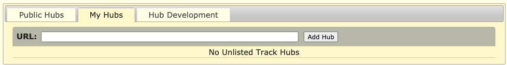{width=100%}\    

>#### **I get a warning**:
<details><summary>What to do with `r colorize("ERROR: Couldn't open [URL]..", col = "red")`? </summary> 
> If you see this error, you can first:  
>
> 1. Check the spelling of the URL. If no mistakes were made, hit 'Retry Hub'.  
> 2. 'Disconnect' this hub and copy-paste the URL again.  
> 3. If none of the above work, ask peers and/or assistants. </details>
>
<br>
<details><summary>What to do when a track is replaced by a folder location? </summary> 
>
> 1. Reload the page.  
> 2. Connect the hub again.  
</details>

Note that, after adding the trackhub, an additional section is added below the browser, specfic to the tracks in this trackhub.  

```{r q8_trackhub}
question("What is the name of this trackhub",
          answer("Trackhub", message = "Examine the section for this hub below the browser view."),
          answer("BLUEPRINT monocytes", correct = TRUE, message = "Notice that this hub contains additional tracks that are currently 'hidden'. We will use them in part 1.4.4."),
          answer("Functional Genomics", message = "Examine the section for this hub below the browser view." ),
           allow_retry = TRUE)
```

This trackhub contains histone PTM ChIP-seq and DNaseI-seq data of monocytes, to be precise of **CD14+, CD16- classical monocytes**. 
<br>

> *Background*: CD14 and CD16 are cell surface markers of the **CD (Cluster of Differentiation) gene family** which we will come across more often during this practical. These cell surface molecules and their differential expression are used for immunophenotyping of cells. CD molecules can function as receptors, ligands and, for example, activate signalling cascades, mediate cell adhesion, cell migration, regulate gene expression etc. [HUGO, genegoups, CD](https://www.genenames.org/data/genegroup/#!/group/471)  

<br> 
We have the following datasets:      

+ H3K9me3 ChIP-seq, grey   
+ H3K27me3 ChIP-seq, grey  
+ H3K4me3 ChIP-seq, red   
+ H3K4me1 ChIP-seq, yellow   
+ H3K27mac ChIP-seq, pink    
+ H3K36me3 ChIP-seq, lightgreen   
+ DNaseI-seq data, blue 
+ polyA-selected, stranded RNA-seq data (plus and minus seperate), forestgreen  
+ Input ChIP-seq, black

<br>
What we haven't discussed so far is the **y-axis** at the left side of the tracks with **signal information** such as the ones just uploaded. Using this y-axis we can evaluate signal intensities. The height is currently set to 30, 50 or 100. This corresponds to the number of reads mapping to that location per million reads in the library. You can change the height of the y-axis by right-mouse click on the trakname, select the "Configure [trackname]" option and change under "Vertical viewing range", the min" and "max". Hit `APPLY` afterwards.  
<br>
<span style="color: goldenrod; font-family: Arial; font-size:16px;">**Action**: Go back to the *ACTB* locus </span>  

>#### **Optional check**:    
<details><summary>Your browser should be showing genomic region:</summary>  
<br>
> chr7:5,527,148-5,530,601      
</details>

```{r q9_ACTB_expression}
quiz(caption = "",
  question("A.) Look at the RNA-seq tracks, would you conclude that the ACTB gene is active?",
       answer("Yes", correct = TRUE),
       answer("No"),
      allow_retry = T),
  
  question("B.) If you would only have ChIP-seq data, which dataset is the most preferred one to answer (A.)?",
         answer("monocyte_H3K9me3", message = "H3K9me3 is associated with silencing, not active genes."),
         answer("monocyte_H3K27me3", message = "H3K27me3 is associated with silencing, not active genes."),
         answer("monocyte_H3K4me3", message = "H3K4me3 is definitely number two, but another histone PTM is more directly associated with transcription."),
         answer("monocyte_H3K4me1", message = "H3K4me1 is not the best mark from this list to recognize active genes."),
         answer("monocyte_H3K27ac", message = "H3K27ac is not the best mark from this list to recognize active genes."),
         answer("monocyte_H3K36me3", correct = TRUE, message = "Indeed, H3K36me3 is the histone mark with the highest correlation to transcription."),
         allow_retry = TRUE)
)
  
```
<br>
<span style="color: goldenrod; font-family: Arial; font-size:16px;">**Action**: From the *ACTB* locus, zoom out 3x to see the surrounding region.</span>     

> #### **Optional check**:  
<details><summary> Your browser should be showing:</summary>  
<br>
chr7:5,523,694-5,534,055 approximately, a few bases more or less is not a problem.   
</details>


Within the ChIP- and DNaseI-seq tracks we can discriminate regions of high signal from the background. These are the peaks.  
<br>
*Figure for the following quesiton:*  
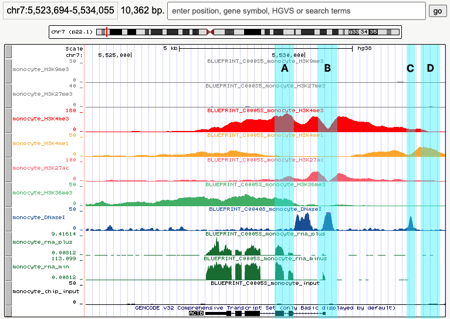{width=70%}    
```{r q10_ACTB_DNaseIseq}
question("Which of the following regions points to a DNaseI-seq peak? (Select ALL that apply.)",
  answer("A", message = "Nice try but this region is part of a H3K4me3 peak."),
  answer("B", correct = TRUE, message = "Observe that peak B is located at the *ACTB* TSS/promoter"),
  answer("C", correct = TRUE, message = "Peak C might be located in the distal *ACTB* promoter." ),
  answer("D", message  = "Try again. If anything, you may be looking at the H3K4me1 signal." ),
  allow_retry = TRUE
     )
```

```{r q11_ACTB_histone_marks_one}
question("We define the promoter as 3kb upstream of the TSS. Which histone marks are detected at the ACTB promoter? Hint, hold shift+mouse click-and-drag to highlight a 3kb region upstream of the ACTB TSS. (Select ALL that apply)",
  answer("H3K9me3", message = "H3K9me3 is not detected here"),
  answer("H3K27me3", message = "H3K27me3 is not detected here"),
  answer("H3K4me3", correct = TRUE, message = "H3K4me3 is indeed covering this promoter."),
  answer("H3K4me1", correct = TRUE, message = "H3K4me1 is indeed covering this promoter."),
  answer("H3K27ac", correct = TRUE, message = "H3K27ac is indeed covering this promoter."),
  answer("H3K36me3", message = "H3K36me3 is detected covering the gene body, not the promoter."),
  answer("none", message = "wrong"),
         allow_retry = T)
```
<br>
 

### 1.4.4 Peaks from peak calling software 
**It would be cumbersume if we would have to identify all peaks manually, not to mention a highly biased procedure. Luckily we have peak calling software to help us with that. In the following section we will use those results along with the tracks.**   
<br>
The peaks are already loaded, see the list of files in "BLUEPRINT monocytes" section below the browser.  
<br>
<span style="color: goldenrod; font-family: Arial; font-size:16px;">**Action**: Turn the display of all peak tracks to "dense" using the drop-down menu.</span>    
<br>
<span style="color: goldenrod; font-family: Arial; font-size:16px;">**Action**: From *ACTB* locus, zoom out 100x.</span>     
<br>
A prominant H3K27me3 peaks upstream of *ACTB* comes in view.  

> #### **Optional check**:  
<details><summary> Your browser should be showing:</summary>  
<br>
chr7:5,356,175-5,701,574 approximately, a few bases more or less is not a problem.   
</details>


```{r q12_FSCN1_bivalent_promoter}
question("A prominant H3K27me3 peaks *upstream* of *ACTB* comes in view. The promoter of which gene is covered by this mark?)",
         answer("*ACTB*", message = "The *ACTB* promoter is not covered by H3K27me3."),
         answer("*FSCN1*", correct = T),
         answer("*FBXL18*", message = "The *FBXL18* promoter is not covered by H3K27me3 *and* is not located up- but downstream."),
         answer("This peak is not covering a promoter.", message = "This peak covers the promoter of a gene."),
         allow_retry = T,
         random_answer_order = T
         )
```

```{r q13_FSCN1_bivalent_promoter}
question("What additional histone marks, mark the H3K27me3-covered region? Optionally, zoom in to the peak using mouse-click-and-drag. (Select ALL that apply.)",
         answer("H3K9me3", message = "we don't see H3K9me3"),
         answer("H3K4me3", correct = T),
         answer("H3K4me1", correct = T),
         answer("H3K27ac", message = "A very thin line, not a 'clear' peak"),
         answer("H3K36me3", message = "We don't see H3K36me3 signal."),
         answer("none", message = "We are referring to peak region ??chr7:5,590,487-5,597,207."),
         allow_retry = T
         )
```

```{r q14_FSCN1_expression}
question("Is *FSCN1* transcribed?",
         answer("Yes"),
         answer("No", correct = T, message = "This is a candidate bivalent promoter. *FSCN1* encodes a member of the fascin family (3 genes in humans) of actin-binding proteins. Fascin proteins organize filamentous actin polymers into parallel bundles. This is required for the formation of actin-based cellular protrusions during cell migration, motility, adhesion and cellular interactions of neurons, glial cells and also dendritic cells [Bros, 2003, J Immunol](https://doi.org/10.4049/jimmunol.171.4.1825). The bivalent marking of this promoter in monocytes makes sense, knowing that a proportion of monocytes differentiates into dendritic cell (also called antigen-presenting cell in this [scheme](https://www.blueprint-epigenome.eu/UserFiles/File/cell%20types%20images%20etc/Haematopoiesis_original.pdf))."),
         allow_retry = T)
```
<br>
The region inbetween *ACTB* and *FSCN1* is marked as well. What marks do you observe and what functional elements could they point to?  
<br>
```{r q15_ACTB_enhacer_one}
quiz(caption = "", 
     question("Epigenetic marks inbetween *ACTB* and *FSCN1* (Select ALL that apply.)",
  answer("H3K9me3", message = "H3K9me3 is not detected here"),
  answer("H3K27me3", message = "H3K27me3 is not detected here"),
  answer("H3K4me3", correct = TRUE),
  answer("H3K4me1", correct = TRUE),
  answer("H3K27ac", correct = TRUE),
  answer("H3K36me3", message = "H3K36me3 is detected covering the gene body, not the promoter."),
  answer("DNaseI-seq", correct = TRUE), 
  allow_retry = TRUE),

  question("What functional element do these marks most likely reflect?",
  answer("terminator"),
  answer("promoter"),
  answer("TSS"),
  answer("enhancer", correct = TRUE, message = "At least the region spanning chr7:5560200-5564149 is reported a super-enhancer and controls among others the *ACTB* gene."),
  answer("centromere"),
  answer("telomere"),
  answer("coding region"), 
  allow_retry = TRUE)
)
```
<br>
Another highly expressed gene in this cell type is *CD14*, remember it's protein was used to select these cells on.  
Answer the following question about this gene using the UCSC Genome Browser:   
<br>

> #### **Optional check**:  
<details><summary> Genomic location of *CD14*:</summary>  
<br>
chr5:140,631,728-140,633,701     
</details>

```{r q17_cd14_questions}
question("What statement about *CD14* is correct? (Select ALL that apply)",
  answer("*CD14* gene is encoded on the minus-strand", correct = TRUE),
  answer("More transcript is detected from the minus strand compared to the plus strand of the *CD14* locus.", correct = T),
  answer("*CD14* is transcribed but the coding region is not covered by H3K36me3"),
  answer("The TTS of *CD14* gene has a higher coordinate than its TSS"), 
  answer("*CD14* is encoded on the long arm of chr5", correct = TRUE),
  answer("*CD14* is encoded on the short arm of chr5"),
  answer("The TSS of *CD14* is not accessible for DNaseI"), 
  answer("A DNaseI-peak appr. 1.5 kb upstream of the TSS could mark the distal promoter.", correct = TRUE),
  allow_retry = TRUE)
```
<br> 
Approximately 20 kb downstream of *CD14* is another enhancer marked by a prominent DNaseI-seq signal. What histone marks mark this enhancer? (You might need to zoom out to find the region 20kb downstream.)   

> #### **Optional check**:  
<details><summary> We're referring to a enhancer located at:</summary>  
<br>
Approximately: chr5:140611060-140612601  
</details>


```{r q18_cd14_enhancer}
question("Which marks mark the enhancer 20kb downstream of *CD14*?",
  answer("H3K9me3", message = "not H3K9me3"),
  answer("H3K27me3", message = "not H3K27me3"),
  answer("H3K4me3", message = "not H3K4me3"),
  answer("H3K4me1", correct = T),
  answer("H3K27ac", correct = T),
  answer("H3K36me3", message = "not H3K36me3"),
  allow_retry = T)
```
<br>
So far we have seen active promoters, bivalent promoters and enhancers. A region silenced by H3K9me3 is loacted appr. 120kb upstream of *CD14*.   
<br>
<span style="color: goldenrod; font-family: Arial; font-size:16px;">**Action**: Navigate and zoom-out to chr5:140250000-141720000 .</span>    

```{r q19_cd14_near_silencing}
question("The expression of what gene family is silenced by this  H3K9me3-domain?",
  answer("PCDHA gene family", correct = T, message = "PCDHA gene cluster encodes a family of cadherin-like cell surface proteins that are expressed in neurons and are present at synaptic junctions. On chr19 we can find H3K9me3 doamins covering KRAB-ZNF encoding genes. "),
answer("A group of LINC RNAs"),
  answer("Family of KRAB-ZNF encoding genes", message = "Not at this location, KRAB-ZNF are silenced by H3K9me3 on chr19."),
  allow_retry = T)
```
<br>
```{r q20_cd14_near_silencing_two}
question("What is the approximate size of the H3K9me3 silenced region? (*Tip2: hold shift and mouse click-and-drag in the browser to capture and thereby measure the width of the H3K9me3 domain)",
  answer("250kb"),
  answer("500kb"),
  answer("750kb", correct = TRUE),
  answer("1Mb"),
  allow_retry = T)
```
<br>
Silencing does not necessarily have to be mediated by H3K9me3.  
<br>
<span style="color: goldenrod; font-family: Arial; font-size:16px;">**Action**: Which of the following genes is silenced by H3K27me3? *ACTA1*,  *EED*, *GATA3*, *HDAC1*, *MYOD1* andncoding muscular actin.</span>  

> #### **Optional check**:  
<details><summary> Table with genomic locations of these genes:</summary>  
<br>
gene | genomic location | product  
:--:|:--:|:--:  
*ACTA1* | chr1:229,431,245-229,434,094 | skeletal muscle actin  
*EED* | chr11:86,244,753-86,278,810 | part of PRC2 complex   
*GATA3* | chr10:8,054,810-8,074,890 | TF in various cell types (e.g. mammary gland maturation, T cells and keratinocytes)   
*HDAC1* | chr1:32,292,083-32,333,626 | Histone deacetylase 1    
*MYOD1* | chr11:17,719,571-17,722,136 | TF for myogenic differentiation  
</details>

```{r q21_ACTA1_marking_one}
question("Which hgenes are silenced by H#K27me3?",
         answer("*ACTA*1", correct = T),
         answer("*EED*", message = "*EED* is not silenced."),
         answer("*GATA3*", correct = T),
         answer("*HDAC1*",  message = "*HDAC1* is not silenced."),
         answer("*MYOD*", correct = T),
         allow_retry = T)
```
<br>
```{r q22_ACTA1_marking_two}
question("Which additional observations support that *ACT1* is not active?",
         answer("Absence of H3K36me3 marking covering the gene body.", message = "H3K36me3 is indeed lacking but other observations are correct as well."),
         answer("Absence of signal in RNA-seq signal", message = "RNA-seq is indeed lacking but other observations are correct as well."),
         answer("Absence of activating signals like DNaseI and H3K4me3 at the *ACTA1* promoter",  message = "The promoter lacks active signals but other answers are correct as well."),
         answer("All the above", correct = TRUE, message = "Indeed, the absence of signals in RNA-seq, H3K36me3 *and* active promoter signals all support that this gene is not expressed. Also observe that in this case H3K27me3 signal covers a relatively broad domain compared to the bivalent promoter at *FSCN1*" ),
         allow_retry = TRUE
         )
```
<br>  

 
### 1.4.5 Recognizing blinded genomics data  
So far you have browsed through ChIP-, DNaseI- and RNA-seq data. These tracks had the correct track names attached to them.   
<br>
Our collegue performed RNA-seq, DNAseI-seq and ChIPs for H3K9me3, H3K27me3, H3K4me3, H3K36me3, H3K4me1 and H3K27ac on CD4+ T cells but accidentally let the tubes fall before the tubes were properly labelled (always label your tubes first and *before* adding your sample!). 
<br>
We know which experiments were performed, but which track (labelled a-f) is most likely which technique?  
<br>
<span style="color: goldenrod; font-family: Arial; font-size:16px;">**Action**: upload the following track hub </span> `http://mbdata.science.ru.nl/ctoenhake/edu/trackhub_unknown/hub.txt`.
<br>  
Note that the y-axis scale of these tracks is set to "auto-scale to data view". In the monocyte track we had set these to fixed values based on our experience with these datasets. "Auto-scaling" means that the y-axis adjusts to the reported signal in the corresponding genomic region.  
<br>
Which column from the following table reflects the most likely encoding?     

Track | column 1 | column 2 | column 3 | column 4 | column 5      
:--:|:--:|:--:|:--:|:--:|:--: 
track_A | H3K36me3 | RNA minus | RNA plus | RNA plus | RNA minus  
track_B | H3K4me1 | DNaseI-seq | DNaseI-seq | H3K4me3 | H3K4me3    
track_C | RNA minus | H3K9me3 | H3K9me3 | H3K9me3 | H3K27me3    
track_D | DNaseI-seq | H3K27ac | H3K27ac | H3K27ac | H3K27ac  
track_E | H3K4me3 | H3K4me1 | H3K4me1 | H3K4me1 | H3K4me1   
track_F | H3K27me3 | Input | H3K27me3 | Input | Input   
track_G | H3K9me3 | H3K27me3 | Input | H3K27me3 | H3K9me3    
track_H | Input | RNA plus | H3K36me3 | RNA minus | RNA plus   
track_I | RNA plus | H3K36me3 | RNA minus | H3K36me3 | H3K36me3   
track_J | H3K27ac | H3K4me3 | H3K4me3 | DNaseI-seq | DNaseI-seq   

<!-- 
# S008H1
# venous blood
# CD4-positive, alpha-beta T cell
# A - RNA-seq minus
# B - DNaseI
# C - H3K9me3
# D - H3K27ac
# E - H3K4me1
# F - Input
# G - H3K27me3
# H - RNA-seq plus
# I - H3K36me3
# J - H3K4me3
-->

```{r q23_recognizing_patterns}
question("The likely encoding is represented by... ",
         answer("column 1", message = "This was a random option, examine the profiles again."),
         answer("column 2", correct = TRUE),
         answer("column 3", message = "RNA-seq and H3K36me3 may look alike, same as for H3K27me3 and input in some regions."),
         answer("column 4", message = "DNaseI and H3K4me3 can look alike but DNaseI generally shows sharper peaks. RNA-seq is stranded."),   
         answer("column 5", message = "DNaseI generally shows sharper peaks than H3K4me3; and H3K9me3 broader than H3K27me3."),
         allow_retry = TRUE) 
```
<br>  

### 1.4.6 Summary  
To summarize, a brief quiz on the association between marks and functional elements.  


```{r Q20_summary, echo = T, eval = F}
quiz(caption = "Summarizing...")

question("Promoters that are active are often marked by ...",
  answer("H3K4me3", correct = T),
  answer("H3K4me1", correct = T),
  answer("H3K27ac", correct = T),
  answer("H3K9me3"),
  answer("DNaseI", correct = T),
  answer("H3K36me3"),  
  allow_retry = TRUE)

question("The marks found at bivalent promoters are ...",
  answer("H3K4me3 and H3K27me3", correct = T),
  answer("H3K27ac and H3K4me1"),
  answer("H3K9me3 and H3K27ac"),
  answer("DNaseI and H3K36me3"),
  random_answer_order = TRUE,
  allow_retry = TRUE)

question("Active enhancers are marked by ...",
  answer("H3K4me3 and H3K27me3"),
  answer("H3K9me3 and H3K27ac and DNaseI"),
  answer("H3K27ac, H3K4me1 and DNaseI", correct = T),
  answer("H3K27me3, H3K4me1 and DNaseI"),
  random_answer_order = TRUE,
  allow_retry = TRUE)

question("H3K9me3-mediated silencing often spans ...",
  answer("small domain, single genes"),
  answer("Broad domain, multple genes", correct = T),
  allow_retry = TRUE)

question("The gene body of a transcribed gene (eg *ACTB* or *CD14* gene in  monocytes) is covered by ...",
  answer("H3K9me3"),
  answer("H3K27me3"),
  answer("H3K4me3"),
  answer("H3K4me1"),
  answer("H3K27ac"),
  answer("H3K36me3", correct = T, message = "H3K36me3 strongly correlates with with transcription."),
  allow_retry = TRUE)
```

<br> 

** Up to now we have inspected individual genes or domains. Can we quantify the observed associations? Eg. "*How many of the H3K4me3 peaks are located at promoters?*" And, "*is this signal statistically enriched in promoters?*". Or "*Which and how often do marks co-occur genome-wide?*" Next week we will use coding in R to quantitatively describe these relationships.** 

#### **Used resources:**   
- seq2science
- fastqc
- [Quality control in sequencing experiments v2019-11, Simon Andrews, Babraham Bioinformatics](https://www.bioinformatics.babraham.ac.uk/training.html#sequenceqc)
- [The Open Science Training Handbook](https://book.fosteropenscience.eu/en/)  
