```{r setup, include=FALSE}
suppressPackageStartupMessages({
  library(learnr)     # 0.10.1.9006 (github)
  library(gradethis)  # 0.1.0.9004  (github)
  library(testthat)   # 3.0.0 
  library(tidyverse)  # 1.3.0
  library(learnr.proto)
  
  # configuration
  knitr::opts_chunk$set(echo = FALSE)
  gradethis::gradethis_setup()
  # knitr::opts_chunk$set(message=FALSE,warning=FALSE, cache=TRUE)
})
```

```{r stop_when_browser_closes, context="server"}
# stop the app when the browser is closed (or refreshed*)
#   *there is **no way** to distinguish between refresh and browser (tab) closing
# this is required as closing the browser window prevents the timeout below from working.
session$onSessionEnded(stopApp)
```

```{r timeout1, context="server"}
# The timeout chunks stop the tutorial if it has been idle for too long
# Their purpose is to keep the server running smoothly

# Method: 
# This chunk (timeout1) sends a unique identifier "session_id" to timeout2.
# When the session has been running idle for longer than "timeoutSec" seconds,
# timeout2 will update shiny variable "input[[session_id]]" .
# This signal is then be used in timeout1 to stop the session.

# obtain the session's ID and send it to the javascript chunk
isolate({
  session_id <- sub('<environment: (.*)>', '\\1', capture.output(session$userData))
  session$sendCustomMessage("session_id", session_id)
})

# stop the tutorial when "input[[session_id]]" is updated
observeEvent(input[[session_id]], ignoreNULL=T, {
  write(paste0("\nTutorial terminated due to inactivity.\nRestart to continue where you left off!\n"), stderr())
  stopApp()
})

# source 1: https://shiny.rstudio.com/reference/shiny/latest/session.html
# source 2: https://stackoverflow.com/questions/18900955/get-environment-identifier-in-r
```

```{js timeout2}
$(function() {
  var timeoutSec = 25*60;  // <-- change as desired
  var idleTimer;

  // receive this session's ID
  Shiny.addCustomMessageHandler("session_id", function(s_id) {
    session_id = s_id;  // assigns the variable globally
  });

  // update "input[[session_id]]" when called
  function onTimeout() {
    alert("Tutorial stopped due to inactivity.\nRestart to continue where you left off!")
    Shiny.setInputValue(session_id, "TRUE");
  }

  function startIdleTimer() {
    if (idleTimer) clearTimeout(idleTimer);
    idleTimer = setTimeout(onTimeout, timeoutSec * 1000);
  }
  
  // (re)set timeout upon user input
  $(document).on('shiny:message shiny:inputchanged', startIdleTimer);

})();

// source 1: https://community.rstudio.com/t/keeping-track-of-idle-time-during-app-usage/1735
// source 2: https://bookdown.org/yihui/rmarkdown/language-engines.html#javascript-and-css
```

```{js open_links_in_new_tab}
// open all links starting with http(s) in a new tab
$(function() {
  var links = document.getElementsByTagName('a');
  for (var i = 0; i < links.length; i++) {
    if (/^(https?:)?\/\//.test(links[i].getAttribute('href'))) {
      links[i].target = '_blank';
    }
  }
})();

// source: https://yihui.org/en/2018/09/target-blank/
```


## Introduction to this computer practical  
This is the computer practical for the [Functional Genomics 1](https://www.ru.nl/courseguides/science/vm/osirislinks/bb/nwi-bb064b/) course. The purpose of this practical is to teach you common bio-informatics analyses performed to analyze epigenomics data. You may already be familiar with the output of these analyses from scientific publications and your Epigenomics lectures. Here, we will focus on **how to detect, quantify, annotate and visualize the genome-wide (co-)occurrence of histone tail modifications**. The majority of the tutorial therefore focuses on the analysis of ChIP-seq data but you will also use RNA- and DNaseI-seq incidentally.   

For this practical, you will use **monocytes data** from the [the BLUEPRINT project](http://dcc.blueprint-epigenome.eu/#/home). Monocytes are part of the innate immune system (first line of defense, general specificity to antigens) and circulate in the blood. They can enter peripheral tissues and differentiate into macrophages or dendritic cells that are highly adapted to engulf engulf larger particles and/or present foreign antigens to cells of the adaptive immune system. **We have chosen this dataset because it is well-documented and easy to find through the BLUEPRINT data portal. Not because we want to teach you the hematopoietic system**.  
<br>  

> ### Global learning objectives  
  1. Explain how to process raw reads from a ChIP-sequencing experiment.   
  2. Display and browse genomics data in the UCSC Genome Browser.  
  3. Distinguish different genomic datasets based on their coverage profile in the UCSC Genome Browser.   
  4. Quantify the overlap among histone ChIP-seq peaks and promoters.    
  5. Visually summarize this quantification in a venn diagram.  
  6. Statistically test for enrichment of this histone marks in promoters.   
  7. Identify the nearest TSS to a histone ChIP-seq peak.  
  8. Plot the distribution of distances to the TSS.  
  9. Summarize the signal signal strength of a histone ChIP-seq dataset around a genomic feature like the TSS or across gene body.  
  10. Visualize the distribution of signal strength in a density plot.  
  11. Visualize the signal strength around the TSS in a clustered heatmap.   

 
### Global tutorial specs  

- You will run a different tutorial for each week.  

- Answers will be saved for each of your sessions and will be loaded if you restart the tutorial.     

- At the end of the tutorial you are instructed to print a pdf report of the tutorial (incl. your answers).   

- To reserve server space to *active* running tutorials, and stop those that aren't actively used anymore, we set a time limit to 25 minutes meaning that if your tutorial has been idle for over 25 minutes, you will see the following warning "Tutorial stopped due to inactivity. Restart to continue where you left off!". When you see this warning, you should close the browser with the tutorial and restart the tutorial. Progress will be saved and once you restart the tutorial you can continue where you left.   

- Finally, links to reference material (not required for reading!) and used resources are formatted with `r colorize("light blue font", col = "dodgerblue")`. Open these links using the 'right-mouse click \-\-\> Open in a new browser tab' strategy. If you click on the links straight away, you are directed away from the tutorial.   

### Structure of this computer practical    
You will run a different tutorial for each week:   

**Week 1**: Raw ChIP-seq data processing and visualize epigenomics data in the UCSC Genome browser.  
Global learning objectives #1-3.  
  
**Week 2**: Quantify the (co-)occurrences of epigenetic marks.   
Global learning objectives #4-6.  
  
**Week 3**: Visually summarize ChIP-seq signal intensity and relate the combination of signals to gene expression.   
Global learning objectives #7-11.  
  
The tutorials of week 2 and week 3 build upon R programming skills taught during [Genomics and Big Data](https://www.ru.nl/courseguides/science/vm/osirislinks/bp/nwi-bp031/) and a basic understanding of the R programming language is helpful. If you want to refresh your memory, you can revisit the tutorial [Data Analysis and Visualization in R alpha
by the Data Carpentry contributors](https://datacarpentry.org/R-genomics/index.html) which was used to develop the computer practical of Genomics and Big Data. However, also without a background in R programming, you should still be able to write the code using the background information we give you, the hints provided and discussions with your pears in the break-out rooms. 
<br>

### Need help?  
You are allocated to Breakout rooms in Zoom (or you can select one yourself). Either way, use the Breakout rooms to discuss  questions and difficulties with your peers. If you still have question, use the "raise hand" option to notify the teacher.  


## 1.1 Introduction week 1    

**This week's focus will be on how ChIP sequencing data is processed and acquaint ourselves with the UCSC Genome browser as a tool to visually inspect epigenomics data.**  

A basic understanding of the histone marks H3K4me3, H3K4me1, H3K27ac, H3K27me3, H3K36me3, H3K9me3 is required. These should have been discussed in your Epigenomics lectures.  

### 1.1.1 Learning Objectives  

> At the end of week 1 you are able to
>
1. Explain the steps taken to go from a ChIP-seq experiment, to raw data, and finally to data usable for analysis.
2. Recognize the following elements in the UCSC genome browser: chromosome, centromere, telomere, gene, exon, intron, UTR, promoter, and (candidate) enhancer/repressors.
3. Go to regions of interest in the genome browser.
4. Explain the difference between 'uptream' and 'downstream'.
5. Identify peaks in the coverage tracks of a histone ChIP-seq experiment in the genome browser.
6. Identify tracks of H3K27ac, H3K27me3, H3K36me3, H3K4me1, H3K4me3 and H3K9me3 histone ChIP-seq and DNaseI-seq signal (and ChIP-seq input) based on their coverage profile and their location with respect to genes and other annotated genomic/chromosomal elements.
- These refer to Global learning objectives #1-3.

### Tutorial specs  

- Exercises for the current tutorial vary from multiple choice, to selecting correct statements. Here are some examples:      

**Example exercise:**  
```{r exemplemc}
quiz(caption = "Example questions:",
     question("What number is the letter A in the English alphabet?",
        answer("8"),
        answer("14"),
        answer("1", correct=TRUE),
        answer("23")
     ),
     question("Where are you right now? (select ALL that apply)",
          answer("Planet Earth", correct=TRUE),
          answer("Pluto"),
          answer("At a computing device", correct=TRUE),
          answer("In the Milky Way", correct=TRUE),
          incorrect = "Incorrect. You're on Earth, in the Milky Way, at a computer.")
)
```

- Refreshers, background information, tips, hints and optional checks are often formatted in gray boxes and **are not obligatory**. These boxes are meant as reference material, **they are optional and the time taken to read them *is not* taken along in the time scheduled for the practical**. In most cases, you should expand the box before you can read its content. This is an example:    

> #### Optional check:  
<details><summary>Click on this sentence to see an example drop-down box.</summary>  
**Well done! Applause for you!** 
**Collapse the box by clicking the sentence again.**  
<br>
<iframe src="https://giphy.com/embed/srg19CG0cKMuI" width="480" height="270" frameBorder="0" class="giphy-embed" allowFullScreen></iframe><p><a href="https://giphy.com/gifs/applause-clapping-oscars-srg19CG0cKMuI">via GIPHY</a></p>  
<br>
</details>   

#### **Used resources:**
- [seq2science data processing description](https://vanheeringen-lab.github.io/seq2science/)    
- [FASTQC examples from the Babraham Bioinformatics group](https://www.bioinformatics.babraham.ac.uk/projects/fastqc/)    
- [Quality control in sequencing experiments v2019-11, Simon Andrews, Babraham Bioinformatics](https://www.bioinformatics.babraham.ac.uk/training.html#sequenceqc)
- [The Open Science Training Handbook](https://book.fosteropenscience.eu/en/)   

## 1.2 Sample to raw data
Briefly review ChIP-seq, library preperation for next-generation sequencing and analysis of the resulting data with the following video:
<br>
**ChIP-seq by Statquest**, duration of 8:30:

<br>

>#### **Refresher**: Illumina technology
<details><summary>Click here for a Illumina sequencing technology refresher.</summary>
There are several manufacturers of sequencing machines and reagents. **Illumina** is a common one. The Illumina technology is summarized in the following videos (optional, to open use right mouse click > open in new browser tab):
>
- [Introduction to Illumina Sequencing, Rob Edwards, duration 2:45](https://www.youtube.com/watch?v=mLZqS0RYqCk&ab_channel=RobEdwards)   
- [Illumina Sequencing Technology, Illumina, duration 5:03](https://www.youtube.com/watch?reload=9&v=womKfikWlxM&ab_channel=Illumina)  
>
> In summary, Illumina sequencing involves:
>
>1. Library preperation (also called sample preperation):
>    i) Extract DNA from your sample.
>    ii) Fragment this DNA.
>    iii) Ligate **adapters** to the fragment these contain a sample specific sequence (= **barcode** or **index**), regions complementary to oligo's that are found on the flow cell (these oligo's are called P5 and P7) and primer bindings sites for sequencing (Rd1 SP and Rd2 SP):
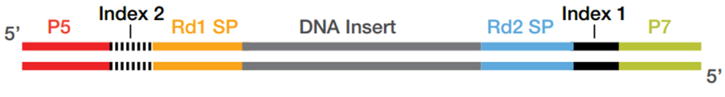{width=80%}      
*Ref: [Illumina, Precise analysis of DNA–protein binding sequences.](https://www.illumina.com/techniques/sequencing/dna-sequencing/chip-seq.html)*
>2. Load library on the **flow cell**:
>    i) The flow cell is a glass slide with P5 and P7 oligo's attached to the surface.
>    ii) The DNA fragments are denatures and single stranded fragments anneal to P5 and P7 oligo's present on the flow cell.
>3. **Cluster** growth:
>    i) Fragments are amplified, the P5 and P7 oligo's are used as the primer for this process ensuring that the final molecule is attached to the flow cell.
>    ii) Multiple amplification cycles result in a cluster of fragments.
>    iii) This procedure occurs for millions of fragments resulting in millions of clusters.
>    iv) The reverse strands are cleaved, ensuring that the same strand is used for sequencing within each cluster.
>4. Sequencing by synthesis:
>    i) Sequencing primer (Rd1 SP) is added and 4 fluorescently labelled nucleotides compete for incorporation in the growing strand.
>    ii) Image acquisition: A laser excites the clusters and the signal from the incorporated nt is measured.
>    iii) The emmission wave length and signal intensity determine the **base call** and the **quality** of the reading.
>    iv) A special index read primer is used to sequence the barcode.
>    v) For paired-end sequencing, the above procedure is repeated with the reverse strand.
{width=80%}       
*Ref: [Harvard Chan Bioinformatics Core training (2019, may 14th) Intro-to-ChIPseq lesson 2.](https://hbctraining.github.io/Intro-to-ChIPseq/lessons/02_QC_FASTQC.html)*
</details>

<!--Currently Illumina also has the nextSeq 500 series (besides MiSeq and HiSeq mentioned in the video). One of the main difference being that the MiSeq and HiSeq use four fluorescent colors (G = blue ,C = green, A = yellow and T = red) while the nextSeq series use 2-color chemistry (green and red). The effect being that with each cycle for the NextSeq, only two images need to be taken, As ar read as clusters appearing in both images and Gs are read as clusters that are not present in either of the two.-->

<br>
The **sequencer** analyzes a set number of bases, eg 42, 50 or 100 bp, called a **read**. The resulting **base calls** and their **quality scores** are stored in **fastq files** which have the .fq or .fastq extension (or compressed as .fq.gz or .fastq.gz). These are always organized in the same manner with 4 lines per read. This is an example with 2 DNA sequences (8 lines):
<br>

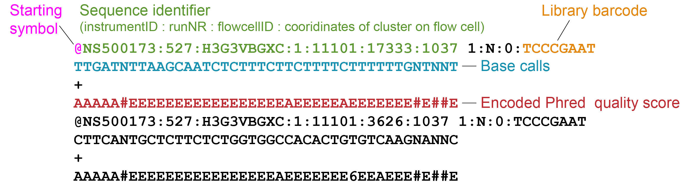{width=80%}    

*Modified with own data from: [Torsten Seemann, Victorian Bioinformatics Consortium, Introduction to NGS.](https://vicbioinformatics.com/documents/Intro%20to%20NGS%20-%20Torsten%20Seemann%20-%20PeterMac%20-%2027%20Jul%202012.pdf)*
<br>

1.  Header starts with '@'-sign and contains a unique sequence ID (the element up to the fist space). This header often follows a set substructure. Element after the space often includes the sample barcode.
2. Called bases in ACGTN-alphabet
3. Midline, can be empty or hold '+'
4. Quality score for each nucleotide, also called **Phred score**.

<br>
The Phred scores represents the probability that the reported call is incorrect. This probability is encoded with a single character. This encoded Phred score will come back in the Quality Control but there's no need to learn this encoding by heart. To give you a brief idea, here's a visual summary of the characters with their Phred scores and corresponding interpretation:

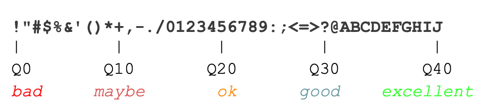{width=80%}    

*Ref:[Torsten Seemann, Victorian Bioinformatics Consortium, Introduction to NGS.](https://vicbioinformatics.com/documents/Intro%20to%20NGS%20-%20Torsten%20Seemann%20-%20PeterMac%20-%2027%20Jul%202012.pdf)*

In general for Illumina sequencing:

- Good quality is generally Phred > 28 - 30
- Concerning quality is Phred < 20

<!--Phred quality score | Probability of incorrect base call | Accuracy | Character
:--:|:--:|:--:|:--:|:--
0 | 1 in 1 | 0% | !
10 | 1 in 10 | 90% | +
20 | 1 in 100 | 99% | 5
30 | 1 in 1000 | 99.9% | ?
40 | 1 in 10000 | 99.99% | J-->


> #### Background box:
<details><summary>Click here for the complete encoding of Phred scrores 0-40.</summary>
{width=90%}     
>  
*Ref: [Amixon (2013/07/01) Bioinformatics for beginners - File formats Part 2. - Short reads.](https://www.omixon.com/bioinformatics-for-beginners-file-formats-part-2-short-reads)*
></details>

<br>
Before we can start our data analysis and identify for example regions marked by activating and repressing histone marks, we need to process the raw data. This includes cleaning up, mapping, visualizing the sequenced reads and identifying genomic regions where reads tend to pile up (in other words "peaks"). Which is what we will discuss next.
<br>

## 1.3 Raw data to science
### 1.3.1 Post-sequencer processing
The sequencer determines the sequence of the DNA molecules in your sample and produces massive amounts of data. In an ideal world, these data would 100% reflect reality. But..... It doesn't and it is often your or a bio-informaticians task to discriminate valuable signal from artefacts and noise, the latter being accumulations of reads in regions that don't actually contain binding sites of the protein or modified histone of interest.  
<br>
{width=60%}      

*Ref: [Biocomicals (2011, May 2) That's what bioinformaticians do...](http://biocomicals.blogspot.com/2011/05/thats-what-bioinformaticians-do.html)*   
<br>
A general analysis workflow for ChIP-sequencing data involves the steps discussed below. In theory, all of them can be performed in R but the first steps are commonly performed by tools outside R (often on Linux server). The resulting peakfiles, files with read depth and/or read counts are then imported in R.  
<br>
Here's a visual of the analysis. We will discuss each part below.  
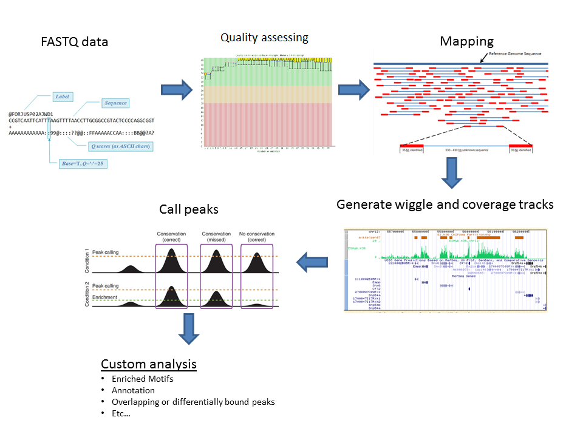{width=80%}         

*Ref: [UT Southestern Medical Center, Computational Biology/Bioinformatic Core - Analysis ChIP-seq.](http://www4.utsouthwestern.edu/mcdermottlab/NGS/analysis/analysis-chipseq.html)*
<!--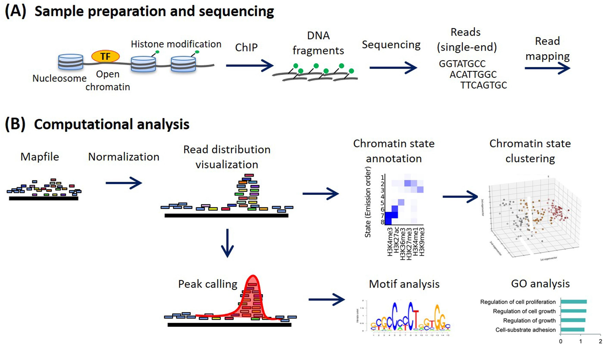{width=50%}
ref: http://www4.utsouthwestern.edu/mcdermottlab/NGS/analysis/analysis-chipseq.html -->
<br>

### 1.3.1 Step 1 Run a quality check on the raw data
We run the raw fastq files through the Quality Control (QC) software [FASTQC](https://www.bioinformatics.babraham.ac.uk/projects/fastqc/). This gives a quick impression of whether our data has any technical problems of which we should be aware before doing any further analysis. FASTQC outputs a HTML report with graphs and tables summarizing, among others the base call accuracy, library base composition, duplication levels and the presence of overrepresented sequences.

The **Per base sequence quality** plot is one of the most important plots generated. It summarizes the base call accuracy (Y-axis) for each cycle (X-axis) across the library. See this example:
<br>
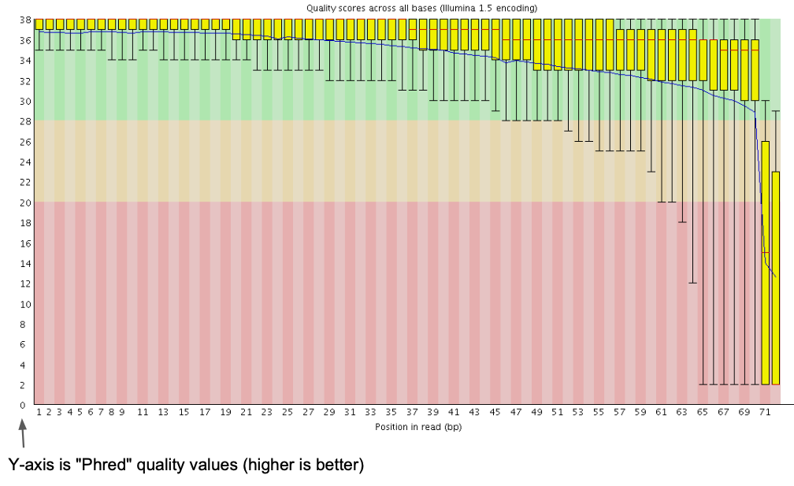{width=80%}\    

*Ref: [Torsten Seemann, Victorian Bioinformatics Consortium, Introduction to NGS.](https://vicbioinformatics.com/documents/Intro%20to%20NGS%20-%20Torsten%20Seemann%20-%20PeterMac%20-%2027%20Jul%202012.pdf)*

<br>

This example shows the average Phred quality for a library sequenced to 72 bp. The majority of bases have a good quality, the quality drops for the last two bases and we should (in this case) remove these from the end of the read.

For most runs, quality should be good for most reads through the whole run. If quality is low, we can use the other plots and tables to try to understand why this is.

If the Quality Control does not support major technical problems like a systematic base bias that occurred during sequencing or contamination during sample prep with foreign DNA, we can continue.

> **Exercise 1**
> Use these two "Per base sequence quality" reports to answer the following questions.   
>
> <details><summary>Click here for example 1.</summary>
> 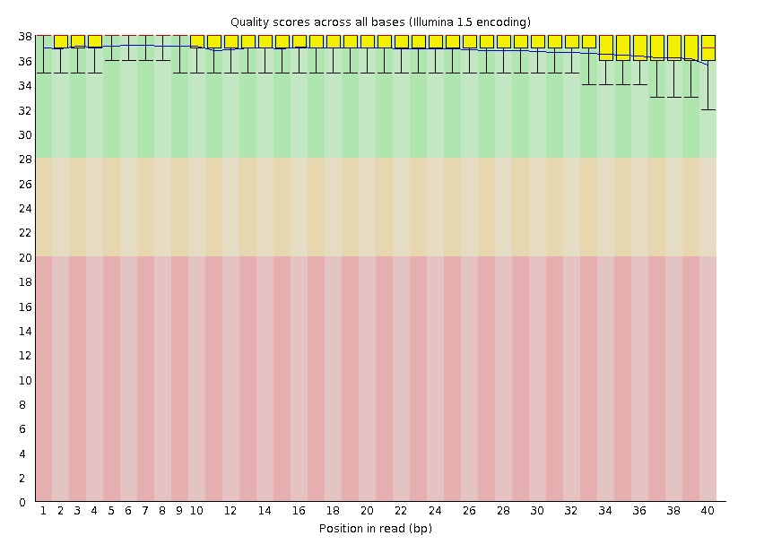{width=95%}\     
> </details>
> <br>
> <details><summary>Click here for example 2.</summary>
> 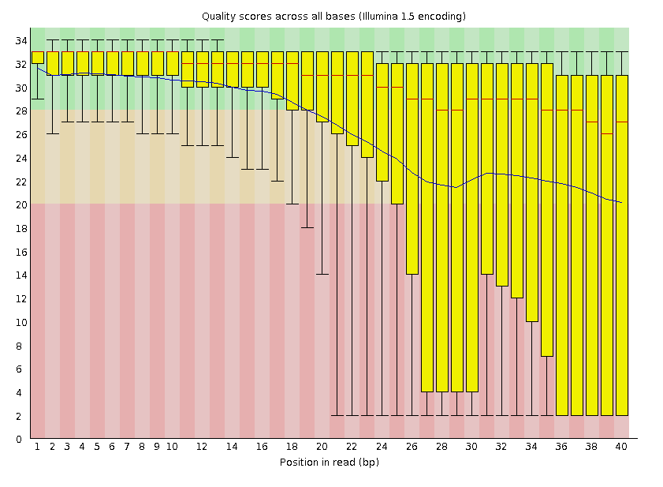{width=95%}\     
> </details>


```{r quiz_fastqc}
quiz(
    question("What is the read length in example 1 and 2?",
             answer("45", message = "The read length can be read from the x-axis of these plots."),
             answer("40", correct = T),
             answer("Can't be answered using these plots",  message = "The read length can be read from the x-axis of these plots."),
             allow_retry = TRUE,
             random_answer_order = TRUE),
    question("Of plot 1 and 2, which shows a **good per base sequence quality**?",
             answer("report 1", correct = T, message = "These examples have been borrowed from the [FASTQC project website of the Braham Institute](https://www.bioinformatics.babraham.ac.uk/projects/fastqc/) (use your right-mouse-click to open the link), visit the 'Example Reports' section of their website for the complete reports."),
             answer("report 2", message = "For a good per base quality the Phred-score should be above 28-30, see also section [1.2 Sample to raw data]"),
             allow_retry = TRUE))
```
<br>

> #### Background box:
> For detailed discussion on FASTQC reports see the [FASTQC website of the Babraham institute](https://www.bioinformatics.babraham.ac.uk/training.html#sequenceqc), and their tutorial on Quality Control in Sequencing Experiments.

<br>

### 1.3.1 Step 2 Trim and quality-filter reads
In this cleaning step we predominantly:

- Remove reads composed solely of adapters without insert.
- Remove reads with an overall low-quality.
- Remove or mask low-quality bases within predominantly high quality reads (if these occur, they are often the last one or two bases for Illumina sequencing). This can result in the complete removal of some reads because of their overall low quality or short length.

<br>

### 1.3.1 Step 3 Align reads to the genome
Next Generation Sequence (NGS) alignment means that we identify the likely location in the reference genome where the original DNA molecule came from. This process is called **aligning** and is performed by **alignment tools**, also called **read mappers**. Well known examples include STAR, BWA and bowtie2. In essence, these tools perform the same tasks but with different algorithms/strategies.  
<br>
Since the publication of the human genome, successive versions have been released (also called **assemblies** or **builds**). The improvements in quality are thanks to technological advancements as well as improvements in the representativeness of the genome with respect to the genetic diversity found in the human population. We will work with (one of) the latests relaese referred to as **GRCh38** or **hg38** (Genome Reference Consortium Human Build 38).  
<br>
The aligner thus requires as input the quality-filtered and trimmed fastq files together with the reference genome.  
<br>
The outputted alignment is stored in (*huge!*) TAB-delimited text Sequence Alignment Map files, **SAM files**. The compressed version of SAM files are called **BAM files** (Binary Alginment Map).  
<br>

> #### Background box:
<details><summary>Click here for additional information about SAM/BAM file format.</summary>
><br>
> SAM/BAM files contain two sections: (1) a header with information about the mapping procedure and (2) records of read alignments with 1 line per read. The latter contains information about the read sequence, how much of it was mapped to the reference genome (eg. the whole read or only part of it), how well it alinged, and lots of other information, dependent on the aligner.
<br>
>
ColumnNR | Description
:--|:--------------
1. | Read name
2. | 12 "bits" flag summarizing of the alignment. Webtools to explain the meaning of each flag: [samformat](https://www.samformat.info/sam-format-flag), or [Broad Institute](https://broadinstitute.github.io/picard/explain-flags.html)
3. | Chromosome in the reference genome the read aligns
4. | Position within the chromosome the read aligns
5. | Mapping quality score, different programs use different scores
6. | CIGAR string, is a summary of the alignment per nt
7. | Chromosome where the paired read aligns (if there is no paired read 0 or *)
8. | Position within where the paried read aligns (if there is no paired read 0 or *)
9. | Length of the complete fragment, from the first mapped base of read 1 to the last mapped base of read 2.
10. | Called bases
11. | Phred quality score of the read
>
To give you a feel for how SAM files looks like, here's an example of the header:
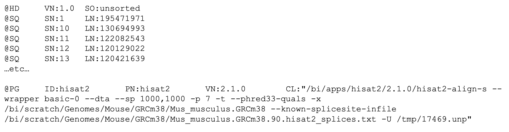{width=100%}   
> 
> And an example of one record:  
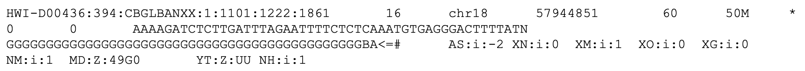{width=100%}  
>
> *Ref:[Simon Andrews, Babraham Bioinformatics, Quality control for Sequencing Experiments pdf, v2019-11](https://www.bioinformatics.babraham.ac.uk/training.html#sequenceqc)*  
<br>
This example tells you among others that the library was mapped with [hisat2](http://daehwankimlab.github.io/hisat2/manual/) to the mouse reference genome GRCm38 with certain additional settings. The single displayed read is mapping to chr18, starting at position 57944851.
<br>
>
> The full SAM/BAM file format specification can be read in this [pdf ](http://samtools.github.io/hts-specs/SAMtags.pdf) from [SAMtools](http://samtools.sourceforge.net/).

</details>
<br>

### 1.3.1 Step 4 Filter artefacts and reads aligning to multiple regions
From the initial alignment we often identify and remove PCR artefacts, reads aligning with a low mapping quality (column 5) and optionally remove reads aligning non-uniquely. These actions can be performed with various tools. Commonly used ones are [SAMtools](http://samtools.sourceforge.net/) and [Picard tools](https://broadinstitute.github.io/picard/). The input and output of these steps are both BAM files.
<br>

### 1.3.1 Step 5 Visualize read depth
Files are created that count how many reads align to each nucleotide in the reference genome. Genomic positions with a relative high score pinpoint the likely locations of the ChIPped factor or histone PTM; to a region of accessible chromatin in ATAC-seq; or to the region that was likely transcribed and detected in RNA-seq.
<br>
These files can be uploaded to the UCSC Genome Browser which we will look at in more detail today as well. Various file types can store this kind of data (including wiggle and bedGraph). We wil use BigWig files, which are binary versions of the wiggle (.bw file extension), these are fast and relatively small but we can't view them.
<br>

> #### Background box:
<details><summary>A fictional example of alignment and a read depth graph</summary>
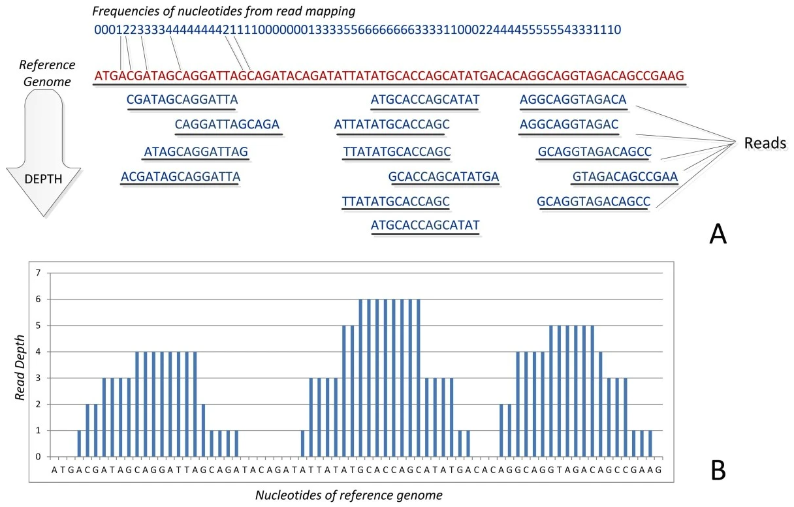{width=80%}    
> 
> *[Ref](https://doi.org/10.1186/1756-0381-6-13) Pavlopoulos et al (2013) BioData Mining, 6(13)*
</details>


### 1.3.1 Step 6 Call peaks
Reads are scattered through the genome but locations where the used antibody recognizes its target (eg. DNA-binding TF, histone, histone variant or histone PTM) will collect more reads. **Peak calling** is the computational process to identify these regions, often with respect to a control dataset where no antibody or no specific antibody was used, resp.  **input control** and **IgG control** . A commonly used tool for this step is [MACS2](https://doi.org/10.1186/gb-2008-9-9-r137). MACS2 was also used to call peaks in the datasets that we will be using.      
<br>
Peak calling is a statistical procedure and never black and white. It depends among others on thresholds used (p-value, false-discovery rate) and the control sample. It is always wise to visually inspect the resulting peaks in the UCSC genome browser. If the called peaks do not correspond to the sites with high read coverage, you may need to adjust the settings for peak calling.       
<br>
Peaks are reported as genomic regions, or **intervals** with the coordinates: **chr**, **start** and **end**. The software also gives each peak a **name**, and **score**. The **name** speaks for itself. The **score** indicates the strength of the signal observed for this peak.      
<br>
These peak data are stored in so-called BED files (which stands for "Browser Extensible Data"). These look like basic text files but when you want to use them in programs like the UCSC Genome Browser (which we will come back to soon), the program expects the files to cohere to a special format. The first 3 columns should contain the chromosome, start and end positions, in that specific order.    
<br>
In practice, BED files with peak data come in two flavors, both cohering to the BED format but with small differences in the columns 4-10. These are called **narrowPeak** and **broadPeak** files. This is because different data types have different peak shapes and peak-calling takes that into account. If you have narrowPeak files, this means that during peak calling, settings were used that fit ChIP-seq datasets with sharp, narrow enrichment signals. For broadPeak files, peak calling settings were used to detect broad domains of (overall lower) enrichment.    
<br>
In summary, you will find the following coluns in BED files with peak data:     

-  1st: chromosome  
-  2nd: peak start location   
-  3rd: peak end location  
-  4th: peak name
-  5th: score (equals -10log(qvalue) \*\ 10, rounded down to integer value)
-  6th: strand to denote orientation (if applicable, otherwise "\*" or "\." if unstranded)
-  7th: fold enrichment fo the signal at the summit or averaged over the complete region
-  8th: p-value to denote statistical significance, given as -log10(p-value)
-  9th: q-value statistical significance using false discovery rate, given as -log10(q-value)
-  10th (only for sharp peaks not broad domains): location of peak summit relative to the "start" coordinate

Here's an example of three types of BED files:
{width=80%}\     
<br>  
Further reading on these file formats on the UCSC Genome Browser FAQ page: [BED](http://genome.ucsc.edu/FAQ/FAQformat.html#format1), and the [narrowPeak BED](http://genome.ucsc.edu/FAQ/FAQformat.html#format12) and [broadPeak BED](http://genome.ucsc.edu/FAQ/FAQformat.html#format13).   
<br>
You will work with these files in the analyses of week 2.

### 1.3.1 Step 7 Read counting
Count reads that fall within genes, other genomic elements like promoters or enhancers, or peak regions. These counts are used for for example differential gene expression analyses in RNA-seq or differential TF-binding in ChIP-seq (comparing differentiated vs undifferentiated or control vs treatment). A well-known, widely used tool for this purpose is DESeq2.     
<br>
Alternatively, you can also use the read depth reported in the .bigWig files of step (5.) to obtain the signal within a particular window like the region around the TSS and/or around a DNaseI sensitive site.     
<br>
Sample clustering using read counts can be included here as additional QC. This clustering detects the samples that are closely related, these should be your replicates. If they don't, this might point to a label swap or more severe issue like not-working stimulus in one of the replicates.     
<br>
Here's an example of such a clustering, showing how different each sample is. Samples 15754-56 should be similar and different from 15757-59, and vice versa:     

<!-- `r colorize("Siebren: what's the color legend representing?", "red")`   -->
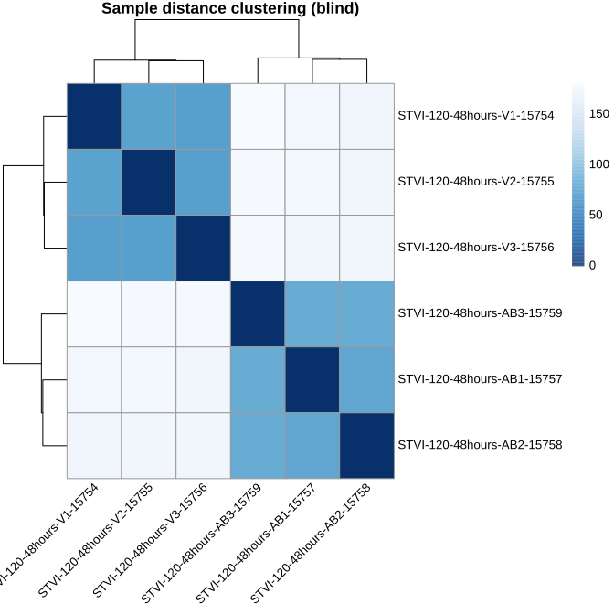{width=60%}      

> #### 8. Optionally: DNaseI footprinting, variant calling, novel gene identification and more
Depending on your experimental set up additional steps are performed outside R. For DNaseI-seq, we can identify small depleted regions within peaks that correspond to the nucleotides that interact with the TF. This interaction protects these nucleotides from DNaseI attacks. These so-called footprints can be used to identify TF motifs and predict the likely TF bound. Although this sounds simple, and for a stable binding factor like CTCF it may be the case, it is not always that simple in reality.

<br>

### 1.3.2 Common causes of noise and artefacts
Artefacts and noise in your data can arise from various causes. Here's a list of common **causes**:

1. Synthetic DNA sequences
2. Poor base call accuracy
3. Amplification bias during library preparation
4. Genomic repeats and Low complexity regions

> **Exercise 2**:
Below is a list of descriptions and methods to handle these arefacts. Read these carefully and combine what you think is the most likely description and method to handle the above mentioned artefacts.

**Descriptions**:

A.  The amount of nucleic acids you generally obtain from your cells is often too low to be directly analyzed and one or more steps of PCR are needed (unless you use special, amplification-free protocols and sequencing methods). Not all DNA or RNA molecules behave the same in this reaction. Some are amplified more than others.
B.  These include adapters ligated to the DNA molecules to allow their amplification with uniform primers during library prep and in the sequencer. These adapter sequences come with the kit or are designed by the researcher self.
C.  Short tandem repeats and interspersed repeats make up roughly 50% of the human genome. Reads produced by sequencers are generally shorter than these sequences, thus mapping them becomes ambiguous.
D.  The chemical reaction and quality of the optical measurement that occur in the sequencer are not perfect and depend among others on the nucleotide composition of all samples, the length of the DNA molecules and the concentration of the samples. Each nt is therefore given a quality score that reflects the accuracy of the measurement.


**Methods**:

a. We can control for this by using the input sample as the control during peak calling, paired-end sequencing and remove all fragments with exactly the same coordinates for read 1 and read 2, and/or the use of a unique molecular identifier (UMI) appended to our adapters that labels each DNA fragment uniquely.
b. There are usually 3 choices: (1) Discard them; (2) Take the best alignment, if there are multiple best hits take one randomly; (3) Report all alignments or report up to a certain number. The strategy you choose depends on the sample, the technology, your research question and the reference species you work with.
c. Filter these out of our dataset right after we get our data from the sequencer.
d. Remove low-quality nt's from reads or remove reads altoghether if all their nt's are of low quality.


```{r quiz_artefacts}
quiz(caption = "Which answers summarize the appropriate combinations of artefact - description - method?",
    question("For (1) *Synthetic DNA sequences*",
             answer("Description B; Method c", correct = T),
             answer("Description D; Method d"),
             answer("Description A; Method b"),
             answer("Description C; Method a"),
             allow_retry = TRUE,
             random_answer_order = TRUE),
    question("For (2) *Base call accuracy*",
             answer("Description B; Method a"),
             answer("Description C; Method b"),
             answer("Description D; Method d", correct = T),
             answer("Description A; Method c"),
             allow_retry = TRUE,
             random_answer_order = TRUE),
    question("For (3) *Amplification bias during library preparation*",
             answer("Description D; Method b"),
             answer("Description C; Method d"),
             answer("Description B; Method c"),
             answer("Description A; Method a", correct = T),
             allow_retry = TRUE,
             random_answer_order = TRUE),
    question("For (4) *Genomic repeats and Low complexity regions*",
             answer("Description D; Method a"),
             answer("Description C; Method b", correct = T),
             answer("Description B; Method c"),
             answer("Description A; Method d"),
             allow_retry = TRUE,
             random_answer_order = TRUE)   )
```


### 1.3.3 Alternatively: use Publicy available data
Instead of working solely with our own data, we can also make use of publicly available datasets. More and more, researchers, institutes and grant agencies advocate the [FAIR principle](https://www.nature.com/articles/sdata201618) for optimal sharing of research data. Research data and metadata should be **Findable**, **Accessible**, **Interoperable** and finally **Re-usable**. This makes it for us (other researchers) much easier to (re-use) these data or repeat analyses.   
<br>
In case of (epi)-genetics data, besides the raw fastq files, various file types can be provided including bam, bigwig, peak files and/or count files.   
<br>
Large consortia can have their own data portals, like [ENCODE](https://www.encodeproject.org/), [BLUEPRINT](https://www.blueprint-epigenome.eu/), [The Human Cell Atlas](https://www.humancellatlas.org/) or [The Cancer Genome Atlas](https://www.cancer.gov/about-nci/organization/ccg/research/structural-genomics/tcga). But data can also be found in the NCBI [GEO database](https://www.ncbi.nlm.nih.gov/geo/) or [Short Read Archive](https://www.ncbi.nlm.nih.gov/sra/). There are many more databases. An extensive list of databases for genomics research can be found [here](https://sites.google.com/site/anshulkundaje/idataset).


{width=80%}     

*Ref: [The Open Science Training Handbook](https://book.fosteropenscience.eu/en/)*   
<br>

## 1.4 UCSC Genome Browser
### 1.4.1 UCSC Genome browser intro
Genome browsers are great tools to display genomics data. You can walk, or **browse**, through all chromosomes, look at the location of genes, extract DNA sequences, examine pre-loaded data or upload your own data. The latter comes in quite handy when you want to, for example, have a visual (personal) confirmation of data quality, evaluate the effect of different settings for processing the raw reads, and/or confirm as computationally detected associations.
<br>

Watch the following youtube video's to get familiar with the UCSC Genome Browser:

1. UCSC Genome Browser Basics (duration: 08.40): 
2. UCSC Genome Browser Tracks (duration: 09.14): 

<br>

**Checklist**:

* Watching video 1 you should be able to:
    + Access your genome & assembly of interest in the UCSC Genome Browser.
    + Find the chromosomal coordinates of the region currently in view or of a region you just selected (with click+drag).
    + Go to a gene or region of interest.
    + Zoom in and out.
    + Recognize UTRs, exons, introns, and the direction of transcription.
    + Find the length of a region or gene.
* After watching video 2 you should be able to:
    + Define what we mean with a track.
    + Adjust the display of tracks: eg. full, pack, hide etc.
    + Display tracks from the list of preloaded tracks below the browser (important: hit `refresh`).

<br>
Additional important actions and terms that were not explicitly discussed in the videos:

**Selecting a region in the genome browser**:
Hold shift-key and click/drag with your left mouse key over the region. A pop-up appears to 'Zoom in', 'Add highlight' or 'Cancel' (cancel = do nothing):   

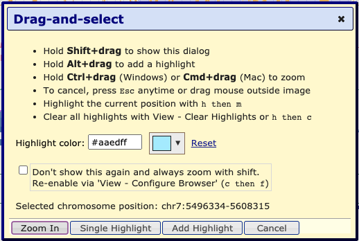{width=50%}    

<br>
**Upstream and downstream**:
These terms refer to a position relative to the coding strand of a gene. Upstream means to the 5' end and beyond. Downstream means to the 3' end and beyond. Thus, depending on the orientation of the gene, upstream can mean that you move in the direction of the start of the chromosome or to the end of the chromosome.  

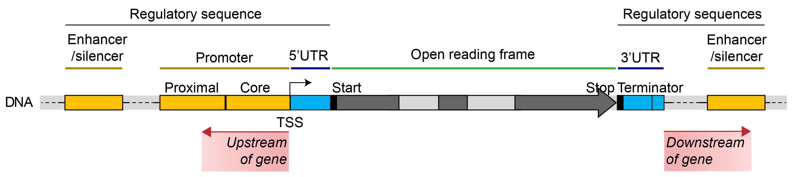{width=80%}      

*Ref: [Modified from Wikipedia, Gene Structure](https://en.wikipedia.org/wiki/Gene_structure)*  

<!-- *Optional videos*: finding the coordinates of a sequence using blat, handy for eg. primers, and using the Table Browser to, among others, obtain DNA, RNA or protein sequences:
1. [UCSC Genome Browser Blat, 9m39s](https://www.youtube.com/watch?v=E6DDNGDXH8A)
2. [UCSC Genome Browser Table Browser, 7m19s](https://www.youtube.com/watch?v=Ueqt5Wgre9c&ab) -->

<br>

### 1.4.2 Go to the UCSC Genome browser
**Let's go to the UCSC genome browser....**

> **Action: Go to the [UCSC Genome Browser](https://genome.ucsc.edu/index.html)** (blue text is a link, use right-mouse click to open in new window).

The starting page has been updated since the video was made but still holds the same blue bar at the top with **Genomes**, **Tools**, etc.:
{width=80%}     

<br>

> *Tip*: A pop-up may appear now or one stap later, redirected you to the official European mirror site if those servers are geographically closer, that's ok.

> **Action: To access the human genome, select the "Genomes" tab.**

On the left you can browse and select the genome you are interested in (not a drop-down menu anymore as in the video). By default, the human genome is selected.   
<br>
We can go to a position of our choice by entering the gene or chromosomal coordinates under **Position/Search Term** or immediately go to the 'Current position' by clicking on `GO` on the right-hand side or **Genome Browser** in the menu bar on top.

> **Action: Ensure that "Human" is selected in the REPRESENTED SPECIES tree and "Dec. 2013 (GRCh38/hg38)" is selected under Human Assembly (red arrows in image below).**

> **Action: Go to *ACTB* gene** (gene coding for non-muscular actin part of cytoskeleton).

*Genomes page, ready to go to ACTB gene in Human genome GRCh38*:
{width=90%}    

>#### **Tip**:
<details><summary>To change the width of the browser to fit your screen (click here): </summary>
> <br>
> Go to "Genome Browser" > "Configure". And adjust the "image width:" .. pixels. Hit `submit` to apply the changed settings and return to the browser:
> 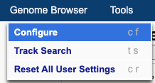
> 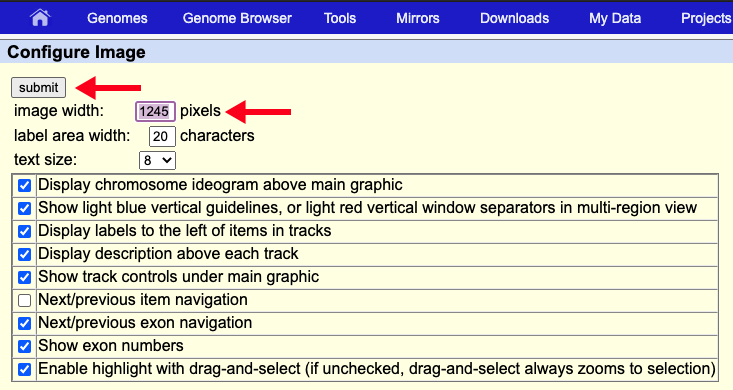{width=80%}
</details>

>#### **Optional check**:
<details><summary>Your browser should be showing genomic region (click here):</summary>
<br>
> chr7:5,527,148-5,530,601
</details>

<br>
As discussed in the video, in the top of the window we have navigation and zoom bottons. Right below we can read the chromosomal coordinates and length of the regions we are currently viewing (in this case the complete *ACTB* gene). Below that we see a miniature chromosome with the characteristic gray/black pattern from karyotyping. A red `r colorize("|", "red")`-sign gives us an idea of our current positioning in the chromosome.
<br>
```{r q3_actin_location}
question("What chromosome is ACTB located on? And is it located on the short or long arm of this chromosome?",
  answer("chr7, short arm", correct = TRUE, message = "The *ACTB* gene is indeed located on the short arm of chromosome 7. In the coordinates bar and in the 'ruler' track we can see that we are looking at chromosome 7. By looking at the red |-sign in the chroosomal idiogram, we see that this gene is located to the left of the centromere (red diabolo within the idiogram) and thus ont the short arm."),
  answer("chr7, long arm", message = "Where do you see the red |-sign in the miniature chromosome on top?"),
  answer("chr17, short arm", message = "Review the UCSC Genome Browser Basics video, or find *chr#* in the browser window"),
  answer("chr17, long arm", message = "Review the UCSC Genome Browser Basics video, or find *chr#* in the browser window"),
  allow_retry = TRUE)
```
<br>
The data window displays various **tracks** or **track sets**. Tracks runs the complete length of the chromosome. Data includes most often:

- **Positional information**, of a gene, SNP or cir-regulatory element for example, often displayed as horizontal bars the thickness and color of which can hold additional information depending on the type of track.
- **Signal information**, of gene expression, detection of histone marks or degree of conservation. Often displayed as histograms but can also be summarized in vertical bars with different levels of color intensity encoding the signal intensity.

<br>

>#### **Refresher**:
<details><summary>Adjusting the display of tracks by (click here): </summary>
>
>1. Right-mouse click on the grey, vertical bar at the left-most area of the Genome Browser shows you options `hide`, `dense`, `squish`, `pack` and `full`. Additional adjustments to the track can be made by selecting `Configure [track name]` in this menu.
> 
> 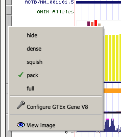{width=40%}   
>  
> 2. Scroll to the area below the data window, here you see a possibly overwhelming list of potential tracks, most are `hidden`. Using the pull down menu you can change display settings of multiple tracks at once. Always make sure to hit the `refresh` button below the browser window to ensure all changes are performed.
</details>

> **Action: hide all tracks and tracksets except for the ruler and GENCODE v32 tracks.**

> **Action: for GENCODE v32, via "Configure GENCODE v32", make sure the option "splice variants" is unchecked.**


>#### **Optional check**:
<details><summary>In case you want to check your settings, these screenshots could help you (click here):</summary>
<br>
Configuration window for GECODE v32 gene track with splice variants unselected:
>  
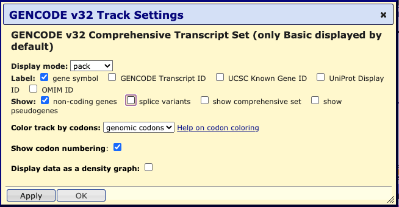{width=90%}     
<br>
Your GB session should look like this:    
> 
> {width=90%}     
</details>

We see the complete *ACTB* gene with exons as horizontally stretched rectangles and **introns** as horintal lines with arrowheads in them indicating the **direction of transcription**. The exons have different heights. The highest regions correspond to  **coding exons**, the other regions are the **5-** and **3UTR**.   
<br>
More information about *ACTB* can be obtained by clicking on the gene in the browser. Doing that brings you to a gene page like:   

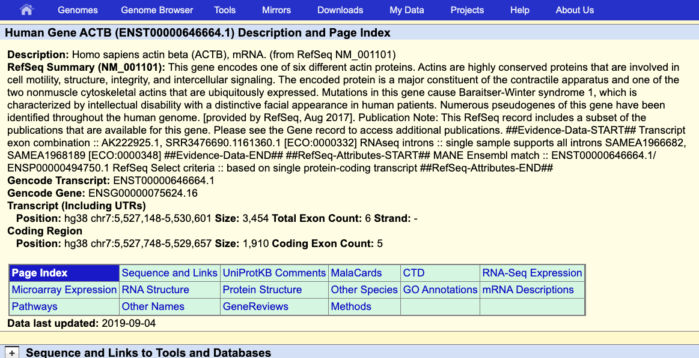{width=80%}    
<br>

```{r q4_ACTB_exons}
question("How many exons does the *ACTB* gene have?",
          answer("5", message = "exons are displayed as thicker lines in the gene, introns as lines with arrows in them."),
          answer("6", correct = TRUE),
          answer("7", message = "one exon can contain coding and non-coding (UTR) elements" ),
          answer("8", message = "one exon can contain coding and non-coding (UTR) elements"),
           allow_retry = TRUE)
```

*Figure for the following two questions*:
{width=100%}     
```{r q5_ACTB_start}
quiz(caption = "",
     question("Which letter points to the TSS?",
     answer("A", message = "Pay attention to how directionality is visualized in the UCSC Genome Browser, discussed in video 1 at 4:30"),
     answer("B", message = "Pay attention to how directionality is visualized in the UCSC Genome Browser, discussed in video 1 at 4:30"),
     answer("C", message = "Pay attention to the visualization of UTRs, discussed in video 1 at 5:10"),
     answer("D", message = "Pay attention to the visualization of UTRs, discussed in video 1 at 5:10"),
      answer("E", correct = T),
         allow_retry = TRUE),
     question("What statement about the *ACTB* gene is correct? (Select ALL that apply.) ",
              answer("ACTB gene is encoded on the minus-strand", correct = TRUE),
              answer("The TTS of ACTB gene has a higher coordinate than its TSS", message = "Look at the direction of arrows in the introns."),
              answer("The *ACTB* nascent RNA is appr 1.9kb", message = "The nascent RNA contains coding and noncoding elements."),
              answer("The coding size of this gene is appr 1.9kb", correct = TRUE),
              answer("If we want to look at the promoter of this gene, we have to move slightly to the right", correct = TRUE),
              answer("The 5UTR contains an intron.", correct = TRUE),
         allow_retry = T)
)

```

> **Action: Go to the gene *SPI1*. **

*SPTI1* encodes the myeloid and B-cell specific transcription factor PU.1 [Pham 2012 Blood](https://doi.org/10.1182/blood-2012-01-402453).

>#### **Optional check**:
<details><summary>Your browser should be showing genomic region (click here):</summary>
<br>
> chr11:47,354,860-47,378,576
</details>


Use the browser view and the gene page of *SPI1* to answer the following question.

```{r q7_spti}
question("What statement about the *SPI1* gene is correct? (Select ALL that apply.)",
         answer("This gene spans 23717 bp", correct = T),
         answer("This gene spans 23127 bp", message = "The coding region spans 23127bp but this excludes the UTRs. What genomic width is the browser covering after navigating to the *SPI1*?"),
         answer("*SPI1* is encoded on the plus strand", message = "*SPI1* is not encoded on the plus strand, check the direction of the arrows."),
         answer("*SPI1* has 5 exons and 7 introns", message = "*SPI1* doesn't have 7 introns, check the number of straight lines (=introns) in the GB view."),
         answer("*SPI1* has 5 exons and 4 introns", correct = T),
         answer("*SPI1* has 7 exons and 4 introns", message = "*SPI1* doesn't have 7 exons. One exon can contain coding parts and the UTR."),
         answer("It encodes a an zinc finger domain transcription factor", message = "*SPI1* is not a zinc-finger TF, check it's gene page."),
         answer("This gene encodes an ETS-domain transcription factor", correct =  T),
         answer("The nearest downstream protein-coding gene is *MYBPC3*", correct = T),
         answer("The nearest upstream protein-coding gene is *MYBPC3*", message = "*MYBPC3* is not the nearest upstream. Review the image on upstream and downstream in section 1.4.1"),
         allow_retry = TRUE)

```

**Wonderful, you are now able to navigate in the genome browser, recognize genes, their location within the chromosome, and their coding elements as well as their orientation. These are important reference points used when we visualize genomics data.**

<br>

### 1.4.3 Viewing BLUEPRINT data     
**Yes! Finally time for some real data! Using the UCSC Genome Browser, you will inspect characteristic histone PTM and DNaseI-seq combinations, what their location in relation to genes and - ultimately - what this may say about the gene's transcription state.**

<br>
To upload the data we have already put them together in a so-called track hub, hosted by our own server. We can add this to our browser session by going to the tab "My Data" in the top menu and select "Track Hubs". In the "My hubs" tab you can paste a URL that points to the location of data you want to upload.

> **Action: Upload the required data using the following URL and return back to the Genome Browser**</span> `http://mbdata.science.ru.nl/ctoenhake/edu/trackhub_monocytes/hub.txt`


>#### **Optional check**:
<details><summary>Screenshots showing where to go to add the trackhub (click here): </summary>
<br>
Note the "My Hubs" tab in the second screenshot:
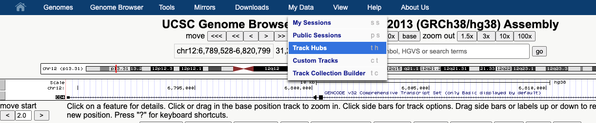{width=100%}\   
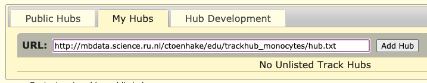{width=100%}\   

>#### **I get a warning**:
<details><summary>What to do with `r colorize("ERROR: Couldn't open [URL]..", col = "red")` (click here)? </summary>
> If you see this error, you can first:
>
> 1. Check the spelling of the URL. If no mistakes were made, hit 'Retry Hub'.
> 2. 'Disconnect' this hub and copy-paste the URL again.
> 3. If none of the above work, ask peers and/or assistants. </details>
>
<br>
<details><summary>What to do when a track is replaced by a folder location (click here)? </summary>
>
> 1. Reload the page.
> 2. Connect the hub again.
</details>

Note that, after adding the trackhub, an additional section is added below the browser, specific to the tracks in this trackhub.

```{r q8_trackhub}
question("What is the name of this trackhub",
          answer("Trackhub", message = "Examine the section for this hub below the browser view."),
          answer("BLUEPRINT monocytes", correct = TRUE, message = "Notice that this hub contains additional tracks that are currently 'hidden'. We will use them in part 1.4.4."),
          answer("Functional Genomics", message = "Examine the section for this hub below the browser view." ),
           allow_retry = TRUE)
```

This trackhub contains histone PTM ChIP-seq and DNaseI-seq data of monocytes, to be precise of **CD14+, CD16- classical monocytes**.
<br>

> *Background*: CD14 and CD16 are cell surface markers of the **CD (Cluster of Differentiation) gene family** which we will come across more often during this practical. These cell surface molecules and their differential expression are used for immunophenotyping of cells. CD molecules can function as receptors, ligands and, for example, activate signalling cascades, mediate cell adhesion, cell migration, regulate gene expression etc. [HUGO, genegoups, CD](https://www.genenames.org/data/genegroup/#!/group/471)

<br>
We have the following datasets:

+ H3K9me3 ChIP-seq, grey
+ H3K27me3 ChIP-seq, grey
+ H3K4me3 ChIP-seq, red
+ H3K4me1 ChIP-seq, yellow
+ H3K27mac ChIP-seq, pink
+ H3K36me3 ChIP-seq, lightgreen
+ DNaseI-seq data, blue
+ polyA-selected, stranded RNA-seq data (plus and minus seperate), forestgreen
+ Input ChIP-seq, black

<br>
What we haven't discussed so far is the **y-axis** on the left side of the tracks with **signal information** such as the ones just uploaded. Using this y-axis you can evaluate signal intensities. The height is currently set to 30, 40, 50 or 100. This corresponds to the number of reads mapping to that location per million reads in the library.
<br>
Leave the settings as they are for now. But, FYI: you can change the height of the y-axis by right-mouse click on the trackname, select the "Configure [trackname]" option and change under "Vertical viewing range", the "min" and "max". Alternatively, you can set the "Data view scaling" to "auto-scale" which adjusts the y-axis limits to the signal in view. Hit `APPLY` afterwards.

> **Action: Go back to the *SPI1* locus.**

>#### **Optional check**:
<details><summary>Your browser should be showing genomic region (click here):</summary>
<br>
> chr11:47,354,860-47,378,576
</details>

```{r q9_ACTB_expression}
quiz(caption = "",
  question("A.) Look at the RNA-seq tracks, would you conclude that the SPTI gene is actively transcribed?",
       answer("Yes", correct = TRUE),
       answer("No"),
      allow_retry = T),

  question("B.) Which (three) ChIP-seq datasets could you have used to answer (A.) (Select ALL that apply.)?",
         answer("monocyte_H3K9me3", message = "H3K9me3 is associated with silencing, not active genes."),
         answer("monocyte_H3K27me3", message = "H3K27me3 is associated with silencing, not active genes."),
         answer("monocyte_H3K4me3", correct = TRUE, message = "H3K4me3 is found at the 5' site of genes and is associated with gene activity."),
         answer("monocyte_H3K4me1", message = "H3K4me1 is not the best mark from this list to recognize active genes."),
         answer("monocyte_H3K27ac", correct = TRUE,  message = "H3K27ac is also often found at the proximal-promoter of transcriptionally active genes"),
         answer("monocyte_H3K36me3", correct = TRUE, message = "Indeed, H3K36me3 is enriched at gene bodies of transcriptionally active genes."),
         allow_retry = TRUE)
)

```

> **Action: Navigate to the *ACTB* locus, zoom out 100x. A prominent H3K27me3 peaks *upstream* of *ACTB* comes in view.**

> #### **Optional check**:
<details><summary> Your browser should be showing (click here):</summary>
<br>
chr7:5,356,175-5,701,574 approximately, a few bases more or less is not a problem.
</details>

```{r q10_FSCN1_promoter}
question("A prominant H3K27me3 peaks *upstream* of *ACTB* comes in view. The promoter of which gene is covered by this mark?) (Select ALL that apply.)",
         answer("*ACTB*", message = "The *ACTB* promoter is not covered by H3K27me3."),
         answer("*FSCN1*", correct = T),
         answer("*FBXL18*", message = "The *FBXL18* promoter is not covered by H3K27me3 *and* is not located up- but downstream."),
         answer("This peak is not covering a promoter.", message = "This peak covers the promoter of a gene."),
         allow_retry = T,
         random_answer_order = T
         )
```

> **Action: Zoom in that gene including the prominant H3K27me3 peak.**

> #### **Optional check**:
<details><summary> Your browser should be showing (click here):</summary>
<br>
chr7:5,587,501-5,611,400  approximately, a few bases more or less is not a problem.
</details>


```{r q11_FSCN1_promoter}
question("Based on the tracks currently shown and the current track settings, would you agree more with proposition A or B?",
        answer("A, the prominent H3K4me3 signal in combination with the H3K36me3 signal (albeit low) suggests that FSCN1 is transcribed", message = "This is a tricky question and both answers are suboptimal, because of some technicalities we had to set one of the answers to correct and this was not the one we chose. A is not correct as, based on the current view and settings, we do not see signal in the RNA-seq track and as RNAs-eq is generally more sensitive than ChIP-seq. However, proposition B is not optimal either because FSCN1 might be expressed at a low level and we should rescale the y-axis before we can draw a conclusion. **Action: adjust the \"Data view scaling\" for the	RNA-seq tracks to \"auto-scale\""),
        answer("B, the prominent H3K27me3 signal in combination with absence of signal in the RNA-plus track suggest FSCN1 is likely NOT transcribed.", correct = T, message = "This is a tricky question and both answers are suboptimal.  is not correct as, based on the current view and settings, we do not see signal in the RNA-seq track and as RNAs-eq is generally more sensitive than ChIP-seq. However, proposition B is not optimal because FSCN1 might be expressed at a low level and we should rescale the y-axis before we can draw a conclusion. **Action: adjust the \"Data view scaling\" for the	RNA-seq tracks to \"auto-scale\"")
         )
```


```{r q12_FSCN1_expression}
question("Based on the tracks currently shown and the current track settings, would you conclude *FSCN1* is transcribed?",
         answer("No"),
         answer("Yes", correct = T, message = "*FSCN1* is transcribed at a low level in monocytes. It encodes a member of the fascin family (3 genes in humans) of actin-binding proteins. Fascin proteins organize filamentous actin polymers into parallel bundles. This is required for the formation of actin-based cellular protrusions during cell migration, motility, adhesion and cellular interactions of neurons, glial cells and also dendritic cells [Bros, 2003, J Immunol](https://doi.org/10.4049/jimmunol.171.4.1825). Monocytes can differentiate into dendritic cells and this is accompanied by upregulation of this gene."),
         allow_retry = T)
```
<br>

### 1.4.4 Peaks from peak calling software
**It would be cumbersome if we would have to identify all peaks manually, not to mention a highly biased procedure. Luckily we have peak calling software to help us with that. In the following section we will use those results along with the tracks.**
<br>
The peaks are already loaded, see the list of files in "BLUEPRINT monocytes" section below the browser.

> **Action: Turn the display of all peak tracks to "dense" using the drop-down menu.**  *Tip*: drag the peak tracks to the corresponding signal track.

> **Action: Go to the *MBD2* locus and zoom out 3x to see the surrounding region.**

MBD2, methyl-CpG binding Domain 2, as the name suggests, recognizes methylated CpG dinucleotides and functions in transcriptional silencing [genecards MBD2 page](https://www.genecards.org/cgi-bin/carddisp.pl?gene=MBD2&keywords=mbd2).

> #### **Optional check**:
<details><summary> Your browser should be showing (click here):</summary>
<br>
chr18:54,078,542-54,297,733 approximately, a few bases more or less is not a problem.
</details>

<br>
```{r q13_MBD2_histone_marks_one}
quiz(caption = "",
     question("Is MBD2 activley transcribed in these cells? (Select ALL that apply.)",
              answer("Yes", correct = T),
              answer("No"),
              allow_retry = T),
     question("Which marks are detected around the *MBD2* promoter? In general we define the promoter as 3-5kb upstream the TSS.",
              answer("H3K9me3", message = "H3K9me3 is not detected here"),
              answer("H3K27me3", message = "H3K27me3 is not detected here"),
              answer("H3K4me3", correct = TRUE, message = "H3K4me3 is present at the MBD2 promoter."),
              answer("H3K4me1", correct = TRUE, message = "H3K4me1 is present at the MBD2 promoter."),

              answer("H3K27ac", correct = TRUE, message = "H3K27ac is present at the MBD2 promoter."),
              answer("H3K36me3", message = "H3K36me3 is found downstream the TSS"),
              answer("DNaseI", correct = TRUE, message = "DNaseI peak is present at that the MBD2 promoter."),
         allow_retry = T)
     )
```
<br>
Downstream of *CEBPA* is an enhancer located. What marks mark this enhancer?

> #### **Optional check**:
<details><summary> We're referring to a enhancer located at:</summary>
<br>
Approximately: chr19:33,250,188-33,305,852
</details>


```{r q18_cebpa_enhancer}
question("Which marks mark the enhancer downstream of *CEBPA*? (Select ALL that apply.)",
  answer("H3K9me3", message = "not H3K9me3"),
  answer("H3K27me3", message = "not H3K27me3"),
  answer("H3K4me3", correct = T, message = "Note that although H3K4me3 is generally a promoter signal, we see it here a little bit as well. This might be due to cross-reactivity of the H3K4me1 Ab and cross-linking/contact between the promoter and the enhancer."),
  answer("H3K4me1", correct = T),
  answer("H3K27ac", correct = T),
  answer("DNaseI", correct = T),
  allow_retry = T)
```
<br>
So far we have seen active promoters, bivalent promoters and enhancers. A region silenced by H3K9me3 is located appr. 120kb upstream of *CD14*.

> **Action: Navigate and zoom out to chr5:140250000-141720000.**

```{r q19_cd14_near_silencing}
question("The expression of what gene family is silenced by this  H3K9me3-domain?",
  answer("PCDHA gene family", correct = T, message = "PCDHA gene cluster encodes a family of cadherin-like cell surface proteins that are expressed in neurons and are present at synaptic junctions. On chr19 we can find H3K9me3 doamins covering KRAB-ZNF encoding genes. "),
answer("A group of LINC RNAs"),
  answer("Family of KRAB-ZNF encoding genes", message = "Not at this location, KRAB-ZNF are silenced by H3K9me3 on chr19."),
  allow_retry = T)
```
<br>
```{r q20_cd14_near_silencing_two}
question("What is the approximate size of the H3K9me3 silenced region? (*Tip2: hold shift and mouse click-and-drag in the browser to capture and thereby measure the width of the H3K9me3 domain)",
  answer("250kb"),
  answer("500kb"),
  answer("750kb", correct = TRUE),
  answer("1Mb"),
  allow_retry = T)
```
<br>
Silencing is not always mediated by H3K9me3.

> **Action: Navigate to the following genes: *ACTA1*, *EED*, *MYOD1*. ** Which of the following genes is silenced by H3K27me3?    

> #### **Optional check**:
<details><summary> Table with their genomic coordinates (click here):</summary>
>
gene | genomic location | product  
:--|:---|:----  
*ACTA1* | chr1:229,431,245-229,434,094 | skeletal muscle actin   
*EED* | chr11:86,244,753-86,278,810 | part of PRC2 complex  
*MYOD1* | chr11:17,719,571-17,722,136 | TF for myogenic differentiation  
>
</details>

```{r q21_ACTA1_marking_one}
question("Which genes are silenced by H3K27me3? (Select ALL that apply.)",
         answer("ACTA1", correct = T),
         answer("*EED*", message = "*EED* is not silenced."),
         answer("*MYOD*", correct = T),
         allow_retry = T)
```


>#### **Tip**:
<details><summary>Save your session so that you can easily revisit the data in the UCSC genome browser (click here): </summary>
> 
> By saving sessions in your account you can easily revisit data that you had uploaded before. In fg2 and fg3 you might, for example, want to cross-check some of the findings from your computational analyses in the UCSC genome browser. To save your session:   
>
> 1. Go to "My Data" > "My sessions" > Select "Create an account" (if you didn't already had one otherwise login and continue with 5).  
> 2. Fill out your details and activate your account through the activation email you received upon registration.    
> 3. When you confirm your e-mail adress, you are brought to a page were you can login immediately.   
> 4. Hit "login" and you will return to the "My Sessions" page:  
> 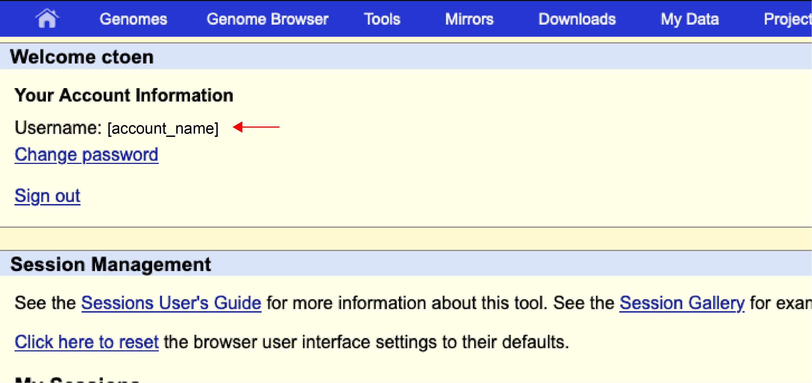{width=100}\    
> 
> 5. In the section "Session management" > "Save sessions" > give your session a name in the "Save current settings as named session:" bar. For example 'blueprint_monocytes_hg38'. Or 'fg1'. Hit "Submit" to save your session.    
> 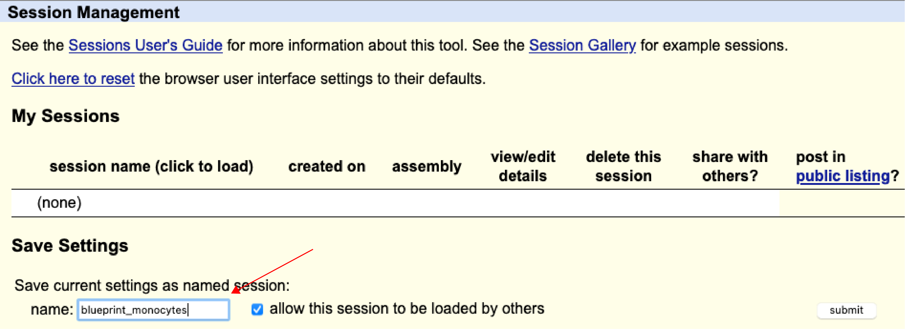{width=100}\    
> 
> 6. After submitting you will see the session appear in the "My Sessions" table. You can visit the session by clicking on the session name.  
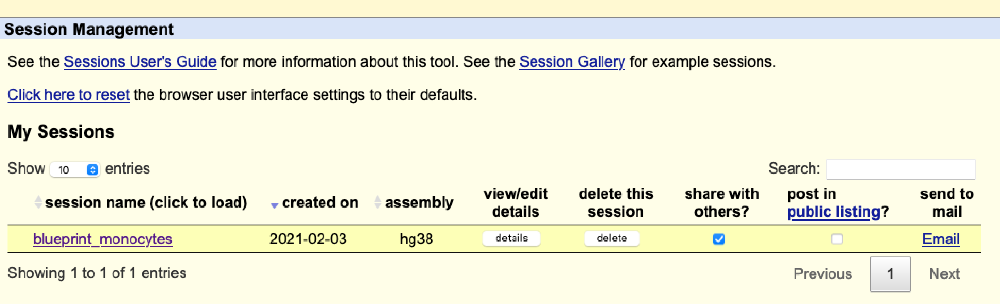{width=100}\    
>
> 7. Whem you revisit the UCSC Genome Browser you can immediatly go to your sessions via the "My Data" section in the header of the homepage and select "My Sessions" > "login".   
</details>


### 1.4.5 Recognizing blinded genomics data    
So far you have browsed through ChIP-, DNaseI- and RNA-seq data. These tracks had the correct track names attached to them.   
<br>
Our colleague performed RNA-seq, DNaseI-seq and ChIPs for H3K9me3, H3K27me3, H3K4me3, H3K36me3, H3K4me1 and H3K27ac on CD4+ T cells but accidentally let the tubes fall before the tubes were properly labeled (always label your tubes first and *before* adding your sample!).      
<br>
We know which experiments were performed, but which track (labeled a-f) is most likely which technique?       

> **Action: upload the following track hub** `http://mbdata.science.ru.nl/ctoenhake/edu/trackhub_unknown/hub.txt`. Upload this trackhub as described in [1.4.3 Viewing BLUEPRINT data].     

<br>
Note that the y-axis scale of these tracks is set to "auto-scale to data view". In the monocyte track we had set these to fixed values based on our experience with these datasets. "Auto-scaling" means that the y-axis adjusts to the reported signal in the corresponding genomic region.     
<br>
Which column from the following table reflects the most likely encoding?     

Track | column 1 | column 2 | column 3 | column 4 | column 5
:--:|:--:|:--:|:--:|:--:|:--:
track_A | H3K36me3 | RNA minus | RNA plus | RNA plus | RNA minus
track_B | H3K4me1 | DNaseI-seq | DNaseI-seq | H3K4me3 | H3K4me3
track_C | RNA minus | H3K9me3 | H3K9me3 | H3K9me3 | H3K27me3
track_D | DNaseI-seq | H3K27ac | H3K27ac | H3K27ac | H3K27ac
track_E | H3K4me3 | H3K4me1 | H3K4me1 | H3K4me1 | H3K4me1
track_F | H3K27me3 | Input | H3K27me3 | Input | Input
track_G | H3K9me3 | H3K27me3 | Input | H3K27me3 | H3K9me3
track_H | Input | RNA plus | H3K36me3 | RNA minus | RNA plus
track_I | RNA plus | H3K36me3 | RNA minus | H3K36me3 | H3K36me3
track_J | H3K27ac | H3K4me3 | H3K4me3 | DNaseI-seq | DNaseI-seq

<!--
# S008H1
# venous blood
# CD4-positive, alpha-beta T cell
# A - RNA-seq minus
# B - DNaseI
# C - H3K9me3
# D - H3K27ac
# E - H3K4me1
# F - Input
# G - H3K27me3
# H - RNA-seq plus
# I - H3K36me3
# J - H3K4me3
-->

```{r q23_recognizing_patterns}
question("The likely encoding is represented by... ",
         answer("column 1", message = "This was a random option, examine the profiles again."),
         answer("column 2", correct = TRUE),
         answer("column 3", message = "RNA-seq and H3K36me3 may look alike, same as for H3K27me3 and input in some regions."),
         answer("column 4", message = "DNaseI and H3K4me3 can look alike but DNaseI generally shows sharper peaks. RNA-seq is stranded."),
         answer("column 5", message = "DNaseI generally shows sharper peaks than H3K4me3; and H3K9me3 broader than H3K27me3."),
         allow_retry = TRUE)
```
<br>

### 1.4.6 Summary
To summarize, a brief quiz on the association between marks and functional elements.


```{r Q20_summary}
quiz( #caption = "Summarizing...",

  question(
    "Promoters that are active are often marked by ...(select ALL that apply)",
    answer("H3K4me3", correct = T),
    answer("H3K4me1", correct = T),
    answer("H3K27ac", correct = T),
    answer("H3K9me3"),
    answer("DNaseI", correct = T),
    answer("H3K36me3"),
    random_answer_order = TRUE,
    allow_retry = TRUE
    ),
  
  question(
    "The marks found at bivalent promoters are ...",
    answer("H3K4me3 and H3K27me3", correct = T),
    answer("H3K27ac and H3K4me1"),
    answer("H3K9me3 and H3K27ac"),
    answer("DNaseI and H3K36me3"),
    random_answer_order = TRUE,
    allow_retry = TRUE
    ),
  
  question(
    "Active enhancers are marked by ...",
    answer("H3K4me3 and H3K27me3"),
    answer("H3K9me3 and H3K27ac and DNaseI"),
    answer("H3K27ac, H3K4me1 and DNaseI", correct = T),
    answer("H3K27me3, H3K4me1 and DNaseI"),
    random_answer_order = TRUE,
    allow_retry = TRUE
    ),
  
  question(
    "H3K9me3-mediated silencing often spans ...",
    answer("small domain, single genes"),
    answer("Broad domain, multple genes", correct = T),
    allow_retry = TRUE
    ),
  
  question(
    "The gene body of a transcribed gene (eg *ACTB* or *CD14* gene in  monocytes) is covered by ...",
    answer("H3K9me3"),
    answer("H3K27me3"),
    answer("H3K4me3"),
    answer("H3K4me1"),
    answer("H3K27ac"),
    answer("H3K36me3", correct = T, message = "H3K36me3 is strongly correlated with transcription."),
    random_answer_order = TRUE,
    allow_retry = TRUE
    )
)
```

## Finish  
### Almost there...        
> **You have one last challenge to go**: Hit the `Print page` button to save a progress report of the tutorial (incl. your answers) as pdf to your local drive.   
> 
> * It is important that you have visited each topic within the tutorial for all of the content to be populated.   
> * Thus, if you see empty sections in your pdf file, revisit each section and print the report again.  
> * Hit `Continue` after you saved your pdf file.     

```{js print2pdf1, context="server"}
$(document).on('shiny:inputchanged', function(event) {
  if (event.name === 'print2pdf') {
    window.print();
  }
});
```

```{r print2pdf2}
actionButton("print2pdf", "Print page", style="opacity: .7; color: #000;")
```


### Well done!  
<br>
<center>
<iframe src="https://giphy.com/embed/ar4x1w44umngk" width="480" height="240" frameBorder="0" class="giphy-embed" allowFullScreen></iframe><p><a href="https://giphy.com/gifs/mrw-someone-brady-ar4x1w44umngk">via GIPHY</a></p>
</center>  
You have studied the preprocessing process for ChIP-seq data and have used the UCSC genome browser to visually inspect the localization and co-occurrences of different histone marks.  
<br>
Up to now we have inspected individual genes or regions. Can we quantify the observed associations? Eg. "*How many of the H3K4me3 peaks are located at promoters?*" And, "*is this signal statistically enriched in promoters?*". Or "*Which and how often do marks co-occur genome-wide?*" Next week we will use R to quantitatively describe these relationships.      
