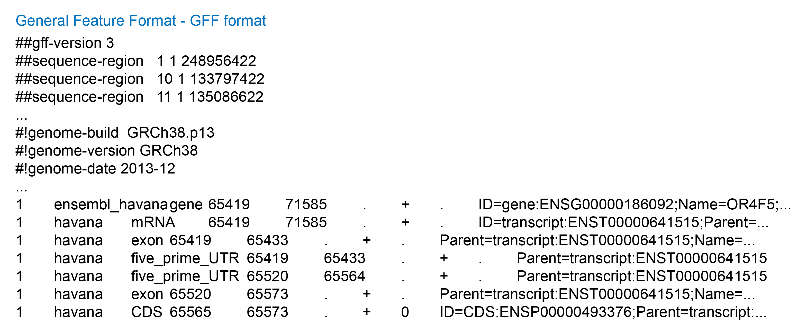
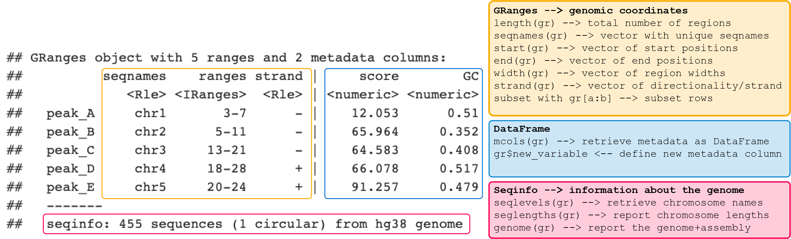
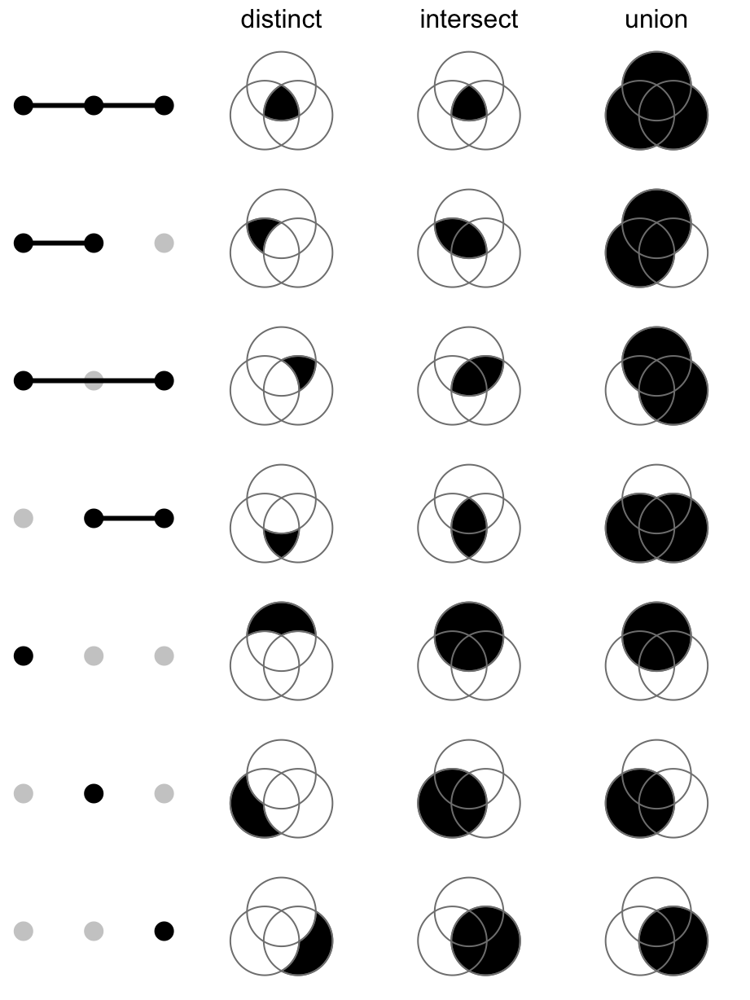

```{r setup, include=FALSE}
library(learnr)     # 0.10.1.9006 (github)
library(gradethis)  # 0.1.0.9004  (github)
library(testthat)   # 3.0.0 
library(tidyverse)  # 1.3.0
library(learnr.proto)

library(IRanges)
library(GenomicRanges)
library(plyranges)
library(rtracklayer)
library(VennDiagram)
library(GenomicFeatures)
library(ComplexHeatmap)
library(genomation)
library(ChIPpeakAnno)
library(ggthemes)
library(org.Hs.eg.db)


# load the txdb package which holds transcript-based gene models of hg38 genome  
library(TxDb.Hsapiens.UCSC.hg38.knownGene)
txdb <- TxDb.Hsapiens.UCSC.hg38.knownGene 
seqlevels(txdb) <- "chr19"

## installing additional packages by:
# BiocManager::install('genomation')
# BiocManager::install("ggthemes")
# BiocManager::install("ComplexHeatmap")  # for upset plot with GRanges
# BiocManager::install("org.Hs.eg.db")


# configuration
knitr::opts_chunk$set(echo=FALSE, message=F)
gradethis::gradethis_setup()

# data accessible to all exercises
rdata = system.file("extdata", "week2.Rdata", package = "learnr.proto")
load(rdata)
monocytes_all <- unlist(monocytes_list)
monocytes_all$chip <- names(monocytes_all)
monocytes_list <- GRangesList(monocytes_list, compress=F)

# chr19_windows_1bp <- tileGenome(seqinfo(txdb), tilewidth = 10, cut.last.tile.in.chrom =T)
tss_chr19 <- unique(promoters(genes(txdb), upstream=100, downstream=0)) 
tss_chr19  <- resize(tss_chr19, width = 1, fix = "end")
promoters_chr19 <- unique(promoters(genes(txdb), upstream=2000, downstream=200)) 
genes_chr19 <- unique(genes(txdb))

# gene quantification chromosome 19  
rdsfile <- system.file("extdata", "week2", "prepared_rds", "blueprint_c000s5_gene_quantification_chr19.rds", package = "learnr.proto")
quantification_chr19 <- readRDS(rdsfile)

### not used anymore 2020-12-14 ###
# rdata <- system.file("extdata", "week2", "prepared_rds", "txdb_annotation_chr19_genes_tx_pr_tss_granges.RData", package = "learnr.proto")
# load(rdata)
# identify TSS (in this case 1 per gene even though we know that genes have multiple TSSs)
# tss <- resize(genes, width = 1, fix = "start")

# consider 1kb upstream and 200bp downstream the TSS as promoter
# promoters <- resize(tss, width = 1000, fix = "end")
# promoters <- resize(promoters, width = 1200, fix = "start")

# windows_1bp <- tileGenome(seqinfo(txdb), tilewidth = 10, cut.last.tile.in.chrom =T)
# saveRDS(annotation_chr19,"~/learnr.proto/renv/library/R-3.6/x86_64-pc-linux-gnu/learnr.proto/extdata/week2/prepared_rds/genomation_chr19_background_annotation.rds")

#  genomation_chr19 <- system.file("extdata", "week2", "prepared_rds","genomation_chr19_background_annotation.rds", package = "learnr.proto")

# import the gencode features for annotation with genomation (exercise 8)
gencode_chr19 <- system.file("extdata", "week2", "encode", "gencodev32.chr19.bed", package = "learnr.proto")
gencode_chr19 <- readTranscriptFeatures(gencode_chr19, up.flank = 2000, down.flank = 200) 

```

```{r timeout1, context="server"}
isolate({
  # obtain the session id
  # source 1: https://shiny.rstudio.com/reference/shiny/latest/session.html
  # source 2: https://stackoverflow.com/questions/18900955/get-environment-identifier-in-r
  session_id <- sub('<environment: (.*)>', '\\1', capture.output(session$userData))
  
  # # send the session ID to the log (indicates the tutorial is loaded)
  # write(paste0("Session ID: ", session_id), stderr())
  
  # send the session ID to the javascript chunk
  session$sendCustomMessage("session_id", session_id)
})

# stop the tutorial when "input[[session_id]]" is updated
observeEvent(input[[session_id]], ignoreNULL=T, {
  write(paste0("\nTutorial terminated due to inactivity.\nRestart to continue where you left off!\n"), stderr())
  stopApp()
})
```

```{js timeout2}
// This chunk stops the tutorial if it has been idle for too long

// Situation: We need to stop inactive tutorials to prevent the server from grinding to a halt.
// Problem: refreshing the tutorial and closing the browser send the same signal to shiny.
// since we cannot distinguish the two, this signal cannot be used to stop the tutorial.
// solution: Use a timeout system. 
// Method: this chunk will update shiny variable "input[[session_id]]" 
//   when the session has been running idle for longer than "timeoutSec" seconds.
// This signal is then be used by Shiny (server-side) to stop the session.

// source1: https://community.rstudio.com/t/keeping-track-of-idle-time-during-app-usage/1735
// source2: https://bookdown.org/yihui/rmarkdown/language-engines.html#javascript-and-css
$(function() {
  var timeoutSec = 15*60;
  var idleTimer;

  // receive this session's ID
  Shiny.addCustomMessageHandler("session_id", function(s_id) {
    session_id = s_id;  // assigns the variable globally
  });

  // assign session ID as reactive variable "input[[session_id]]" 
  function onTimeout() {
    alert("Tutorial stopped due to inactivity.\nRestart to continue where you left off!")
    Shiny.setInputValue(session_id, "TRUE");
  }

  function startIdleTimer() {
    if (idleTimer) clearTimeout(idleTimer);
    idleTimer = setTimeout(onTimeout, timeoutSec * 1000);
  }
  
  $(document).on('shiny:message shiny:inputchanged', startIdleTimer);

})();
```


## 2.1 Introduction
<br>
In week 1 we discussed the major steps involved in obtaining genomics data, from experiment to raw data to normalized signal and peaks. You examined histone PTM ChIP-, DNaseI-, and RNA-seq data of monocytes in the UCSC genome browser and searched for regions with increased signal, *peaks*. You looked at the position of these peaks in the chromosome and with respect to genes as well as the co-occurrence of different marks.   
<br>
These observations showed examples of marks associated with a particular functional elements (e.g. active enhancer, active promoter, silenced domains). Manual annotation of each peak region would be an overkill and dangerously subjective. 
<br>
**This week and next week you will perform computational analyses to annotate peaks and answer common questions including:** "*How many peaks do I have?*", "*Is this mark statistically enriched at promoters?*", "*Which and how often do marks co-occur?*","*The expression of which gene could be affected by this mark?*",  and "*What is the signal of the mark around a particular element of interest like the TSS?*"   
<br>

### 2.1.1 Learning Objectives  

> At the end of week 2 you are able to:  
> 
1. Import ChIP-seq peaks into a GRanges object in r.  
2. Perform exploratory data analysis on GRanges objects with ChIP-seq peaks using plyranges and ggplot. 
3. Detect and count overlap between two GRanges objects.    
4. Plot this overlap in a venndiagram.  
5. Statistically test for enrichment of histone marks in a particular genomic region.  
6. Visually compare gene expression of genes with different histone marks at their promoters.  
7. summarise the genome-wide overlap among multiple marks in a upset plot.  
- These refer to global learning objectives #4-#7.  

#### Tutorial specs  
In this tutorial you will have multiple-choice and check-the-box questions like in fg1 but also **complete-the-code exercises**. The latter are sometimes evaluated on the computed outcome (e.g a computed p-value), in other cases, the code itself is checked. When the code is evaluated we added "code check" to the question.  
<br>
For short lines of code, you have to decide which function or object to use and how to write this in code. For some longer lines of codes, we left blanks as "___" that indicate where in the code you should fill in a function, object or variable. Make sure fill out all the blanks before Answer submission, they will otherwise result in errors.  
<br>

- Hit `Hint` (when provided) for clues.  
- Hit `Run Code` to test your code and preview the output.  
- Hit `Submit Answer` (if present) to submit the code. As 'submitting' not always shows the code output, it is advised to use `Run Code` first. If your code-checking is enabled and your submitted code is different from the solution code, R will give automatic feedback that helps you correct your code.  
- Hit `Start Over` to remove any adjustments you made and start again.   
- Try to keep yourself from hitting `Solution` (when provided). This is option is sometimes provided when your code is evaluated. Only use it when you do not understand the automatic feedback given by R.   

Although we ask for specific answers or completion of specific code, you are encouraged to test your own code and use `Run Code` and `Start Over` extensively. I.e., remove the pre-coded code and write your own code for a different graph or different summary of the data. Use `Run Code` to preview the results. Unfortunately these self-thought of codes can not be evaluated. For the evaluation you need to use our pre-coded code. Hit `Start Over` to get this pre-coded code.  
<br>

**Example coding exercise:**  

> **Example exercise**: Print the head of object `monocytes_h3k4me3` (code check).   

```{r examplecode, exercise=TRUE, exercise.lines=3, exercise.eval=FALSE, error=TRUE}
# print the head of `monocytes_h3k4me3`

```

```{r examplecode-solution}
head(monocytes_h3k4me3)
```

```{r examplecode-code-check}
grade_code()
```

<br>  
Again, to reserve server space to *active* running tutorials, and stop those that aren't actively used anymore, we set a time-out at 15 minutes. Meaning that if your tutorial has been idle for over 15 minutes, you will see the following warning "Tutorial stopped due to inactivity. Restart to continue where you left off!". When you see this warning, you should close the browser with the tutorial and restart the tutorial. Progress will be saved and once you restart the tutorial you can continue where you left. <br>   

## 2.2 ChIP-seq peaks in R    
### 2.2.1 Data formats      
In genomics you often work with **interval** data. Think of peaks, genes, exons, ... any genomic region reported with the **genomic coordinates: chr, start, and end**. As we discussed in week 1, these often come in a tabular format with the basic information about the location and some other information.  
<br>
Common file formats include BED format for peak files and GFF for gene annotations. In practice, peak files come in two flavors, both cohering to the BED format but with small differences in columns 6-7. These are called **narrowPeak** and **broadPeak** files. This is because different data types have different peak shapes and peak-calling takes that into account. If you have narrowPeak files, this means that during peak calling, settings were used that fit ChIP-seq datasets with sharp, narrow enrichment signals. For broadPeak files, peak calling settings were used to detect broad domains of (overall lower) enrichment. We will come back to this difference shortly.      
 

>#### **Background info**: File formats   
<details><summary>What do BED and GFF files hold and look like? (click here to expand)</summary>   
**Browser Extensible Data - BED format**:  
>
- Used for peaks, motif locations or other custom intervals.  
- Has 3 required columns: chromosome, start and end position.  
- 6 or 7 optional columns, in case of peaks:  
  4th: peak name  
  5th: peak score (-10log(q-value) * 10, rounded down to integer value))  
  6th: strand to denote orientation (if applicable, otherwise "\*" or "\." if unstranded)  
  7th: signalValue  
  8th: p-value to denote statistical significance, given as -log10(p-value)  
  9th: q-value statistical significance using false discoveray rate, given as -log10(q-value)  
  10th (only for sharp peaks not broad domains): location of peak summit relative to the "start" coordinate.  
>
> Example:  
{width=80%}  
> Further reading on the file formats on the UCSC Genome Browser FAQ page: [BED](http://genome.ucsc.edu/FAQ/FAQformat.html#format1), and the [narrowPeak BED](http://genome.ucsc.edu/FAQ/FAQformat.html#format12) and [broadPeak BED](http://genome.ucsc.edu/FAQ/FAQformat.html#format13).  
> <br>
> **General Feature Format - GFF format**:   
>  
-	Common file format for storing gene annotations not only including genes but also transcripts/splice variants, cDNA sequences, exons, rRNA, ncRNA, etc.  
-	Begins with meta-data in headerlines, starting with #  
-	Records reported in 9 fixed columns  
-	Column 9 can contains various attirbutes (eg gene symbol, the transcript to which the exon belongs).  
- Downloaded for example from [Ensembl](https://www.ensembl.org/Homo_sapiens/Info/Index).  
>
> Example:   
{width=80%}      
> Further reading on the gff file formats: [UCSC Genome Browser](http://genome.ucsc.edu/FAQ/FAQformat.html#format3), or [ENSEMBL](https://m.ensembl.org/info/website/upload/gff3.html).  
> <br>


### 2.2.2 Peaks as data.frame     
<br>
Peak data can be imported into a data.frame with:  
```{r exampleimport, eval=FALSE, echo=TRUE}
object_name <- read.table("location/of/peak_file.bed")
```
<br>
The data.frame data structure is, however, not the most efficient way to work with interval data. E.g. a simple manipulation such as shifting all reported intervals 2 bp to the right, requires you to manipulate the "start" and "end" columns at the same time.  
<br>
Interval data such as genomic peaks can be more efficiently handled with the `IRanges` package which works with a data structure especially developed for **ranges of integers**: IRanges objects.  

### 2.2.3 Introducing IRanges and GRanges    
To construct an IRanges object you need to define at least two of the following three values:  

1. a starting coordinate  
2. a finishing coordinate  
3. the width of the interval.  

<br>
The GRanges objects of the `GenomicRanges` package are very similar but require a additional **sequence name** (in other words a chromosome) for every interval and an optional **strand** column.  
<br>
We installed and loaded the packages `IRanges` and `GenomicsRanges` for you with:
```{r install_genomicranges, eval=FALSE, echo=TRUE}
BiocManager::install(c("IRanges", "GenomicsRanges"))
library(IRanges)
library(GenomicRanges)
```
<br> 
Here we create GRanges object called `gr` with 3 intervals on chr1:  
```{r create gr, echo=TRUE, eval=TRUE}
# create `gr`
gr_chr1 <-  GRanges(seqnames = c("chr1"), # argument is recycled  
              ranges = IRanges(start=c(5,10,25), width = c(13,17,6)),
              strand = c("-","+", "+"),
              color = c("black", "red", "green"))
# add names to `gr_chr1`
names(gr_chr1) <- paste("interval", LETTERS[1:3], sep = "_")
# print the object:
gr_chr1
```
<br>
When we visualize these intervals we see three 'blocks' along the horizontal axis:
```{r plot gr, echo=FALSE}
plotRanges(gr_chr1, col = gr_chr1$color)
rm(gr_chr1)
```

### 2.2.4 Handy functions for GRanges    
There are several functions to retrieve and set the values in GRanges objects. Here is an image of a GRanges object called `gr` with the respective functions. You will use many of these function in this tutorial, it may therefore be handy to save this image in your Downloads (right-mouse-click --> save image as).  

{width=100%}   
<br>
To add a column to the metadata you can use:  
`granges_object$new_variable <- new_variable_calculation`  
<br>
A list of the above functions (and more) for GRanges can also be called with `methods(class = "...")`. This also command works for other objects as well. You just need to figure out the class of the object in question using `class([object_name])`.  
<br>
You can print a summary of the GRanges object with `show(object_name)` and `print(object_name)` (this works for many  other R objects as well).  
<br>

### 2.2.5 Slots in GRanges objects     
Notice that `gr` holds 3 slots:  

1. the genomic coordinates in a **GRanges** slot  
2. 2 columns as **metadata**  (metadata is data about the data)    
3. a genome in the **seqinfo** slot  

The main differences between the metadata and the genomic coordinates are:  

Genomic coordinates |  Metadata columns   
:--|:---  
Printed on the left-hand side of the \|-sign | Printed on the right-hand side of the \|-sign     
Extract using `granges(object_name)` |  Extract as DataFrame with `mcols(object_name)` or `object_name$column_name` for a specific column   
Restricted to variables `seqnames`, `ranges` and `strand` | Almost anything can be stored in the metadata

<br>
Information about the genome is stored in the **seqinfo** part of the object. In the example you see that the peaks are located in human genome 38 which holds 455 sequences in total of which 1 circular (mitochondrial genome). (Sequences that can not be confidently placed on a specific chromosome is stored in chrUn, chr*N*_random and chr*N*_region [explanation on UCSC GB website](http://genome.ucsc.edu/FAQ/FAQdownloads#download10).)   


### 2.2.6 Importing peak files as GRanges     
To parse peak files directly into GRanges you use the `import()` function from the `rtracklayer` package. We installed and loaded this package with:
```{r installrtracklayer, eval=FALSE, echo=TRUE}
BiocManager::install("rtracklayer")
library(rtracklayer)
```
<br>
Peakfiles in .bed format can be imported with:  
```{r exampleimport_rtracklayer, eval=FALSE, echo=TRUE}
# import monocyte H3K4me3 peak locations
monocytes_h3k4me3 <- import("C000S5H2.ERX547984.H3K4me3.bwa.GRCh38.20150527.chr19.bed", format = "narrowPeak")

# (you could also use rtracklayer::import("C000S5H2.ERX547984.H3K4me3.bwa.GRCh38.20150527.chr19.bed", format = "narrowPeak") and skip loading the library)
```
<br>
As mentioned above, different data types have different peak shapes resulting in "narrowPeak" and "broadPeak" files. H3K4me3 ChIP-seq generally shows sharp(er) enrichment that can reach high enrichment values. For `import()` to function properly, we defined this format in the `format = ` parameter.  
<br>
H3K4me1 covers broad(er) domains and peak calling took that into account, resulting in a "broadPeak" peak file. 
```{r qimport}
question("Which function imports the H3K4me1 dataset into a GRanges object?",
         answer("import(\"C000S5H2.ERX547981.H3K4me1.bwa.GRCh38.broad.20150527.chr19.bed\", format = \"narrowPeak\")", message = "check the file format."),
         answer("import(\"C000S5H2.ERX547981.H3K4me1.bwa.GRCh38.broad.20150527.chr19.bed\", format = \"BED\")", message = "BED is not the right format."),
         answer("import(\"C000S5H2.ERX547981.H3K4me1.bwa.GRCh38.broad.20150527.chr19.bed\", format = \"broadPeak\")", correct =T),
         answer("read.table(\"C000S5H2.ERX547981.H3K4me1.bwa.GRCh38.broad.20150527.chr19.bed\", format = \"broadPeak\")", message = "read.table parses the data into a data.frame while we asked for a GRanges object."),
         allow_retry=TRUE,
         random_answer_order=TRUE
         )
```
<br>
Let's have a quick look at `monocytes_h3k4me3`.     

### Exercise 1  

> **Exercise 1a**: Print the head of `monocytes_h3k4me3`.  

```{r q1_head_h3k4me3, exercise=TRUE, exercise.lines=3, exercise.eval=FALSE, error=TRUE}
# print the head of monocytes_h3k4me3  
# the object "monocytes_h3k4me3" has already been imported for you


```

```{r q1_head_h3k4me3-hint-1}
# You may want to use the function:
head()
```

```{r q1_head_h3k4me3-hint-2}
# As in:
head(monocytes_h3k4me3)
```

```{r q1_head_h3k4me3-check}
grade_result(
 pass_if(~identical(.result, head(monocytes_h3k4me3)))
 )
```

```{r quiz_grangesobject}
quiz(caption = "", 
    question("How many metadata columns does the 'monocytes_h3k4me3' object have?",
             answer("2"),
             answer("3"),
             answer("6", correct=T, message = "The original .BED files lacked column headers. The `rtracklayer::import()` function appendended variable names and converted the data to the data type (eg numeric, integer, character etc.) according to the file format we defined."),   
             answer("9"), 
             allow_retry=TRUE),
    question("How many different chromosomes are reported in this file? *Hint*: look in seqinfo part of the object.",
             answer("1", correct=T, message = "We have restricted all peak files to chromosome 19 to limit their file size. That is why 'seqinfo' holds only one sequence"),
             answer("24"),
             answer("455"),
             allow_retry=TRUE)
)
```

### Briefly summarizing  
You have the following information in your object `monocytes_h3k4me3`:  

Column | Section in GRanges object | Variable | Description   
-- | --- | --- | ------  
1. | GRanges | seqnames | chromosome name of peak location.        
2. | GRanges | ranges | start and enc position of peak.         
3. | GRanges | strand | if applicable, orientation of the peak, otherwise \*\.        
4. | Metadata | name | peak name, given by the peak caller.     
5. | Metadata | score | -10log(qvalue) * 10, rounded down to integer value.  
6. | Metadata | signalValue | enrichment signal at the peak summit.  
7. | Metadata | pValue | -log10(p-value), (*e.g.if p-value = 1e-10, this value is 10*), roughly put, the significance of the enrichment.   
8. | Metadata | qValue | -log10(qvalue), the false discovery rate determined by swapping test and control.  
9. | Metadata | peak  | location of peak summit relative to the peak start.  

## 2.3 Exploratory data analysis   
A common first step in genomics data analysis is to look at some basic characteristics of the data by making exploratory summaries and plots. You will look at peak counts and peak widths of the different marks in this section. In a normal analyses, these plots could function as an additional QC control or  provide new insights, depending on the system that you are working with (think of a newly discovered histone mark or TF).  
<br>
In this case, you will visualize the differences between broad and narrow marks and at the same time get used to working with GRanges objects and refresh your understanding of ggplot2 and dplyr. Let's get started!  

### 2.3.1 Peak counts

> **Exercise 2a**: Determine the number of H3K4me3 and H3K4me1 peaks in monocytes. 
> 
> * The peak data are stored in the R objects `monocytes_h3k4me3` and `monocytes_h3k4me1`.    

```{r q2a_exploreh3k4me3, exercise=TRUE, exercise.lines=3, exercise.eval=FALSE, error=TRUE}
# How many peaks are stored in "monocytes_h3k4me3"?
monocytes_h3k4me3

```

```{r q2a_exploreh3k4me3-hint-1}
# Look at the handy functions in section 2.2.4
```

```{r q2a_exploreh3k4me3-hint-2}
# You may want to use the function
length()
```

```{r q2a_exploreh3k4me3-check}
grade_result(
 pass_if(~identical(.result, length(monocytes_h3k4me3)))
 )
```

```{r q2a_exploreh3k4me1, exercise=TRUE, exercise.lines=3, exercise.eval=FALSE, error=TRUE}
# And how many H3K4me1 peaks do you have?


```

```{r q2a_exploreh3k4me1-hint}
# look at the command you used above
```

```{r q2a_exploreh3k4me1-check}
grade_result(
 pass_if(~identical(.result, length(monocytes_h3k4me1)))
 )
```

### Exercise 2b  

> **Exercise 2b**: And what is the distribution of peak sizes for these marks? 

```{r q2b_widthh3k4me3, exercise=TRUE, exercise.lines=3, exercise.eval=FALSE, error=TRUE}
# What is the distribution of H3K4me3 peak sizes?   
summary(___(monocytes_h3k4me3))
```

```{r q2b_widthh3k4me3-hint-1}
# Review the handy functions in section 2.2.4
```

```{r q2b_widthh3k4me3-hint-2}
# You may want to use
width()
```

```{r q2b_widthh3k4me3-check}
grade_result(
  pass_if(~identical(.result, summary(width(monocytes_h3k4me3))))
)
```

```{r q2b_widthh3k4me1, exercise=TRUE, exercise.lines=3, exercise.eval=FALSE, error=TRUE}
# And what is the distribution of H3K4me1 peak sizes?   
monocytes_h3k4me1
```

```{r q2b_widthh3k4me1-check}
grade_code(
  pass_if(~identical(.result, summary(width(monocytes_h3k4me1))))
)
```

```{r quiz_peakgranges}
quiz(caption = "", 
    question("What are the median peak sizes for H3K4me3 and H3K4me1 ChIP-seq peaks in the current dataset? (in monocytes, restricted to chromosome19)",
             answer("median H3K4me3 peak = 879.5 bp", correct=T),
             answer("median H3K4me3 peak = 1662 bp"),
             answer("median H3K4me3 peak = 1198.6 bp"),   
             answer("median H3K4me3 peak = 2642 bp"),
             answer("median H3K4me1 peak = 879.5 bp"),
             answer("median H3K4me1 peak = 1662 bp", correct=T),
             answer("median H3K4me1 peak = 1198.6 bp"),   
             answer("median H3K4me1 peak = 2642 bp"), 
             allow_retry=TRUE),
    question("And what are the widths of the *largest* peaks in the current H3K4me3 and H3K27me1 ChIP-seq datasets of monocytes?",
             answer("largest H3K4me3 peak = 8237 bp", message = "8237 bp is the width of the largest H3K27ac peak on chr19" ),
             answer("largest H3K4me3 peak = 12705 bp", correct=T),
             answer("largest H3K4me3 peak = 73112 bp", message = "73112 bp is the width of the largest H3K36me3 peak on chr19" ),   
             answer("largest H3K4me1 peak = 32063 bp", correct=T ),
             answer("largest H3K4me1 peak = 86201 bp", message = "86201 bp is the width of the largest H3K27me3 peak on chr19"),
             answer("largest H3K4me1 peak = 136766 bp", message = "136766 bp is the width of the largest H3K9me3 peak on chr19"),
             allow_retry=TRUE))
```
<br>
Notice the larger median and maximum peak size for H3K4me1 peaks compared to H3K4me3 peaks. This is related to these datasets having "broad domain" and "narrow peaks", respectively.  

### 2.3.2 Plotting summaries with ggplot2  
You will use ggplot2 and dplyr package to explore the ChIP-seq data further. You have used these packages in the year 1 course Genomics and Big Data. Use the refresher-boxes and package cheatsheets (tip: use google) when you  need a quick reminder of the basics and how-to-use the package-functions.  
<br>

> #### **Refresher**: ggplot2  
<details><summary>For a very brief refresher on ggplot2-ting...(click here)</summary>  
> With **ggplot2** you generally begin with the `ggplot(data = ..)` function and you add so-called layers with `geom..()` functions. Example geom functions include `geom_point()` for a scatter plot, `geom_histogram()` for a histogram, `geom_density()` for a smoothened version of the histogram, and `geom_bar()` for a barplot.  
> <br>
> The **geom functions** take a `mapping = aes(x = ..., y = ..., ...)` argument that defines how variables in the dataset are mapped to visual properties (aes for "aesthetic mapping"). Depending on the geom function, you can map variables to the x- and y-axis, to the shape of symbols, the line type of line graphs, to the fill color of symbols and more.  
> <br>
**Scales** can be customized with `scale_[]_[]` functions. These can be used to for example, change a color palette, set limits to the values included in the mapping, or log transform an axis.  
<br>
Modifications of the plot appearance (including background colors, thick labels, thick lines, axis labels, titles) can be achieved by combinations of several functions.  
<br>
A template code for a ggplot2 plot:  
`ggplot(data = <DATA>)+`  
  `geom_<FUNCTION>(mapping = aes(<MAPPING>))+`   
  `<SCALE_FUNCTION>+`
  `<THEME_FUNCTION>+`
  `<GGTITLE>`  
><br>
> **References**:  
> *[R for Datascience, chapter 3 Data visualization](https://r4ds.had.co.nz/data-visualisation.html)*  
> *[ggplot2 cheatsheet](https://github.com/rstudio/cheatsheets/raw/master/data-visualization-2.1.pdf)*  
</details>

### Exercise 3  
In this exercise you will make a **barplot showing the number of peaks per ChIP experiment**. All ChIP-seq peaks are concatenated in the GRanges object `monocytes_all`. To generate the barplot, you need to:  

a. Identify the variable that you can use to count the number of peaks per chip in the ggplot2 barplot function. 
b. As GRanges objects are not compatible with ggplot, you need to transform the metadata to a data.frame.  
c. Identify the `geom_` function that will give you a barplot.    

> **Exercise 3a**: Print a summary of `monocytes_all` using `show()` and identify the variable (column in metadata) that you can use for counting the number of peaks per chip (this will be the statistic used in the barplot).   

```{r monocytesall, exercise=TRUE, exercise.lines=3, exercise.eval=FALSE, error=TRUE}
# print summary of object 'monocytes_all'


```

```{r monocytesall-hint}
show(monocytes_all)
```

```{r monocytesall-check}
grade_code(
  pass_if(~identical(.result, show(monocytes_all)))
  )
```

```{r barplotvariable}
question("Which variable will you use for counting the number of peaks per ChIP-seq dataset?",
         answer("dataset"),
         answer("type"),
         answer("peak"), 
         answer("chip", correct =T),
         allow_retry=T)
```

Secondly, you have to extract the metadata and write into a a data.frame as GRanges objects are not compatible with ggplot2.  

### Exercise 3b  

> **Exercise 3b**: Complete the code below to extract the metadata from the object `monocytes_all` (code check).  
> 
> * The function `as.data.frame()` is used to convert the resulting 'DFrame' object into a 'data.frame'.  
> * Review the functions mentioned in section 2.2.4 if you do not remember how to extract the metadata.  

```{r q_extractmetadata, exercise=TRUE, exercise.lines=6, exercise.eval=FALSE, error=TRUE}
# extract metadata from 'monocytes_all'
monocytes_metadata <- __(__)

# convert to a data.frame
monocytes_metadata <- as.data.frame(monocytes_metadata)
```

```{r q_extractmetadata-solution}
# extract metadata 
monocytes_metadata <- mcols(monocytes_all)

# convert to a data.frame
monocytes_metadata <- as.data.frame(monocytes_metadata)
```

```{r q_extractmetadata-code-check}
grade_code()
```

### Exercise 3c  

> **Exercise 3c**: Complete the code below to plot the number of peaks per ChIP in a bar chart using ggplot2 plotting (code check).  

```{r prepare-barplotpeakcount} 
monocytes_metadata <- as.data.frame(mcols(monocytes_all))
```

```{r barplotpeakcount, exercise=TRUE, exercise.lines=8, exercise.eval=FALSE, error=TRUE}
# plot the number of peaks per chip
ggplot(data = __)+
  __(mapping=aes(y=__) )+
  scale_fill_colorblind()+
  theme_calc()+
  theme(legend.position = "none")+
  ggtitle("Number of peaks per ChIP, monocytes, chr19")
```

```{r barplotpeakcount-hint-1}
# You prepared your data object in exercise 3b
```

```{r barplotpeakcount-hint-2}
# Look at the ggplot refresher or cheatsheet to identify the geom_ function that will give you a barplot.
```

```{r barplotpeakcount-hint-3}
# Which variable should be counted to obtain the number of peaks per chip (see exercise 3a)
# WARNING: the next hint is the solution!
```

```{r barplotpeakcount-solution}
# plot the number of peaks per chip
ggplot(data = monocytes_metadata)+
  geom_bar(mapping=aes(y=chip))+
  theme_bw()+
  theme(legend.position = "none")+
  ggtitle("Number of peaks per ChIP, monocytes, chr19")
```

```{r barplotpeakcount-code-check}
grade_code()
```

*For which marks do you observe the most peaks? And for which the fewest number of peaks? Did they, in the genome browser, show a sharp peaks or broad domains of enrichment?*   

<br>
The range of peak counts can tell you whether your experiment and peak calling performed as expected. If they show extremely high or low values, it is likely something is off with your experiment (something you should have already noted in the Genome Browser). It can also function as an extra control step to check that the complete peakfiles are imported in R (and no strange things happened to your files along the way). Or give you insights in the occurrence of a newly characterized factor or the function of a known factor in a new system.     
<br>
In this case, the number of peaks is correct and you can continue with the analysis. 
<br>

### Exercise 4   
Visualize the differences in peak size between the different marks in a boxplot.  

> **Exercise 4a**: Add the 'peak_size' variable to `monocytes_metadata`. This new variable holds the peak widths (code check).  
> 
* Remember, to add new columns to GRanges objects you can use: `granges_object$new_variable <- variable_calculation`.    

```{r prepare-addpeaksize, echo=FALSE}
monocytes_metadata <- as.data.frame(mcols(monocytes_all))
```

```{r addpeaksize, exercise=TRUE, exercise.lines=3, exercise.eval=FALSE, error=TRUE, exercise.setup="prepare-addpeaksize"}
# add variable 'peak_size' to monocytes_metadata with the width of the peaks from monocytes_all 


```

```{r addpeaksize-hint-1}
# to obtain peak sizes, use the function
width() 
# WARNING: the next hint is the solution!
```

```{r addpeaksize-solution}
monocytes_metadata$peak_size <- width(monocytes_all)
```

```{r addpeaksize-code-check}
grade_code()
```

> **Exercise 4b**: Plot the peak size distribution as a boxplot. Make sure to hit "Run Code" to show the plot in the console (code check). Look in the ggplot2 refresher or ggplot cheatsheet to identify the geom function that will give you a boxplot.      

```{r prepare-plotpeaksize}
monocytes_metadata <- as.data.frame(mcols(monocytes_all))
monocytes_metadata$peak_size <- width(monocytes_all)
```

```{r plotpeaksize, exercise=TRUE, exercise.lines=5, exercise.eval=FALSE, error=TRUE, exercise.setup="prepare-plotpeaksize"}
# plot the peak_size per chip as boxplot
__(data = __)+
  __(mapping = aes(x = __, y = __), fill = "gray", col = "black", bins = 100)+
  theme_bw()

```

```{r plotpeaksize-hint-1}
## Use 
ggplot(data = monocytes_metadata)
```

```{r plotpeaksize-hint-2}
# Look at the ggplot refresher or cheatsheet to identify the geom_ function that will give you a boxplot
```

```{r plotpeaksize-hint-3}
# x should hold the variable identifying the chip 
# y the peak sizes (you defined in 4a)
```

```{r plotpeaksize-solution}
ggplot(data = monocytes_metadata)+
  geom_boxplot(mapping = aes(x = chip, y = peak_size), fill = "gray", col = "black")+
  theme_bw()
```

```{r plotpeaksize-code-check}
grade_code()
```

> **Exercise 4c**: This doesn't look very informative, we mainly see the outliers! Let's log10-transform the y-axis by adding `scale_y_continuous(trans = "log10")` to the code of exercise 4b (code check):  

```{r plotpeaksizelog, exercise=TRUE, exercise.lines=6, exercise.eval=FALSE, error=TRUE, exercise.setup="prepare-plotpeaksize"}
# plot the peak_size per chip as boxplot, log10-transform the y-axis

```

```{r plotpeaksizelog-hint-1}
# Write a "+" after 'theme_bw() to ensure that the line you add is taken along as an extra layer.  
# WARNING: the next hint is the solution!
```

```{r plotpeaksizelog-solution}
ggplot(data = monocytes_metadata)+
  geom_boxplot(mapping = aes(x = chip, y = peak_size), fill = "gray", col = "black")+
  theme_bw()+
  scale_y_continuous(trans = "log10")
```

```{r plotpeaksizelog-code-check}
grade_code()
```

As mentioned in section 2.2.1 and 2.2.6, different data types have different peak shapes. H3K4me3 and H3K4me1 ChIP-seq peaks are resp. **narrow**, and the **broad** peaks. 

```{r q_broad_vs_narrow}
quiz(caption = "Use the boxplot above.", 
     question("Which ChIP-seq dataset has/have broad peak shapes?",
         answer("H3K27ac"),
         answer("3K36me3", correct=T),
         answer("H3K27me3", correct=T),
         answer("H3K9me3", correct=T),
         allow_retry=TRUE),
     question("which have narrow peak shapes?",
         answer("H3K27ac", correct=T),
         answer("3K36me3"),
         answer("H3K27me3"),
         answer("H3K9me3"),
         allow_retry=TRUE,
         message = "You could have gotten this information from the [BLUEPRINT ChIP-Seq Analysis Pipeline description](http://dcc.blueprint-epigenome.eu/#/md/chip_seq_grch38) (remember: FAIR principles!). Under the section **Peak Calling** you can read that peak calling was performed with MACS2 and that the -broad flag was added depending on the mark in question." )
)
```
<br>

> #### **In summary**, marks with narrow and with broad peaks 
><details><summary>Click here to view the summary...</summary>  
>  
> narrowPeak file | broadPeak file  
> :-- |:--  
H3K27ac | H3K27me3   
H3K4me3 | H3K36me3  
H3K9/14ac | H3K9me3  
H2A.Zac | H3K4me1  
</details>  

### 2.3.3 Explore total peak area with dplyr & ggplot  
In this section you will visualize the fraction that each ChIP-seq peak set covers in total on chromosome 19.  
<br>  
To generate this plot, you have to calculate the total number of bps covered by each peak dataset. This can be achieved by summing up the `peak_size` values.  
<br>
GRanges objects follow the **tidy data principle**: each row of a Ranges object corresponds to an interval, and each column will represent a variable about that interval, and generally each object will represent a single unit of an observation (like gene annotations). You can use **dplyr**-like functions from the `plyranges` package to manipulate these objects and use the **pipe** operator `%>%` to combine functions in a workflow.  

>#### **Refresher**: dplyr     
<details><summary>Click here for common dplyr-functions and examples of their plyranges-relatives on GRanges objects</summary>   
>
Function | Purpose | Example on GRanges   
:--|:----|:----     
`select()` | subset variables (=columns) |  `select(my_gr, GC)`
`group_by()` | group data into rows with the same value for the specified variable. |  `my_gr %>% group_by(strand)`.  
`filter()` | subset observations (= rows) | `filter(my_gr, GC < 0.4)` or `my_gr %>% group_by(strand) %>%  filter(GC == max(GC))`.     
`summarise()` | Summarise variables, often per group | `group_by(my_gr, strand) %>% summarise(n = n(), gc = max(GC))`   
`mutate()` | Add a new varialbe | 
>
See also the [dplyr cheatsheet](https://rstudio.com/wp-content/uploads/2015/02/data-wrangling-cheatsheet.pdf)  
</details>  

### Exercise 5a  

> **Exercise 5a**: Finish the code below using `group_by()` and `summarise()` to calculate the fraction of bps covered by each ChIP-seq peak dataset (code check). To do so ..
> 
> 1. First, group the 'monoyctes_all' dataset per ChIP.  
> 2. Then, calculate the total number of bps covered by each peak dataset as 'total_bps'. Use the 'peak_size' variable you defined in exercise 4a.        
> 3. Laslty, calculate what fraction this is of chromosome 19 (=total 58617616 bp).   


```{r prepare-summarisewidth}
monocytes_metadata <- as.data.frame(mcols(monocytes_all))
monocytes_metadata$peak_size <- width(monocytes_all)
```

```{r summarisewidth, exercise=TRUE, exercise.lines=6, exercise.eval=FALSE, error=TRUE, exercise.setup="prepare-summarisewidth"}
# calculate the total number of bps covered by each chipseq dataset
# and as a fraction of total bps in chromosome 19
monocytes_metadata %>% 
  ___ %>%
  summarise(total_bps = ___,
            fraction_chr19 = ___/58617616)
```

```{r summarisewidth-hint-1}
# group per chip with 
group_by(chip)
```

```{r summarisewidth-hint-2}
# calculate the total_bps by summing up peak_size
```

```{r summarisewidth-hint-3}
# ie
tutal_bps = sum(peak_size)
# WARNING: the next hint is the solution!
```

```{r summarisewidth-solution, eval=FALSE}
monocytes_metadata %>% group_by(chip) %>% 
  summarise(total_bps = sum(peak_size),
            fraction_chr19=total_bps/58617616)
```

```{r summarisewidth-code-check}
grade_code()
```

### Exercise 5b  

> **Exercise 5b**: To plot the `fraction_chr19` as bar chart, pipe the output of the code below into ggplot (code check).  
> 
> * We instruct the barplot function to plot the actual values (in contrast to counting the occurrences of each value as in exercise 3) with: `stat = "identity"`.  
> * Hit "Run Code" to plot the plot in the console.  

```{r plotsummarisewidth, exercise=TRUE, exercise.eval=FALSE, error=TRUE, exercise.setup="prepare-summarisewidth"}
# plot the fraction covered in a bar chart
monocytes_metadata %>%  group_by(chip) %>% 
  summarise(total_bps = sum(peak_size),  
            fraction_chr19 = sum(peak_size)/58617616) %>% 
  ggplot(.)+ 
  geom_bar(mapping = aes(x = __, y = __, fill = chip), stat = "identity")+
  theme_bw()+
  theme(legend.position = "none")
```

```{r plotsummarisewidth-solution}
monocytes_metadata %>%  group_by(chip) %>% 
  summarise(total_bps = sum(peak_size),  
            fraction_chr19 = sum(peak_size) /58617616) %>% 
  ggplot(.)+ 
  geom_bar(mapping = aes(x = chip, y=fraction_chr19, fill = chip), stat = "identity")+
  theme_bw()+
  theme(legend.position = "none")
```

```{r plotsummarisewidth-code-check}
grade_code()
```

```{r mcsummarisedwidth}
question("Which type of peaks covers relativley more bp in chromosomes 9?",
         answer("narrow peak ChIP-seq peak datasets"),
         answer("broad domain ChIP-seq peak datasets", correct=T),
         allow_retry=T)
```

**So far the characteristics of narrow and broad marks. Let's look at the overlap between marks and genomics features.**  

## 2.4 Overlap analysis   
### 2.4.1 Detect overlap with GenomicRanges       
To understand the function of a ChIPped histone mark or factor often want to know whether it is enriched in a particular genomic element. To find out, you need to calculate a quantitative summary of its genome-wide distribution across the different elements. By comparing this distribution to the genome-wide coverage of these different elements (null hypothesis), we can test for enrichment of the mark or factor.   
<br>
The genomic elements are defined in a reference file. You can use various reference files for this exercise: from transcript-oriented objects, to functional elements from a database like ENCODE, to a custom one.   
<br>
In the coming exercise, you will first quantify the overlap between H3K4me3 peaks and promoters and, subsequently, between H3K4me3 peaks and several different genomic elements simultaneously.   
<br>
To identify and count overlap between two sets of GRanges objects (e.g. H3K4me3 peaks and promoters) you can use function from the GenomicRanges package:  
<br>
**countOverlaps**: `countOverlaps(query, subject)` returns a integer vector with *the number of overlaps* for each element in the `query`.    
<br>
**subsetByOverlaps**: `subsetByOverlaps(query, subject)` extracts the elements in the `query` that overlap with at least one element in the subject.   
<br>
**findOverlaps**: `findOverlaps(query, subject)` returns a `Hits` object containing the index pairings for the overlapping elements.   

- The columns with indexes can be accessed through `queryHits(overlap_object)` and `subjectHits(overlap_object)`. These can subsequently be used to extract the corresponding peaks or regions from the objects that were used as inputs.    
- If a peak in one of the inputs overlaps with multiple peaks in the other, its index will appear multiple times in the output.  

<br>  

### 2.4.2 Overlap promoters vs h3k4me3 peaks   
To determine the overlap among H3K4me3 peaks and promoters, you first need to obtain promoter interval regions as GRanges object. We have done that for you with the following code that:  
  
1. Loads the `TxDb.Hsapiens.UCSC.hg38.knownGene` database package. Which holds the coordinates of all transcripts for known genes defined in human genome release 38 by the UCSC genome browser. Besides the transcript coordinates, it also stores the genomic coordinates of TSSs, exons, introns, UTRs and genes.   
2. Extract promoter regions with the `promoters()` function. This function outputs a GRanges object with intervals around the TSS.  
3. By default, `promoters()` works on transcripts but we are often more interested in promoters of genes therefore we add the `genes()` function.  
4. We define promoters as 2kb upstream and 0.2 kb downstream the TSS.  

```{r retrieve_genes_txdb, echo=TRUE, eval=FALSE}
# install the txdb package
BiocManager::install("TxDb.Hsapiens.UCSC.hg38.knownGene")

# load the txdb package which holds transcript-based gene models of hg38 genome  
library(TxDb.Hsapiens.UCSC.hg38.knownGene)
txdb <- TxDb.Hsapiens.UCSC.hg38.knownGene 
seqlevels(txdb) <- "chr19" # limits the database to chromosome 19

# extract promoter coordinates, filter for promoters 
promoters_chr19 <- unique(promoters(genes(txdb), upstream=2000, downstream=200)) 
```

### Exercise 6a 

> **Exercise 6a:** How many promoter are stored in `promoters_chr19`?     

```{r q6a_proms, exercise=TRUE, exercise.lines=3, exercise.eval=FALSE, error=TRUE}
#  How many regions do you have are stored in `promoters_chr19`? 

```

```{r q6a_proms-hint-1}
## You may want to use the `length()` function.  
```

```{r q6a_proms-hint-2}
## WARNING: the next hint is the solution!
```

```{r q6a_proms-solution, eval=FALSE}
length(promoters_chr19)
```

```{r q6a_proms-check}
grade_result(
 pass_if(~identical(.result, length(promoters_chr19)))
 )
```

### Exercise 6b  
We want to know how many of the promoters overlap with a H3K4me3 ChIP-seq peak and vice versa.    

> **Exercise 6b:** Use `findOverlaps()` to determine the overlap between `monocytes_h3k4me3` (query) and  `promoters_chr19` (subject) (code check).   
> 
> * You need to hit "Run Code" to be able to see the output of `show()`   


```{r q6b_overlap, exercise=TRUE, exercise.eval=FALSE, error=TRUE}
# Find overlap between monocytes_h3k4me3 peaks and promoters
overlap <- ___(query = ___, subject = ___)

# print the overlap output
show(___)
```

```{r q6b_overlap-solution}
# Find overlap between monocytes_h3k4me3 peaks and promoters
overlap <- findOverlaps(query = monocytes_h3k4me3, subject = promoters_chr19)

# print the overlap output
show(overlap)
```

```{r q6b_overlap-code-check}
grade_code()
```
<br>
The Hits object "overlap" reports the indexes of `monocytes_h3k4me3` and `promoters_chr19` that overlap. If a peak or a promoter overlaps several times, each overlap will be reported in a new row.  
<br>

### Exercise 6c      

> **Exercise 6c:** What fraction of promoters overlaps with H3K4me3 peaks?  

```{r prepare_exercise6}
overlap <- findOverlaps(query = monocytes_h3k4me3, subject = promoters_chr19)
```

```{r q6c_overlap, exercise=TRUE, exercise.eval=FALSE, error=TRUE, exercise.setup="prepare_exercise6"}
# Extract the unique promoter indexes
unique_promoters <- unique(___(overlap))

# How many of these unique promoters do you have?
unique_promoter_count <- ___(unique_promoters)

# Print the resulting number
unique_promoter_count

# What fraction of promoters is part of the overlap?  
unique_promoter_count/__(promoters)
```

```{r q6c_overlap-hint-1}
## Use `subjectHits()` to extract the indexes of overlapping promoters from `overlap`   
```

```{r q6c_overlap-hint-2}
## Use `unique()` to minimize this output to unique promoter indexes  
```

```{r q6c_overlap-hint-3}
## Use `length()` to count the number of unique indexes of the query and the subject.  
```

```{r q6c_overlap-hint-4}
## WARNING: the next hint is the solution!
```

```{r q6c_overlap-solution}
# Extract the unique promoter indexes
unique_promoters <- unique(subjectHits(overlap))

# How many of these unique promoters do you have?
unique_promoters_count <- length(unique_promoters)

# Print the resulting number
unique_promoters_count

# What fraction of promoters is part of the overlap?  
unique_promoters_count/length(promoters_chr19)
```

```{r q6c_overlap_textbox, echo=FALSE}
question_text(
  "Enter the number of promoters that are part of the overlap:",
  answer("1723", message = "This is the total number of promoters. Find the ones part of the overlap with subjectHits() unique() and length()"),
  answer("1150", correct=TRUE),
  answer("1366", message = "This is the length of the overlap object, select the subject and reduce with unique."),
  answer("1087", message = "This is number of unique H3K4me3 peaks that are part of the overlap. Make sure you use subjectHits() and not queryHits() function."),
  allow_retry=TRUE)
```

```{r prepare_exercise6c}
overlap <- findOverlaps(query = monocytes_h3k4me3, subject = promoters_chr19)
unique_promoters <- unique(subjectHits(overlap))
unique_promoters_count <- length(unique_promoters)
```

```{r q6c_overlap_enterfraction, exercise=TRUE, exercise.lines=3, exercise.eval=FALSE, error=TRUE, exercise.setup="prepare_exercise6c"}
# enter the fraction of promoters that are part of the overlap, round to 3 decimal places:  


```

```{r q6c_overlap_enterfraction-solution, eval=FALSE}
round(unique_promoters_count/length(promoters_chr19),3)
```

```{r q6c_overlap_enterfraction-check}
grade_result(
  pass_if(~identical(.result,round(unique_promoters_count/length(promoters_chr19),3))))
```

This looks like a strong enrichment of this signal in promoters. Let's visualize the overlap.  

### 2.4.3 Plot the overlap in a Venn diagram  
To plot the overlap among promoters and H3K4me3 peaks in a Venn diagram you will use the the `plot.pairwise.venn()` function of the `VennDiagram` package. This function has three "areas"-parameters:  

1. `area1=[integer]` and `area2=[integer]` that represent the total counts (overlapping and not-overlapping) for each object. See exercise 6a or 2a for how you can calculate these numbers.      
2. `cross.area=[integer]` the number of overlaps. You will first calculate the 'unique_peaks_count' in a similar fasion as you did for the promoters and then use the minimum of the 'unique_peaks_count' and 'unique_promoters_count' as the number of 'common peaks' in your venn diagram.  

### Exercise 6d

> **Exercise 6d:** How many h3k4me3 peaks are part of the overlap?  

```{r q6d_overlap, exercise=TRUE, exercise.eval=FALSE, error=TRUE, exercise.setup="prepare_exercise6"}
# Extract the unique peaks
unique_peaks <- unique(___(overlap))

# How many of these unique peaks do you have?
unique_peaks_count <- ___(unique_peaks)

# Print the resulting number
unique_peaks_count
```

```{r q6d_overlap-solution}
# Extract the unique peaks
unique_peaks <- unique(queryHits(overlap))

# How many of these unique peaks do you have?
unique_peaks_count <- length(unique_peaks)

# Print the resulting number
unique_peaks_count
```

```{r q6d_overlap-check}
grade_result(
  pass_if(~identical(.result, length(unique(
                       queryHits(findOverlaps(query = monocytes_h3k4me3, subject = promoters_chr19))
                       ))))
  )
```

### Exercise 6e   
 
> **Exercise 6e:**   
> Complete the `plot.pairwise.venn()` code below to visualize these counts in a venn diagram (code check).
>  
> * Hit "Run Code" to ensure that the venn diagram is plotted. 

```{r prepare_exercise6e, echo=FALSE}
overlap <- findOverlaps(query = monocytes_h3k4me3, subject = promoters_chr19)
# unique peaks 
unique_peaks <- unique(queryHits(overlap))
unique_peaks_count <- length(unique_peaks)
# unique promoters
unique_promoters <- unique(subjectHits(overlap))
unique_promoters_count <- length(unique_promoters)
# common
common_counts <- min(unique_promoters_count, unique_peaks_count)
```

```{r q6e_plotvenn, exercise=TRUE, exercise.eval=FALSE, error=TRUE, exercise.setup="prepare_exercise6e"}
# determine the number of common counts
common_counts <- min(unique_promoters_count, unique_peaks_count)

# call a new plotting area
grid.newpage()

# Plot the overlap in a venn diagram
draw.pairwise.venn( 
           area1=___, # total count for area 1
           area2=___, # total count for area 2
           cross.area=common_counts, # count for the overlap.
           category=c("H3K4me3", "Promoters"), 
           fill=c("red", "gray"), 
           cat.cex=1.2)
```

```{r q6e_plotvenn-hint-1}
## Use `length()` to calculate 
# area1 (h3k4me3 peaks in monocytes_h3k4me3) 
# area2 (promoters in promoters_chr19)

## WARNING: the next hint is the solution!
```

```{r q6e_plotvenn-solution}
# determine the number of common counts
common_counts <- min(unique_promoters_count, unique_peaks_count)

# call a new plotting area
grid.newpage()

# Plot the overlap in a venn diagram
draw.pairwise.venn( 
   area1=length(monocytes_h3k4me3),
   area2=length(promoters_chr19), 
   cross.area=common_counts, 
   category=c("H3K4me3", "Promoters"), 
   fill=c("red", "gray"), 
   cat.cex=1.2)
```

```{r q6e_plotvenn-code-check}
grade_code()
```

**This looks like a considerable enrichment of H3K4me3 in promoter regions. Let's test this.**  

### 2.4.4 Testing for enrichment by overlap      

### Exercise 7: Is there a significant enrichment of h3k4me3 in promoters?
<br>
To answer this question, we compare the fraction of promoters with a H3K4me3 peak with the chromosome 19-wide fraction of promoters.
<br>
If H3K4me3 is not enriched at promoters, we would expect that the fraction of promoters with a H3K4me3 peak is in the same range as the fraction of promoters on chromosome 19. (This is our **null hypothesis of no enrichment**).
<br>
As some promoters may overlap we *reduced* `promoters` to non-overlapping intervals to calculate the chromosome 19-wide fraction of promoters.  We do that by running:
```{r fraction_promoters, echo=TRUE, eval=FALSE}
# obtain reduced promoter regions
promoters_chr19_reduced <- reduce(promoters_chr19)
```
Similarly to exercise 3 we then extract the metadata from this object and write it into a data.frame:
```{r metadata_prom, echo=TRUE, eval=FALSE}
# retrieve metadata and convert to dataframe
promoters_metadata <- as.data.frame(mcols(promoters_chr19_reduced))
```

### Exercise 7a

> **Exercise 7a**: Finish the code below to define the "promoter_size" variable and calculate the fraction of bps covered by `promoters_chr19_reduced` in chromosome 19 (chr19 =58617616 bp).

```{r q7a_promfraction-setup}
promoters_chr19_reduced <- reduce(promoters_chr19)
# convert to a data.frame
promoters_metadata <- as.data.frame(mcols(promoters_chr19_reduced))
```

```{r q7a_promfraction, exercise=TRUE, exercise.eval=FALSE, error=TRUE}
# define the variable 'promoter_size'
promoters_metadata$promoter_size <- ___(promoters_chr19_reduced)

# calculate the  fraction of bps covered 'promoters_chr19_reduced`
promoters_metadata %>%
  summarise(total_bps = ___ ,
            fraction_chr19 = ___ /58617616)
```

```{r q7a_promfraction-hint-1}
## Look back at exercise 5a
```

```{r q7a_promfraction-hint-2}
## WARNING: the next hint is the solution!
```

```{r q7a_promfraction-solution}
# define the variable 'promoter_size'
promoters_metadata$promoter_size <- width(promoters_chr19_reduced)

# calculate the  fraction of bps covered 'promoters_chr19_reduced`
promoters_metadata %>%
  summarise(total_bps = sum(promoter_size),
            fraction_chr19=total_bps /58617616)
```

```{r q7a_promfraction_enterfraction, exercise=TRUE, exercise.eval=FALSE, error=TRUE}
# enter the fraction of promoters in chromosome 19, round of to 3 decimals


```

```{r q7a_promfraction_enterfraction-solution}
round(0.06179487,3)
```

```{r q7a_promfraction_enterfraction-check}
grade_result(
  pass_if(~identical(.result,round(0.06179487,3))))
```
<br>
Promoters make up 6% of this chromosome but appr. 66% of all promoters overlap with h3k4me3 peaks. This looks like an enrichment.

### Exercise 7b
You can test whether the observed fraction is indeed larger than expected with a binomial test, in r we can use the function `binom.test(x, p)` for this:

- `x` = vector with number of successes (= number of promoters with H3K4me3 peak) and number of failures (= number of promoters without H3K4me3 peak)
- `p` = expected probability of success, in this case the fraction of promoters in chromosome 19

<br>

> *Background*: The binomial test is run when an experiment has two possible outcomes (i.e. success/failure) and you have an idea about what the probability of success is. Success in this case is overlap and our expectation is that 20% of the cases show overlap. The test calculates the probability of getting a desired outcome with a specific sample size.

>**Exercise 7b**: Use a binomial test to test for enrichment of H3K4me3 in promoters.
>
> - Use the function `binom.test(x = c(successes, failures), p, alternative = "greater")` to call the test.
> - Use the information from exercise 6a and 6d to calculate the number of successes and failures.
> - Set `alternative = "greater"` because we test for *enrichment* and our alternative hypothesis is that the true probability is *larger* than the expected probability.

```{r prepare_q7b}
overlap <- findOverlaps(query = monocytes_h3k4me3, subject = promoters_chr19)
```

<br>
```{r q7b_binomtest, exercise=TRUE, exercise.eval=FALSE, error=TRUE, exercise.setup="prepare_q7b"}
# Use the indexes from the overlap object to identify promoters with H3K4me3 peak
promoters_with_h3k4me3 <- promoters_chr19[unique(___(overlap)) ]

# Perform negative selection using the same indexes to find promoters without H3K4me3 peak
# the - sign removes the lines with the respective indexes from the original object
promoters_without_h3k4me3 <- promoters_chr19[ -unique(___(overlap)) ]

# Define the x for your test
# hint: use the function length()
x_test <- c(___, ___)

# Define the p for your test
# hint: the fraction you entered above in 7a
p_test <- __

# binomial test for enrichment of h3k4me3 peaks in promoters:
binomtest_result <- binom.test(x = x_test, p = p_test, alternative = "greater" )

# report the test output
binomtest_result
```

```{r q7b_binomtest-hint-1}
# define x_test as
x_test <- c(length(promoters_with_h3k4me3), length(...))
```

```{r q7b_binomtest-hint-2}
# define 
x_test <- c(length(promoters_with_h3k4me3), length(promoters_without_h3k4me3))
```

```{r q7b_binomtest-hint-3}
# WARNING: the next hint contains the complete solultion!
```

```{r q7b_binomtest-solution}
# Use the indexes from the overlap object to identify promoters with H3K4me3 peak
promoters_with_h3k4me3 <- promoters_chr19[unique(subjectHits(overlap)) ]

# Perform negative selection using the same indexes to find promoters without H3K4me3 peak
# the - sign removes the lines with the respective indexes from the original object
promoters_without_h3k4me3 <- promoters_chr19[ -unique(subjectHits(overlap)) ]

# Define the x for your test
# hint: use the function length()
x_test <- c(length(promoters_with_h3k4me3), length(promoters_without_h3k4me3))

# Define the p for your test
# hint: the fraction you entered above in 7a
p_test <- 0.062

# binomial test for enrichment of h3k4me3 peaks in promoters:
binomtest_result <- binom.test(x = x_test, p = p_test, alternative = "greater")

# report the test output
binomtest_result
```

> **Exercise 7c** Based on this test, do you conclude that H3K4me3 is enriched in promoter regions?

```{r q7c_enrichmenttest}
question("Is H3K4me3 enriched promoters?",
         answer("*Yes*", correct=T, message = "The binomial test shows a p-value < 2.2e-16 and a confidence interval that excludes the expected 0.062 We therefore reject the H0 of no enrichment. Realize that with the current test, we compared the number of overlaps and ignored the size of the overlap. There is still ongoing discussion of what is the best method to test for enrichment of genomic interals. This was a relative simple approach that gives a good indication. An alternative would have been to cut chromosome 19 in 200bp windows and determine whether you have more windows than expected covering promoters AND H3K4me3 peaks."),
         answer("*No*", message = "Incorrect. Look at the p-value of the previous test.")
)
```

### 2.4.4 Overlap promoters, exons, introns and intergenic regions vs h3k4me3 peaks   
Instead of looking only at the overlap with promoters, we can also calculate the distribution of H3K4me3 peaks over various genomic features. To achieve this with functions like `findOverlaps` would require several, successive overlap analyses that would clutter up the code. Luckily, special packages have been developed for ChIP-seq analyses that perform this task. One of these packages is `genomation`. We have installed and loaded that package by:  
```{r genomation, eval=FALSE, echo=TRUE}
BiocManager::install("genomation")
library(genomation)
```
<br>
You can use the following function to calculate the peak distribution of over exons, introns, promoter, intergenic regions:    
`annotateWithGeneParts(target = [peaks_as_GRanges], feature = [features_as_GRangesList])`  
<br>
An important difference with the analysis above is that `annotateWithGeneParts()` uses transcript-level features. In exercise 6 and 7 we used gene-level features, ie. one promoter per gene.  `annotateWithGeneParts()` defines one promoter per transcript.  
<br>
The features have been loaded from gencode (downloaded from the UCSC genome browser) and read into a GRangesList object with the genomation-function `readTranscriptFeatures()`. With `up.flank` and `down.flank` we defined the up- and downstream boundaries of promoters around the TSSs.   
```{r readin_gencode, echo=TRUE, eval=FALSE}
gencode_chr19 <- readTranscriptFeatures("data/encode/gencodev32.chr19.bed", unique.prom = TRUE, up.flank = 2000, down.flank = 200) 
```

### Exercise 8a  

> **Exercise 8a**: Use annotateWithGeneParts to determine the overlap between H3K4me3 peaks and promoters, exons, introns and intergenic regions (code check).  

```{r q8a_genomationoverlap, exercise=TRUE, exercise.eval=FALSE, error=TRUE}
# overlap of h3k4me3 with promoters, exons, introns and intergenic regions
annotation_h3k4me3 <- ___(target = __, feature = __)
```

```{r q8a_genomationoverlap-solution}
# solution
annotation_h3k4me3 <- annotateWithGeneParts(target = monocytes_h3k4me3, feature = gencode_chr19)
```

```{r q8a_genomationoverlap-code-check}
grade_code()
```

### Exercise 8b  
You can visualize the result with:   
`plotTargetAnnotation(x = [annotateWithGeneParts output], main = "....")`   

> **Exercise 8b**: Plot the output of exercise 8a    

```{r prepare_exercise8b, echo=FALSE}
annotation_h3k4me3 <- annotateWithGeneParts(target = monocytes_h3k4me3, feature = gencode_chr19)
```

```{r q8b_genomationoverlap, exercise=TRUE, exercise.eval=FALSE, error=TRUE}
# visualize the output of exercise 8a

```

```{r q8b_genomationoverlap-solution}
# solution
plotTargetAnnotation(x = annotation_h3k4me3, main = "H3K4me3 over gene parts")
```

### Exercise 8c    

> **Exercise 8b**: Rerun the analysis of exercise 8a and 8b for the other marks (H3K4me1, H3K36me3, H3K27me3, H3K27ac, H3K9me3). You can use the following code section run these plots.   
> 
> * peak data for each dataset are loaded for you in objects "monocytes_h3k4me1", "monocytes_h3k36me3" etc.


```{r q8c, exercise=TRUE, exercise.eval=FALSE, error=TRUE, exercise.lines=12}


```

```{r q8c_bivalent_mc}
quiz(caption ="", 
     question("Which mark is harldy found in intergenic regions?",
              answer("H3K4me3"),
              answer("H3K36me3", correct = T),
              answer("H3K27me3"),
              answer("H3K9me3"),
              allow_retry = T),
     question("For which three marks 50% or more of the peaks are overlapping with promoters, according to these analysis?",
              answer("H3K4me3", correct = T),
              answer("H3K4me1", correct = T),
              answer("H3K36me3"),
              answer("H3K27me3"),
              answer("H3K9me3"),
              answer("H3K27ac", correct = T),
              allow_retry = T,
              random_answer_order = T),
     question("Which 2 marks have the 25% or more of peaks overlapping with intergenic regions?",
              answer("H3K4me3"),
              answer("H3K4me1"),
              answer("H3K36me3"),
              answer("H3K27me3", correct = T),
              answer("H3K9me3", correct = T),
              answer("H3K27ac"),
              allow_retry = T,
              random_answer_order = T))
```     

Realize that this transcript-oriented analyses gives you slightly different results compared to the gene-centered one in exercise 8a and 8b. For now, we will stick to the gene-centered values and look at how the presence of histone marks at the TSS is related to the expression of the downstream gene.  

## 2.5 Association with gene expression   
### 2.5.1 Genes with H3K4me3 at their promoter  
Can we observe a difference in gene expression between genes with and without H3K4me3 in their promoters?
<br>
To answer this question, we first need to obtain the genes associated with the promoters that have a H3K4me3 peak. To do so, we can use the indexes from the overlap object (exercise 6) to subset the original `promoters_chr19` object and extract the corresponding geneIDs.

### Exercise 9  

> **Exercise 9**: How many different genes are associated withthe H3K4me3-overlapping promoters?  
>
> * the objects `overlap` and `promoters_chr19` are loaded for you.  
> * `promoters_chr19` has 1 metadatacolumn: "gene_id". This holds the Entrez gene id.  

```{r prepare_exercise9, echo=FALSE}
overlap <- findOverlaps(query = monocytes_h3k4me3, subject = promoters_chr19)
```

```{r q9_genesids_overlap, exercise=TRUE, exercise.eval=FALSE, error=TRUE, exercise.setup="prepare_exercise9"}
# subset for promoters that are part of the overlap with H3K4me3 in monocytes 
promoters_with_h3k4me3  <- 

# convert the metadata of this object into a data.frame
# count the length of unique gene_id's using summarise() and ndistinct()
as.data.frame(mcols(promoters_with_h3k4me3)) %>% 
  ___(unique_geneids = n_distinct(___) )  
```

```{r q9_genesids_overlap-hint-1}
## To get the promoters with H3K4me3 overlap, subset `promoters_chr19`  with
`subjectHits(overlap)`  
```

```{r q9_genesids_overlap-hint-2}
## ie
promoters_chr19[subjectHits(overlap)]
```

```{r q9_genesids_overlap-hint-3}
## count the number of unique gene ids with
n_distinct(gene_id)
```

```{r q9_genesids_overlap-hint-4}
## WARNING: the next hint is the solution!
```

```{r q9_genesids_overlap-solution}
# the objects `overlap` and `promoters_chr19` are loaded for you 
# subset for promoters that are part of the overlap with H3K4me3 in monocytes 
promoters_with_h3k4me3 <- promoters_chr19[subjectHits(overlap)]

# count the length of unique geneIDs in this object using summarise() and ndistinct()
as.data.frame(mcols(promoters_with_h3k4me3)) %>% 
  summarise(unique_geneids = n_distinct(gene_id)) 
```

```{r q9_genesids_overlap-check}
grade_result(
  pass_if(~identical(.result,
                     as.data.frame(mcols(promoters_chr19[subjectHits(overlap)])) %>% 
  summarise(unique_geneids = n_distinct(gene_id)) 
                     )))
```

### Exericse 10  
Plot the expression of genes with and without H3K4me3 in their promoters. We obtained the gene expression quantification from the BLUEPRINT data portal [ref](http://dcc.blueprint-epigenome.eu/#/experiments/ERX157053) and filtered it for genes present on chromosome 19. These data are loaded in object `quantification_chr19` for you.  
<br>

> **Exercise 10a**: Define a new variable `h3k4me3_promoter` which groups genes based on their overlap (TRUE/FALSE) with H3K4me3 peaks (code check).   
>
> * First view the head of 'quantification_chr19' to identify the variable with the gene id
> * Use dplyr mutate(h3k4me3_promoter = ....) to define the new variable

```{r prepare_exercise10a, echo=FALSE}
overlap <- findOverlaps(query = monocytes_h3k4me3, subject = promoters_chr19)
promoters_with_h3k4me3 <- promoters_chr19[subjectHits(overlap)]
```

```{r q10_geneexpression, exercise=TRUE, exercise.eval=FALSE, error=TRUE}
# The object quantification_chr19 holds the RNA-seq quantification for genes on chromosome 19. 
# View the structure to identify the variable you will use in mutate. 
head(quantification_chr19)
```

```{r q10a_geneexpression, exercise=TRUE, exercise.eval=FALSE, error=TRUE, exercise.setup="prepare_exercise10a"}
# Define a new variable that identifies if a gene is present in the overlap or not.  
quantification_chr19_new <- quantification_chr19 %>% 
  ___(h3k4me3_promoter = ___ %in% promoters_with_h3k4me3$gene_id)
```

```{r q10a_geneexpression-solution}
# Define a new variable that identifies if a gene is present in the overlap or not.  
quantification_chr19_new <- quantification_chr19 %>% 
  mutate(h3k4me3_promoter = entrezgene_id %in% promoters_with_h3k4me3$gene_id )
```

```{r q10a_geneexpression-code-check}
grade_code()
```

### Exericse 10b  

> **Exercise 10b**: Use ggplot() and geom_boxplot() to visualize the FPKM (y-axis) per 'h3k4me3_promoter' group (code check).  
>
> Hit "Run Code" to view the resulting plot.  

```{r prepare_exercise10b, echo=FALSE}
overlap <- findOverlaps(query = monocytes_h3k4me3, subject = promoters_chr19)
promoters_with_h3k4me3 <- promoters_chr19[subjectHits(overlap)]
quantification_chr19_new <- quantification_chr19 %>% 
  mutate(h3k4me3_promoter = entrezgene_id %in% promoters_with_h3k4me3$gene_id )
```

```{r q10b_plot_genequant, exercise=TRUE, exercise.eval=FALSE, error=TRUE, exercise.setup="prepare_exercise10b"}
# Use ggplot() and geom_boxplot() to visualize the FPKM per gene group in the dataset `quantification_chr19_new`   
ggplot(___)+
  geom_boxplot(mapping = aes(x = __, y = __))+
  theme_calc()
```

```{r q10b_plot_genequant-solution}
ggplot(quantification_chr19_new)+
  geom_boxplot(mapping = aes(x = h3k4me3_promoter, y = FPKM))+
  theme_calc()
```

```{r q10b_plot_genequant-code-check}
grade_code()
```

This doesn't look very informative. RNA-seq quantification has a broad range. We must therefore log-transoform the y-axis. 

### Exericse 10c  

> **Exercise 10c**: Repeat the plot of 10b but lgo10-transform the y-axis (code check).  
>
> - Add 1 to all FPKM values to prevent log10(0).  
> - Also add another 'layer', visualizing the same data but as jitter (points).  
> - Hit "Run Code" to view the resulting plot.  

```{r q10c_plot_genequant, exercise=TRUE, exercise.eval=FALSE, error=TRUE, exercise.setup="prepare_exercise10b"}
# Repeat the plot of 9b but lgo10-transform the y-axis    
ggplot(quantification_chr19_new)+
  geom_boxplot(mapping = aes(x = h3k4me3_promoter, y = (FPKM+1)))+
  geom_jitter(mapping = aes(x = h3k4me3_promoter, y = (FPKM+1)), point= 0.5, alpha = 0.6)+ # alpha makes the points transparent, ensuring that you still see the violin shape.  
  theme_calc()+
  scale_y_continuous(trans = "___")
```

`r colorize("make y-axis-label log10(PPKM+1)", col = "red" )`  

```{r q10c_plot_genequant-solution, eval=FALSE}
# Repeat the plot of 9b but log10-transform the y-axis    
ggplot(quantification_chr19_new)+
  geom_boxplot(mapping = aes(x = h3k4me3_promoter, y = (FPKM+1)))+
  geom_jitter(mapping = aes(x = h3k4me3_promoter, y = (FPKM+1)), point= 0.5, alpha = 0.8)+ 
  theme_calc()+
  scale_y_continuous(trans = "log10")
```

```{r q10c_plot_genequant-code-check}
grade_code()
```

There is a clear difference in gene expression between the two gene sets with presence of H3K4me3 being associated with higher expression. H3K27me3 can also be deposited at promoters. What trend do you observe there?  

### 2.5.2 Genes with H3K27me3 at their promoter   
### Exercise 11   

> **Exercise 11**: Plot the expression of genes with and without H3K27me3 at their promoters (code check).  
To do this, you must....  
>  
1. identify overlap between H3K27me3 peaks and promoters  
2. obtain promoters that are reported in the overlap  
3. define a new variable called "h3k27me3_promoter" in `quantification_chr19` that groups genes based on the overlap of their promoter with H3K27me3 peak. Instead of writing this into a new object, you can pipe the output data.frame immediately into step 4.    
4. plot the FPKM per gene set.  
* Use the previous exercises if you need hints to code these steps.  
* Use the first chunk for testing sections of the code.  

```{r q11testing, exercise=TRUE, exercise.eval=FALSE, error=TRUE, exercise.lines=6}
# If you want, you can use this chunk to test sections of your code  


```


```{r q11_H3K27me3_prom, exercise=TRUE, exercise.eval=FALSE, error=TRUE}
# 1. identify the overlap between monocytes_h3k27me3 and promoters_chr19
overlap_h3k27me3_promoters <- ___(query = ___, subject = ___)

# 2. obtain promoters that are reported in the overlap  
promoters_with_h3k27me3 <- promoters_chr19[___(overlap_h3k27me3_promoters)]

# 3. define a "h3k27me3_promoter" in `quantification_chr19`, pipe the output in your ggplot command  
quantification_chr19 %>%  
  ___(h3k27me3_promoter = ____) %>% 
  ggplot(.) +
  geom_boxplot(mapping = aes(x = ___, y = (FPKM+1)))+
  geom_jitter(mapping = aes(x = ___, y = (FPKM+1)), alpha = 0.8, size = 0.5)+
  theme_calc()+
  scale_y_continuous(trans = "log10")
```


```{r q11_H3K27me3_prom-solution}
# 1. identify the overlap between monocytes_h3k27me3 and promoters_chr19
overlap_h3k27me3_promoters <- findOverlaps(query = monocytes_h3k27me3, subject = promoters_chr19)

# 2. obtain promoters that are reported in the overlap  
promoters_with_h3k27me3 <- promoters_chr19[subjectHits(overlap_h3k27me3_promoters)]

# 3. define a "h3k27me3_promoter" in `quantification_chr19`, pipe the output in your ggplot command  
quantification_chr19 %>%  
  mutate(h3k27me3_promoter = entrezgene_id %in% promoters_with_h3k27me3$gene_id) %>% 
  ggplot(.) +
  geom_boxplot(mapping = aes(x = h3k27me3_promoter, y = (FPKM+1)))+
  geom_jitter(mapping = aes(x = h3k27me3_promoter, y = (FPKM+1)), alpha = 0.8, size = 0.5)+
  theme_calc()+
  scale_y_continuous(trans = "log10")
```

```{r q11_H3K27me3_prom-code-check}
grade_code()
```

This time the trend is the other way around; presence of H3K27me3 is associated with lower gene expression. H3K4me3 and H3K27me3 can also co-occur. What gene expression level is associate with promoters that have both marks?  

### 2.5.3 Bivalent promoters   
This time you will make 4 gene sets, depending on the overlap of promoters with H3K4me3 and/or H3K27me3 peaks. 

### Exercise 12a   

> **Exercise 12a**: To do this, you must define a new "promoter_mark" in `quantification_chr19` that groups genes based in 4 groups of promoters based on them being or not being reported in 'promoters_with_only_h3k4me3' or 'promoters_with_only_h3k27me3'. For this, we use `case_when()` within `mutate()` and define new category names based on the conditions as shown below.       

```{r prepare_exercise12, echo=FALSE}
overlap_h3k4me3_promoters <- findOverlaps(query = monocytes_h3k4me3, subject = promoters_chr19)
promoters_with_h3k4me3 <- promoters_chr19[subjectHits(overlap_h3k4me3_promoters)]

overlap_h3k27me3_promoters <- findOverlaps(query = monocytes_h3k27me3, subject = promoters_chr19)
promoters_with_h3k27me3 <- promoters_chr19[subjectHits(overlap_h3k27me3_promoters)]
```

```{r q12a_bivalent_prom, exercise=TRUE, exercise.eval=FALSE, error=TRUE, exercise.setup="prepare_exercise12"}
# 1. define the variable "promoter_mark" in `quantification_chr19`
# define the level name between the ""-signs.  
quantification_chr19_new <- quantification_chr19 %>% mutate(
  promoter_mark = case_when(
    entrezgene_id %in% promoters_with_h3k4me3$gene_id & entrezgene_id %in% promoters_with_h3k27me3$gene_id ~ "____",  # promoters with both marks
    entrezgene_id %in% promoters_with_h3k4me3$gene_id & !(entrezgene_id %in% promoters_with_h3k27me3$gene_id) ~ "____", # promoters with only h3k4me3
    !(entrezgene_id %in% promoters_with_h3k4me3$gene_id) & entrezgene_id %in% promoters_with_h3k27me3$gene_id ~ "____", # and so forth... 
    !(entrezgene_id %in% promoters_with_h3k4me3$gene_id | entrezgene_id %in% promoters_with_h3k27me3$gene_id) ~ "____") ) 

```

```{r q12a_bivalent_prom-hint-2}
## An example of level names would be:  
`quantification_chr19 %>%  mutate(promoter_mark = case_when(`
    `entrezgene_id %in% promoters_with_h3k4me3$gene_id & entrezgene_id %in% promoters_with_h3k27me3$gene_id ~ "bivalent",` 
    `entrezgene_id %in% promoters_with_h3k4me3$gene_id & !(entrezgene_id %in% promoters_with_h3k27me3$gene_id) ~ "H3K4me3_only", `
    `!(entrezgene_id %in% promoters_with_h3k4me3$gene_id) & entrezgene_id %in% promoters_with_h3k27me3$gene_id ~ "H3K27me3_only",` 
    `!(entrezgene_id %in% promoters_with_h3k4me3$gene_id | entrezgene_id %in% promoters_with_h3k27me3$gene_id) ~ "no_mark") )`
```

```{r q12a_bivalent_prom-hint-3}
## WARNING: the next hint is the solution!
```

```{r q12a_bivalent_prom-solution}
quantification_chr19_new <- quantification_chr19 %>%  mutate(promoter_mark = case_when(
    entrezgene_id %in% promoters_with_h3k4me3$gene_id & entrezgene_id %in% promoters_with_h3k27me3$gene_id ~ "bivalent", 
    entrezgene_id %in% promoters_with_h3k4me3$gene_id & !(entrezgene_id %in% promoters_with_h3k27me3$gene_id) ~ "H3K4me3_only", 
    !(entrezgene_id %in% promoters_with_h3k4me3$gene_id) & entrezgene_id %in% promoters_with_h3k27me3$gene_id ~ "H3K27me3_only", 
    !(entrezgene_id %in% promoters_with_h3k4me3$gene_id | entrezgene_id %in% promoters_with_h3k27me3$gene_id) ~ "no_mark") ) 
```

### Exercise 12b  

> **Exercise 12b**: plot the gene expression as log10(FPKM+1) in a boxplot with extra geom_jittter, per group of genes.  

```{r prepare_exercise12b, echo=FALSE}
overlap_h3k4me3_promoters <- findOverlaps(query = monocytes_h3k4me3, subject = promoters_chr19)
promoters_with_h3k4me3 <- promoters_chr19[subjectHits(overlap_h3k4me3_promoters)]

overlap_h3k27me3_promoters <- findOverlaps(query = monocytes_h3k27me3, subject = promoters_chr19)
promoters_with_h3k27me3 <- promoters_chr19[subjectHits(overlap_h3k27me3_promoters)]

quantification_chr19_new <- quantification_chr19 %>%  mutate(promoter_mark = case_when(
    entrezgene_id %in% promoters_with_h3k4me3$gene_id & entrezgene_id %in% promoters_with_h3k27me3$gene_id ~ "bivalent", 
    entrezgene_id %in% promoters_with_h3k4me3$gene_id & !(entrezgene_id %in% promoters_with_h3k27me3$gene_id) ~ "H3K4me3_only", 
    !(entrezgene_id %in% promoters_with_h3k4me3$gene_id) & entrezgene_id %in% promoters_with_h3k27me3$gene_id ~ "H3K27me3_only", 
    !(entrezgene_id %in% promoters_with_h3k4me3$gene_id | entrezgene_id %in% promoters_with_h3k27me3$gene_id) ~ "no_mark") ) 
```

```{r q12b_bivalent_prom, exercise=TRUE, exercise.eval=FALSE, error=TRUE, exercise.setup="prepare_exercise12b"}
# pipe the output into your ggplot
  ggplot(___) +
    geom_boxplot(mapping = aes(x = ___, y = (FKPM+1)))+
    geom_jitter(mapping = aes(x = ___, y = (FKPM+1)), alpha = 0.8, size = 0.5)+
    theme_calc()+
    scale_y_continuous(trans = "log10")
```

```{r q12b_bivalent_prom-solution}
ggplot(quantification_chr19_new) +
    geom_boxplot(mapping = aes(x = promoter_mark, y = (FPKM+1)))+
    geom_jitter(mapping = aes(x = promoter_mark, y = (FPKM+1)), alpha = 0.8, size = 0.5)+
    theme_calc()+
    scale_y_continuous(trans = "log10")
```

```{r q12_bivalent_mc}
question("Which of the following statments are correct?",
         answer("There are more promoters with only H3K4me3 than with H3K4me3 combined with another mark.", message = "We have to evaluate more marks to determine whether H3K4me3 is indeed found more often by itself at a promoter than combined with another mark."),
         answer("Gene expression is associated with different histone mark (combinations).", correct=T),
         answer("H3K4me3 defines promoters.", message = "H3K4me3 does not define promoters. Promoters are defined as the regions near the TSS."),
         answer("There are more promoters with chromatin markings than without, in chromosome 19 of monocytes.", correct=T),
         answer("H3K4me3 is more often found at promoters than H3K27me3, in chromosome 19 of monocytes.", correct=T),
         allow_retry=T,
         random_answer_order=T
         )

```


**So far we have only looked at individual overlaps but chromatin states are actually defined by the combinatorial occupancy of different marks and factors. Let's analyse the chromosome19-wide overlap of the marks in our dataset and identify the occuring combinations.**  

## 2.6 Summarizing overlap among marks   
You will make an UpSet plot, which is an elegant alternative to the VennDiagram, that visualizes the size of each detected combination. Combination in our case refers to overlap. This **size** of the combined set can be defined in various ways, depending on how you compare your regions. In the `ComplexHeatmap` package they define three 'modes' for it: distinct, intersect and union. You will work with the results from the setting 'distinct'. Below is a visual summary of these modes.   

/  
[Ref](https://jokergoo.github.io/ComplexHeatmap-reference/book/upset-plot.html#input-data): *Zuguang Gu, ComplexHeatmap Complete Reference, last revised on 2020-10-27*  
<br>
<br>
The `make_comb_mat([list_of_grangesobjects])` is used to detect overlapping marks:   
```{r makecombexample, eval=FALSE, echo=TRUE}
monocytes_combinationmatrix <- make_comb_mat(monocytes_list) # takes a while! 
```
`make_comb_mat()` returns a "combination matrix" object. Special functions can be used to view its information and filter the reported combinations:   

- set_name() prints the names of the objects from the original list  
- set_size() prints the total number of bps covered by the intervals in each object  
- comb_size() reports the total number of bps covered by the respective combination of intervals.  
    + The combinations are encoded in a binary fashion of 0s and 1s.  
    + A 1 means the mark in question is present in the combination.  
    + These 0s and 1s follow the order given by set_name().   


### Exericse 13a    

> **Exercise 13a**: Examine the `monocytes_combinationmatrix` object with the obove mentioned functions.     

```{r prepare_exercise13a, echo=FALSE}
# import correct output 
rdsfile <- system.file("extdata", "week2", "prepared_rds", "blueprint_monocyte_chr19_complexheatmap_combmatrix.rds", package = "learnr.proto")
monocytes_combinationmatrix <- readRDS(rdsfile)
```

```{r q13a_upsetrplot_mark_overlap, exercise=TRUE, exercise.eval=FALSE, error=TRUE, exercise.setup="prepare_exercise13a"}
# What are the names of the sets?
__(monocytes_combinationmatrix)

# What are the sizes of the sets? (in million bps)
___(monocytes_combinationmatrix)/1e-6

# What are the sizes of the detected set combinations? (in million bps)
___(monocytes_combinationmatrix)/1e-6
```

```{r q13a_upsetrplot_mark_overlap-solution}
# What are the names of the sets?
set_name(monocytes_combinationmatrix)

# What are the sizes of the sets? (in million bps)
set_size(monocytes_combinationmatrix)/1e-6

# What are the sizes of the detected set combinations?  
comb_size(monocytes_combinationmatrix)/1e-6
```

```{r q13_bivalent_mc}
quiz(caption ="", 
     question("Which mark covers most bps?",
              answer("H3K4me3"),
              answer("H3K36me3"),
              answer("H3K27me3"),
              answer("H3K9me3", correct=T, message = "other marks have more peaks, but this marks spans broad domains."),
              allow_retry=T),
     question("And which combination of marks apparantly covers most bps?",
              answer("H3K4me3 and H3K27me3"),
              answer("H3K9me3 and H3K27me3"),
              answer("H3K9me3 and H3K4me3"),
              answer("H3K9me3 and H3K36me3", correct=T, message = "These two marks generally cover large windows in the genome. Their co-occupancy has been associated weakly transcribed genes. A large domain of H3K36me3 H3K9me3 bivalent chromatin is found at the cluster of zinc finger genes on chromosome 19 we saw in week1. (ref: 
                     Mauser et al. 2017 Epigentics and Chromatin)"),
              allow_retry=T,
              random_answer_order=T)
     )
```


The combination H3K4me1 and H3K4me3 is the 3rd most widespread combination. This combination might well represent signal due to some cross-reactivity of the antibody (-ies) or co-chipping of these regions because of enhancer-promoter pairing. It would help if we could also look at the signal besides its presence/absence. Will do so in week3.  

### Exericse 13b  

> **Exercise 13a**: Filter `monocytes_combinationmatrix` for combinations of 100kb and more. And plot the filtered combination matrix with `UpSet()` (code check).   


```{r q13b_upsetrplot, exercise=TRUE, exercise.eval=FALSE, error=TRUE, exercise.setup="prepare_exercise13a"}
# filter monocytes_combinationmatrix for combinations covering at least 100kb
monocytes_combmatrix_filt <- monocytes_combinationmatrix[comb_size(monocytes_combinationmatrix) > ___ ]

# plot the result in an upset plot:  
___(monocytes_combmatrix_filt)

```

```{r q13b_upsetrplot-solution}
# filter monocytes_combinationmatrix for combinations covering at least 100kb
monocytes_combmatrix_filt <- monocytes_combinationmatrix[comb_size(monocytes_combinationmatrix) > 100000]

# plot the result in an upset plot:  
UpSet(monocytes_combmatrix_filt)
```

```{r q13b_upsetrplot-code-check}
grade_code()
```

### Exericse 13c  

> **Exercise 13c**: Run the code below, which changes the labels at the top and rightside.   

```{r q13c_niceupset, exercise=TRUE, exercise.eval=FALSE, error=TRUE, exercise.setup="prepare_exercise13a"}
# filter monocytes_combinationmatrix for combinations covering at least 100kb
monocytes_combmatrix_filt <- monocytes_combinationmatrix[comb_size(monocytes_combinationmatrix) > 100000]

# plot with nice axis labels
UpSet(monocytes_combmatrix_filt, top_annotation = upset_top_annotation(
		monocytes_combmatrix_filt,
		axis_param = list(at = c(0, 2e6,4e6,6e6, 8e6, 10e6),
			labels = c("0Mb", "2Mb","4Mb", "6Mb", "8Mb", "10Mb")),
		height = unit(2, "cm")
	),
	right_annotation = upset_right_annotation(
		monocytes_combmatrix_filt,
		axis_param = list(at = c(0,4e6,8e6, 1.2e7),
			labels = c("0Mb", "4Mb", "8Mb", "12Mb"),
			labels_rot = 0),
		width = unit(2, "cm")
	))
```

This makes the plot a bit better readable. You can also add additional plots to the top and bottom of this graph.  

### Exericse 13d  

> **Exercise 13d**: Run the code below, calculating the distance to the nearest TSS and plotting those values in the 

First we filter the original combination matrix and then extract all the matrices into a GRanges object. The `lapply()` command returns a list of these GRanges objects.  

```{r add_distance_to_tss, echo=TRUE}
# import matrix 
rdsfile <- system.file("extdata", "week2", "prepared_rds", "blueprint_monocyte_chr19_complexheatmap_combmatrix.rds", package = "learnr.proto")
monocytes_combinationmatrix <- readRDS(rdsfile)

# filter monocytes_combinationmatrix for combinations covering at least 200kb
monocytes_combmatrix_filt <- monocytes_combinationmatrix[comb_size(monocytes_combinationmatrix) > 100000]

# extract different combinations they are turned into a list of GRanges objects  
monocytes_combmatrix_sets <- lapply(comb_name(monocytes_combmatrix_filt), function(nm) extract_comb(monocytes_combmatrix_filt, nm))
```

```{r q13d_add_distance_to_tss, exercise=TRUE, exercise.eval=FALSE, error=TRUE, exercise.setup="add_distance_to_tss"}
# define variable "dist_to_tss" in each GRanges object
	# use distancetoNearest from genomicranges package
  # extract the metadat from the output and take column 1 with the distance in bp from that object
monocytes_combmatrix_sets <- lapply(monocytes_combmatrix_sets, function(gr) {
	gr$dist_to_tss <- mcols(distanceToNearest(gr, tss_chr19))[,1]
	gr$nearby_tss_geneid <- tss_chr19[subjectHits(distanceToNearest(gr, tss_chr19))]$gene_id
	gr
})


# plot the UpSet plot with nice top and right-side annotation. 
# add boxplots at the bottom represting the distance to the tss.  
UpSet(monocytes_combmatrix_filt, 
      top_annotation = upset_top_annotation(
        monocytes_combmatrix_filt,
        axis_param = list(at = c(0, 2e6,4e6,6e6, 8e6, 10e6),
                          labels = c("0Mb", "2Mb","4Mb", "6Mb", "8Mb", "10Mb")),
        height = unit(4, "cm")
        ),
      right_annotation = upset_right_annotation(
        monocytes_combmatrix_filt,
        axis_param = list(at = c(0,4e6,8e6, 1.2e7),
                          labels = c("0Mb", "4Mb", "8Mb", "12Mb"),
                          labels_rot = 0),
        width = unit(4, "cm")
        ),
      bottom_annotation = HeatmapAnnotation(
        dist_to_tss = anno_boxplot(lapply(monocytes_combmatrix_sets, function(gr) gr$dist_to_tss), outline=FALSE),
        label = anno_text(LETTERS[1:length(monocytes_combmatrix_sets)], rot = 0),
        annotation_name_side = "left",
        height = unit(4, "cm")
	))
```

```{r q13e_bivalent_mc}
 question("Use the plot above, which statements do you agree with?",
         answer("There are more promoters with only H3K4me3 than with H3K4me3 combined with another mark.", message = "Based on these marks, we would say no. Compare with the output from question 11. Taking more marks along let us see that H3K4me3 only is sparse."),
         answer("Column I (letters at the bottom), marks promoters", correct=T),
         answer("H3K4me3 defines promoters.", message = "H3K4me3 does not define promoters. Promoters are defined as the regions near the TSS."),
         answer("Column M marks the second-most widespread combination and could be promoters or enhancers.", correct=T),
         answer("Column D, with H3K36me3 only marking, likely represents silences genes"),
         allow_retry=T,
         random_answer_order=T
         )
```


## So far,... 
So far we have examined peak locations, overlap with features and the association between the absence or presence of a mark and gene expression. This binary approach is a very simplistic model and we have been ignoring the signal strength altogether. As in, *Are high and lowly expressed genes associated with equal levels of H3K4me3 at their promoter or not? And what about H3K36me3 across the gene body?*. The measure of strength is also taken along in the definition of different chromatin states, see for example this paper on the [chromHMM tool](https://doi.org/10.1038/nmeth.1906). Positional and signal information are combined to learn these states. Next week you will examine the relationship between signal strength and gene expression. 

But what also should be said, you have come very far already. Very well done, keep up the good work!!    

```{js print2pdf1, context="server"}
$(document).on('shiny:inputchanged', function(event) {
  if (event.name === 'print2pdf') {
    window.print();
  }
});
```

```{r print2pdf2}
actionButton("print2pdf", "Print page", style="opacity: .7; color: #000;")
```
