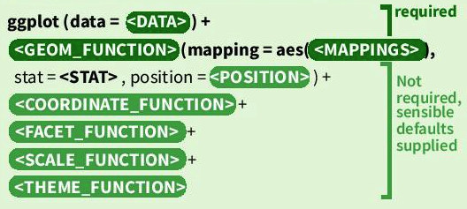
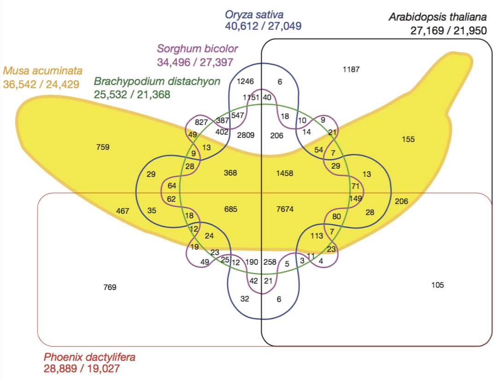
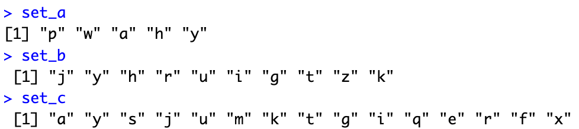
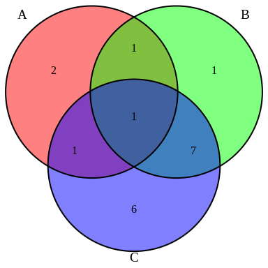
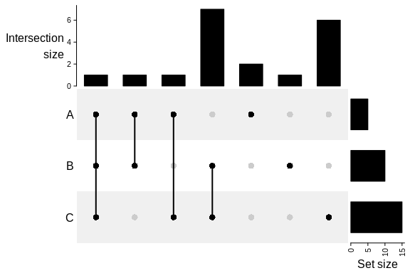
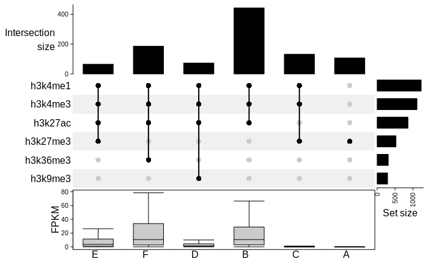

```{r setup, include=FALSE}
suppressPackageStartupMessages({
  library(learnr)     # 0.10.1.9006 (github)
  library(gradethis)  # 0.1.0.9004  (github)
  library(testthat)   # 3.0.0 
  library(tidyverse)  # 1.3.0
  library(learnr.proto)
  
  library(IRanges)
  library(GenomicRanges)
  library(plyranges)
  library(rtracklayer)
  library(VennDiagram)
  library(GenomicFeatures)
  library(ComplexHeatmap)
  library(genomation)
  library(ChIPpeakAnno)
  library(ggthemes)
  library(org.Hs.eg.db)

  # load the txdb package which holds transcript-based gene models of hg38 genome  
  library(TxDb.Hsapiens.UCSC.hg38.knownGene)
  txdb <- TxDb.Hsapiens.UCSC.hg38.knownGene 
  seqlevels(txdb) <- "chr19"
  
  ## installing additional packages by:
  # BiocManager::install('genomation')
  # BiocManager::install("ggthemes")
  # BiocManager::install("ComplexHeatmap")  # for upset plot with GRanges
  # BiocManager::install("org.Hs.eg.db")
  
  # configuration
  options("tutorial.storage"="local")  # save progress in ~/.local/share/R/ see https://bit.ly/3oNP3kF
  knitr::opts_chunk$set(echo=FALSE, message=F)
  gradethis::gradethis_setup()
  
  # data accessible to all exercises
  rdata = system.file("extdata", "week2.Rdata", package = "learnr.proto")
  load(rdata)
  monocytes_list <- GRangesList(monocytes_list, compress=F) # go from compressed to simpleGRangesList
  # make one large granges object
  monocytes_all <- unlist(monocytes_list)
  monocytes_all$chip <- names(monocytes_all)
  
  # chr19_windows_1bp <- tileGenome(seqinfo(txdb), tilewidth = 10, cut.last.tile.in.chrom =T)
  tss_chr19 <- unique(promoters(genes(txdb), upstream=100, downstream=0)) 
  tss_chr19  <- resize(tss_chr19, width = 1, fix = "end")
  promoters_chr19 <- unique(promoters(genes(txdb), upstream=2000, downstream=200)) 
  
  # gene quantification chromosome 19  
  rdsfile <- system.file("extdata", "week2", "prepared_rds", "blueprint_c000s5_gene_quantification_chr19.rds", package = "learnr.proto")
  quantification_chr19 <- readRDS(rdsfile)
  
  # import the gencode features for annotation with genomation (exercise 8)
  gencode_chr19 <- system.file("extdata", "week2", "encode", "gencodev32.chr19.bed", package = "learnr.proto")
  gencode_chr19 <- readTranscriptFeatures(gencode_chr19, up.flank = 2000, down.flank = 200) 
})
```

```{r stop_when_browser_closes, context="server"}
# stop the app when the browser is closed (or refreshed*)
#   *there is **no way** to distinguish between refresh and browser (tab) closing
# this is required as closing the browser window prevents the timeout below from working.
session$onSessionEnded(stopApp)
```

```{r timeout1, context="server"}
# The timeout chunks stop the tutorial if it has been idle for too long
# Their purpose is to keep the server running smoothly

# Method: 
# This chunk (timeout1) sends a unique identifier "session_id" to timeout2.
# When the session has been running idle for longer than "timeoutSec" seconds,
# timeout2 will update shiny variable "input[[session_id]]" .
# This signal is then be used in timeout1 to stop the session.

# obtain the session's ID and send it to the javascript chunk
isolate({
  session_id <- sub('<environment: (.*)>', '\\1', capture.output(session$userData))
  session$sendCustomMessage("session_id", session_id)
})

# stop the tutorial when "input[[session_id]]" is updated
observeEvent(input[[session_id]], ignoreNULL=T, {
  write(paste0("\nTutorial terminated due to inactivity.\nRestart to continue where you left off!\n"), stderr())
  stopApp()
})

# source 1: https://shiny.rstudio.com/reference/shiny/latest/session.html
# source 2: https://stackoverflow.com/questions/18900955/get-environment-identifier-in-r
```

```{js timeout2}
$(function() {
<<<<<<< HEAD
  var timeoutSec = 25*60;
=======
  var timeoutSec = 15*60;  // <-- change as desired
>>>>>>> d77f4dcca65a462c074531435811701900c445a9
  var idleTimer;

  // receive this session's ID
  Shiny.addCustomMessageHandler("session_id", function(s_id) {
    session_id = s_id;  // assigns the variable globally
  });

  // update "input[[session_id]]" when called
  function onTimeout() {
    alert("Tutorial stopped due to inactivity.\nRestart to continue where you left off!")
    Shiny.setInputValue(session_id, "TRUE");
  }

  function startIdleTimer() {
    if (idleTimer) clearTimeout(idleTimer);
    idleTimer = setTimeout(onTimeout, timeoutSec * 1000);
  }
  
  // (re)set timeout upon user input
  $(document).on('shiny:message shiny:inputchanged', startIdleTimer);

})();

// source 1: https://community.rstudio.com/t/keeping-track-of-idle-time-during-app-usage/1735
// source 2: https://bookdown.org/yihui/rmarkdown/language-engines.html#javascript-and-css
```

```{js open_links_in_new_tab}
// open all links starting with http(s) in a new tab
$(function() {
  var links = document.getElementsByTagName('a');
  for (var i = 0; i < links.length; i++) {
    if (/^(https?:)?\/\//.test(links[i].getAttribute('href'))) {
      links[i].target = '_blank';
    }
  }
})();

// source: https://yihui.org/en/2018/09/target-blank/
```

## 2.1 Introduction
### 2.1.1 Recap fg1    
In **fg1** you studied the major steps involved in obtaining epigenomics data, from experiment to raw data and from raw data to normalized signal and peaks. You uploaded and inspected data of DNaseI-seq, RNA-seq and ChIP-seq of histone modifications of monocytes in the UCSC genome browser and you searched for regions with increased signal, so-called *peaks*.   
<br>
By browsing through the data in the UCSC genome browser, you observed that the signal of the various epigenomics datasets have different shapes. E.g. narrow and high signal mainly at the promoter for H3K4me3 versus broad shallow signal covering multiple genes for H3K9me3.   
<br>
In addition, you looked at the position of these peaks in the chromosome, with respect to genes as well as the co-occurrences of different marks at these sites. Lastly, you practiced in discriminating active from silenced genes based on their associated histone and DNaseI markings.    

### 2.1.2 This and next week    
You will computationally analyze the genome-wide trends in ChIP-seq data of histone modifications using R programming and answer common questions such as:  

- *"How many peaks do I have?"*;    
- *"Is this mark statistically enriched at promoters?"*;    
- *"Which and how often do marks co-occur?"*;   
- *"What is the association between the occurrence of this mark at the promoter and gene expression?"*;
- *"What is the average signal of this mark around the TSS?"*;    
- *"What are the different chromatin states in my cells, how often do they occur and what functional genomic element do they correspond to?"*;  

A tiny side note: instead of performing the analyses genome-wide, we have restricted that dataset to chromosome 19; one of the smallest chromosomes. This was done to reduce the sizes of the files that you are woking with and thereby speed up the tutorial.  

### 2.1.3 Learning Objectives  

> At the end of week 2 you are able to:  
> 
1. Import ChIP-seq peaks into a GRanges object in r.  
2. Perform exploratory data analysis on GRanges objects with ChIP-seq peaks using plyranges and ggplot. 
3. Detect and count overlap between two GRanges objects.    
4. Plot this overlap in a Venn diagram.  
5. Statistically test for enrichment of histone marks in a particular genomic region.  
6. Compare gene expression of genes with different histone marks at their promoters.  
7. Identify the different combinations of histone marks that can be found at promoters along with their frequency.  
- These refer to global learning objectives #4-#7.  

### 2.1.4 Tutorial specs  

- **Answers will be saved** each time you close your session and will be loaded if you restart the tutorial. Unless you hit `Start over` at the bottom of the table-of-contents.      

- At the end of the tutorial you are instructed to **print a pdf report of the tutorial** (incl. your answers).   

- To reserve server space to *active* running tutorials, and stop those that aren't actively used anymore, **we set a time limit to 25 minutes** meaning that if your tutorial has been idle for over 25 minutes, you will see the warning "Tutorial stopped due to inactivity. Restart to continue where you left off!". When you see this warning, you should close the browser with the tutorial and restart the tutorial. As progress is saved, you can continue where you left once you restart the tutorial.   

- Links to reference material and used resources are formatted with `r colorize("light blue font", col = "dodgerblue")`. It is advised to open these links using the "right-mouse click \-\-\> Open in a new browser tab" strategy. If you click on the links straight away, you are directed away from the tutorial.   

- Reading of references and background material **is not required and not taken into account when estimating the time-required** for this tutorial!   

### 2.1.5 About the exercises  

* In this tutorial you will have multiple-choice and check-the-box questions like in fg1 but also **complete-the-code exercises**. The latter are sometimes evaluated on the printed object or summary (e.g a the top part of an object), in other cases, the code itself is checked. When the code is evaluated we added "(code check)" to the question. In these cases, R will give custom feedback that helps you correct your code.      

* Due to technical reasons, when you hit Submit Answer of **(code check)** exercises, the output (if there is any) will not be printed. Eg a plot won't be shown. To visualize the plot, you must you use `Run Code`.  

* For short lines of code, you have to decide which function or object to use and how to write this in code. For some longer lines of codes, we left blanks as '\_\_\_' that indicate where in the code you should fill in a function, object or variable. Make sure fill out all the blanks before Answer submission, they will otherwise result in errors.  

* Hit `Hint` (when provided) for clues. Due to technical reasons **you can't go back to previous hints, so make sure you read them well!**        

* Hit `Run Code` to test your code and preview the output.  

* Hit `Run Code` to test your code and preview the output (but make sure no '\_' are left).  

* Hit `Submit Answer` (if present) to submit the code (make sure no '\_' are left) for evaluation.    

* Try to keep yourself from hitting `Solution` (when provided). Only use it when you do not understand the automatic feedback given by R.   

* Hit `Start Over` in the header of the exercise to remove any adjustments you made and start again.   

Although we ask for specific answers or completion of specific code, you are encouraged to test your own code and use `Run Code` and `Start Over` extensively. I.e., remove the pre-coded code and write your own code for a different graph or different summary of the data. Use `Run Code` to preview the results. Unfortunately these self-thought of codes can not be evaluated. For the evaluation you need to use our pre-coded code. Hit `Start Over` to get this pre-coded code.  
<br>

**Example coding exercise:**  

> **Example exercise**: Print the head of object `monocytes_h3k4me3` (code check).   

```{r examplecode, exercise=TRUE, exercise.lines=3, exercise.eval=FALSE, error=TRUE}
# print the head of `monocytes_h3k4me3`

```

```{r examplecode-hint}
# use the function
head([object_name])
# warning: the next hint is the solution!
```

```{r examplecode-solution}
head(monocytes_h3k4me3)
```

```{r examplecode-code-check}
grade_code()
```

### 2.1.6 Need help?  
You are allocated to Breakout rooms in Zoom (or you can select one yourself). Either way, use the Breakout rooms to discuss questions and difficulties with your peers. If you still have question, use the "raise hand" option to notify the host of the session.     


## 2.2 ChIP-seq peaks in R    
### 2.2.1 ChIP-seq peaks can be narrow or broad     
In epigenomics you often work with **interval** data, also referred to as **windows** or **(genomic) regions**. Think of peaks, genes, exons, ... any genomic region reported with the **genomic coordinates: chr, start, and end**. As we discussed in week 1, these often come in a tabular format with the basic information about the location and some other information.  
<br>
Common file formats include BED format for peak files and GFF for gene annotations. In practice, peak files come in two flavors, both cohering to the BED format but with small differences in columns 6-7. These are called **narrowPeak** and **broadPeak** files.    
<br>
*"Why should peak files come in two flavors?"*  
<br>
This is because the factors and histone modifications on which ChIPs can be performed, show different enrichment shapes. In other words: some show broad domains of relatively low enrichment, think of H3K9me3; others have more sharp and narrow peaks that clearly have a peak summit, think of transcription factors and H3K4me3.   
<br>
Peak calling software can take this into account resulting in slightly different settings for the different data types and two different output formats. If you have a narrowPeak file, this means that during peak calling, settings were used that fit ChIP-seq datasets with sharp, narrow enrichment signals.  For broadPeak files, peak calling settings were used to detect broad domains of (overall lower) enrichment.     
<br>
Discussing the differences between narrowPeak and broadPeak files is one thing, and not very significant. What is important to realize is that ChIP-seq datasets of histone modifications have different shapes. As you also could have see in the UCSC Genome Browser. We will come back to these differences in section 2.3.   
 

>#### **Background info**: File formats   
<details><summary>What do BED and GFF files hold and look like? (click here to expand)</summary>   
**Browser Extensible Data - BED format**:  
>
- Used for peaks, motif locations or other custom intervals.  
- Has 3 required columns: chromosome, start and end position.  
- 6 or 7 optional columns, in case of peaks:  
  4th: peak name  
  5th: peak score (-10log(q-value) * 10, rounded down to integer value))  
  6th: strand to denote orientation (if applicable, otherwise "\*" or "\." if unstranded)  
  7th: signalValue  
  8th: p-value to denote statistical significance, given as -log10(p-value)  
  9th: q-value statistical significance using false discoveray rate, given as -log10(q-value)  
  10th (only for sharp peaks not broad domains): location of peak summit relative to the "start" coordinate.  
>
> Example:  
{width=80%}  
> Further reading on the file formats on the UCSC Genome Browser FAQ page: [BED](http://genome.ucsc.edu/FAQ/FAQformat.html#format1), and the [narrowPeak BED](http://genome.ucsc.edu/FAQ/FAQformat.html#format12) and [broadPeak BED](http://genome.ucsc.edu/FAQ/FAQformat.html#format13).  
> <br>
> **General Feature Format - GFF format**:   
>  
-	Common file format for storing gene annotations not only including genes but also transcripts/splice variants, cDNA sequences, exons, rRNA, ncRNA, etc.  
-	Begins with meta-data in headerlines, starting with #  
-	Records reported in 9 fixed columns  
-	Column 9 can contains various attirbutes (eg gene symbol, the transcript to which the exon belongs).  
- Downloaded for example from [Ensembl](https://www.ensembl.org/Homo_sapiens/Info/Index).  
>
> Example:   
{width=80%}      
> Further reading on the gff file formats: [UCSC Genome Browser](http://genome.ucsc.edu/FAQ/FAQformat.html#format3), or [ENSEMBL](https://m.ensembl.org/info/website/upload/gff3.html).  
> <br>

### 2.2.2 Peaks as data.frame     
Peak data can be imported into a data.frame with:  
```{r exampleimport, eval=FALSE, echo=TRUE}
object_name <- read.table("location/of/peak_file.bed")
```

> #### Refresher:  
> Follow this link for a recap on data.frames: [What are data.frames? by Data Carpentry](https://datacarpentry.org/R-genomics/02-starting-with-data.html#what_are_data_frames).  

The data.frame data structure is, however, not the most efficient way to work with interval data. E.g. a simple manipulation such as shifting all reported intervals 2 bp to the right, requires you to manipulate the "start" and "end" columns at the same time.  
<br>
Interval data such as genomic peaks can be more efficiently handled with the `IRanges` package which works with a data structure especially developed for **ranges of integers**: IRanges objects.  

### 2.2.3 Introducing IRanges and GRanges    
To construct an IRanges object you need to define at least two of the following three values:  

1. a starting coordinate  
2. a finishing coordinate  
3. the width of the interval.  

<br>
The GRanges objects of the `GenomicRanges` package are very similar but require a additional **sequence name** (in other words a chromosome) for every interval and an optional **strand** column.  
<br>
We installed and loaded the packages `IRanges` and `GenomicsRanges` for you with:
```{r install_genomicranges, eval=FALSE, echo=TRUE}
BiocManager::install(c("IRanges", "GenomicsRanges"))
library(IRanges)
library(GenomicRanges)
```
<br> 
Here we create GRanges object called `gr` with 4 intervals on chr1:  
```{r create gr, echo=TRUE, eval=TRUE}
# create `gr`
gr_chr1 <-  GRanges(seqnames = c("chr1"), # argument is re-used for each interval
                    ranges = IRanges(start=c(1,3,8,15), width = c(3,10,6,2)),
                    color = c("black", "red", "green", "yellow"))  # this color will be used for plotting the ranges in the plot below.  
# add names to `gr_chr1`
names(gr_chr1) <- paste("interval", LETTERS[1:4], sep = "_")
# print the object:
gr_chr1
```
<br>
When we visualize these intervals we see three 'blocks' along the horizontal axis:
```{r plot_gr, echo=FALSE}
plotRanges(gr_chr1, col = gr_chr1$color, xlim = c(0, 20))
#rm(gr_chr1)
```
<br>
Notice that `gr_chr1` holds 3 slots:  

1. the genomic coordinates in a **GRanges** slot with the variables "seqnames", "ranges" and "strand".   
2. 1 column as **metadata**  (metadata is data about the data): "color".     
3. 1 sequence from an unspecified genome in the **seqinfo** slot: "*1 sequence from an unspecified genome; no seqlengths*"      

We will come back to these slots shortly.  

### 2.2.4 Handy functions for GRanges    
There are several functions to retrieve and set the values in GRanges objects. Here is an image of a GRanges object called `gr` with the respective functions. You will use many of these function in this tutorial, it may therefore be handy to save this image in your Downloads ("right-mouse-click --> save image as").  
```{r my_gr_making, eval=FALSE, echo=FALSE}
my_gr <- GRanges(seqnames = c("chr1", "chr2", "chr3", "chr4", "chr5"), 
              ranges = IRanges(start=c(3, 5, 13, 18, 20), width = c(5, 7, 9, 11,4)),
              strand = c("-", "-", "-","+", "+"),
              score = round(runif(5, 0, 106), digits = 3),
              GC = round(runif(5, 0.35, 0.60), digits = 3))
# add rownames:
names(my_gr) <- paste("peak", LETTERS[1:5], sep = "_")
my_gr
# made screenshot of the object and added boxes to mark the different slots with functions in illustrator. Save and upload to package as png  
```

{width=100%}   
<br>
To add a column to the metadata you can use:  
```{r adding_coilumn, eval=FALSE, echo=TRUE}
granges_object$new_variable <- new_variable_calculation
```
<br>
A list of the above functions (and more) for GRanges can also be called with `methods(class = "...")`. This also command works for other objects as well. You just need to figure out the class of the object in question using `class([object_name])`.  
<br>
You can print a summary of the GRanges object with `show(object_name)` and `print(object_name)` (this works for many  other R objects as well).  

### 2.2.5 Slots in GRanges objects     
The object `gr` in the image above also holds 3 slots:  

1. the genomic coordinates in a **GRanges** slot  
2. 2 columns as **metadata**  (metadata is data about the data)    
3. a genome in the **seqinfo** slot  

The main differences between the genomic coordinates and the metadata are:  

Genomic coordinates |  Metadata columns   
:--|:---  
Printed on the left-hand side of the \|-sign | Printed on the right-hand side of the \|-sign     
Extract using `granges(object_name)` |  Extract as DataFrame with `mcols(object_name)` or `object_name$column_name` for a specific column   
Restricted to variables `seqnames`, `ranges` and `strand` | Almost anything can be stored in the metadata

<br>
Information about the genome is stored in the **seqinfo** part of the object. In the example you see that the peaks are located in human genome 38 which holds 455 sequences in total of which 1 circular (mitochondrial genome). (Sequences that can not be confidently placed on a specific chromosome is stored in chrUn, chr*N*_random and chr*N*_region [explanation on UCSC GB website](http://genome.ucsc.edu/FAQ/FAQdownloads#download10).)   


### 2.2.6 Importing peak files as GRanges     
To parse peak files directly into a GRanges object you use the `import()` function from the `rtracklayer` package. We installed and loaded this package with:
```{r installrtracklayer, eval=FALSE, echo=TRUE}
BiocManager::install("rtracklayer")
library(rtracklayer)
```
<br>
Peakfiles in .bed format can be imported with:  
```{r exampleimport_rtracklayer, eval=FALSE, echo=TRUE}
# import monocyte H3K4me3 peak locations
monocytes_h3k4me3 <- import("h3k4me3_peaks.chr19.bed", format = "narrowPeak")

# (you could also use rtracklayer::import("h3k4me3_peaks.chr19.bed", format = "narrowPeak") and skip loading the library)
```
<br>
As mentioned in [2.2.1 ChIP-seq peaks can be narrow or broad], different histone modifications show different peak shapes in ChIP-seq resulting in "narrowPeak" and "broadPeak" files. H3K4me3 ChIP-seq generally shows sharp(er) enrichment that can reach high enrichment values and is stored as "narrowPeak" file. For `import()` to function properly, we defined this format in the `format = ` parameter.  
<br>
H3K4me1 covers broad(er) domains and peak calling took that into account, resulting in a "broadPeak" peak file. 
```{r qimport}
question("Which function imports the H3K4me1 dataset into a GRanges object?",
         answer("import(\"h3k4me1_peaks.chr19.bed\", format = \"narrowPeak\")", message = "check the file format."),
         answer("import(\"h3k4me1_peaks.chr19.bed\", format = \"BED\")", message = "BED is not the right format."),
         answer("import(\"h3k4me1_peaks.chr19.bed\", format = \"broadPeak\")", correct =T),
         answer("read.table(\"h3k4me1_peaks.chr19.bed\", format = \"broadPeak\")", message = "read.table parses the data into a data.frame while we asked for a GRanges object."),
         allow_retry=TRUE,
         random_answer_order=TRUE
         )
```
<br>
Note that, to reduce the sizes of the files, we restricted them to chromosome 19.   
<br>
Let's have a quick look at `monocytes_h3k4me3`.     

### Exercise 1  

> **Exercise 1a**: Print the head of `monocytes_h3k4me3`.  

```{r q1_head_h3k4me3, exercise=TRUE, exercise.lines=3, exercise.eval=FALSE, error=TRUE}
# print the head of monocytes_h3k4me3  
# the object "monocytes_h3k4me3" has already been imported for you


```

```{r q1_head_h3k4me3-hint-1}
# You may want to use the function:
head()
```

```{r q1_head_h3k4me3-hint-2}
# As in:
head(monocytes_h3k4me3)
```

```{r q1_head_h3k4me3-check}
grade_result(
 pass_if(~identical(.result, head(monocytes_h3k4me3)))
 )
```

```{r quiz_grangesobject}
quiz(caption = "", 
    question("How many metadata columns does the 'monocytes_h3k4me3' object have?",
             answer("2"),
             answer("3"),
             answer("6", correct=T, message = "The original .BED files lacked column headers. The `rtracklayer::import()` function appended variable names and converted the data to the correct data type (eg numeric, integer, character etc.) according to the 'narrowPeak' format we defined."),   
             answer("9"), 
             allow_retry=TRUE),
    question("How many different chromosomes are reported in this file?",
             answer("1", correct=T, message = "We have restricted all peak files to chromosome 19 to limit their file size. That is why 'seqinfo' holds only one sequence"),
             answer("24", message = "Look in seqinfo part of the object."),
             answer("455", message = "Look in seqinfo part of the object."),
             allow_retry=TRUE)
)
```

#### Briefly summarizing the information in `monocytes_h3k4me3`     

Column | Section in GRanges object | Variable | Description   
:--|:---|:---|:------      
1. | GRanges | seqnames | chromosome on which the peak is located.        
2. | GRanges | ranges | start and end positions of peak.         
3. | GRanges | strand | if applicable, orientation of the peak, otherwise \*\.        
4. | Metadata | name | peak name, given by the peak caller.     
5. | Metadata | score | -10log(qvalue) * 10, rounded down to integer value.  
6. | Metadata | signalValue | enrichment signal at the peak summit.  
7. | Metadata | pValue | -log10(p-value), (*e.g.if p-value = 1e-10, this value is 10*), roughly put, the significance of the enrichment.   
8. | Metadata | qValue | -log10(qvalue), the false discovery rate determined by swapping test and control.  
9. | Metadata | peak  | location of peak summit relative to the peak start.  

## 2.3 Exploratory data analysis   
A common first step in genomics data analyses is to look at some basic characteristics of the data by making exploratory summaries and plots. You will look at peak counts and peak widths of the different marks in this section. In a normal analysis, these plots could function as an additional quality control (QC) or  provide new insights, depending on the system that you are working with (think of a newly discovered histone mark or TF).  
<br>
In this case, you will visualize the differences between broad and narrow marks and at the same time get used to working with GRanges objects and refresh your understanding of ggplot2 and dplyr.  
<br>
Let's get started!  

### 2.3.1 Peak counts

> **Exercise 2a**: Determine the number of H3K4me3 and H3K4me1 peaks in monocytes. 
> 
> * The peak data are stored in the R objects `monocytes_h3k4me3` and `monocytes_h3k4me1`.    

```{r q2a_exploreh3k4me3, exercise=TRUE, exercise.lines=3, exercise.eval=FALSE, error=TRUE}
# How many peaks are stored in "monocytes_h3k4me3"?
monocytes_h3k4me3

```

```{r q2a_exploreh3k4me3-hint-1}
# Look at the handy functions in section 2.2.4
```

```{r q2a_exploreh3k4me3-hint-2}
# You may want to use the function
length()
```

```{r q2a_exploreh3k4me3-check}
grade_result(
 pass_if(~identical(.result, length(monocytes_h3k4me3)))
 )
```

```{r q2a_exploreh3k4me1, exercise=TRUE, exercise.lines=3, exercise.eval=FALSE, error=TRUE}
# And how many H3K4me1 peaks do you have?


```

```{r q2a_exploreh3k4me1-hint}
# look at the command you used above
```

```{r q2a_exploreh3k4me1-check}
grade_result(
 pass_if(~identical(.result, length(monocytes_h3k4me1)))
 )
```

### Exercise 2b  

> **Exercise 2b**: And what is the distribution of peak sizes for these marks?   
> 
> * `summary()` gives you the summary statistics of a variable or object.   

```{r q2b_widthh3k4me3, exercise=TRUE, exercise.lines=3, exercise.eval=FALSE, error=TRUE}
# What is the distribution of H3K4me3 peak sizes?   
summary(___(monocytes_h3k4me3))
```

```{r q2b_widthh3k4me3-hint-1}
# Review the handy functions in section 2.2.4
```

```{r q2b_widthh3k4me3-hint-2}
# You may want to use
width()
```

```{r q2b_widthh3k4me3-hint-3}
# Ie
summary(width(___))
```

```{r q2b_widthh3k4me3-check}
grade_result(
  pass_if(~identical(.result, summary(width(monocytes_h3k4me3))))
)
```

```{r q2b_widthh3k4me1, exercise=TRUE, exercise.lines=3, exercise.eval=FALSE, error=TRUE}
# And what is the distribution of H3K4me1 peak sizes?   
monocytes_h3k4me1
```

```{r q2b_widthh3k4me1-check}
grade_result(
  pass_if(~identical(.result, summary(width(monocytes_h3k4me1))))
)
```

<br>
Notice the larger median and maximum peak size for H3K4me1 peaks compared to H3K4me3 peaks. This is related to H3K4me3 having having **narrow** peaks of enrichment (enrichment restricted to a relatively small region with high  scores) and H3K4me1 **broad** enrichment profiles (enrichment covering a broad region).   

> #### **In summary**, marks with narrow and with broad peaks 
><details><summary>Click here to view the summary...</summary>  
>  
> Histone modifications with narrow peak shape in ChIP-seq | Histone modifications with broad peak shape in ChIP-seq      
> :-- |:--  
H3K27ac | H3K27me3   
H3K4me3 | H3K36me3  
H3K9/14ac | H3K9me3  
H2A.Zac | H3K4me1  
</details>  

### 2.3.2 Plotting summaries with ggplot2  
You will use ggplot2 and dplyr package to explore the ChIP-seq data further. You have used these packages in the year 1 course Genomics and Big Data. Use the refresher-boxes and package cheatsheets (tip: use google) when you  need a quick reminder of the basics and how-to-use the package-functions.  
<br> 

> #### **Refresher**: ggplot2  
<details><summary>Click here for a very brief refresher on ggplot2-ting...</summary>  
> Adapted from the [ggplot2 cheatsheet](https://github.com/rstudio/cheatsheets/raw/master/data-visualization-2.1.pdf).  
> <br>
> **ggplot2** is based on the **grammar of graphics**: the idea that you  can build every graph from the same components: a **data**set, a **coordinate system** and **geoms**. Geoms are visual marks that represent data points.    
> <br>
> To display values, map variables in the dataset to visual properties of the geom (**aesthetics**) like **size**, **color**, and **x** and **y** locations.   
<br>
> To build a ggplot graph you can use this template:   
><br>
> {width=50%}     
><br>
> In **ggplot2** you begin with the `ggplot(data = ..)` function and add layers with `geom()` functions. Example geom functions include `geom_point()` for a scatter plot, `geom_histogram()` for a histogram, `geom_density()` for a smoothened version of the histogram, and `geom_bar()` for a barplot.  
> <br>
> The **geom functions** take a `mapping = aes(x = ..., y = ..., ...)` argument that defines how data from variables in the dataset are mapped to visual properties (aes for "aesthetic mapping"). Depending on the geom function, you can map variables to the x- and y-axis, to the shape of symbols, the line type of line graphs, to the fill color of symbols and more.  
> <br>
> Each plot has a **coordinate system** that determine the scales and orientation of the x and/or y-axis. The default coordinate system is given by the `coord_cartesian()` funtion. Adding this to a default ggplot won't change your plot. What is helpful is that within `coord_cartesian()` you can set the `xlim=` and `ylim=` arguments. Other coordinate systems can be found on the ggplot2 cheatsheet](https://github.com/rstudio/cheatsheets/raw/master/data-visualization-2.1.pdf).  
> **Scales** control the mapping from data to aesthetics and can be customized with `scale_[]_[]` functions. These can be used to, for example, change a color palette, set limits to the values included in the mapping, or log transform an axis.  
<br>
> **Theme** elements include functions to specifify non-data elements of your graph. You can also provide function that contain **complete** themes, eg in `theme_bw()`, `theme_grey()` and many more.   
> Finally **Faceting** generates small multiples of the graph, each showing a different subset of the data grouped by a categorical variable.   
><br>
> **Additional reference**:  
> *[R for Data Science, chapter 3 Data visualization](https://r4ds.had.co.nz/data-visualisation.html)*  
> *[ggplot2: elegant graphics for data analysis](https://ggplot2-book.org/index.html)*  
</details>

### Exercise 3  
In this exercise you will make a **barplot showing the number of peaks per ChIP experiment**. All ChIP-seq peaks are concatenated in the GRanges object `monocytes_all`. To generate the barplot, you need to:  

a. Identify the variable that you can use to count the number of peaks per chip in the ggplot2 barplot function. 
b. As GRanges objects are not compatible with ggplot, you need to transform the metadata to a data.frame.  
c. Identify the `geom_` function that will give you a barplot.    

> **Exercise 3a**: Print the top and bottom rows of `mcols(monocytes_all)` using `show()`.  
> 
> * This will show the top and bottom rows in the metadata of `monocytes_all`.  

```{r monocytesall, exercise=TRUE, exercise.lines=3, exercise.eval=FALSE, error=TRUE}
# print the top and bottom rows of object 'mcols(monocytes_all)'


```

```{r monocytesall-hint-1}
# Use mcols() within show()
```

```{r monocytesall-hint-2}
# ie:
show(mcols(___))
```

```{r monocytesall-check}
grade_result(
  pass_if(~identical(.result, show(monocytes_all))),
  correct = "Identify the variable (column in metadata) that you can use for counting the number of peaks per chip (this will be the statistic used in the barplot)."
  )
```

```{r barplotvariable}
question("Which variable will you use for counting the number of peaks per ChIP-seq dataset?",
         answer("dataset"),
         answer("type"),
         answer("peak"), 
         answer("chip", correct =T),
         allow_retry=T)
```

### Exercise 3b  
Secondly, you have to extract the metadata and write into a a data.frame as GRanges objects are not compatible with ggplot2.      

> **Exercise 3b**: Complete the code below to extract the metadata from the object `monocytes_all` (code check).  
> 
> * The function `as.data.frame()` is used to convert the resulting 'DFrame' object into a 'data.frame'.  
> * Review the functions mentioned in section 2.2.4 if you do not remember how to extract the metadata.  

```{r q_extractmetadata, exercise=TRUE, exercise.lines=6, exercise.eval=FALSE, error=TRUE}
# extract metadata from 'monocytes_all'
monocytes_metadata <- __(__)

# convert to a data.frame
monocytes_metadata <- as.data.frame(monocytes_metadata)
```

```{r q_extractmetadata-solution}
# extract metadata 
monocytes_metadata <- mcols(monocytes_all)

# convert to a data.frame
monocytes_metadata <- as.data.frame(monocytes_metadata)
```

```{r q_extractmetadata-code-check}
grade_code()
```

### Exercise 3c  

> **Exercise 3c**: Complete the code below to plot the number of peaks per ChIP in a bar chart using ggplot2 plotting (code check).  

```{r prepare_q3c} 
monocytes_metadata <- as.data.frame(mcols(monocytes_all))
```

```{r q3c_barplotpeakcount, exercise=TRUE, exercise.lines=8, exercise.eval=FALSE, error=TRUE, exercise.setup="prepare_q3c"}
# plot the number of peaks per chip
ggplot(data = __)+
  __(mapping=aes(y=__) )+
  scale_fill_colorblind()+
  theme_calc()+
  theme(legend.position = "none")+
  ggtitle("Number of peaks per ChIP, monocytes, chr19")
```

```{r q3c_barplotpeakcount-hint-1}
# You prepared your data object in exercise 3b
```

```{r q3c_barplotpeakcount-hint-2}
# Look at the ggplot refresher or cheatsheet to identify the geom_ function that will give you a barplot.
```

```{r q3c_barplotpeakcount-hint-3}
# Which variable should be counted to obtain the number of peaks per chip (see exercise 3a)
# WARNING: the next hint is the solution!
```

```{r q3c_barplotpeakcount-solution}
# plot the number of peaks per chip
ggplot(data = monocytes_metadata)+
  geom_bar(mapping=aes(y=chip))+
  scale_fill_colorblind()+
  theme_calc()+
  theme(legend.position = "none")+
  ggtitle("Number of peaks per ChIP, monocytes, chr19")
```

```{r q3c_barplotpeakcount-code-check}
grade_code(
  correct = "Hit Run Code to view your plot. For which marks do you observe the most peaks? And for which the fewest number of peaks?"
)
```

```{r q3c_barplotpeakcount_mc}
question("Mark has the most peaks on chromosome 19 and which the fewest?",
         answer("H3K4me1 the most, H3K9me3 the fewest."),
         answer("H3K27ac the most, H3K9me3 the fewest.", correct=TRUE, message = "The range of peak counts can tell you whether your experiment and peak calling performed as expected. If they show extremely high or low values, it is likely something is off with your experiment (something you should have already noted in the Genome Browser). It can also function as an extra control step to check that the complete peakfiles are imported in R (and no strange things happened to your files along the way). Or give you insights in the occurrence of a newly characterized factor or the function of a known factor in a new system. In this case, the number of peaks is correct and you can continue with the analysis."),
         answer("H3K4me3 the most, H3K36me3 the fewest."),
         allow_retry=TRUE, random_answer_order = TRUE)
```

### 2.3.3 Explore total peak area with dplyr & ggplot  
In this section you will visualize the fraction that each ChIP-seq peak set covers in total on chromosome 19.  
<br>
To generate this plot, you have to calculate the total number of bps covered by each peak dataset. This can be achieved by summing up the `peak_size` values.  
<br>
GRanges objects follow the **tidy data principle**: each row of a Ranges object corresponds to an interval, and each column will represent a variable about that interval, and generally each object will represent a single unit of an observation (like gene annotations). You can use **dplyr**-like functions from the `plyranges` package to manipulate these objects and use the **pipe** operator `%>%` to combine functions in a workflow.  

>#### **Refresher**: dplyr     
<details><summary>Click here for common dplyr-functions and examples of their plyranges-relatives on GRanges objects</summary>   
>
Function | Purpose | Example on GRanges   
:--|:----|:----     
`select()` | subset variables (=columns) |  `select(my_gr, GC)`
`group_by()` | group data into rows with the same value for the specified variable. |  `my_gr %>% group_by(strand)`.  
`filter()` | subset observations (= rows) | `filter(my_gr, GC < 0.4)` or `my_gr %>% group_by(strand) %>%  filter(GC == max(GC))`.     
`summarise()` | Summarise variables, often per group | `group_by(my_gr, strand) %>% summarise(n = n(), gc = max(GC))`   
`mutate()` | Add a new varialbe | 
>
See also the [dplyr cheatsheet](https://rstudio.com/wp-content/uploads/2015/02/data-wrangling-cheatsheet.pdf)  
</details>  

### Exercise 4  

> **Exercise 4a**: Add the 'peak_size' variable to `monocytes_metadata`. This new variable holds the peak widths (code check).   
> 
> * Remember, to add new columns to GRanges objects you can use: `granges_object$new_variable <- variable_calculation`.    

```{r prepare_q4a, echo=FALSE}
monocytes_metadata <- as.data.frame(mcols(monocytes_all))
```

```{r addpeaksize, exercise=TRUE, exercise.lines=3, exercise.eval=FALSE, error=TRUE, exercise.setup="prepare_q4a"}
# add variable 'peak_size' to monocytes_metadata with the width of the peaks from monocytes_all 


```

```{r addpeaksize-hint-1}
# to obtain peak sizes, use the function
width() 
# WARNING: the next hint is the solution!
```

```{r addpeaksize-solution}
monocytes_metadata$peak_size <- width(monocytes_all)
```

```{r addpeaksize-code-check}
grade_code()
```


> **Exercise 4b**: Finish the code below using `group_by()` and `summarise()` to calculate the fraction of bps covered by each ChIP-seq peak dataset (code check).   
> 
> To do so ..  
> 
> 1. First, group the 'monoyctes_all' dataset per ChIP.  
> 2. Then, calculate the total number of bps covered by each peak dataset as 'total_bps'. Use the 'peak_size' variable you defined in exercise 4a.        
> 3. Laslty, calculate what fraction this is of chromosome 19 (=total 58617616 bp).   

```{r prepare_q4b}
monocytes_metadata <- as.data.frame(mcols(monocytes_all))
monocytes_metadata$peak_size <- width(monocytes_all)
```

```{r summarisewidth, exercise=TRUE, exercise.lines=6, exercise.eval=FALSE, error=TRUE, exercise.setup="prepare_q4b"}
# calculate the total number of bps covered by each chipseq dataset
# and as a fraction of total bps in chromosome 19
monocytes_metadata %>% 
  ___ %>%
  summarise(total_bps = ___,
            fraction_chr19 = ___/58617616)
```

```{r summarisewidth-hint-1}
# group per chip with 
group_by(chip)
```

```{r summarisewidth-hint-2}
# calculate the total_bps by summing up peak_size
```

```{r summarisewidth-hint-3}
# ie
tutal_bps = sum(peak_size)
# WARNING: the next hint is the solution!
```

```{r summarisewidth-solution, eval=FALSE}
monocytes_metadata %>% group_by(chip) %>% 
  summarise(total_bps = sum(peak_size),
            fraction_chr19=total_bps/58617616)
```

```{r summarisewidth-code-check}
grade_code()
```

### Exercise 5  

> **Exercise 5**: To plot the `fraction_chr19` as bar chart, pipe the output of exercise 5 into ggplot (code check).  
> 
> * We instruct the barplot function to plot the actual values (in contrast to counting the occurrences of each value as in exercise 3) with: `stat = "identity"`.  
> * Hit "Run Code" to plot the plot in the console.  

```{r plotsummarisewidth, exercise=TRUE, exercise.eval=FALSE, error=TRUE, exercise.setup="prepare_q4b"}
# plot the fraction covered in a bar chart
monocytes_metadata %>%  group_by(chip) %>% 
  summarise(total_bps = sum(peak_size),  
            fraction_chr19 = sum(peak_size)/58617616) %>% 
  ggplot(.)+ 
  geom_bar(mapping = aes(x = __, y = __), stat = "identity")+
  theme_bw()+
  theme(legend.position = "none")
```

```{r plotsummarisewidth-solution}
monocytes_metadata %>%  group_by(chip) %>% 
  summarise(total_bps = sum(peak_size),  
            fraction_chr19 = sum(peak_size) /58617616) %>% 
  ggplot(.)+ 
  geom_bar(mapping = aes(x = chip, y=fraction_chr19), stat = "identity")+
  theme_bw()+
  theme(legend.position = "none")
```

```{r plotsummarisewidth-code-check}
grade_code()
```

```{r mcsummarisedwidth}
question("Which type of peaks (broad or narrow) covers relativeley more bp in chromosome 19?",
         answer("narrow peak ChIP-seq peak datasets"),
         answer("broad domain ChIP-seq peak datasets", correct=T),
         allow_retry=T)
```

**Thus far about the differences between ChIP-seq marks with a a narrow or broad enrichment shapes. Let's look at the overlap between marks and genomics features.**  

## 2.4 Overlap analysis   
### 2.4.1 Detect overlap with GenomicRanges       
To understand the function of a ChIPped histone mark or factor often want to know whether it is enriched in a particular genomic element. To find out, you need to calculate a quantitative summary of its genome-wide distribution across the different elements. By comparing this distribution to the genome-wide coverage of these different elements (null hypothesis), we can test for enrichment of the mark or factor.   
<br>
The genomic elements are defined in a reference file. You can use various reference files for this exercise: from transcript-oriented objects, to functional elements from a database like ENCODE, to a custom one.   
<br>
In the coming exercise, you will first quantify the overlap between H3K4me3 peaks and promoters and, subsequently, between H3K4me3 peaks and several different genomic elements simultaneously.   
<br>
To identify and count overlap between two sets of GRanges objects (e.g. H3K4me3 peaks and promoters) you can use the `findOverlaps()` function from the GenomicRanges package:  
```{r findoverlaps_example, eval=FALSE, echo=TRUE}
overlap <- findOverlaps(query = [GRanges_object1], subject = [GRanges_object2])
```

* The output `overlap` is a `Hits` object containing the indexes of the overlapping elements from the query and subject objects.    
* The columns with indexes can be accessed through `queryHits(overlap_object)` and `subjectHits(overlap_object)`.   
* The outcomes of `queryHits(overlap_object)` and `subjectHits(overlap_object)`can be used to extract the corresponding peaks or regions from the objects that were used as inputs (we will guide you through an example soon).    
* If a peak in one of the inputs overlaps with multiple peaks in the other, its index will appear multiple times in the output.  

### 2.4.2 findOverlaps() example         
Here we use `findOverlaps()` to find the intervals that overlap between `gr_chr1` and `my_gr` (see [2.2.3 Introducing IRanges and GRanges]):  
```{r making_my_gr_again, eval=TRUE,echo=FALSE}
# did not save the object in section 2.2.4 :-(
my_gr <- GRanges(seqnames = c("chr1", "chr2", "chr3", "chr4", "chr5"), 
              ranges = IRanges(start=c(3, 5, 13, 18, 20), width = c(5, 7, 9, 11,4)),
              strand = c("-", "-", "-","+", "+"),
              score = c(12.053, 65.964, 64.583, 66.078, 91.257),
              GC= c(0.510, 0.352, 0.408, 0.517, 0.479))
names(my_gr) <- paste("peak", LETTERS[1:5], sep = "_")
```

```{r overlap_example, eval=TRUE, echo=TRUE}
# We place () brackets around the code to instruct R to print the output  
# of the function on the right side of the arrow, and at the same time assign
# the output to the new object 'my_first_overlap' on the left side of the arrow.

(my_first_overlap <- findOverlaps(query = gr_chr1, subject = my_gr)) 

```
<br>
In this case, the output tells you that:  

- There are two different overlaps identified ("2 hits").  
- The query object `gr_chr1` contained 4 intervals ("queryLength: 4").  
- The subject object `my_gr` contained 5 intervals ("subjectLength: 5").  
- 2 intervals in the query, in this case `gr_chr1` overlap with intervals in `my_chr`. These are the intervals with indexes [1] and [2] in `gr_chr1`.     
- The other way around, only 1 interval in `my_gr` overlaps with intervals in `gr_chr1`. This the interval with index [1] in `my_gr`.  

We can obtain the relevant intervals from `gr_chr1` and `my_gr` by running:   
```{r example_queryhits, echo=TRUE, eval=TRUE}
# obtain the intervals fom gr_chr1 (query) that are part of the overlap 
indexes_query <- queryHits(my_first_overlap)

# subset gr_chr1 with these indexes
gr_chr1[indexes_query]
```
<br>
And from `my_gr` by running:   
```{r example_subjecthits, echo=TRUE, eval=TRUE}
# obtain the overlapping intervals from my_gr (subject)
indexes_subject <- subjectHits(my_first_overlap)

# subset my_gr with these indexes
my_gr[indexes_subject]
```

- Obviously, `my_gr` had 5 intervals, each on a different chromosome. So only the interval on chromosome 1 showed overlap with the intervals in `gr_chr1`, of which the intervals were restricted to chromosome 1.   
- From the variable `ranges` we can see that interval_A in `gr_chr1` overlaps with the first bp of peak_A in `my_gr`; and interval_B in `gr_chr1` overlaps with the whole of peak_A in `my_gr`.  

Finally, if you want to know the **number of unique intervals** that overlap you can limit the reported indexes to only the unique ones (do not report indexes more than once), subset the original GRanges object with these unique indexes, and count its length:
```{r example_subjecthits_uniquecount, echo=TRUE, eval=TRUE}
# obtain the overlapping intervals from my_gr (subject)
indexes_subject <- subjectHits(my_first_overlap)

# take unique indexes
indexes_subject_unique <- unique(indexes_subject)

# subset my_gr with uniuqe indexes and count the number of intervals in the resulting object
length(my_gr[indexes_subject])
```
<br>
*Side note:* in the code above, instead of running `unique()` on the indexes, you can also run it on the GRanges object with duplicate intervals and then count the length:  
```{r example_subjecthits_uniquecount2, echo=TRUE, eval=TRUE}
# obtain the overlapping intervals from my_gr (subject)
indexes_subject <- subjectHits(my_first_overlap)

# take relevant intervals, restrict to only unique intervals and count these  
length(unique(my_gr[indexes_subject]))
```


### 2.4.3 Overlap promoters vs h3k4me3 peaks   
You will determine the overlap among H3K4me3 peaks and promoters. To do so you first need to obtain promoter regions as a GRanges object. We have done that for you with the following code:  

```{r retrieve_genes_txdb, echo=TRUE, eval=FALSE}
# install the txdb package
BiocManager::install("TxDb.Hsapiens.UCSC.hg38.knownGene")

# load the txdb package which holds transcript-based gene models of hg38 genome  
library(TxDb.Hsapiens.UCSC.hg38.knownGene)
txdb <- TxDb.Hsapiens.UCSC.hg38.knownGene 
seqlevels(txdb) <- "chr19" # limits the database to chromosome 19

# extract promoter coordinates, filter for promoters 
promoters_chr19 <- unique(promoters(genes(txdb), upstream=2000, downstream=200)) 
```

This code:  
  
1. Loads the `TxDb.Hsapiens.UCSC.hg38.knownGene` database package. Which holds the coordinates of all transcripts for known genes defined in human genome release 38 by the UCSC genome browser. Besides the transcript coordinates, it also stores the genomic coordinates of TSSs, exons, introns, UTRs and genes.   
2. Extract promoter regions with the `promoters()` function. This function outputs a GRanges object with intervals around the TSS.  
3. By default, `promoters()` works on transcripts but we are often more interested in promoters of genes therefore we add the `genes()` function.  
4. **We define promoters as 2kb upstream and 0.2 kb downstream the TSS**.  

### Exercise 6a 

> **Exercise 6a:**  
How many promoter are stored in `promoters_chr19`?     

```{r q6a_proms, exercise=TRUE, exercise.lines=3, exercise.eval=FALSE, error=TRUE}
#  How many regions do you have are stored in `promoters_chr19`? 

```

```{r q6a_proms-hint-1}
## You may want to use the `length()` function.  
```

```{r q6a_proms-hint-2}
## WARNING: the next hint is the solution!
```

```{r q6a_proms-solution, eval=FALSE}
length(promoters_chr19)
```

```{r q6a_proms-check}
grade_result(
 pass_if(~identical(.result, length(promoters_chr19)))
 )
```

### Exercise 6b  
We want to know how many of the promoters overlap with a H3K4me3 ChIP-seq peak and vice versa.    

> **Exercise 6b:**  
Use `findOverlaps()` to determine the overlap between `monocytes_h3k4me3` (query) and  `promoters_chr19` (subject).   


```{r q6b_overlap, exercise=TRUE, exercise.eval=FALSE, error=TRUE}
# Find overlap between monocytes_h3k4me3 peaks and promoters
overlap <- ___(query = ___, subject = ___)

# print the overlap output
show(___)
```

```{r q6b_overlap-solution}
# Find overlap between monocytes_h3k4me3 peaks and promoters
overlap <- findOverlaps(query = monocytes_h3k4me3, subject = promoters_chr19)

# print the overlap output
show(overlap)
```

```{r q6b_overlap-check}
grade_result(pass_if(~identical(.result, show(findOverlaps(query = monocytes_h3k4me3, subject = promoters_chr19)))),
            correct = "The Hits object `overlap` reports the indexes of `monocytes_h3k4me3` and `promoters_chr19` that overlap. If a peak or a promoter overlaps several times, each overlap will be reported in a new row.")
```


### Exercise 6c      

> **Exercise 6c:**   
Complete the code below to determine the number and fraction of promoters that overlaps with H3K4me3 peaks (Code check).  

```{r prepare_exercise6}
overlap <- findOverlaps(query = monocytes_h3k4me3, subject = promoters_chr19)
```

```{r q6c_overlap, exercise=TRUE, exercise.eval=FALSE, error=TRUE, exercise.setup="prepare_exercise6"}
# 1. Extract the unique indexes of the promoter that overlap
unique_promoters <- unique(___(overlap))

# 2. How many of these unique promoters do you have?
unique_promoter_count <- ___(unique_promoters)

# 3. Print the resulting number (leave this code as it is)
unique_promoter_count

# 4. What fraction of promoters is part of the overlap?  
unique_promoter_count/__(promoters_chr19)
```

```{r q6c_overlap-hint-1}
## Use `subjectHits()` to extract the indexes of overlapping promoters from `overlap`   
```

```{r q6c_overlap-hint-2}
## Use `unique()` to minimize this output to unique promoter indexes  
```

```{r q6c_overlap-hint-3}
## Use `length()` to count the number of unique indexes of the query and the subject.  
```

```{r q6c_overlap-hint-4}
## WARNING: the next hint is the solution!
```

```{r q6c_overlap-solution}
# Extract the unique promoter indexes
unique_promoters <- unique(subjectHits(overlap))

# How many of these unique promoters do you have?
unique_promoters_count <- length(unique_promoters)

# Print the resulting number
unique_promoters_count

# What fraction of promoters is part of the overlap?  
unique_promoters_count/length(promoters_chr19)
```

```{r q6c_overlap-code-check}
grade_code(correct = "Now hit 'Run Code' and submit the reported values in the relevant boxes below.")
```

```{r q6c_overlap_textbox, echo=FALSE}
question_text(
  "Enter the number of promoters that are part of the overlap:",
  answer("1723", message = "This is the total number of promoters. Find the ones part of the overlap with subjectHits() unique() and length()"),
  answer("1150", correct=TRUE),
  answer("1366", message = "This is the length of the overlap object, select the subject and reduce with unique."),
  answer("1087", message = "This is number of unique H3K4me3 peaks that are part of the overlap. Make sure you use subjectHits() and not queryHits() function."),
  allow_retry=TRUE)
```

```{r prepare_exercise6c}
overlap <- findOverlaps(query = monocytes_h3k4me3, subject = promoters_chr19)
unique_promoters <- unique(subjectHits(overlap))
unique_promoters_count <- length(unique_promoters)
```

```{r q6c_overlap_enterfraction, exercise=TRUE, exercise.lines=3, exercise.eval=FALSE, error=TRUE, exercise.setup="prepare_exercise6c"}
# enter the fraction of promoters that are part of the overlap, round to 3 decimal places:  


```

```{r q6c_overlap_enterfraction-solution, eval=FALSE}
round(unique_promoters_count/length(promoters_chr19),3)
```

```{r q6c_overlap_enterfraction-check}
grade_result(
  pass_if(~identical(.result,round(unique_promoters_count/length(promoters_chr19),3))))
```

This looks like a strong enrichment of this signal in promoters. Let's visualize the overlap.  

### 2.4.4 Plot the overlap in a Venn diagram  
To plot the overlap among promoters and H3K4me3 peaks in a Venn diagram you will use the the `draw.pairwise.venn()` function of the `VennDiagram` package. This function has three "areas"-parameters:  

```{r plotvenn_example, eval=FALSE, echo=TRUE}
draw.pairwise.venn(area1=[integer_value], area2=[integer_value], cross.area=[integer_value], ....)
```

- `area1=[integer]` and `area2=[integer]` represent the total counts (overlapping and not-overlapping) for each object. See exercise 6a or 2a for how you can calculate these numbers.      
- `cross.area=[integer]` refers to the number of overlaps. You will first calculate the 'unique_peaks_count' in a similar fashion as you did for the promoters and then use the minimum of the 'unique_peaks_count' and 'unique_promoters_count' as the number of 'common peaks' in your venn diagram.   
- `...` means that there are additional, optional parameters that you can define but are not needed at the moment.   

### Exercise 6d

> **Exercise 6d:**   
How many h3k4me3 peaks are part of the overlap?  

```{r q6d_overlap, exercise=TRUE, exercise.eval=FALSE, error=TRUE, exercise.setup="prepare_exercise6"}
# Extract the unique peaks
unique_peaks <- unique(___(overlap))

# How many of these unique peaks do you have?
unique_peaks_count <- ___(unique_peaks)

# Print the resulting number
unique_peaks_count
```

```{r q6d_overlap-hint}
# Use the function 
queryHits()
```

```{r q6d_overlap-solution}
# Extract the unique peaks
unique_peaks <- unique(queryHits(overlap))

# How many of these unique peaks do you have?
unique_peaks_count <- length(unique_peaks)

# Print the resulting number
unique_peaks_count
```

```{r q6d_overlap-check}
grade_result(
  pass_if(~identical(.result, length(unique(
                       queryHits(findOverlaps(query = monocytes_h3k4me3, subject = promoters_chr19))
                       ))))
  )
```

### Exercise 6e   
 
> **Exercise 6e:**   
Complete the `draw.pairwise.venn()` code below to visualize these counts in a venn diagram (code check).


```{r prepare_exercise6e, echo=FALSE}
overlap <- findOverlaps(query = monocytes_h3k4me3, subject = promoters_chr19)
# unique peaks 
unique_peaks <- unique(queryHits(overlap))
unique_peaks_count <- length(unique_peaks)
# unique promoters
unique_promoters <- unique(subjectHits(overlap))
unique_promoters_count <- length(unique_promoters)
# common
common_counts <- min(unique_promoters_count, unique_peaks_count)
```

```{r q6e_plotvenn, exercise=TRUE, exercise.eval=FALSE, error=TRUE, exercise.setup="prepare_exercise6e"}
# determine the number of common counts
common_counts <- min(unique_promoters_count, unique_peaks_count)

# call a new plotting area
grid.newpage()

# Plot the overlap in a venn diagram
___( area1=___, # total count for area 1
    area2=___, # total count for area 2
    cross.area=common_counts, # count for the overlap.
    category=c("H3K4me3", "Promoters"), 
    fill=c("red", "gray"), 
    cat.cex=1.2)
```

```{r q6e_plotvenn-hint-1}
## Use `length()` to calculate the values for area1 and area2
```

```{r q6e_plotvenn-hint-2}
# For area1 you need to count the number of peaks in 'monocytes_h3k4me3' 
```

```{r q6e_plotvenn-hint-3}
# For area2 you need to count the number of promoters in 'promoters_chr19'
```

```{r q6e_plotvenn-hint-4}
# ie
area1 = length(monocytes_h3k4me3)
area2 = length(promoters_chr19)
# WARNING: the next hint is the solution!
```

```{r q6e_plotvenn-solution}
# determine the number of common counts
common_counts <- min(unique_promoters_count, unique_peaks_count)

# call a new plotting area
grid.newpage()

# Plot the overlap in a venn diagram
draw.pairwise.venn( 
   area1=length(monocytes_h3k4me3),
   area2=length(promoters_chr19), 
   cross.area=common_counts, 
   category=c("H3K4me3", "Promoters"), 
   fill=c("red", "gray"), 
   cat.cex=1.2)
```

```{r q6e_plotvenn-code-check}
grade_code(correct = "Make sure you hit 'Run Code' to plot the venn diagram. You can ignore the text message that is printed below the plot.")
```

Now you have your visualization of the overlap among promoters and H3K4me3 peaks. Let's test the enrichment of H3K4me3 peaks in promoters.    

### 2.4.5 Testing for enrichment by overlap      
### Exercise 7   
**Is there a significant enrichment of H3K4me3 peaks in promoters?**  
<br>
To answer this question, we compare the fraction of promoters with a H3K4me3 peak with the chromosome 19-wide fraction of promoters.
<br>
If H3K4me3 is not enriched at promoters, we would expect that the fraction of promoters with a H3K4me3 peak is in the same range as the fraction of promoters on chromosome 19. This is our **null hypothesis of no enrichment**.  
<br>
As some promoters may overlap we *reduced* `promoters_chr19` to non-overlapping intervals before we calculate the chromosome 19-wide fraction of promoters:  
```{r fraction_promoters, echo=TRUE, eval=FALSE}
# obtain reduced promoter regions
promoters_chr19_reduced <- reduce(promoters_chr19)
```
Similarly to exercise 3 we then extract the metadata from this object and write it into a data.frame:
```{r metadata_prom, echo=TRUE, eval=FALSE}
# retrieve metadata and convert to dataframe
promoters_metadata <- as.data.frame(mcols(promoters_chr19_reduced))
```

### Exercise 7a

> **Exercise 7a**: Finish the code below to (code check):     
> 
> 1. Define a new variable "promoter_size" in `promoters_metadata` with the widths of the intervals in `promoters_chr19_reduced`.  
> 2. Calculate the fraction of bps covered by `promoters_chr19_reduced` in chromosome 19 (chr19 =58617616 bp).

```{r prepare_q7a}
promoters_chr19_reduced <- reduce(promoters_chr19)
# convert to a data.frame
promoters_metadata <- as.data.frame(mcols(promoters_chr19_reduced))
```

```{r q7a_promfraction, exercise=TRUE, exercise.eval=FALSE, error=TRUE, exercise.setup="prepare_q7a"}
# 1. define the variable 'promoter_size'
promoters_metadata$promoter_size <- ___(promoters_chr19_reduced)

# 2. calculate the  fraction of bps covered 'promoters_chr19_reduced`
promoters_metadata %>%
  summarise(total_bps = ___ ,
            fraction_chr19 = ___ /58617616)
```

```{r q7a_promfraction-hint-1}
## Look back at exercise 5a for the function you need in step 1 or use the additional hints.  
```

```{r q7a_promfraction-hint-2}
## you  may want to use width() in step 1
```

```{r q7a_promfraction-hint-3}
## define `total_bp` as the sum of `promoter_size`   
```

```{r q7a_promfraction-hint-4}
## in other words
total_bps = sum(promoter_size)
```

```{r q7a_promfraction-hint-5}
# and define the fraction_chr19 as the fraction between 'total_bps' and 58617616
```

```{r q7a_promfraction-hint-6}
## in other words
fraction_chr19=total_bps /58617616
## WARNING: the next hint is the solution!
```

```{r q7a_promfraction-solution}
# define the variable 'promoter_size'
promoters_metadata$promoter_size <- width(promoters_chr19_reduced)

# calculate the  fraction of bps covered 'promoters_chr19_reduced`
promoters_metadata %>%
  summarise(total_bps = sum(promoter_size),
            fraction_chr19=total_bps /58617616)
```

```{r q7a_promfraction-code-check}
grade_code(correct = "Run the code as well and submit the returend fraction in the box below." )
```

```{r q7a_promfraction_enterfraction, exercise=TRUE, exercise.eval=FALSE, error=TRUE}
# Enter the fraction of promoters in chromosome 19, round of to 3 decimals


```

```{r q7a_promfraction_enterfraction-solution}
round(0.06179487,3)
```

```{r q7a_promfraction_enterfraction-check}
grade_result(
  pass_if(~identical(.result,round(0.06179487,3))),
  correct = "Promoters make up 6% of this chromosome but appr. 66% of all promoters overlap with h3k4me3 peaks. This looks like a strong enrichment!")
```

### Exercise 7b
You can test whether the observed fraction is indeed larger than expected with a binomial test, in r we can use the function 
```{r binom_test_exaple, eval=FALSE, echo=TRUE}
binom.test(x = [integer_values_for_successes_and_failures], p = [expected_success_probability], alternative = ["two.sided"/"less"/"greater"])
```

- `x` = vector with number of successes (= number of promoters with H3K4me3 peak) and number of failures (= number of promoters without H3K4me3 peak)
- `p` = expected probability of success, in this case the fraction of promoters in chromosome 19.  
- `alternativea` = refers to the alternative hypothesis, must be one of "two.sided" (alternative can be "enriched" or "depleted"), "greater" (alternative is testing for "enrichment") or "less" (alternative is testing for "depletion").    

> *Background*: The binomial test is run when an experiment has two possible outcomes (i.e. success/failure) and you have an idea about what the probability of success is. Success in this case is overlap and our expectation is that 20% of the cases show overlap. The test calculates the probability of getting a desired outcome with a specific sample size.

> **Exercise 7b**: Use a binomial test to test for enrichment of H3K4me3 in promoters.   
>
> - Determine the number of successes and failures (step 2, 3 and 4).  
> - Set `alternative = "greater"` because we test for *enrichment* and our alternative hypothesis is that the true probability is *larger* than the expected probability.

```{r q7b_binomtest, exercise=TRUE, exercise.eval=FALSE, error=TRUE}
# 1. We repeat the overlap calculation from exercise 6b so that you don't have to scroll back:
overlap <- findOverlaps(query = monocytes_h3k4me3, subject = promoters_chr19)

# 2. Use the indexes from the overlap object to identify promoters with H3K4me3 peak
promoters_with_h3k4me3 <- promoters_chr19[unique(___(overlap))]

# 3. Perform negative selection using the same indexes to find promoters without H3K4me3 peak
# the - sign removes the lines with the respective indexes from the original object
promoters_without_h3k4me3 <- promoters_chr19[ -unique(___(overlap)) ]

# 4. Define the x for your test
x_test <- c(___, ___)

# 5. Define the p for your test (round to 3 decimals)
p_test <- __

# 6. Binomial test for enrichment of h3k4me3 peaks in promoters:
binomtest_result <- binom.test(x = x_test, p = p_test, alternative = "greater" )

# 7. Report the test output
binomtest_result
```

```{r q7b_binomtest-hint-1}
# do you need the subjectHits() or queryHits() function in step2 and 3?  
```

```{r q7b_binomtest-hint-2}
# in step 4 you also need the length() function 
```

```{r q7b_binomtest-hint-3}
# eg
x_test <- c(length(promoters_with_h3k4me3), length(...))
```

```{r q7b_binomtest-hint-4}
# completely: 
x_test <- c(length(promoters_with_h3k4me3), length(promoters_without_h3k4me3))
```

```{r q7b_binomtest-hint-5}
# in step 5 you need the fraction you obtained in exercise 7a
#
# WARNING: the next hint contains the complete solultion!
```

```{r q7b_binomtest-solution}
# 1. We repeat the overlap calculation from exercise 6b so that you don't have to scroll back:
overlap <- findOverlaps(query = monocytes_h3k4me3, subject = promoters_chr19)

# 2. Use the indexes from the overlap object to identify promoters with H3K4me3 peak
promoters_with_h3k4me3 <- promoters_chr19[unique(subjectHits(overlap)) ]

# 3. Perform negative selection using the same indexes to find promoters without H3K4me3 peak
# the - sign removes the lines with the respective indexes from the original object
promoters_without_h3k4me3 <- promoters_chr19[ -unique(subjectHits(overlap)) ]

# 4. Define the x for your test
x_test <- c(length(promoters_with_h3k4me3), length(promoters_without_h3k4me3))

# 5. Define the p for your test (round to 3 decimals)
p_test <- 0.062

# 6. binomial test for enrichment of h3k4me3 peaks in promoters:
binomtest_result <- binom.test(x = x_test, p = p_test, alternative = "greater")

# 7. report the test output
binomtest_result
```

```{r q7b_binomtest-code-check}
grade_code(correct = "Run the code as well and use the output to answer the question below.")
```

> **Exercise 7c** Based on this test, do you conclude that H3K4me3 is enriched in promoter regions?

```{r q7c_enrichmenttest}
question("Is H3K4me3 enriched promoters?",
         answer("*Yes*", correct=T, message = "The binomial test shows a p-value < 2.2e-16 and a confidence interval that excludes the expected 0.062 We therefore reject the H0 of no enrichment. Realize that with the current test, we compared the number of overlaps and ignored the size of the overlap. There is still ongoing discussion of what is the best method to test for enrichment of genomic interals. This was a relative simple approach that gives a good indication. An alternative would have been to cut chromosome 19 in 200bp windows and determine whether you have more windows than expected covering promoters AND H3K4me3 peaks."),
         answer("*No*", message = "Incorrect. Look at the p-value of the previous test.")
)
```

### 2.4.6 Overlap promoters, exons, introns and intergenic regions vs h3k4me3 peaks   
Instead of looking only at the overlap with promoters, we can also calculate the distribution of H3K4me3 peaks over various genomic features. To achieve this with functions like `findOverlaps` would require several, successive overlap analyses that would clutter up the code. Luckily, special packages have been developed for ChIP-seq analyses that perform this task. One of these packages is `genomation`. We have installed and loaded that package by:  
```{r genomation, eval=FALSE, echo=TRUE}
BiocManager::install("genomation")
library(genomation)
```
<br>
You can use the following function to calculate the peak distribution of over exons, introns, promoter, intergenic regions:  
```{r annotate_genomation, echo=TRUE, eval=FALSE}
annotateWithGeneParts(target = [peaks_as_GRanges], feature = [features_as_GRangesList])
```
<br>
An important difference with the analysis above is that `annotateWithGeneParts()` uses transcript-level features. In exercise 6 and 7 we used gene-level features, ie. one promoter per gene.  `annotateWithGeneParts()` defines one promoter per transcript.  
<br>
The features have been loaded from gencode (downloaded from the UCSC genome browser) and read into a GRangesList object with the genomation-function `readTranscriptFeatures()`:    
```{r readin_gencode, echo=TRUE, eval=FALSE}
gencode_chr19 <- readTranscriptFeatures("data/encode/gencodev32.chr19.bed", unique.prom = TRUE, up.flank = 2000, down.flank = 200) 
```

* With the `up.flank=` and `down.flank=` parameters we defined the up- and downstream boundaries of promoters around the TSSs.    

### Exercise 8a  

> **Exercise 8a**: Use annotateWithGeneParts() to determine the overlap between H3K4me3 peaks and promoters, exons, introns and intergenic regions (code check).  


```{r q8a_genomationoverlap, exercise=TRUE, exercise.eval=FALSE, error=TRUE}
# overlap of h3k4me3 with promoters, exons, introns and intergenic regions
annotation_h3k4me3 <- ___(target = __, feature = __)
```

```{r q8a_genomationoverlap-solution}
# solution
annotation_h3k4me3 <- annotateWithGeneParts(target = monocytes_h3k4me3, feature = gencode_chr19)
```

```{r q8a_genomationoverlap-code-check}
grade_code()
```

### Exercise 8b  
You can visualize the result with:   
```{r plot_genomation_annotation, eval=FALSE, echo=TRUE}
plotTargetAnnotation(x = [annotateWithGeneParts_output], main = "....")
```   
<br>

> **Exercise 8b**: Plot the output of exercise 8a using plotTargetAnnotation().     

```{r prepare_q8b, echo=FALSE}
annotation_h3k4me3 <- annotateWithGeneParts(target = monocytes_h3k4me3, feature = gencode_chr19)
```

```{r q8b_genomationoverlap, exercise=TRUE, exercise.eval=FALSE, error=TRUE, exercise.setup="prepare_q8b"}
# visualize the output of exercise 8a
____(x = ____, main = "H3K4me3 over gene parts")
```

```{r q8b_genomationoverlap-solution}
# solution
plotTargetAnnotation(x = annotation_h3k4me3, main = "H3K4me3 over gene parts")
```

```{r q8b_genomationoverlap-code-check}
grade_code(correct = "Hit `Run Code` to view your plot.")
```

Realize that this transcript-oriented analyses gives you slightly different results compared to the gene-centered one in exercise 6 and 7. For now, we will stick to the gene-centered values and look at how the presence of histone marks at the TSS is related to the expression of the downstream gene.  

## 2.5 Association with gene expression   
### 2.5.1 Genes with H3K4me3 at their promoter  
Can we observe a difference in gene expression between genes with and without H3K4me3 in their promoters?
<br>
To answer this question, we first need to obtain the genes associated with the promoters that have a H3K4me3 peak. To do so, we can use the indexes from the overlap object (exercise 6) to subset the original `promoters_chr19` object and extract the corresponding gene IDs.

### Exercise 9  

> **Exercise 9**: How many different genes are associated with the H3K4me3-overlapping promoters?  
>
> * the objects  `promoters_chr19` (exercise 6a) and `overlap` (exercise 6b)  are loaded for you.  
> * As we have gene-oriented promoters, we only have one promoter per gene (and you can count the number of unique promoters to answer this question).  

```{r prepare_exercise9, echo=FALSE}
overlap <- findOverlaps(query = monocytes_h3k4me3, subject = promoters_chr19)
```

```{r q9_genesids_overlap, exercise=TRUE, exercise.eval=FALSE, error=TRUE, exercise.setup="prepare_exercise9"}
# subset for promoters that are part of the overlap with H3K4me3 in monocytes 
promoters_with_h3k4me3  <- ___

# count the number of unique promoters
__(__(promoters_with_h3k4me3))
```

```{r q9_genesids_overlap-hint-1}
## To get the promoters with H3K4me3 overlap, subset `promoters_chr19`  with
subjectHits(overlap)
```

```{r q9_genesids_overlap-hint-2}
## ie
promoters_chr19[subjectHits(overlap)]
```

```{r q9_genesids_overlap-hint-3}
## obtain the unique promoters with
unique(promoters_with_h3k4me3)
```

```{r q9_genesids_overlap-hint-4}
# use for counting
length()
## WARNING: the next hint is the solution!
```

```{r q9_genesids_overlap-solution}
# the objects `overlap` and `promoters_chr19` are loaded for you 
# subset for promoters that are part of the overlap with H3K4me3 in monocytes 
promoters_with_h3k4me3 <- promoters_chr19[subjectHits(overlap)]

# count the number of unique promoters
length(unique(promoters_with_h3k4me3))
```

```{r q9_genesids_overlap-check}
grade_result(
  pass_if(~identical(.result,
                     length(unique(promoters_chr19[subjectHits(overlap), "gene_id"]))
                     )))
```

### Exericse 10  
Plot the expression of genes with and without H3K4me3 in their promoters. We obtained the gene expression levels from the [BLUEPRINT data portal](http://dcc.blueprint-epigenome.eu/#/experiments/ERX157053) and filtered it for genes present on chromosome 19. These data are loaded in object `quantification_chr19` for you.  
<br>

> **Exercise 10a**: Define a new variable `h3k4me3_promoter` in `quantification_chr19` which groups genes based on their overlap (TRUE/FALSE) with H3K4me3 peaks.   
>
> * 1. First view the head of 'quantification_chr19' to identify the variable with the gene id
> * 2. Use the dplyr-function mutate(h3k4me3_promoter = ....) to define the new variable (code check).

```{r prepare_exercise10a, echo=FALSE}
overlap <- findOverlaps(query = monocytes_h3k4me3, subject = promoters_chr19)
promoters_with_h3k4me3 <- promoters_chr19[subjectHits(overlap)]
```

```{r q10_geneexpression, exercise=TRUE, exercise.eval=FALSE, error=TRUE}
# The object quantification_chr19 holds the RNA-seq quantification for genes on chromosome 19. 
# 1. View the structure to identify the variable you will use in step 2. 
head(quantification_chr19)
```

```{r q10a_geneexpression, exercise=TRUE, exercise.eval=FALSE, error=TRUE, exercise.setup="prepare_exercise10a"}
# 2. Define the new variable `h3k4me3_promoter`    
quantification_chr19_new <- quantification_chr19 %>% 
  ___(h3k4me3_promoter = ___ %in% promoters_with_h3k4me3$gene_id)
```

```{r q10a_geneexpression-hint-1}
# You may want to use the function 
mutate()
```

```{r q10a_geneexpression-hint-2}
# 2. Define the new variable `h3k4me3_promoter` using the variable you identified in step 1   
```

```{r q10a_geneexpression-hint-3}
# ie:
  mutate(h3k4me3_promoter = entrezgene_id %in% promoters_with_h3k4me3$gene_id)
# the next hint is the solution!
```


```{r q10a_geneexpression-solution}
# 2. Define the new variable `h3k4me3_promoter`   
quantification_chr19_new <- quantification_chr19 %>% 
   mutate(h3k4me3_promoter = entrezgene_id %in% promoters_with_h3k4me3$gene_id)
```

```{r q10a_geneexpression-code-check}
grade_code()
```

### Exericse 10b  

> **Exercise 10b**: Use ggplot() and geom_boxplot() to visualize the FPKM (y-axis) per 'h3k4me3_promoter' group (x-axis) (code check).  
 

```{r prepare_exercise10b, echo=FALSE}
overlap <- findOverlaps(query = monocytes_h3k4me3, subject = promoters_chr19)
promoters_with_h3k4me3 <- promoters_chr19[subjectHits(overlap)]
quantification_chr19_new <- quantification_chr19 %>% 
  mutate(h3k4me3_promoter = entrezgene_id %in% promoters_with_h3k4me3$gene_id)
```

```{r q10b_plot_genequant, exercise=TRUE, exercise.eval=FALSE, error=TRUE, exercise.setup="prepare_exercise10b"}
# Use ggplot() and geom_boxplot() to visualize the FPKM per gene group in the dataset `quantification_chr19_new`   
ggplot(___)+
  geom_boxplot(mapping = aes(x = __, y = __))+
  theme_calc()
```

```{r q10b_plot_genequant-solution}
ggplot(quantification_chr19_new)+
  geom_boxplot(mapping = aes(x = h3k4me3_promoter, y = FPKM))+
  theme_calc()
```

```{r q10b_plot_genequant-code-check}
grade_code( correct = "Make sure you also hit `Run Code` to view your plot.")
```

This doesn't look very informative, we mainly see the outliers! RNA-seq quantification has a broad range. We should therefore log-transoform the y-axis. 

### Exericse 10c  

> **Exercise 10c**: Repeat the plot of 10b but log10-transform the FPKM values on the y-axis (code check).  
>
> - Add 1 to all FPKM values to prevent taking a log10() of 0.  
> - Also add another 'layer', visualizing the same data but as jitter (points).  
> - Hit "Run Code" to view the resulting plot.  

```{r q10c_plot_genequant, exercise=TRUE, exercise.eval=FALSE, error=TRUE, exercise.setup="prepare_exercise10b"}
# Repeat the plot of 9b but lgo10-transform the y-axis    
ggplot(quantification_chr19_new)+
  geom_boxplot(mapping = aes(x = h3k4me3_promoter, y = ____)+
  geom_jitter(mapping = aes(x = h3k4me3_promoter, y = ____), size = 0.75, alpha = 0.6)+ # size makes the dots smaller, alpha makes the points transparent, ensuring that you still see the boxplot. 
  theme_calc()
```

```{r q10c_plot_genequant-hint-1}
# Incorporate the log10-transformation by adding `log()` to the y-axis variable 
```

```{r q10c_plot_genequant-hint-2}
# Eg
log(FPKM+1)
# make sure that you match all "(" with ")"-signs
# The next hint is the solution!
```

```{r q10c_plot_genequant-solution}
# Repeat the plot of 9b but log10-transform the y-axis    
ggplot(quantification_chr19_new)+
  geom_boxplot(mapping = aes(x = h3k4me3_promoter, y = log(FPKM+1)))+
  geom_jitter(mapping = aes(x = h3k4me3_promoter, y = log(FPKM+1)), size = 0.75, alpha = 0.6)+ 
  theme_calc()
```

```{r q10c_plot_genequant-code-check}
grade_code(correct = "Make sure you also hit `Run Code` to view your plot.")
```

There is a clear difference in gene expression between the two gene sets with presence of H3K4me3 being associated with higher expression although we also see genes that deviate from this trend. This can be due to the presence of other histone marks, the presence of transcription factors or even downsream, transcriptional mechanisms that control gene expression.   

### 2.5.2 Genes with H3K27me3 at their promoter   
H3K27me3 can also be deposited at promoters. What trend do you observe there?  

### Exercise 11   

> **Exercise 11**: Plot the expression of genes with and without H3K27me3 at their promoters (code check).  
To do this, you must....  
>  
1. Identify overlap between H3K27me3 peaks and promoters  
2. Obtain promoters that are reported in the overlap  
3. Define a new variable called "h3k27me3_promoter" in `quantification_chr19` that groups genes based on the overlap of their promoter with H3K27me3 peak. Instead of writing this into a new object, you can pipe the output data.frame immediately into step 4.    
4. Plot the log(FPKM+1) group in 'h3k27me3_promoter' in a bpxplot.  
* Use the previous exercises if you need hints to code these steps.  
* Use the first chunk for testing sections of the code.  

```{r q11_H3K27me3_prom, exercise=TRUE, exercise.eval=FALSE, error=TRUE}
# 1. Identify the overlap between monocytes_h3k27me3 and promoters_chr19
overlap_h3k27me3_promoters <- ___(query = ___, subject = ___)

# 2. Obtain promoters that are reported in the overlap  
promoters_with_h3k27me3 <- promoters_chr19[___(overlap_h3k27me3_promoters)]

# 3. Define a "h3k27me3_promoter" in `quantification_chr19`, pipe the output in your ggplot command  
quantification_chr19 %>%  
  ___(h3k27me3_promoter = ____) %>% 
  ggplot(.) +
  geom_boxplot(mapping = aes(x = ___, y = ____))+ # make sure the () match!
  geom_jitter(mapping = aes(x = ___, y = ____), size = 0.75, alpha = 0.6)+
  theme_calc()
```

```{r q11_H3K27me3_prom-hint-1}
# In step 1 you may want to use the function 
findOverlaps()
```

```{r q11_H3K27me3_prom-hint-2}
# I.e.
findOverlaps(query = monocytes_h3k27me3, subject = ___)
```

```{r q11_H3K27me3_prom-hint-3}
# And in step 2 the function subjectHits() 
```

```{r q11_H3K27me3_prom-hint-4}
# Use mutate to define the new variable 'h3k27me3_promoter' as you did in exercise 10a
```

```{r q11_H3K27me3_prom-hint-5}
# in exercise 10a you did:
  mutate(h3k4me3_promoter = entrezgene_id %in% promoters_with_h3k4me3$gene_id)
```

```{r q11_H3K27me3_prom-hint-6}
# Incorporate the log10-transformation by adding `log()` to the y-axis variable 
```

```{r q11_H3K27me3_prom-hint-7}
# Eg
log(FPKM+1)
# make sure that you match all "(" with ")"-signs
# The next hint is the solution!
```

```{r q11_H3K27me3_prom-solution}
# 1. identify the overlap between monocytes_h3k27me3 and promoters_chr19
overlap_h3k27me3_promoters <- findOverlaps(query = monocytes_h3k27me3, subject = promoters_chr19)

# 2. obtain promoters that are reported in the overlap  
promoters_with_h3k27me3 <- promoters_chr19[subjectHits(overlap_h3k27me3_promoters)]

# 3. define a "h3k27me3_promoter" in `quantification_chr19`, pipe the output in your ggplot command  
quantification_chr19 %>%  
  mutate(h3k27me3_promoter = entrezgene_id %in% promoters_with_h3k27me3$gene_id) %>% 
  ggplot(.) +
  geom_boxplot(mapping = aes(x = h3k27me3_promoter, y = log(FPKM+1)))+
  geom_jitter(mapping = aes(x = h3k27me3_promoter, y = log(FPKM+1)), size = 0.75, alpha = 0.6)+
  theme_calc()
```

```{r q11_H3K27me3_prom-code-check}
grade_code(correct = "Make sure you also hit `Run Code` to view your plot.")
```

This time the trend is the other way around; presence of H3K27me3 is associated with lower gene expression but also in this case it is not a hard 1-to-1 relationship but a trend.   

### 2.5.3 Bivalent promoters   
H3K4me3 and H3K27me3 can also co-occur. What gene expression level is associate with promoters that have both marks?    

This time we have to make 4 categories of genes, depending on the overlap of promoters with H3K4me3 and/or H3K27me3 peaks. We have done this for you, using the dplyr-functions `case_when()` within `mutate()` and the objects 'promoters_with_only_h3k4me3' or 'promoters_with_only_h3k27me3' of exercise 9 and 11 resp. 

```{r define_bivalent_prom, eval=FALSE, echo=TRUE}
quantification_chr19_new <- quantification_chr19 %>%  mutate(promoter_mark = case_when(
    entrezgene_id %in% promoters_with_h3k4me3$gene_id & entrezgene_id %in% promoters_with_h3k27me3$gene_id ~ "bivalent", 
    entrezgene_id %in% promoters_with_h3k4me3$gene_id & !(entrezgene_id %in% promoters_with_h3k27me3$gene_id) ~ "H3K4me3_only", 
    !(entrezgene_id %in% promoters_with_h3k4me3$gene_id) & entrezgene_id %in% promoters_with_h3k27me3$gene_id ~ "H3K27me3_only", 
    !(entrezgene_id %in% promoters_with_h3k4me3$gene_id | entrezgene_id %in% promoters_with_h3k27me3$gene_id) ~ "no_mark") ) 
```

### Exercise 12  

```{r prepare_exercise12, echo=FALSE}
overlap_h3k4me3_promoters <- findOverlaps(query = monocytes_h3k4me3, subject = promoters_chr19)
promoters_with_h3k4me3 <- promoters_chr19[subjectHits(overlap_h3k4me3_promoters)]

overlap_h3k27me3_promoters <- findOverlaps(query = monocytes_h3k27me3, subject = promoters_chr19)
promoters_with_h3k27me3 <- promoters_chr19[subjectHits(overlap_h3k27me3_promoters)]

quantification_chr19_new <- quantification_chr19 %>%  mutate(promoter_mark = case_when(
    entrezgene_id %in% promoters_with_h3k4me3$gene_id & entrezgene_id %in% promoters_with_h3k27me3$gene_id ~ "bivalent", 
    entrezgene_id %in% promoters_with_h3k4me3$gene_id & !(entrezgene_id %in% promoters_with_h3k27me3$gene_id) ~ "H3K4me3_only", 
    !(entrezgene_id %in% promoters_with_h3k4me3$gene_id) & entrezgene_id %in% promoters_with_h3k27me3$gene_id ~ "H3K27me3_only", 
    !(entrezgene_id %in% promoters_with_h3k4me3$gene_id | entrezgene_id %in% promoters_with_h3k27me3$gene_id) ~ "no_mark") ) 
```

> **Exercise 12a**: How many genes do we have in each category?  

```{r q12a_bivalent_prom, exercise=TRUE, exercise.eval=FALSE, error=TRUE, exercise.setup="prepare_exercise12"}
____(quantification_chr19_new$___)
```
```{r q12a_bivalent_prom-hint-1}
# Use the function table() to get the contingency table
```

```{r q12a_bivalent_prom-hint-2}
# Ie
table(quantification_chr19_new$___)
```

```{r q12a_bivalent_prom-hint-3}
# The next hint is the solution!
```

```{r q12a_bivalent_prom-hint-4}
table(quantification_chr19_new$promoter_mark)
```

```{r q12a_bivalent_prom-check}
grade_result(pass_if(~identical(.result, table(quantification_chr19_new$promoter_mark))))
```

> **Exercise 12b**: Plot the gene expression as log10(FPKM+1) in a boxplot with extra geom_jittter, per group of genes and answer the question below (thus, there is no "submit answer" box).  

```{r q12b_bivalent_prom, exercise=TRUE, exercise.eval=FALSE, error=TRUE, exercise.setup="prepare_exercise12"}
# Print the boxplot of the log(FPKM+1) distribution per gene group 
___(___) +
    ___(mapping = aes(x = ___, y = log(FPKM+1)))+
    geom_jitter(mapping = aes(x = ___, y = log(FPKM+1)), size = 0.75, alpha = 0.6)+
    theme_calc()
```

```{r q12b_bivalent_prom-solution}
ggplot(quantification_chr19_new) +
    geom_boxplot(mapping = aes(x = promoter_mark, y = log(FPKM+1)))+
    geom_jitter(mapping = aes(x = promoter_mark, y = log(FPKM+1)), size = 0.75, alpha = 0.6)+
    theme_calc()
```


```{r q12_bivalent_mc}
question("Which of the following statments are supported by the table and the boxplot?",
         answer("Gene expression is associated with different histone mark (combinations).", correct=TRUE),
         answer("H3K4me3 defines promoters.", message = "H3K4me3 does not define promoters. Promoters are defined as the regions near the TSS."),
         answer("There are more promoters with chromatin markings than without, in chromosome 19 of monocytes.", correct=TRUE),
         answer("Bivalent promoters show equally low expression levels as promoters with H3K27me3 only"),
         answer("H3K4me3 is more often found at promoters than H3K27me3, in chromosome 19 of monocytes.", correct=TRUE),
         allow_retry=TRUE,
         random_answer_order=TRUE
         )

```

`r colorize("As you can see, the specific combination of histone marks at the promoter can be functionally associated with a different output in gene expression levels. Let's not restrict our analysis to 2 marks but examine the occurrence at the promoter of all the different marks in our dataset.", "red")`   

## 2.6 Promoters with combinations of histone marks  
### 2.6.1 Taking the old road: the Venn diagram strategy    
What if we want to quantify and plot **all the different combinations** of histone marks that are present at the promoters in our dataset? As we have ChIP-seq data of 6 different histone marks, we could theoretically detect 0, 1 or any combination of 2 to 6 marks resulting in 64 different outcomes! How could we ever visualize those results clearly? A Venn diagram based on 6 datasets is extremely difficult to read. See this example of the genes found in the genome of 6 different crop species:    
<br>
{width=50%}\    
*Ref: [D’Hont, A., Denoeud, F., Aury, JM. et al. The banana (Musa acuminata) genome and the evolution of monocotyledonous plants. Nature 488, 213–217 (2012)](https://doi.org/10.1038/nature11241)*  

### 2.6.2 The new kid on the block: Upset plot  
[UpSet plots](https://jku-vds-lab.at/tools/upset/) are an elegant alternative to the Venn diagram. Especially for cases when you want to visualize the intersection among more than 3 "sets" (also see this [commentary in Nature Methods 2014 by Alexander Lex & Nils Gehlenborg](https://www.nature.com/articles/nmeth.3033)).   
<br>
An UpSet depicts the detected intersections  (or 'combinations') as a matrix with barplots on the top and right side that show respectively the size of the combination and the size of the original sets ([here](https://jku-vds-lab.at/tools/upset/) you find the UpSet-version of the banana-Venn diagram shown above).   
<br>
There are several R packages with functions to make an UpSet. You will use the one from the `ComplexHeatmap` package, see [here](https://jokergoo.github.io/ComplexHeatmap-reference/book/) for the complete reference book of this package. We installed and loaded the package for you by running:  
```{r complexheatmap, echo=TRUE, eval=FALSE}
BiocManager::install("ComplexHeatmap")
library(ComplexHeatmap)
```
<br>
Two functions are important to make an UpSet plot: `make_comb_mat()` and `UpSet()`. With `make_comb_mat()` you prepare a so-called "combination matrix" that summarizes the number of elements that overlap among the provided sets. With `UpSet()` you plot the UpSet plot of the combination matrix.  
```{r make_comb_example, eval=FALSE, echo=TRUE}
# Generate the combination matrix
my_combination_matrix <- make_comb_mat([the_input_sets_as_list], ...)

# Generate the UpSet plot
UpSet(m = [combination_matrix], set_order = ... , comb_order = ... ,...)
```

* The object `[the_input_sets_as_list]` should be a list of sets. Each set in this list should have a name attached to it.    
* In `m =` you provide the matrix generated by `make_comb_matrix()`.  
* With `set_order =` you can set a custom order to the sets, these are by default depicted in rows and with a barplot to the right of the matrix.  
* With `comb_order =` you can do the same for the combinations (depicted in the columns with a barplot at the top of the plot).  

Let's look at an example to clarify this further.  

### 2.6.3 UpSet plot example  
Here we generated 3 'sets' of letters sampled from the alphabet and we visualize the overlap among the sets with a Venn diagram and an UpSet plot.  

```{r set_example, eval=FALSE, echo=TRUE}
# generate set 'set_a', 'set_b' and 'set_c'
set_a <- sample(letters, 5)
set_b <- sample(letters, 10)
set_c <- sample(letters, 15)
# print the sets  
set_a
set_b
set_c
```
{width=50%}\   
<br>
The aim is to visualize the overlap among the sets. So how many letters are common to all 3 sets, how many to 2 and how many letters are unique to 1 of the sets?  
<br>
First, we plot the overlap among the sets using a Venn diagram:   
```{r set_example_venn, eval=FALSE, echo=TRUE, fig.height=4, fig.width=4}
## make Venn diagram
# call a new plotting area
grid.newpage()

# Plot the overlap in a Venn diagram
draw.triple.venn( 
   area1=length(set_a),
   area2=length(set_b), 
   area3=length(set_c),
   n12 = sum(set_a %in% set_b),   # The size of the intersection between 'set_a' and 'set_b'
   n23 = sum(set_b %in% set_c),   # The size of the intersection between 'set_b' and 'set_c'
   n13 = sum(set_a %in% set_c),   # The size of the intersection between 'set_a' and 'set_c'
   n123 = sum(set_a[set_a %in% set_b] %in% set_c),  # The size of the intersection between 'set_a', 'set_b' and 'set_c'
   category=c("A", "B", "C"), 
   fill=c("red", "green", "blue"), 
   cat.cex=1.2)
```
{width=50%}\   
<br>  
Next, we plot the same data in an UpSet plot:  
```{r set_example_upset, eval=FALSE, echo=TRUE, fig.height=4, fig.width=6}
## Make UpSet plot
# make a combination matrix (required for Upset plot)
my_combination_matrix <- make_comb_mat(list(A = set_a, B = set_b, C = set_c))

# plot the matrix of combinations
UpSet(my_combination_matrix,
      set_order = order(set_size(my_combination_matrix)))
```
\   
<br>

- The matrix in the center depicts the sets and combinations.     
    + Each row represents a set (A, B or C).  
    + The detected combinations are visualized by a connector line within one column across the different rows.  
    + The sets (=rows) where the connector line contains a dot are included in the combination.   
- The barplot on top of the matrix shows how many letters are common among the respective combination.   
    + Example 1: the first column tells you that 1 letter is found in all sets.  
    + Example 2: the second column tells you that 1 letter is common among set A and B. And so forth.  
- The barplot to the right of the matrix shows the sizes of the original sets.  

In contrast to the Venn diagram you can easily identify the biggest combination and which sets it involves using the Upset plot.   

```{r upsetexample_mc}
 quiz(caption = "",
      question("What is the size of the biggest combination in the example UpSet plot, depicted above?",
              answer("2"),
              answer("6", message = "This is the size of the letters unique to set C"),
              answer("7", correct = TRUE),
              answer("15", message = "This is the size of the biggest original set (set C)"),
              allow_retry=TRUE),
      question("Which sets are involved in this biggest combination?",
               answer("set A and set B"),
               answer("set A and set C"),
               answer("set B and set C", correct = TRUE),
               answer("set A, set B and set C"), 
               allow_retry=TRUE)
 )
```

### 2.6.4 Your UpSet plot  
Now, let's return to our question. We want to quantify and visualize the combination of histone marks at promoters (in this case limited to promoters of chromosome 19).   

### Exercise 13  
You'll first need to obtain the combination matrix. In this case, that will be a list of 6 sets, one for each mark. Each set will have gene IDs that correspond to the genes on which promoter the mark is found. To get these sets you will use `findOverlaps()` and `subjectHits()` the get the indexes of the relevant promoters. You will then use these indexes to subset the `promoters_chr19` object which has the gene IDs in the column "gene_id" in the metadata.  
<br>
Instead of repeating this procedure for each object, we have written a function that includes all these steps. This function:  

1. identifies the overlap among a GRanges object given by the parameter `gr_peaks` and `promoters_chr19`;    
2. extracts the unique indexes of `promoters_chr19` that are part of the overlap;    
3. extracts the corresponding promoters from `promoters_chr19` with these indexes;
4. writes the corresponding gene IDs to a new object;  
5. outputs this object with gene IDs.  

```{r ex_13_function, echo=TRUE, eval=FALSE}
get_geneids <- function(gr_peaks) {
  overlap <- findOverlaps(query = gr_peaks , subject = promoters_chr19) # step 1
  unique_indexes <- unique(subjectHits(overlap)) # step 2
  promoter_selection <- promoters_chr19[unique_indexes] # step 3 
  gene_id_selection <- promoter_selection$gene_id # step 4
  return(gene_id_selection) # step 5 
}
```
<br>
This function `get_geneids()` is a "custom" function (in other words, we wrote it ourselves). It takes as input one object, defined by the `gr_peaks =` parameter. This should be a GRanges object with ChIP-seq peaks.  It outputs a vector of gene IDs corresponding to the genes on which promoters the mark is found.  
<br>
You can use the `lapply()` function to apply a function to a each item in a list and return the output of each calculation again as a list:  
```{r lapply_example, echo=TRUE, eval=FALSE}
output_list <- lapply(X = [input_list], FUN = [function_to_apply])
```

> **Exercise 13a**: Apply `get_geneids()` to each item in `monocytes_list`. Write the output to `geneids_per_mark`.  
> 
> * `monocytes_list` is a list of all GRanges objects with peak data of all the different histone marks we have (H3K4me1, H3K4me3, H3K9me3, H3K27ac, H3K27me3, H3K36me3).  

```{r prep_q13a}
get_geneids <- function(gr_peaks) {
  overlap <- findOverlaps(query = gr_peaks , subject = promoters_chr19)  # identify the overlap among x and promoters_chr19
  unique_indexes <- unique(subjectHits(overlap)) # extract the unique indexes of promoters_chr19 with overlap
  promoter_selection <- promoters_chr19[unique_indexes] # extract the corresponding promoters
  gene_id_selection <- promoter_selection$gene_id # write the corresponding gene ids to a new object  
  return(gene_id_selection) # return only the gene ids
}
```

```{r q13a_upset, exercise=TRUE, exercise.eval=FALSE, error=TRUE, exercise.setup="prep_q13a"}
# Apply 'get_geneids()' to 'monocytes_list'
geneids_per_mark <- ___(X =  ____ FUN = ___)
```

```{r q13a_upset-hint-1}
# You need to use lapply() here
```

```{r q13a_upset-hint-2}
# eg: geneids_per_mark <- lapply(X = monocytes_list, __)
```

```{r q13a_upset-hint-3}
# and set the FUN parameter as
FUN = get_geneids
```

```{r q13a_upset-solution}
geneids_per_mark <- lapply(X = monocytes_list, FUN = get_geneids)
```

```{r q13a_upset-code-check}
grade_code()
```

> **Exercise 13b**: Generate the combination matrix of `geneids_per_mark`.  

```{r prep_q13b}
get_geneids <- function(gr_peaks) {
  overlap <- findOverlaps(query = gr_peaks , subject = promoters_chr19)  # identify the overlap among x and promoters_chr19
  unique_indexes <- unique(subjectHits(overlap)) # extract the unique indexes of promoters_chr19 with overlap
  promoter_selection <- promoters_chr19[unique_indexes] # extract the corresponding promoters
  gene_id_selection <- promoter_selection$gene_id # write the corresponding gene ids to a new object  
  return(gene_id_selection) # return only the gene ids
}
geneids_per_mark <- lapply(X = monocytes_list, FUN = get_geneids)
```

```{r q13b_upset, exercise=TRUE, exercise.eval=FALSE, error=TRUE, exercise.setup="prep_q13b"}
# Obtain the combination matrix of 'geneids_per_mark'
my_combination_matrix <- ___(____)
```

```{r q13b_upset-hint-1}
# Review section 2.6.2 to identify the function you need.  
```

```{r q13b_upset-solution}
my_combination_matrix <- make_comb_mat(geneids_per_mark)
```

```{r q13b_upset-code-check}
grade_code()
```

### Exercise 14  
You can make an UpSet pot with the combination matrix you just made.  

> **Exercise 14**: Plot the UpSet plot of `my_combination_matrix`.  

```{r prep_q14}
get_geneids <- function(gr_peaks) {
  overlap <- findOverlaps(query = gr_peaks , subject = promoters_chr19)  # identify the overlap among x and promoters_chr19
  unique_indexes <- unique(subjectHits(overlap)) # extract the unique indexes of promoters_chr19 with overlap
  promoter_selection <- promoters_chr19[unique_indexes] # extract the corresponding promoters
  gene_id_selection <- promoter_selection$gene_id # write the corresponding gene ids to a new object  
  return(gene_id_selection) # return only the gene ids
}
geneids_per_mark <- lapply(X = monocytes_list, FUN = get_geneids)
my_combination_matrix <- make_comb_mat(geneids_per_mark)
```

```{r q14_upset, exercise=TRUE, exercise.eval=FALSE, error=TRUE, exercise.setup="prep_q14", exercise.lines=3}
# Generate the UpSet plot of `my_combination_matrix`.  

```

```{r q14_upset-hint-1}
# Review section 2.6.2 to identify the function you need.  
```

```{r q14_upset-solution}
UpSet(my_combination_matrix)
```

```{r q14_upset-code-check}
grade_code(correct = "Make sure you also hit 'Run Code' to view the resulting plot.")
```

```{r q14_mc}
 quiz(caption = "",
      question("How many promoters are covered by the combination of marks that is found most often at promoters on chromosome 19? Choose the number that is closest to your approximation.",
              answer("150"),
              answer("200"),
              answer("300"),
              answer("450", correct = TRUE),
              allow_retry=TRUE),
      question("Which histone marks are part of this combination?",
               answer("H3K4me3 and H3K4me1"),
               answer("H3K4me3, H3K4me1, H3K27ac and H3K36me3"),
               answer("H3K4me3, H3K4me1 and H3K27me3"),
               answer("H3K4me3, H3K4me1 and H3K27ac", correct = TRUE, message = "Observe that your Upset plot contains a lot of combinations that rather very infrequent. In exercise 15 you will therefore filter the combination matrix to only contain combinations of a size of 60 or more."), 
               allow_retry=TRUE,
               random_answer_order = TRUE)
 )
```

### Exercise 15  
You can filter a combination matrix for combinations of a particular size using the following code:  
```{r subset_example, eval=FALSE, echo=TRUE}
new_combination_matrix <- original_combination_matrix[comb_size(original_combination_matrix) > [threshold]]
```

* In the example we used `>` for `greater than` but you can also use other [logical operators](https://www.statmethods.net/management/operators.html).  
* The `comb_size()` functions finds the sizes of all the combinations in the given combination matrix.  

> **Exercise 15**: Repeat the plot of exercise 14 but this time filter `my_combination_matrix` for combinations that have more than 60 genes.  

```{r q15_filtupset, exercise=TRUE, exercise.eval=FALSE, error=TRUE, exercise.setup="prep_q14", exercise.lines=6}
## 1. Filter `my_combination_matrix`
my_filtered_combination_matrix <- ____

## 2. Generate the UpSet plot of `my_filtered_combination_matrix`.  
# in `top_annotation=` we changed the height of the top barplot.
___(___,
    top_annotation = upset_top_annotation(my_filtered_combination_matrix,
                                             height = unit(5, "cm"))
```

```{r q15_filtupset-hint-1}
# subset my_combination_matrix for combinations of a size above 60
```

```{r q15_filtupset-hint-2}
# Thus, subset using:
comb_size(my_combination_matrix) >60
```

```{r q15_filtupset-hint-3}
# Step 1 completely:
my_filtered_combination_matrix <- my_combination_matrix[comb_size(my_combination_matrix) >60]
```

```{r q15_filtupset-hint-4}
# Make the UpSet plot as in exercise 14
```

```{r q15_filtupset-solution}
my_filtered_combination_matrix <- my_combination_matrix[comb_size(my_combination_matrix) > 60]
UpSet(my_filtered_combination_matrix, 
       top_annotation = upset_top_annotation(my_filtered_combination_matrix,
                                             height = unit(5, "cm")))
```

```{r q15_filtupset-code-check}
grade_code(correct = "Also hit 'Run Code' to view the UpSet plot.")
```

```{r q15_mc}
 quiz(caption = "",
      question("How many promoters are covered by the combination H3K4me1, H3K4me3, H3K27ac and H3K27me3? Choose the number that is closest to you approximation.",
              answer("50",  correct = TRUE, message = "The number of promoters with these four marks is 66 according to this analysis."),
              answer("100"),
              answer("150"),
              answer("200"),
              allow_retry=TRUE),
      question("What do you expect the gene expression level of the corresponding genes to be?",
               answer("Sky high; among the highest of genes."),
               answer("Among the lowest of all genes.", correct = TRUE),
               allow_retry=TRUE)
 )
```

### Exercise 16  
In the plot below we added gene expression of the corresponding genes as 

  


```{r q16_mc}
 quiz(caption = "",
      question("Which column (labeled A -F at the bottom) represents polycomb-silenced genes?",
              answer("A", correct = TRUE),
              answer("B"),
              answer("C"),
              answer("D"),
              answer("E"),
              answer("F"),
              allow_retry=TRUE),
      question("Which columns represent candiate bivalent promoters with polycomb-mediated silencing?",
              answer("A"),
              answer("B"),
              answer("C", correct = TRUE),
              answer("D"),
              answer("E", correct = TRUE, message = "Notice that you also have H3K4me3/H3K9me3 bivalent promoters in column D. Also notice the difference in gene expression among genes of column C and E. Column E may contain promoters that for only a few bps overlap with a H3K27me3 peak and not with the majority promoter. Alternatively, the H3K27me3 signal may be very low and H3K4me3 signals very high. We will look at the relationship between signal intensity and gene expression next week."),
              answer("F"),
              allow_retry=TRUE)
              )
```

```{r q16_makingplot, echo=FALSE, eval=FALSE}
# make promoters_chr19 with added FPKM
promoters_chr19_new <- promoters_chr19[promoters_chr19$gene_id %in% quantification_chr19$entrezgene_id]
quantification_chr19_new <- quantification_chr19[quantification_chr19$entrezgene_id %in% promoters_chr19_new$gene_id,]
FPKM_promorder<- as.vector(NA)
for(i in 1:length(promoters_chr19_new)) {
  FPKM_promorder[i] <- quantification_chr19_new[which(quantification_chr19_new[, "entrezgene_id"] == promoters_chr19_new$gene_id[i]),]$FPKM
  }
promoters_chr19_new$FPKM <- FPKM_promorder
rm(FPKM_promorder)

## new function
get_geneids <- function(gr_peaks) {
  overlap <- findOverlaps(query = gr_peaks , subject = promoters_chr19_new)  # identify the overlap among x and promoters_chr19_new
  unique_indexes <- unique(subjectHits(overlap)) # extract the unique indexes of promoters_chr19_new with overlap
  promoter_selection <- promoters_chr19_new[unique_indexes] # extract the corresponding promoters
  gene_id_selection <- promoter_selection$gene_id # write the corresponding gene ids to a new object  
  return(gene_id_selection) # return only the gene ids
}
## make first combi matrix
geneids_per_mark <- lapply(X = monocytes_list, FUN = get_geneids)
m1 <- make_comb_mat(geneids_per_mark)

## filter m1
m3 <- m1[comb_size(m1) >60]

## add average gene expression as boxplot below the combinations
m3_comb_sets <- lapply(comb_name(m3), function(nm) extract_comb(m3, nm))

# add FPKM to comb sets
m3_comb_sets <- lapply(m3_comb_sets, function(v) {
  new <- as.data.frame(v) 
  colnames(new) <- "gene_id"
  new$FPKM <- NA
  for(i in 1:nrow(new)) {
    new[i, "FPKM"] <- promoters_chr19_new[which(promoters_chr19_new$gene_id == new[i, "gene_id"])]$FPKM
  }
	new
})        
     
## plot new UpSet plot
UpSet(m3,
      bottom_annotation = HeatmapAnnotation(
        "log(FPKM+1)" = anno_boxplot(lapply(m3_comb_sets, function(d) log(d$FPKM+1)), outline = FALSE),
        annotation_name_side = "left",
        height = unit(3, "cm"),
        label = anno_text(LETTERS[1:length(m3_comb_sets)], rot = 0))
      )

UpSet(m3,
      bottom_annotation = HeatmapAnnotation(
        FPKM = anno_boxplot(lapply(m3_comb_sets, function(d) d$FPKM), outline = FALSE),
        annotation_name_side = "left",
        height = unit(3, "cm"),
        label = anno_text(LETTERS[1:length(m3_comb_sets)], rot = 0))
      )

UpSet(m3,
      bottom_annotation = HeatmapAnnotation(
        mean(FPKM) = sapply(m3_comb_sets, function(d) mean(d$FPKM)),
        annotation_name_side = "left",
        height = unit(3, "cm"),
        label = anno_text(LETTERS[1:length(m3_comb_sets)], rot = 0))
      )
```

## Finish  
### Almost there...        
> **You have one last challenge to go**: Hit the `Print page` button to save a progress report of the tutorial (incl. your answers) as pdf to your local drive.   
> 
> * It is important that you have visited each topic within the tutorial for all of the content to be populated.   
> * Thus, if you see empty sections in your pdf file, revisit each section and print the report again.  
> * Hit `Continue` after you saved your pdf file.     

```{js print2pdf1, context="server"}
$(document).on('shiny:inputchanged', function(event) {
  if (event.name === 'print2pdf') {
    window.print();
  }
});
```

```{r print2pdf2}
actionButton("print2pdf", "Print page", style="opacity: .7; color: #000;")
```


### Well done!  
You have studied peak locations, their overlap with features, and the association between the absence or presence of a (or a combination of) mark(s) at the promoter and gene expression.   
<br>
<center>
<iframe src="https://giphy.com/embed/JPsFUPp3vLS5q" width="480" height="420" frameBorder="0" class="giphy-embed" allowFullScreen></iframe><p><a href="https://giphy.com/gifs/friends-thumbs-up-matthew-perry-JPsFUPp3vLS5q">via GIPHY</a></p>
</center>  
<br>
Next week you will study the relationship between the ChIP-peak signal (the height of the peak in the UCSC genome browser) and gene expression asking for example whether high and lowly expressed genes are associated with equal levels of H3K4me3 at their promoter or not?  
<br>


