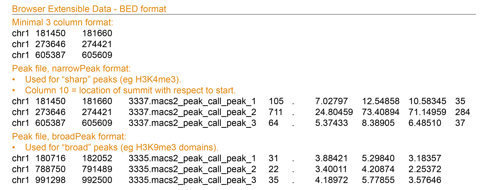

```{r setup, include=FALSE}
library(learnr)     # 0.10.1.9006 (github)
library(gradethis)  # 0.1.0.9004  (github)
library(testthat)   # 3.0.0 
library(tidyverse)  # 1.3.0
library(learnr.proto)

library(IRanges)
library(GenomicRanges)
library(plyranges)
library(rtracklayer)
library(VennDiagram)
library(GenomicFeatures)
# library(TxDb.Hsapiens.UCSC.hg19.knownGene)
# library(TxDb.Hsapiens.UCSC.hg38.knownGene)
# library(ChIPpeakAnno)
# library(UpSetR)
# library(genomation)

# configuration
knitr::opts_chunk$set(echo = FALSE)
gradethis::gradethis_setup()

# data accessible to all exercises
rdata = system.file("extdata", "week2.Rdata", package = "learnr.proto")
load(rdata)

# txdb19 <- TxDb.Hsapiens.UCSC.hg19.knownGene
# txdb38 <- TxDb.Hsapiens.UCSC.hg38.knownGene
```


## 2.1 Introduction   
<br>
In week 1 we discussed the major steps imvolved in obtaining genomics data, from experiment to raw data to normalized signal and peaks. You examined histone PTM ChIP-, DNaseI-, and RNA-seq data of monocytes in the UCSC genome browser and searched for regions with increased signal, *peaks*. You looked at the position of these peaks in the chromosome and with respect to genes as well as the co-occurence of different marks.   
<br>
These observations showed you that some marks are associated with particular functional elements (eg active enhancer, active promoter, silenced domains).   
<br>
**This week and next week you will put numbers to these observations and perform computational analyses to answer common questions including:** "*How many peaks do I have?*", "*Is this mark statistically enriched in a particular genomic element?*", "*Which and how often do marks co-occur?*","*The expression of which gene could be affected by this mark?*",  and "*What is the signal of the mark around a particular element of interest like the TSS?*"   
<br>

### 2.1.1 Learning Objectives  

> At the end of week 2 you are able to:  
> 
1. Import ChIP-seq peaks into a GRanges object in r.  
2. Perform exploratory data analysis on GRanges objects with ChIP-seq peaks.   
3. Detect and count overlap between two GRanges objects.    
4. Visualize the number of overlaps in a vennDiagram.  
5. Visualize the number of overlaps with bar- and pieplots.   
6. Statistically test for enrichment of histone marks in a particular genomic region. 
7. Optionally, quantify and plot the overlap among histone marks (a  tiny bit like chromHMM but much less fancy, ggplot + geom_bar with index at the bottom for the different combinations or plot the tabular output as heatmap with nubmer display).  
8. Identify the nearest TSS to a histone ChIP-seq peak.  
9. Identify the genes that are associated with these TSSs.  
- These refer to global learning objectives #4-#7.  

<br>

***  
<br> 

> TEASER... let's look at some of the plots you will make.    

<br>  

***  
<br> 

## 2.2 ChIP-seq peaks in R  {data-progressive=TRUE}  
### 2.2.1 Data import    
In genomics you often work with **interval** data. Think of peaks, genes, exons, ... any genomic region reported with the **genomic coordinates: chr, start, and end**. As we discussed in week 1, these often come in a tabular format with the basic information about the location and some other information. Common file formats includ BED for peak files, GFF for gene annotations, and BigWig for read depth.     

>#### **Background info**: File formats   
<details><summary>What do BED, GFF, BigWig files hold and look like?</summary>
**Peak files in BED format**:  
>
- 3 required columns: chromosome, start and end position of the peak region.  
- 6 or 7 optional columns:  
  4th: peak name  
  5th: peak score  
  6th: strand to denote orientation (if applicable, otherwise "\*" or "\." if unstranded)  
  7th: signalValue
  8th: p-value to denote statistical significance, given as -log10(p-value)  
  9th: q-value statistical significance using false discoveray rate, given as -log10(q-value)  
  10th (only for sharp peaks not broad domains): location of peak summit relative to the "start" coordinate.  
>
> Example:  
{width=80%}  
> Further reading on the file formats on the UCSC Genome Browser FAQ page: [BED](http://genome.ucsc.edu/FAQ/FAQformat.html#format1), and the [narrowPeak BED](http://genome.ucsc.edu/FAQ/FAQformat.html#format12) and [broadPeak BED](http://genome.ucsc.edu/FAQ/FAQformat.html#format13).  
> <br>
> **Gene annotations in GFF**:  
General Feature Format - GFF format
-	Common file format for gene annotations (including splice variants, cDNA sequences, exons, rRNA, ncRNA, etc).
-	Begins with meta-data in headerlines, starting with #
-	Records reported in 9 fixed columns
-	Column 9 can contains various attirbutes (eg gene symbol, the transcript to which the exon belongs).
- Downloaded for example from [Ensembl](https://www.ensembl.org/Homo_sapiens/Info/Index). 
>
> Example:  
{width=80%}      
> Further reading on the gff file formats: [UCSC Genome Browser](http://genome.ucsc.edu/FAQ/FAQformat.html#format3), or [ENSEMBL](https://m.ensembl.org/info/website/upload/gff3.html).  
> <br>
> **Read depth in bigWig**:  
BigWig files are binary versions of the larger wiggle files. BigWig files are faster to upload and use but can't be viewed by us. Wiggle files can be viewed but are slow to upload. Wiggle files report a genomic region with the data value for that region. For this practical it is not neccessary to know the details of how these files are generatd. But if you are curious, read the UCSC Genome browser documentation on [wiggle](https://genome.ucsc.edu/goldenPath/help/wiggle.html) and [bigWig](https://genome.ucsc.edu/goldenPath/help/bigWig.html) file formats.  
</details>

<br>
Peak data can be imported into a data.frame in r with:  
```{r exampleimport, eval =F, echo =T}
object_name <- read.table("location/of/peak_file.bed")
```
<br>
The data.frame datastructure is, however, not the most efficient way to work with interval data. E.g. a simple manipulation such as shifting all reported intervals 2 bp to the right, requires you to manipulate the "start" and "end" columns at the same time.  
<br>
Interval data such as genomic peaks can be more efficiently handled with the IRanges package which works with a data structure especially developed for **ranges of integers**: IRanges objects.  
<br>
To construct an IRanges object you need to define at least two of the following three values:  

1. a starting coordinate  
2. a finishing coordinate  
3. the width of the interval.  

<br>
The GRanges objects of the GenomicRanges package are very similar but require a additional **sequence name** (in other words a chromosome) for every interval and an optional **strand** column.  
<br> 
Here's an example GRanges object called `my_gr` with the functions to set and retrieve its content:     

{width=100%}  

<br>
Notice that this object holds the **genomic coordinates** and **2 metadata columns**. Metadata is data about the data:  

Genomic coordinates |  Metadata columns   
:--|:---  
Printed on the left-hand side of the \|-sign | Printed on the right-hand side of the \|-sign     
Extract using `granges(object_name)` |  Extract as DataFrame with `mcols(object_name)` or `object_name$column_name` for a specific column   
Restricted to variables `seqnames`, `ranges` and `strand` | Almost anything can be stored in the metadata

<br>
Information about the genome is stored in the "seqinfo"" part of the object. In the example you see that the peaks are located in human genome 38 which holds 455 sequences in total of which 1 circular (mitochondrial genome). (Sequences that can not be confidently placed on a specific chromosome is stored in chrUn, chr*N*_random and chr*N*_region [explanation on UCSC GB website](http://genome.ucsc.edu/FAQ/FAQdownloads#download10).)   
<br>
GRanges objects follow the **tidy data principle**: each row of a Ranges object corresponds to an interval, and each column will represent a variable about that interval, and generally each object will represent a single unit of an observation (like gene annotations). You can use **dplyr**-like functions from the plyranges package to manipulate these objects and use the **pipe** operator `%>%` to combine functions in a workflow.  

>#### **Refresher**: dplyr     
<details><summary>Common dplyr-functions and examples of plyranges-relatives on GRanges objects</summary>   
>
Function | Purpose | Example on GRanges   
:--|:----|:----     
`select()` | subset variables (=columns) |  `select(my_gr, GC)`
`group_by()` | group data into rows with the same value for the specified variable. |  `my_gr %>% group_by(strand)`.  
`filter()` | subset observations (= rows) | `filter(my_gr, GC < 0.4)` or `my_gr %>% group_by(strand) %>%  filter(GC == max(GC))`.     
`summarize()` | Summarise variables, often per group | `group_by(my_gr, strand) %>% summarize(n = n(), gc = max(GC))`   
</details>  

<br>
To parse peak files directly into GRanges you use the `import()` function from the rtracklayer package:   
```{r exampleimport_rtracklayer, eval = F, echo = T}
# load the required library
library(rtracklayer)

# import monocyte H3K4me3 peak locations
monocytes_h3k4me3 <- import("C000S5H2.ERX547984.H3K4me3.bwa.GRCh38.20150527.chr19.bed", format = "narrowPeak")

# (you could also use rtracklayer::import("C000S5H2.ERX547984.H3K4me3.bwa.GRCh38.20150527.chr19.bed", format = "narrowPeak") and skip loading the library)
```
<br>

> #### **Background info**: 
GRanges and rtracklayer are bioconductor packages. But what is Bioconductor? 
> <details><summary>The bioconductor repository with r packages developed for the analysis of high-throughput genomics datain R.</summary>  
[Bioconductor](https://www.bioconductor.org/) is a special repository of packages for the analysis of high throughput genomic data in r. Packages are often heavily dependend on each other and regular releases and a special installer ensure that you install package version that can work together. Usually you would use the `biocManager::install()` command to install these packages. But in this tutorial, all required packages are already installed.  
<br>
Bioconductor packages that you will be using include:   
>
Package | Purpose   
--|--------    
[GenomicRanges](https://bioconductor.org/packages/release/bioc/vignettes/GenomicRanges/inst/doc/GenomicRangesIntroduction.html) | Provides the `GRanges` data structures to store and handle genomic intervals.  
[plyranges](https://bioconductor.org/packages/release/bioc/html/plyranges.html) | `dplyr`-like interface for interacting and manipulating `Ranges` data structures.    
[GenomicFeatures](https://www.bioconductor.org/packages/release/bioc/html/GenomicFeatures.html) | Functions to retrieve and manage genomic features from database packages.  
[rtracklayer](https://www.bioconductor.org/packages/release/bioc/html/rtracklayer.html) | Provides functions to import and work with annotation files with various formats (GFF, BED, bedGraph, BED15, WIG, BigWig and 2bit).   
`TxDb` packages | Provide an R representation of gene models, each genome has a separate package.   
`OrgDb` packages | Contain mappings between a unique gene identifier and other kinds of identifiers for a certain genome (eg from Entrez gene identifier to Gene Symbol)  
<br>
Bioconductor packages can use **data structures** different from `vectors`,`matrices` or `data.frames`. The `GRanges` data structure provided by the `GenomicRanges` package is an example and is used by many. We will come to those shortly.   
<br>
These "Bioconductor-specific-objects", like `GRanges`, generally have their own set of functions or methods that you can explore using `methods(class = "...")`. To find out the `class`, use `class(object_name)`.  
<br>
Here's a list of basic functions to explore objects and/or call the help on packages or functions:   
>
- Use `class()` to found out what kind of data structure you are dealing with  
- Use `show()` or `print()` to have r print a summary of your data    
- use `methods(class = "...")` to get a list of (default) methods or functions you can use to extract and manipulate the data, also called *assessor* functions or *getter* and *setter* functions       
- use `help(package = "[packageName]")` to display the help page     
</details>

<br>  
Let's take a quick look at one `monocytes_h3k4me3`.   

> **Exercise 1:**  
Print the head of `monocytes_h3k4me3`.  

<!-- # ```{r q1_head_h3k4me3-setup, echo = F} -->
<!-- # library(rtracklayer) -->
<!-- # monocytes_h3k4me3 <- rtracklayer::import(paste0(datadir, "www/blueprint/bed/C000S5H2.ERX547984.H3K4me3.bwa.GRCh38.20150527.chr19.bed"), format = "narrowPeak") -->
<!-- # ``` -->

```{r q1_head_h3k4me3, exercise = TRUE}
# the object "monocytes_h3k4me3" has already been imported for you
monocytes_h3k4me3

```

<!-- # ```{r q1_head_h3k4me3-hint-1} -->
<!-- # head("object", n="rows") -->
<!-- # ``` -->

<div id="q1_head_h3k4me3-hint">
**Hint:** You may want to use the `head(.., n = ..)` function.  
</div>

```{r q1_head_h3k4me3-solution, eval = F}
head(monocytes_h3k4me3, n = 2)
```

```{r q1_head_h3k4me3-code-check, eval = F}
grade_code()
```

<!-- # ```{r q1_head_h3k4me3-check} -->
<!-- # grade_result( -->
<!-- #   pass_if(~identical(.result, head(monocytes_h3k4me3, n = 2))) -->
<!-- # ) -->
<!-- # ``` -->

> *Note 1*: We have restricted all peak files to chromosome 19 to limit their file size. That is why "seqinfo" holds only one sequence.  

> *Note 2*: The original .BED files lacked column headers. The `rtracklayer::import()` function appendended variable names and converted the data to the data type (eg numeric, integer, character etc.) according to the file format we defined.  


<br>
**Let's do some exploratory analyses on these data.**  
<br>

### 2.2.2 Exploratory data analysis   
A common first step in genomics data analysis is to make some exploratory plots. You will do so for the peaks called on H3K4me3 and H3K27me3 ChIP-seq tracks for monocytes (used in the week 1). These are stored in the R objects `monocytes_h3k4me3` and `monocytes_h3K27me3`.   
<br>

> **Exercise 2:**  
>
> * Determine the number of H3K4me3 and H3K27me3 peaks in monocytes.  
> * What is the distribution of peak sizes and scores? 

<!-- # ```{r q2a_explore-setup, echo = F} -->
<!-- # monocytes_h3k4me3 <- rtracklayer::import("www/blueprint/bed/C000S5H2.ERX547984.h3k4me3.bwa.GRCh38.20150527.chr19.bed", format = "narrowPeak") -->
<!-- #  -->
<!-- # ``` -->

```{r q2a_explore, exercise = T}
# How many peaks do are stored in monocytes_h3k4me3?
monocytes_h3k4me3

```

<div id="q2a_explore-hint">
**Hint:** You may want to use the `length()` function.  
</div>

```{r q2a_explore-solution, eval = F}
length(monocytes_h3k4me3)
```

```{r q2a_explore-code-check, eval = F}
grade_code()
```


```{r q2b_explore, exercise = T}
# What is the distribution of peak widths?   
summary(...(...))
```

<div id="q2b_explore-hint">
**Hint:** You may want to retrieve peak widths with `width()` function.  
</div>

```{r q2b_explore-solution, eval = F}
summary(width(monocytes_h3k4me3))
```

```{r q2b_explore-code-check, eval = F}
grade_code()
```

<!-- # ```{r q2c_explore-setup, echo = F} -->
<!-- # monocytes_h3k4me1 <- rtracklayer::import("www/blueprint/bed/C000S5H2.ERX547981.H3K4me1.bwa.GRCh38.broad.20150527.chr19.bed", format = "broadPeak") -->
<!-- # ``` -->

```{r q2c_explore, exercise = T}
# What is the distribution of peak sizes for H3K4me1?
monocytes_h3k4me1

```

<div id="q2c_explore-hint">
**Hint:** You may want to use `score()` to retrieve the peak scores.  
</div>

```{r q2c_explore-solution, eval = F}
summary(score(monocytes_h3k4me1))
```

```{r q2c_explore-code-check, eval = F}
grade_code()
```

<br>

### 2.2.3 Exploratory plotting   
Let's plot some of the above generated outputs using **base** plotting functions. 

> **Exercise 3:**  
> Plot the h3k4me3 peaksizes as a histogram and as a boxplot.   

```{r q3a_exploreplot, exercise = T}
# plot the distribution of peak sizes for h3k4me3 as histogram
..(..(monocytes_h3k4me3), main = "Monocytes h3k4me3 ChIP-seq, chr19", xlab = "peak size", col = "gray")
```

<div id="q3a_exploreplot-hint">
**Hint:** You may want to use `width()` to retrieve the peak widths and plot with `hist()`    
</div>

```{r q3a_exploreplot-solution, eval = F}
# plot the distribution of peak sizes for h3k4me3 as histogram 
hist(width(monocytes_h3k4me3), main = "Monocytes h3k4me3 ChIP-seq, chr19", xlab = "peak size", col = "gray")
```

```{r q3a_exploreplot-code-check, eval = F}
grade_code()
```


```{r q3b_exploreplot, exercise = T}
# plot the same data as boxplot
..(..., main = "Monocytes h3k4me3 ChIP-seq, chr19", ... = "peak size", col = "gray")
```

<div id="q3b_exploreplot-hint">
**Hint:** You may want to plot with `boxplot()`. Which axis will hold the widht information, x or y?     
</div>

```{r q3b_exploreplot-solution, eval = F}
# plot the same data as boxplot, ensue that "peak size" labels the right axis (x or y)
boxplot(width(monocytes_h3k4me3), main = "Monocytes h3k4me3 ChIP-seq, chr19", ylab = "peak size", col = "gray")
```

```{r q3b_exploreplot-code-check, eval = F}
grade_code()
```
<br>

> *Note*: plotting with the ggplots packages is also possible, as long as you convert the data you are interested to `data.frame` objects by running for example: 
```{r example_to_get_metadata, echo =T, eval = F}
meta_h3k4me3 <- as.data.frame(mcols(monocytes_h3k4me3))
```

<br>
Several peaks have a width of >10000 bp. You can retrieve these peaks with: `monocytes_h3k4me3[width(monocytes_h3k4me3)> 10000,]` or using `filter()` from `plyranges`.    
<br>

> **Exercise 4:**  
What is the number of peaks with width > 10kb.  

```{r q4_filter, exercise = T}
# How many monocytes_h3k4me3 peaks have width > 10kb>
monocytes_h3k4me3

```

<div id="q4_filter-hint">
**Hint:** You may want to use `[ ]`-subsetting and `width > 10000`   
</div>

<div id="q4_filter-hint">
**Hint:** You may want to use `length(..[..(..) > 10000,])`   
</div>

```{r q4_filter-solution, eval = F}
# using [ ]-subsetting
length(monocytes_h3k4me3[width(monocytes_h3k4me3) > 10000,])
```

```{r q4_filter-code-check, eval = F}
grade_code()
```

> **Exercise 5:**  
Filter `monocytes_h3k4me3` for peaks with width > 10kb using `filter()` from `plyranges`   

```{r q5_filter, exercise = T}
# filter monocytes_h3k4me3 for peaks with size above 10kb
.. %>% plyranges::..(.. > ..)
```

```{r q5_filter-solution, eval = F}
# filter monocytes_h3k4me3 for peaks with size above 10kb
monocytes_h3k4me3 %>% plyranges::filter(width > 10000)
```

```{r q5_filter-code-check, eval = F}
grade_code()
```
  
<br>

> **Exercise 6**  
> Use the `plyranges::filter` and the UCSC genome browser to find the gene(s) whose promoter(s) is/are covered by the peak with the highest score.  

```{r q6_maxscore, exercise = T}
# find the peak peak with highest score

```

<div id="q6_maxscore-hint">
**Hint:** You may want to use `score == max(score)`  
</div>

```{r q6_maxscore-solution, eval = F}
# find the peak peak with highest score
monocytes_h3k4me3 %>% filter(score == max(score))
```

```{r q6_maxscore-code-check, eval = F}
grade_code()
```


```{r q7_ucsc, exercize = T}
question("The promoters of which gene(s) are covered by the h3k4me3 peak with the highest score?",
         answer("AKAP8", correct = T, message = "While this peak spans parts of both genes, it covers the promoter of AKAP8 but the 3'UTR of AKAP8L." ),
         answer("AKAP8L", message = "Incorrect. Be aware of the directionaility of this gene by looking at the arrowsheads in the introns."),
         answer("Both", message = "Only one of the genes listed here. Look at the direction of transcription indicated by the arrowheads in the introns of the genes.")
         )
```


`r colorize("remove (part of) this description, let it come back after comparing withs of H3K4_me3 and H3K4me1", "red")`

> *Background*: you will come across **narrowPeak** and **broadPeak** files. These are both outputs from MACS2 peak calling.  
> 
- narrowPeak files are for more focused signals like transcription factor ChIP-seq but also some histone marks.  
- broadPeak mode is used for more defuse signals.   
> 
> The outputs are very similar except that the broadPeak mode, the peak summit won't be called and the values in the 5th, and 7-9th columns are the mean value across all positions in the peak region.  
> 
> narrowPeak file | broadPeak file  
> :-- |:--  
H3K27ac | H3K27me3   
h3k4me3 | H3K36me3  
H3K9/14ac | H3K9me3  
H2A.Zac | H3K4me1  

You have the following information about the identified peaks (ref: [MACS2 github](https://github.com/macs3-project/MACS)):  

Column | Information | narrowPeak description | broadPeak description   
-- | -- | -- | --  
1. | chromosome name | same | same    
2. | peak start | same | same       
3. | peak end | same | same      
4. | peak name | same | same   
5. | score | -10log(qvalue) \*\ 10, rounded down to integer value) | mean of -10log(qvalue) \*\ 10 *across all positions*  
6. | strand | +, - or \*\ for unstranded | same  
7. | fold_enrichment | at peak summit |  mean across all positions  
8. | -log10(qvalue) (*e.g.if qvalue = 1e-10, this value is 10*) | at peak summit  | mean *across all positions*  
9. | -log10(pvalue) | at peak summit | mean *across all positions*   
10. | relative summit | position relative to peak start | not reported   


<br>
**Later on in this tutorial we will learn how to annotate peaks with the gene that they most likely control. First we will calculate the fraction of overlap among two `GRanges` objects. **  
<br>

***
<br>

## 2.4 Overlap analysis   
### 2.4.1 Detect overlap with GenomicRanges        
The GenomicRanges package has a family of functions to count and identify overlappig intervals in GRanges objects:  
<br>
**countOverlaps**: `countOverlaps(query, subject)` returns a integer vector with the number of overlaps for each element in the `query`  
<br>
**subsetByOverlaps**: `subsetByOverlaps(query, subject)` extracts the elements in the `query` that overlap with at least one element in the subject.  
<br>
**findOverlaps**: `findOverlaps(query, subject)` returns a `Hits` object containing the index pairings for the overlapping elements.  

- The columns of indices can be accessed through `queryHits(overlap_object)` and `subjectHits(overlap_object)`.  
- If a peak in one of the inputs overlaps with mutiple peaks in the other, its index will appear multiple times in the output.  

<br>  

### 2.4.2 Overlap promoters vs h3k4me3 peaks   
We have used the package `TxDb.Hsapiens.UCSC.hg38.knownGene` to retrieve the genomic coordinates of all genes on human chromosome 19. This object, `genes`, thus contains all the coordinates of the outermost UTR boundaries and the Entrez gene identifier of each gene.  
<br>

```{r retrieve_genes_txdb, echo = T}
# load the txdb package which holds transcript-based gene models of hg38 genome  
library(TxDb.Hsapiens.UCSC.hg38.knownGene)
txdb <- TxDb.Hsapiens.UCSC.hg38.knownGene 

# extract gene coordinates  
genes <- unique(genes(txdb, filter = list(tx_chrom = "chr19")))
```

We define the promoter region as 1kb upstream and 200bp downstream the TSS as follows:  
```{r retrieve_promoters , echo = T}
# identify TSS (in this case 1 per gene even though we know that genes have multiple TSSs)
tss <- GenomicRanges::resize(genes, width = 1, fix = "start")

# consider 1kb upstream and 200bp downstream the TSS as promoter
promoters <- GenomicRanges::resize(tss, width = 1000, fix = "end")
promoters <- GenomicRanges::resize(promoters, width = 1200, fix = "start")

# show promoters object
head(promoters, n = 3)
```
<br>
We want to know how many of the promoters overlap with a h3k4me3 peak and vise versa.    
<br>

> **Exercise 8:**  
> Use `findOverlaps()` to determine the overlap between (query) `monocytes_h3k4me3` and (subject) `promoters`.     

```{r overlap_exercise7}
# prepare data for exercise 10
library(TxDb.Hsapiens.UCSC.hg38.knownGene)
txdb <- TxDb.Hsapiens.UCSC.hg38.knownGene 

# extract gene coordinates  
genes <- unique(genes(txdb, filter = list(tx_chrom = "chr19")))

# identify TSS (in this case 1 per gene even though we know that genes have multiple TSSs)
tss <- resize(genes, width = 1, fix = "start")

# consider 1kb upstream and 200bp downstream the TSS as promoter
promoters <- resize(tss, width = 1000, fix = "end")
promoters <- resize(promoters, width = 1200, fix = "start")

# load the monocyte data
rdata = system.file("extdata", "week2", "prepared_rds", "blueprint_monocyte_chr19_granges.RData", package = "learnr.proto")
load(rdata)
#load("www/prepared_rds/blueprint_monocyte_chr19_granges.RData")
```

```{r q8_overlap, exercise = T, exercise.setup = "overlap_exercise7"}
# Find overlap between monocytes_h3k4me3 peaks and promoters
overlap <- ..(query = .., subject = ..)

# print the overlap output
show(..)
```

```{r q8_overlap-solution, eval = F}
# Find overlap between monocytes_h3k4me3 peaks and promoters
overlap <- findOverlaps(query = monocytes_h3k4me3, subject = promoters)

# print the overlap output
show(overlap)
```

```{r q8_overlap-code-check, eval = F}
grade_code()
```
<br>
'overlap' gives you the indices of `monocytes_h3k4me3` and `promoters` that overlap. If a peak or a promoter overlaps several times, each overlap will be reported on a new row.  
<br>

> **Exercise 11:**  
> How many of the promoters are part of the overlap? And how many of the h3k4me3 peaks?  
>  
- Use `queryHits()` and `subjectHits()` to extract the indices of overlapping peaks and promoters respectively.  
- Use `unique()` to minimize this output to unique peaks.  
- Use `length()` to count the number of unique intervals of the query and the subject. 

```{r q10_overlap}
# prepare data for exercise 10
library(TxDb.Hsapiens.UCSC.hg38.knownGene)
txdb <- TxDb.Hsapiens.UCSC.hg38.knownGene 

# extract gene coordinates  
genes <- unique(genes(txdb, filter = list(tx_chrom = "chr19")))

# identify TSS (in this case 1 per gene even though we know that genes have multiple TSSs)
tss <- resize(genes, width = 1, fix = "start")

# consider 1kb upstream and 200bp downstream the TSS as promoter
promoters <- resize(tss, width = 1000, fix = "end")
promoters <- resize(promoters, width = 1200, fix = "start")

# Find overlap between monocytes_h3k4me3 peaks and promoters
overlap <- findOverlaps(query = monocytes_h3k4me3, subject = promoters)
```


```{r q11a_overlap, exercise = T, exercise.setup = "q10_overlap"}
# What is the number of unique h3k4me3 peaks reported in 'overlap'?
length(unique(..(..))) 
```

```{r q11a_overlap-solution, eval = F}
# What is the number of unique h3k4me3 peaks reported in 'overlap'?
length(unique(queryHits(overlap)))
```

```{r q11a_overlap-code-check, eval = F}
# grade_result(
#   pass_if(~identical(.result, 1008))
# )
grade_code()
```


```{r q11b_overlap, exercise = T, exercise.setup = "q10_overlap"}
# What is the proportion of h3k4me3 peaks that overlap?
length(unique(..(..)))/length(..)
```

```{r q11b_overlap-solution, eval = F}
length(unique(queryHits(overlap)))/length(monocytes_h3k4me3)
```

```{r q11b_overlap-code-check, eval = F}
# grade_result(
#   pass_if(~identical(round(.result, digits= 3), round(0.3551797, digits = 3)))
# )
grade_code()
```


```{r q11c_overlap, exercise = T, exercise.setup = "q10_overlap"}
# What is the proportion of promoters that overlap?
length(unique(..(..)))/length(..)
```

```{r q11c_overlap-solution, eval = F}
length(unique(subjectHits(overlap)))/length(promoters)
```

```{r q11c_overlap-code-check, eval = F}
# grade_result(
#   pass_if(~identical(round(.result, digits= 3), round(0.6495084, digits = 3)))
# )
grade_code()
```
<br>
Let's plot this overlap in a venn diagram with the `plot.pairwise.venn()` function of the `VennDiagram` package.  

- Use the minimum of the two 'unique counts' as the number of 'common peaks' for our venn diagram.  
 
```{r venndiagram, exercise = T, warnings =  F, exercise.setup = "q10_overlap"}
# Identify the minimum of the two numbers of unique intervals among h3k4me3 peaks and promoters
common_intervals <- min(c(length(unique(queryHits(overlap))), length(unique(subjectHits(overlap)))))

# call a new plotting area
grid.newpage()

# Plot the overlap in a venn diagram
draw.pairwise.venn( 
   area1=length(monocytes_h3k4me3),
   area2=length(promoters), 
   cross.area=common_intervals, 
   category=c("h3k4me3", "Promoters"), 
   fill=c("red", "gray"), 
   cat.cex=1.2)
```
<br>
**Is there a significant enrichment of h3k4me3 in promoters?**    
<br>
To answer this question, we compare the fraction of promoters with a h3k4me3 peak with the chromosome 19-wide fraction of promoters.  
<br>
If h3k4me3 is not enriched at promoters, we would expect that the fraction of promoters with a h3k4me3 peak is in the same range as the fraction of promoters on chromosome 19. (This is our **null hypothesis of no enrichment**).  
<br>
To calculate the chromosome 19-wide fraction of promoters we identify the total number of bps covered by a promoter. As some promoters may overlap we first *reduce* `promoters` to non-overlapping intervals.     
<br>
```{r fraction_promoters, echo = T}
# total number of bps covered by promoters
total_bp_prom <- sum(width(GenomicRanges::reduce(promoters)))
# chromosome 19-wide fraction of promoters 
(prom_fraction_chr19 <- total_bp_prom/seqlengths(promoters)["chr19"])
```
<br>
Promoters make up 3.4% of this chromosome but nearly 65% of all promoters overlap with h3k4me3 peaks. This looks like a strong enrichment. We can test whether the observed fraction is indeed larger than expected with a binomial test, in r we use the function `binom.test(x, n, p)` for this:  

- `x` = number of successes, number of promters with h3k4me3 peak  
- `n` = total number of trails, total number of h3k4me3 peaks  
- `p` = expected probability of success, in this case the fraction of promoters in chromosome 19  

<br>

> *Background*: The binomial test is run when an experiment has two possible outcomes (i.e. success/failure) and you have an idea about what the probability of success is. Success in this case is overlap and our expectation is that 3.4% of the cases show overlap. The test calculates the probability of getting a desired outcome with a specific sample size `n`. 

>**Exercise 12**  
Use a binomial test to test for enrichment of h3k4me3 at promoters.  
> 
> - Use the function `binom.test(x, n, p, alternative = "greater")` to call the test  
> - We set `alternative = "greater"` because we test for *enrichment* and our alternative hypothesis is that the true probability is *larger* than the expected probability.  

<br>
```{r q12_binomtest, exercise = T, exercise.setup = "q10_overlap", exercise.setup = "fraction_promoters"}
# binomial test for enrichment of h3k4me3 peaks in promoters:  
binom.test(length(unique(..(overlap))), length(..), prom_fraction_chr19, alternative = "greater" )

```

```{r q12_binomtest-solution, eval = F}
binom.test(length(unique(subjectHits(overlap))), length(monocytes_h3k4me3), prom_fraction_chr19, alternative = "greater" )
```

```{r q12_binomtest-code-check, eval = F}
grade_code()
```
<br>
The binomial test shows a p-value < 2.2e-16 and a confidence interval that excludes the expected 0.034. We therefore reject the H0 of no enrichment.  
<br>
In the genome browser we also observed H3K27ac often at promoters. Is this mark enriched in these regions?  

>**Exercise 13**  
Use a binomial test to test for enrichment of H3K27ac at promoters.  
> 
> - First, use findOverlaps to detect the overlap between intervals reported in monocytes_h3k37 and promoters
> - Use the function `binom.test(x, n, p, alternative = "greater")` to call the test  
> - We set `alternative = "greater"` because we test for *enrichment* and our alternative hypothesis is that the true probability is *larger* than the expected probability.  

```{r overlap_exercise13} 
# this chunk no longer exists: exercise.setup = 'prep-txdbindiv'}

# prepare data for exercise 13

# identify TSS (in this case 1 per gene even though we know that genes have multiple TSSs)
tss <- resize(genes, width = 1, fix = "start")
# consider 1kb upstream and 200bp downstream the TSS as promoter
promoters <- resize(tss, width = 1000, fix = "end")
promoters <- resize(promoters, width = 1200, fix = "start")

# load the monocyte data
rdata = system.file("extdata", "week2", "prepared_rds", "blueprint_monocyte_chr19_granges.RData", package = "learnr.proto")
load(rdata)
#load("www/prepared_rds/blueprint_monocyte_chr19_granges.RData")

# fraction of promoters on chr19
prom_fraction_chr19 <- sum(width(GenomicRanges::reduce(promoters)))/seqlengths(promoters)["chr19"]
```

```{r q13a_h3k27ac, exercise = TRUE, exercise.setup = "overlap_exercise13" }
# find overlap between monocytes_h3k27ac and promoters
overlap2 <- ...
```

```{r q13a_h3k27ac-solution, eval = F}
overlap2 <- findOverlaps(query = monocytes_h3k27ac, subject = promoters)
```

```{r q13b_h3k27ac, exercise = TRUE, exercise.setup = "overlap_exercise13", exercise.setup = "q13a_h3k27ac"}
# binomial test for enrichment of H3K27ac peaks in promoters
# `prom_fraction_chr19` holds the fractio of promoters in chromosome 19
..(..(..(..(..))), ..(..), prom_fraction_chr19, alternative = "greater" )
```

```{r q13b_h3k27ac-solution, eval = F}
# binomial test for enrichment of H3K27ac peaks in promoters:  
binom.test(length(unique(subjectHits(overlap2))), length(monocytes_h3k27ac), prom_fraction_chr19, alternative = "greater" )
```
 
```{r q13b_h3k27ac-code-check, eval =F}
grade_code()
```
<br>

>**Exercise 14:**  
Do you conclude that H3K27ac is enriched at promoters?  

```{r q14_enrichment, exercise = T, echo = T}
question("Is H3K27ac enriched at promoters?",
         answer("*Yes*", correct = T),
         answer("*No*", message = "Incorrect. Look at the p-value of the previous test.")
)
```

### 2.4.3 Overlap with multiple genomic features    
`r colorize("remove?", "red")`  
To understand the function of a ChIPped mark or factor we often want to know to which genomic features it binds.
<br>

```{r q13a_anno-setup}
# we need the `TxDb` object and limits its active chromosomes to chromosome 19
library(TxDb.Hsapiens.UCSC.hg19.knownGene)
txdb <- TxDb.Hsapiens.UCSC.hg19.knownGene
seqlevels(txdb) <- "chr19"

# laod package to annotate peaks with genes
library(ChIPpeakAnno)   
```

> **Exercise 13**  
> Plot the percentage of features with the mark as barplot and as piechart  
> 
> - Access the percent values in `h3k4me3_features` using the $ operator.  
> - For plotting use `pie()` and `barplot()`.

```{r q13a_anno, exercise = T }
# calculate the overlap with features
h3k4me3_features <- assignChromosomeRegion(monocytes_h3k4me3, TxDb=txdb, precedence = c("Promoters","immediateDownstream", "fiveUTRs", "threeUTRs", "Exons", "Introns" ), nucleotideLevel=FALSE)
# show the results
h3k4me3_features

# make pie-chart

```

```{r q13a_anno-solution, eval = F}
# calculate the overlap with features
h3k4me3_features <- assignChromosomeRegion(monocytes_h3k4me3, TxDb=txdb, precedence = c("Promoters","immediateDownstream", "fiveUTRs", "threeUTRs", "Exons", "Introns" ), nucleotideLevel=FALSE)
# show the results
h3k4me3_features

# make pie-chart
pie(h3k4me3_features$percentage)
```

```{r q13a_anno-code-check, eval = F}
grade_code()
```


```{r q13b_anno, exercise = T}
# this chunk no longer exists: exercise.setup = "anno_h3k4me3_prep"}

# make barplot
bp <- ..(..$.., ylab="%")
# add percentages to the bars with text()  
text(bp, h3k4me3_features$percentage, signif(h3k4me3_features$percentage, 4), pos=1, main = "Mono h3k4me3 in features")
```

```{r q13anno-solution, eval = F}
# make barplot
bp <- barplot(h3k4me3_features$percentage, ylab="%", las = 2)
# add percentages to the bars with text()  
text(bp, h3k4me3_features$percentage, signif(h3k4me3_features$percentage, 4), pos=1, main = "Mono h3k4me3 in features")
```

```{r q13anno-code-check , eval = F}
grade_code()
```

### 2.4.5 Overlap with GRangesList   
`r colorize("remove?", "red")`  
So far we looked at h3k4me3 marking. How do the other marks overlap with genomic features? Instead of rerunning the above code for each mark individually, we combine the individual peak objects into a list of `GRanges` objects with the function `GRangesList()`.   
<br>  
We have created a `GRangesList` `monocytes_list` by:  
<!-- # ```{r prepare files, echo = F} -->
<!-- # # H3k4me1  -->
<!-- # monocytes_h3k4me1 <- rtracklayer::import("www/blueprint/bed/C000S5H2.ERX547981.H3K4me1.bwa.GRCh38.broad.20150527.chr19.bed", format = "broadPeak") -->
<!-- #  -->
<!-- # # H3K4me3   -->
<!-- # monocytes_h3k4me3 <- rtracklayer::import("www/blueprint/bed/C000S5H2.ERX547984.H3K4me3.bwa.GRCh38.20150527.chr19.bed", format = "narrowPeak") -->
<!-- #  -->
<!-- # # H3K9me3  -->
<!-- # monocytes_h3k9me3 <- rtracklayer::import("www/blueprint/bed/C000S5H2.ERX547982.H3K9me3.bwa.GRCh38.broad.20150527.chr19.bed", format = "broadPeak") -->
<!-- #  -->
<!-- # # H3K27ac  -->
<!-- # monocytes_h3k27ac <- rtracklayer::import("www/blueprint/bed/C000S5H2.ERX547980.H3K27ac.bwa.GRCh38.20150527.chr19.bed", format = "narrowPeak") -->
<!-- #  -->
<!-- # # H3K27me3    -->
<!-- # monocytes_h3k27me3 <- rtracklayer::import("www/blueprint/bed/C000S5H2.ERX547983.H3K27me3.bwa.GRCh38.broad.20150527.chr19.bed", format = "broadPeak") -->
<!-- #  -->
<!-- # # H3K36me3 -->
<!-- # monocytes_h3k36me3 <- rtracklayer::import("www/blueprint/bed/C000S5H2.ERX547979.H3K36me3.bwa.GRCh38.broad.20150527.chr19.bed", format = "broadPeak") -->
<!-- # ``` -->

```{r grangeslist, echo = T}
# make a list of your GRanges objects
monocytes_list  <- GRangesList(monocytes_h3k4me1, monocytes_h3k4me3, monocytes_h3k9me3, monocytes_h3k27ac, monocytes_h3k27me3, monocytes_h3k36me3)
# add names to each element in the list
names(monocytes_list) <- c("h3k4me1", "h3k4me3", "h3k9me3", "h3k27ac", "h3k27me3", "h3k36me3")

# print the length of your list  
length(monocytes_list)
```
<br>
The `length` function now applies to the list and not to the individual items any more.  
<br>
We can access elements in the list using `[[]]` or `$`-sign.  

  + Use `[[]]` and the *index*: eg. `monocytes_list[[1]]` will extract the first item in the list. 
  + Use `[[]]` and the name: eg `monocytes_list[["h3k36me3"]]` will extract the item with this name.  
  + Use `$item_name` to extract the item with that name.  

To calculate the length of individual items in the list use `lapply()`, which applies a function to each item in the list.  
<br>
With the fuction `lapply(list_object, function)` we can apply or *loop* a function to each element in the list and returns the results as a list.  
<br>
Here we apply `length()` to each item in `monocytes_list`
```{r length of list item, echo = T}
# print the length of each element at once with apply
lapply(monocytes_list, length) 
```
<br>
`unlist()` flattens the list to one object. Depending on the elements in the list this will return a `vector`, `matrix` or, if all elements have the same data structure and column names, one large version of that particular data structure.  
<br> 
E.g. `unlist(monocytes_list)` will give you one large `GRanges` object that is often not usefull because peaks of all marks are mixed up. `unlist(lapply(monocytes_list, length))`, on the other hand, returns a usefull vector of peak numbers per ChIP.  
<br>

> **Exercise 14:**  
> Make a barplot of peak numbers per ChIP:**    
> 
>  * Use the `monocytes_list` object  
>  * Obtain `counts_vector` with `lapply()`, and `unlist()`  
>  * Use the `length` within `lapply()`  

```{r q14_barplot, exercise = T}
# print the length of each element at once with apply
counts_list <- .. ( .. , .. )

# unlist the resulting output
counts_vector <- ..(..)

# make barplot of the number of peaks, store this in 'bp':  
bp <- ..(.., ylab = "Number of peaks", main = "Monocytes ChIP-seq; chr19")

# add actual values as text lables to the plot
text(bp, counts_vector, labels=names(counts_vector), pos=1)
```

```{r q14_barplot-solution, eval = F}
# print the length of each element at once with apply
counts_list <- lapply(monocytes_list, length)

# unlist the resulting output
counts_vector <- unlist(counts_list)

# barplot of the number of peaks, store this in 'bp':   
bp <-barplot(counts_vector, ylab = "Number of peaks", main = "Monocytes ChIP-seq; chr19")

# add actual values as text lables to the plot
text(bp, counts_vector, labels = counts_vector, pos=1)
```

```{r q14_barplot-code-check, eval = F}
grade_code()
```
<br>
Instead of the length, let's look at the distribution of these peaks among features, as in section 2.4.3.   
<br>

> **Exercise 15**  
> 
> For each item in `monocytes_list` determine the overlap with genomic features. Use the `assignChromosomeRegion(object,TxDb=txdb, nucleotideLevel=FALSE)` to assign peaks to features. 

```{r anno_grlist_prep}
# make a list of your GRanges objects
monocytes_list  <- GRangesList(monocytes_h3k4me1, monocytes_h3k4me3, monocytes_h3k9me3, monocytes_h3k27ac, monocytes_h3k27me3, monocytes_h3k36me3)
# add names to each element in the list
names(monocytes_list) <- c("h3k4me1", "h3k4me3", "h3k9me3", "h3k27ac", "h3k27me3", "h3k36me3")
# you need the `TxDb` object and limits its active chromosomes to chromosome 19
library(TxDb.Hsapiens.UCSC.hg19.knownGene)
txdb <- TxDb.Hsapiens.UCSC.hg19.knownGene
seqlevels(txdb) <- "chr19"
```

```{r annotate_with_list}
# laod package to annotate peaks with genes
library(ChIPpeakAnno)   

# calucluate the overlap with features
# this code takes rather long to run!!!!
allmarks_features <- lapply(monocytes_list, function(.object) assignChromosomeRegion(.object, TxDb=txdb, nucleotideLevel=FALSE))
names(allmarks_features) <- names(monocytes_list)

# show the results
allmarks_features
```


```{r annotate_list_with_chipseeker}


```

## 2.5 Annotation of ChIP-seq peaks
### 2.5.1 Distance to TSS   
In this part of the analysis you will assign peaks to their closest TSS, assuming that it likely is involved in regulating the expression regulates that gene.  
<br>
The `GenomicRanges` package has the function `distanceToNearest(x, subject)` to help you identify the distance between intervals in `x` and the nearest neighbor in `subject`. In this case, the intervals are the peaks and the subject are the TSSs. The function outputs a `Hits` objects with distances.  
<br>

>**Exercise 15**  
Use `distanceToNearest()` to get the distance between h3k4me3 peaks and the nearest TSS.  

```{r q15_distance_tss, exercise = T}
# this chunk does not exist: exercise.setup = "overlap_exercise10"}

# calculate the distances from peaks to tss
h3k4me3_to_tss <- ..(.., ..)
```

```{r q15_distance_tss-solution, include = F}
# calculate the distances from peaks to tss
h3k4me3_to_tss <- distanceToNearest(monocytes_h3k4me3, tss)
```

```{r q15_distance_tss-code-check, eval = F}
grade_code()
```
<br>
Let's look at the resulting `Hits` object.  
<br>
```{r look at hits, echo = T}
# show object h3k4me3_to_tss
show(h3k4me3_to_tss)

# summary of distances
summary(mcols(h3k4me3_to_tss)[,1])

# plot the distribution of distances
boxplot(mcols(h3k4me3_to_tss)[,1])
```
<br>  

### 2.5.2 Find associating gene  
You can use this `Hits` object to subset peaks to those that are less than 10 Kb away from the TSS. You can than use the function `subjectHits()` to get the genes associated to each peak.  
<br>

>**Exercise 16**  
Subset the h3k4me3_to_tss for distances =< 10kb and select the associated genes from `genes` object.  

```{r prepare_closegene_q16}
rdata = system.file("extdata", "week2", "prepared_rds", "txdb_annotation_chr19_genes_tx_pr_tss_granges.RData", package = "learnr.proto")
load(rdata)
# load("www/prepared_rds/txdb_annotation_chr19_genes_tx_pr_tss_granges.RData")  
h3k4me3_to_tss <- distanceToNearest(monocytes_h3k4me3, tss)
```


```{r q16a_closegenes, eval = F, exercise = T, exercise.setup = "prepare_closegene_q16" }
# save the distances in a vector
distances <- mcols(h3k4me3_to_tss)[,1]

# subset h3k4me3_to_tss by distance
h3k4me3_to_tss_close <- ..[..,..]
```

```{r q16a_closegenes-solution, eval = F}
# save the distances in a vector
distances <- mcols(h3k4me3_to_tss)[,1]

# subset h3k4me3_to_tss for distances <= 10000
h3k4me3_to_tss_close <- h3k4me3_to_tss[distances <= 10000,]
```

```{r q16a_closegenes-code-check, eval = F}
grade_code()
```


```{r 16b_closegenes, exercise = T, exercise.setup = "q16a_closegenes" }
# obtain the genes
monocytes_h3k4me3_genes <- unique(genes[..(..)])

# look at the output
show(monocytes_h3k4me3_genes)
```
 
```{r 16b_closegenes-solution, eval = F}
# obtain the genes
monocytes_h3k4me3_genes <- unique(genes[subjectHits(h3k4me3_to_tss_close)])

# look at the output
show(monocytes_h3k4me3_genes)
```

```{r q16b_closegenes-code-check, eval = F}
grade_code()
```

<br>
Besides the distance, we are also (very!) interested in the distribution of the ChIP-seq signal around the TSS. You will look at that next week.  
