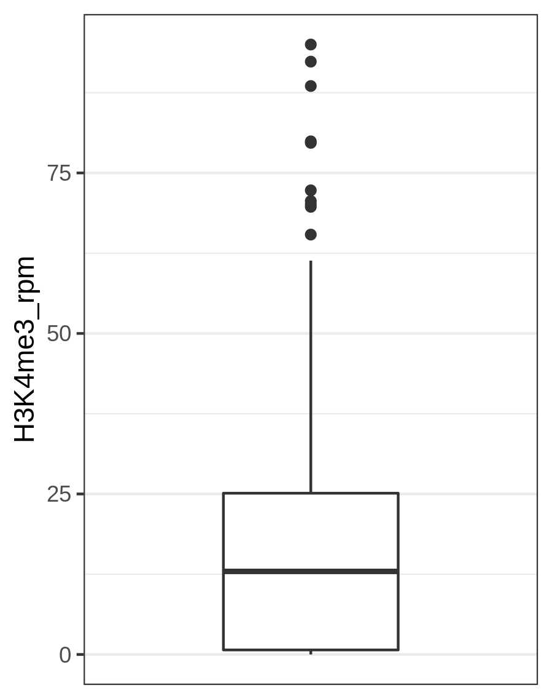
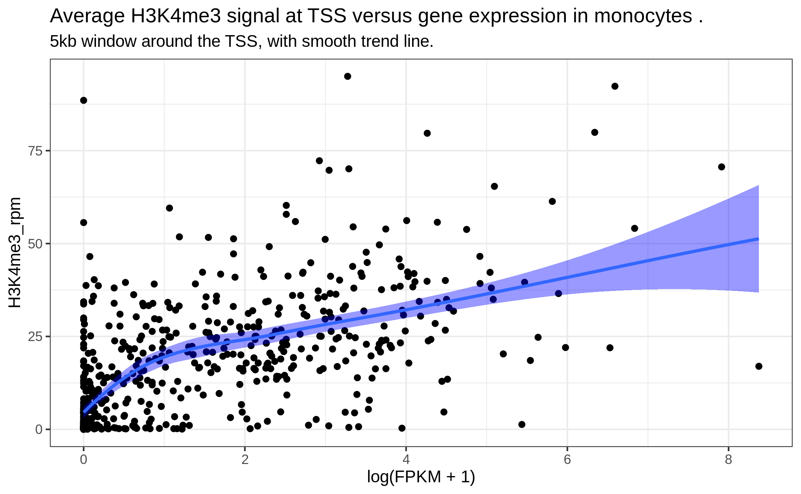
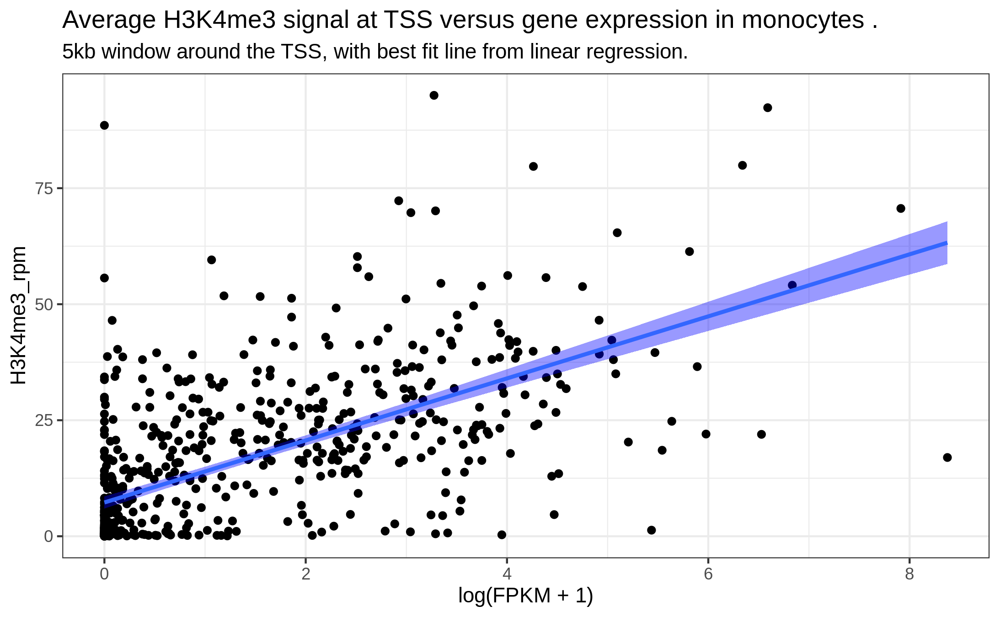
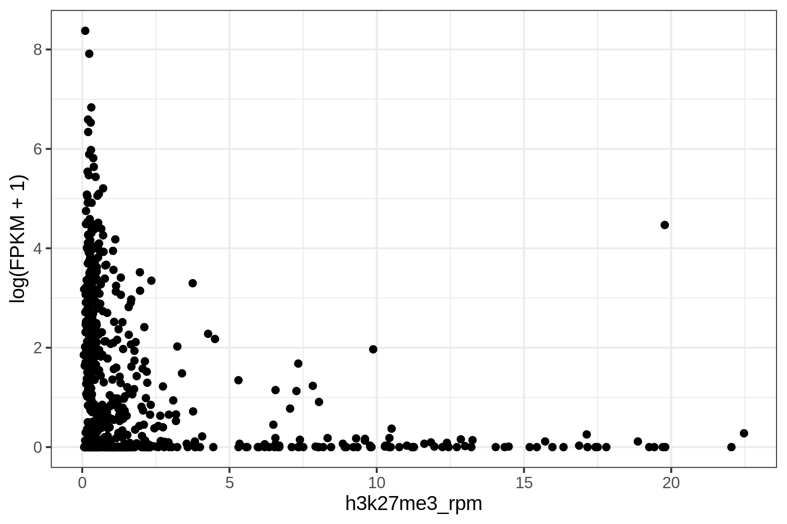
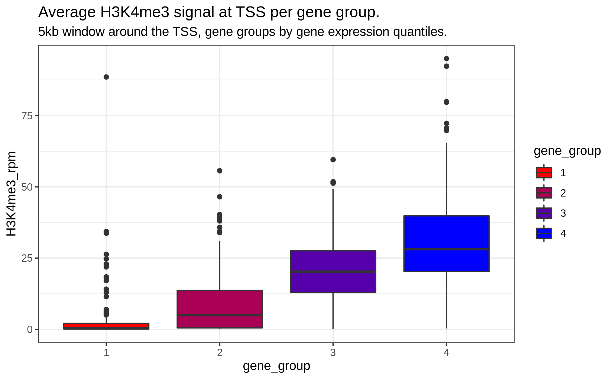
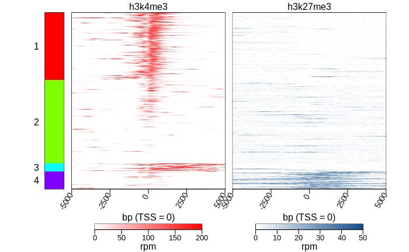
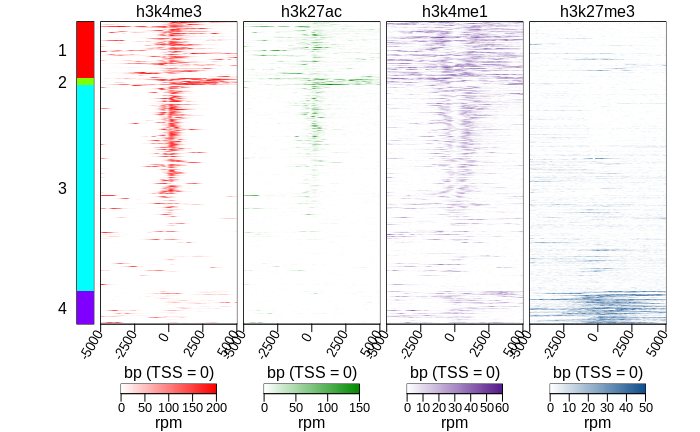
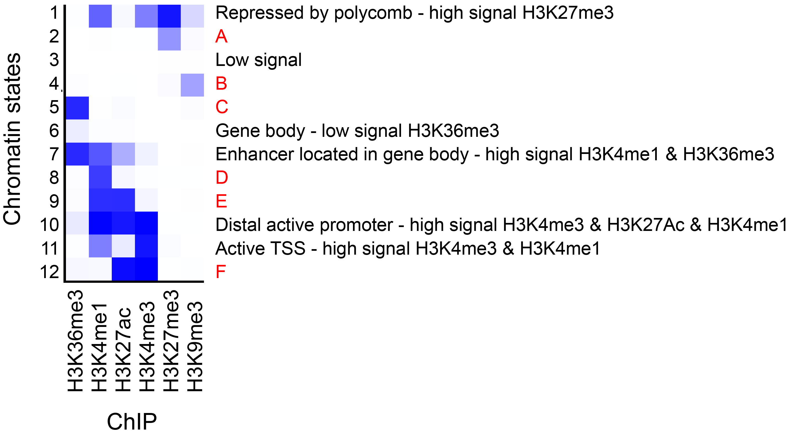

```{r setup, include=FALSE}
suppressPackageStartupMessages({
  library(learnr)     # 0.10.1.9006 (github)
  library(gradethis)  # 0.1.0.9004  (github)
  library(testthat)   # 3.0.0 
  library(tidyverse)  # 1.3.0
  library(learnr.proto)
  
  library(IRanges)
  library(GenomicRanges)
  library(rtracklayer)
  library(GenomicFeatures)
  library(genomation)
  library(ggthemes)
  #library(org.Hs.eg.db)
  
  
  # load the txdb package which holds transcript-based gene models of hg38 genome  
  library(TxDb.Hsapiens.UCSC.hg38.knownGene)
  txdb <- TxDb.Hsapiens.UCSC.hg38.knownGene 
  seqlevels(txdb) <- "chr19"
  
  # configuration
  knitr::opts_chunk$set(echo=FALSE, message=FALSE)
  gradethis::gradethis_setup()
  
  # data accessible to all exercises
  rdata = system.file("extdata", "week2.Rdata", package = "learnr.proto")
  load(rdata)
  monocytes_all <- unlist(monocytes_list)
  monocytes_all$chip <- names(monocytes_all)
  monocytes_list <- GRangesList(monocytes_list, compress=FALSE)
  rm(rdata)
  
  # chr19_windows_1bp <- tileGenome(seqinfo(txdb), tilewidth = 10, cut.last.tile.in.chrom =TRUE)
  tss_chr19 <- unique(promoters(genes(txdb), upstream=100, downstream=0)) 
  tss_chr19  <- resize(tss_chr19, width = 1, fix = "end")
  tss_chr19$name <- tss_chr19$gene_id
  
  # Load the sample of tss_chr19 and quantification_chr19 that correspond to the windows of which we have data in the bigwig files
  # those those for which we have data in bigwig files, see extdata/prepdata.Rmd)
  rdata = system.file("extdata", "week3.Rdata", package = "learnr.proto")
  load(rdata)
  rm(rdata)

  # # gene quantification chromosome 19  --- NOT USED in fg3, only in fg2
  # rdsfile <- system.file("extdata", "week2", "prepared_rds", "blueprint_c000s5_gene_quantification_chr19.rds", package = "learnr.proto")
  # quantification_chr19 <- readRDS(rdsfile)
  # quantification_chr19 <- quantification_chr19 %>% dplyr::rename(gene_id = entrezgene_id)
  
  ## bw file locations, see extdata/prepdata.Rmd for how these were generated. 
  bw_h3k4me3 <- system.file("extdata", "week3", "bw_chr19_tss_sample", "C000S5H2.ERX547984.H3K4me3.bwa.GRCh38.20150528.chr19_chr19tss_0.4ofGenes_10kb.bw", package = "learnr.proto")
  bw_h3k4me1 <- system.file("extdata", "week3", "bw_chr19_tss_sample", "C000S5H2.ERX547981.H3K4me1.bwa.GRCh38.20150528.chr19_chr19tss_0.4ofGenes_10kb.bw", package = "learnr.proto")
  bw_h3k27me3 <- system.file("extdata", "week3", "bw_chr19_tss_sample", "C000S5H2.ERX547983.H3K27me3.bwa.GRCh38.20150528.chr19_chr19tss_0.4ofGenes_10kb.bw", package = "learnr.proto")
  bw_h3k27ac <- system.file("extdata", "week3", "bw_chr19_tss_sample", "C000S5H2.ERX547980.H3K27ac.bwa.GRCh38.20150528.chr19_chr19tss_0.4ofGenes_10kb.bw", package = "learnr.proto")
  bw_h3k36me3 <- system.file("extdata", "week3", "bw_chr19_tss_sample", "C000S5H2.ERX547979.H3K36me3.bwa.GRCh38.20150528.chr19_chr19tss_0.4ofGenes_10kb.bw", package = "learnr.proto")
  
  ## color palettes for heatmaps
  # color palette for h3k4me3
  colors_h3k4me3 <- colorRampPalette(c ("white", "red"))(100)
  # color palette for h3k4me1
  colors_h3k4me1 <- colorRampPalette(c ("white", "purple4"))(100)
  # color palette for h3k27ac
  colors_h3k27ac <- colorRampPalette(c ("white", "green4"))(100)
  # color palette for h3k27me3
  colors_h3k27me3 <- colorRampPalette(c ("white", "dodgerblue4"))(100)
  # color palette for h3k36me3
  colors_h3k36me3 <- colorRampPalette(c ("white", "brown"))(100)
})
```

```{r timeout1, context="server"}
session$onSessionEnded(stopApp)

isolate({
  # obtain the session id
  # source 1: https://shiny.rstudio.com/reference/shiny/latest/session.html
  # source 2: https://stackoverflow.com/questions/18900955/get-environment-identifier-in-r
  session_id <- sub('<environment: (.*)>', '\\1', capture.output(session$userData))
  
  # # send the session ID to the log (indicates the tutorial is loaded)
  # write(paste0("Session ID: ", session_id), stderr())
  
  # send the session ID to the javascript chunk
  session$sendCustomMessage("session_id", session_id)
})

# stop the tutorial when "input[[session_id]]" is updated
observeEvent(input[[session_id]], ignoreNULL=TRUE, {
  write(paste0("\nTutorial terminated due to inactivity.\nRestart to continue where you left off!\n"), stderr())
  stopApp()
})
```

```{js timeout2}
// This chunk stops the tutorial if it has been idle for too long

// Situation: We need to stop inactive tutorials to prevent the server from grinding to a halt.
// Problem: refreshing the tutorial and closing the browser send the same signal to shiny.
// since we cannot distinguish the two, this signal cannot be used to stop the tutorial.
// Solution: Use a timeout system. 
// Method: this chunk will update shiny variable "input[[session_id]]" 
//   when the session has been running idle for longer than "timeoutSec" seconds.
// This signal is then be used by Shiny (server-side) to stop the session.

// source1: https://community.rstudio.com/t/keeping-track-of-idle-time-during-app-usage/1735
// source2: https://bookdown.org/yihui/rmarkdown/language-engines.html#javascript-and-css
$(function() {
  var timeoutSec = 20*60;
  var idleTimer;

  // receive this session's ID
  Shiny.addCustomMessageHandler("session_id", function(s_id) {
    session_id = s_id;  // assigns the variable globally
  });

  // assign session ID as reactive variable "input[[session_id]]" 
  function onTimeout() {
    alert("Tutorial stopped due to inactivity.\nRestart to continue where you left off!")
    Shiny.setInputValue(session_id, "TRUE");
  }

  function startIdleTimer() {
    if (idleTimer) clearTimeout(idleTimer);
    idleTimer = setTimeout(onTimeout, timeoutSec * 1000);
  }
  
  $(document).on('shiny:message shiny:inputchanged', startIdleTimer);

})();
```

## 3.1 Introduction   
In week 2 we quantified and visualized the overlap between histone peaks and promoters and examined the association with gene expression. Although informative, we have been ignoring the actual ChIP-seq signal strengths altogether.  
<br>
This week you will investigate the relationship between histone PTMs and gene expression further by including ChIP-seq signals in your analyses. You will generate plots displaying the distribution of ChIP-seq signal around certain genomic positions, here a set of promoter regions to answer common questions like: "*What is the signal of the mark around the TSS?*", "*What is the relationship between histone ChIP-seq signal intensity and gene expression?*".  
<br>
These plots include an average signal profile and a heatmap representation. You could use dplyr-related functions and ggplot-ting to achieve this but it is much more convenient to use dedicated tools for these tasks.   
<br>
We have chosen for the [genomation](https://github.com/BIMSBbioinfo/genomation) package for this purpose because it is compatible with the file types that we have available. (Side note: there are a number of other packages to analyze ChIP-seq data we well. Incl. ChIPpeakAnno and ChIPseeker.)   
<br>
We have installed and loaded this package for you with the following code:  
```{r install_genomation, echo = T, eval =FALSE}
BiocManager::install("genomation")
library(genomation)
```

### Tutorial specs  
The exercises in this tutorial are similar to those in fg2. A brief reminder:  

- For some longer coding exercises, we left blanks as '___' that indicate where in the code you should fill in a function, object or variable. Make sure you **fill out all the blanks before hitting 'Run Code' or 'Submit Answer'**. If you leave even a single '_', this will result in errors that may be difficult to interpret.  
- Hit `Hint` (when provided) for clues. Due to technical reasons **you can't always go back to previous hints so make sure you read them well!**       
- Hit `Run Code` to test your code and preview the output (but make sure no '_' are left).  
- Hit `Submit Answer` (if present) to submit the code (make sure no '_' are left) for evaluation.    
- For some complete-the-code exercises, automated code-checking is enabled. You can recognize these exercises by the addition of '(code check)' to the exercise. In these cases, R will give custom feedback that helps you correct your code.  
- Try to keep yourself from hitting `Solution` (when provided). This is option is provided for '(code check)' exercises. Only use it when you do not understand the automatic feedback given by R.   
- Hit `Start Over` to remove any adjustments you made and start again.   

Although we ask for specific answers or completion of specific code, you are encouraged to test your own code and use `Run Code` and `Start Over`. I.e., remove the pre-coded code and write your own code for a different graph or different summary of the data. Use `Run Code` to preview the results. Unfortunately these self-thought of codes can not be evaluated. For the evaluation you need to use our pre-coded code. Hit `Start Over` to get this pre-coded code.  

#### **Used resources**   

- Data were obtained from the [BLUEPRINT data portal](http://dcc.blueprint-epigenome.eu/#/home).    
- Akalin A, Franke V, Vlahovicek K, Mason C, Schubeler D (2014). “genomation: a toolkit to summarize, annotate and visualize genomic intervals.” Bioinformatics. doi: 10.1093/bioinformatics/btu775.  
- [Genomation package vignette](http://bioconductor.org/packages/release/bioc/vignettes/genomation/inst/doc/GenomationManual.html).   
- [ChromHMM Tutorial by Jason Ernst](https://www.genome.gov/Multimedia/Slides/ENCODE_ASHGTutorial_Oct2015/07_Ernst.pdf)  


### 3.1.1 Learning Objectives  

> At the end of week 3 you are able to:  
> 
1. Identify the nearest TSS to a histone ChIP-seq peak.  
3. Plot the distribution of distances between ChIP-seq peaks and the nearest TSS.      
2. Import coverage data from bigwig files into r.  
4. Plot the average histone ChIP-seq signal around a genomic feature like the TSS.  
5. Plot the relationship between the average ChIP-seq signal at the TSS and gene expression.   
6. Plot ChIP-seq signal around a genomic feature in a heatmap figure.  
7. Order the heatmap of (6) by gene expression.  
8. Cluster the heatmap of (6) based on ChIP-seq signals of different marks.  
9. Optionally, back-analyze chromHmm output, in other words, heatmap summary of signal intensities of the different marks in chromHMM defined regions. Regions are labelled 1-12, can you, using the sig
  
## 3.2 Identify nearby TSSs  
### 3.2.1 Identify the nearest TSS   
First, let's identify the nearest TSS and plot the distance between a histone mark and its nearest TSS (in contrast to identifying strict overlap as in **fg2**).  

### Exercise 1    
Identify the nearest TSS for each H3K4me3 peak in monocytes.   

> **Exercise 1a**: Recap, which of the commands below imports the peaks table into a GRanges object?  

```{r q1_mc_import}
question("Which function imports the H3K4me3 peaks into a GRanges object?",
         answer("import(\"H3K4me3.bwa.GRCh38.chr19.bed\", format = \"narrowPeak\")", correct =TRUE),
         answer("import(\"H3K4me3.bwa.GRCh38.chr19.bed\", format = \"BED\")", message = "BED is not the right format."),
         answer("import(\"H3K4me3.bwa.GRCh38.chr19.bed\", format = \"broadPeak\")", message = "check the file format."),
         answer("read.table(\"H3K4me3.bwa.GRCh38.chr19.bed\", format = \"broadPeak\")", message = "read.table parses the data into a data.frame while we asked for a GRanges object."),
         allow_retry =TRUE,
         random_answer_order =TRUE)
```

### Exercise 1b  
To identify the nearest TSS, you use the `distance2NearestFeature()` function:   

```{r nearestfeature_example, eval=FALSE, echo=TRUE}
distance2NearestFeature(g.idh = [chip_peaks_in_GRanges], 
                        tss = [TSSs_in_GRanges])  
```

The output is a data.frame reporting for each range in the `g.idh` object:  

- its nearest TSS  
- the name of the corresponding peak and gene.  
- the distance between them. 

The fact that the output is a data.frame makes it easy for us to manipulate and plot the results with dplyr and ggplot2.      

> **Exercise 1b**: Identify the nearest TSS for each H3K4me3 ChIP-seq peak.  
> 
- TSS locations are stored in object `tss_chr19`.  
- H3K4me3 peaks in monocytes are stored in `monocytes_h3k4me3`.   
- Print the head of the resulting object to the console using `head()`.     

```{r q1_distancetss, exercise =TRUE, exercise.lines = 5, exercise.eval =FALSE, error = TRUE}
# Identify the nearest TSS for each H3K4me3 peak  
dist_h3k4me3_to_tss <- __(g.idh = __, tss = __)

# Show the resulting object 

```

```{r q1_distancetss-hint-1}
# use the function
distance2NearestFeature()
```

```{r q1_distancetss-hint-2}
# within distance2NearestFeature define g.idh as:
g.idh = monocytes_h3k4me3
```

```{r q1_distancetss-hint-3}
# and tss as:
tss = tss_chr19
```

```{r q1_distancetss-hint-4}
# finish with
head(dist_h3k4me3_to_tss)
```

```{r q1_distancetss-check}
grade_result(
  pass_if(~identical(.result, head(distance2NearestFeature(monocytes_h3k4me3, tss_chr19))))
)
```

The `dist_h3k4me3_to_tss` reports for each H3K4me3 peak a nearest TSS. In total `r length(unique(distance2NearestFeature(monocytes_h3k4me3, tss_chr19)$feature.name))` different TSSs are reported, meaning that some peaks are assigned to the same TSS. *Which variable reports the distance between the peak and its nearest TSS?*       
<br>

>#### **Optional check**:  
<details><summary>Curious to check the matches in the genome browser? Click here for a quick how-to:</summary>   
<br>
You may want to check some of the matches. For example to check that positive distances are indeed peaks that are located *downstream* the TSS. To do so...  
1. View a part of the output of `dist_h3k4me3_to_tss`. For example, peaks with `dist.to.feature` above 1kb, sorted by distance, showing only the top 5 of the output by running: `dist_h3k4me3_to_tss %>% filter(dist.to.feature >= 1000) %>% arrange(dist.to.feature) %>% slice_head(n=5)`   
2. The first row reports:     
  `r distance2NearestFeature(monocytes_h3k4me3, tss_chr19) %>% filter(dist.to.feature >= 1000) %>% arrange(dist.to.feature) %>% slice_head(n=2) %>% slice_tail(n=1)`  
3. You can either look up the gene id ('feature.name' variable) in the [ncbi gene database](https://www.ncbi.nlm.nih.gov/gene/) and use the gene symbol to navigate to the right location in the UCSC genome browser.  
3. Or subset `monocytes_h3k4me3` with the given index in the 'target.index' column (805): `monocytes_h3k4me3[805]`.  
4. Go to the UCSC Genome Browser.  
5. Upload the monocytes trackhub (same as fg1): `http://mbdata.science.ru.nl/ctoenhake/edu/trackhub_monocytes/hub.txt`.    
  + Go to the tab "My Data" in the top menu.  
  + Select "Track Hubs".   
  + In the "My hubs" tab you can paste the above URL.  
  + You need to change the visibility of the tracks with "monocyte_H3K4me3_peaks" from "hide" to "pack". This can be done below the browser view. Remember to hit `Refresh`.  
6. Navigate to the gene from step 3 or the genomic region of step 4.  
  + In this example: `chr19:11577771-11577970`.    
7. Zoom out and observe or measure the location of the peak in relation to the TSS of the gene given in step 3. The name of the peak is given in the output of step 4.   
8. This confirms that **positive dist.to.feature values indicate that the H3K4me3 peaks is located *downstream* the TSS**.  
</details>  

### 3.2.2 Plot distances between ChIP peaks and features  
Having identified the nearest TSS for each H3K4me3 peak, you will summarize the distances between H3K4me3 peaks and TSSs.   

### Exercise 2   

> **Exercise 2a:** Print a summary of the distances reported in `dist_h3k4me3_to_tss` using the `summary()` function.
> 
> * Tip: Look at the output from exercise 1b to identify the variable that stores the distances.   

```{r prepare_q2a, echo =FALSE}
 dist_h3k4me3_to_tss <- distance2NearestFeature(monocytes_h3k4me3, tss_chr19)
```

```{r q2a_summary, exercise =TRUE, exercise.eval =FALSE, error = T, exercise.setup = "prepare_q2a"}
# print a summary of the distances

```

```{r q2a_summary-hint-1}
# We want a summary of 
dist_h3k4me3_to_tss$dist.to.feature
```

```{r q2a_summary-check}
grade_result(
  pass_if(~identical(.result,summary(dist_h3k4me3_to_tss$dist.to.feature)))
)
```

### Exercise 2b  

> **Exercise 2b:** Plot the distances from `dist_h3k4me3_to_tss` using ggplot() and geom_histogram() and answer the multiple-choice question below.     
>
> * With the summary of exercise 2a in mind, play around with the `binwidth  =` parameter in `geom_histogram()`. 

>#### **Refresher**: histograms   
<details><summary>Click here for a quick explainer on histograms and the importance of the bin width or bandwidth.</summary>   
**Histograms** visualize the distribution of a single variable. Events are grouped into bins with comparable values and the number of events per bin is counted and these counts are visualized.  
<br>
Because histograms are made by binning the data, the bin width is a critical parameter that will affect the appearance of the graph. Choosing a bin width that is too small will result in a overly busy and peaky histogram making it difficult to discern the main trends. If the bin width is too large, then smaller features of the distribution may dissapear.  
<br>
In practice, if you generate a histogram, always explore multiple bin widths besides the default settings.   
<br>
In geom_histogram(), the bin width can be set by:  
> 
- Specify the parameter "binwidth", eg `binwidth = 5`   
- Specify the parameter "breaks", eg `breaks=seq(20, 50, by=2)` or `breaks=c(0,100,200)`  
</details>  

```{r q2b_plotdistances, exercise =TRUE, exercise.eval =FALSE, error = T, exercise.setup = "prepare_q2a"}
# plot the distances as histogram with ggplot
ggplot(___)+
  geom_histogram(aes(x= ___), binwidth = __)
```

```{r q2b_plotdistances-hint-1}
# use the output from exercise 1b as the input for ggplot
```

```{r q2b_plotdistances-hint-2}
# plot the distance on the x axis
```

```{r q2b_plotdistances-hint-3}
# ie 
ggplot(dist_h3k4me3_to_tss)+
  geom_histogram(aes(x=dist.to.feature))
```

```{r q2b_plotdistances-hint-4}
# try binwidths of 10kb or 100kb, for example:
ggplot(dist_h3k4me3_to_tss)+
  geom_histogram(aes(x=dist.to.feature), binwidth = 1000)
```

```{r q2b_plotdistances_mc}
question("Which of the following statments are correct?",
         answer("Over 50% of the datapoints fall within 10kb up- or downstream the TSS", correct = T, message = "Indeed, over 50% of H3K4me3 peaks are within +/- 10kb of the TSS. But also notice the  outliers we are having: peaks are assigned to TSSs that are over 100kb away! These might be peaks in enhancers that are due to cross-reactivity of the antibody or chromosomal looping."),
         answer("Less than 50% of the datapoints fall within 10kb up- or downstream the TSS", message= "Review the output of question 2a. Take a carefull look at the 1st and 3rd Quartile values."),
         answer("A binwidth of 100kb, givs us the nicest histogram with sufficient detail but not too peaky.", message = "Try again, 100kb is a bit too large in this case."),
         answer("A binwidth of 10kb, givs us the nicest histogram with sufficient detail but not too peaky.", correct=TRUE),
         allow_retry=TRUE
         )
```

## 3.3 ChIP-seq signal strength     
Distance and overlap may tell you which gene and/or regulatory element the mark is most likely associated with. As we for example observed in fg2: the presence and absence of H3K4me3 and H3K27me3 at a gene's promoter is associated with gene expression. But there is more to it!  
<br>
Not only the presence or absence but the actual signal from ChIP-seq marks can be associated with the expression level of the gene in question. Such associations between ChIP-seq signal strength and gene expression - being it positive or negative associations - point to a functional relationship. Think of the ChIP-seq mark recruiting basal transcription factors or the deposition of marks by proteins recruited by the transcriptional machinery in elongation mode.  
<br>
In both cases you will observe a positive association between ChIP-seq signal strength and gene expression. In research, such observations (or the absence thereof) can help you decide on the direction and design of follow-up experiments.   
<br>
These relationships between signal intensity and gene expression may have already been discussed in your Epigenomics lectures. Let's look at how they look in real data.   

### 3.3.1 Importing ChIP-seq signal strength in r   
The ChIP-seq signal can be obtained from the data stored in .bam files or from .bigwig files. Remember from week 1, .bam files contain records of read alignments with 1 line per read. The .bigwig files do not store individual reads but the coverage across the genome, often normalized per million mapped reads.   
<br>
Not all packages and functions are compatible with both file types and the resulting plots may look differ in resolution in part because .bam files - as they store read information -  give you more freedom to define how coverage is calculated. However, as BLUEPRINT only provides the .bigwig files we will use those today and not the .bam files.   
<!-- REF: https://www.bioconductor.org/packages/release/bioc/vignettes/genomation/inst/doc/GenomationManual.html#4_Extraction_and_visualization_of_genomic_data   -->
<br>
We limited the data stored in the bigWig files to a **10kb window around the TSSs of 40% of genes (randomly selected) on chromosome 19**. This was done to reduce the size of these files (bigWig and .bam files are huge!) and speed up the tutorial a bit. We have made sure that this random selection still reflects the genome-wide relationships. However, because of this decision you can't make plots of other or wider windows than 10kb.   

### Exercise 3  
You will plot the average H3K4me3 ChIP-seq signal strength around the TSSS.  

A trick that prevents loading complete bigWig files in your environment is to load only the the regions of interest; in this case the window around the TSS. You load the signal in a "ScoreMatrix" object with the `ScoreMatrix()` function from the genomation package:  

```{r scorematrixcode, eval=FALSE, echo=TRUE}
ScoreMatrix(target = [path to bigwig file], 
            windows = [GRanges object with intervals of interest], 
            type = "bigWig", 
            strand.aware = [TRUE/FALSE], 
            ...)
```

* To take the strand of the TSS into account, we set `strand.aware=TRUE`.   
* Every row in the resulting ScoreMatrix object corresponds to a window of the `[regions of interest]`.  
* Every column in the resulting ScoreMatrix object is a bp within that window (see the image below).   
* `...` means that there are additional, optional arguments, some of which we will come back to later.    

  {width=50%}\   
  *Modified from [GenomationManual](https://www.bioconductor.org/packages/release/bioc/vignettes/genomation/inst/doc/GenomationManual.html#1_Introduction): Wikipedia, Gene Structure*

<br>   
The GRanges object `tss_chr19_sample` contains the TSSs (1bp) of which we also have data in the bigwig files. The window is currently 1bp but we want to plot the signal *around* the TSS. To do so, we resize these 1bp intervals with the `resize()` function from the GenomicRanges package:  

```{r resizexcode, eval=FALSE, echo=TRUE}
resize(x = [GRanges object], width = [desired width], fix = ["start", "end" or "center"])
```

* If we want a window of 20kb around the TSS, use `width = 200001` to include the TSS (1bp extra).  
* As we want to have a window *around* the TSS we set the `fix = "center"`.  

> **Exercise 3a**: Run the code below to obtain the H3K4me3 signal in a 10kb window around the TSSs **and** answer the multiple-choice question below.  
>
> * The object `bw_h3k4me3` directs to the H3K4me3 ChIP-seq BigWig file.  
> * Hit "Run Code" to view the structure of the resulting ScoreMatrix object.   

```{r q3a_h3k4me3_scores, exercise=TRUE, exercise.eval=FALSE, error=TRUE}
# define the window size  
window <- 10001

# resize the tss interval to this window.
tss_window <- resize(tss_chr19_sample, width = window, fix = "center")

# create H3K4me3 ScoreMatrix for these intervals.
# strand.aware=TRUE takes into account the strand of the TSS. 
scores_h3k4me3_tss <- ScoreMatrix(target = bw_h3k4me3, windows = tss_window, type = 'bigWig', strand.aware =TRUE)  

# what structure is scores_h3k4me3? Hit "Run code" to view the result. 
str(scores_h3k4me3_tss)
```

```{r q3a_mc_h3k4me3_scores}
question("What is the 'class' of the resulting object 'scores_h3k4me3_tss'?",
         answer("ScoreMatrix", correct =TRUE, message = "The object `scores_h3k4me3_tss` is of formal class ScoreMatrix, which is related to a basic matrix but - as it says - 'more formal'. In other words, it has special functions to retrieve and set the data. We won't go into the details of these differences with basic matrices but focus on how we can use this result."),
         answer(".Data", message = "It is not a .Data. The '.Data' is a so-called slot within the 'scores_h3k4me3_tss' object but is not its class. Review the output of the 'str(scores_h3k4me3_tss)' again."),
         answer("List", message = "It is not a List. Review the output of the 'str(scores_h3k4me3_tss)' again."),
         answer("matrix", message = "It is not a matrix. Review the output of the 'str(scores_h3k4me3_tss)' again."),
         allow_retry =TRUE,
         random_answer_order =TRUE)
```

The object `scores_h3k4me3_tss` is of formal class ScoreMatrix, which is related to a basic matrix but - as it says - "more formal". In other words, it has special functions to retrieve and set the data. We won't go into the details of these differences with basic matrices but focus on how we can use this result.  

### 3.3.2 Plot the average H3K4me3 signal around the TSS   
You can plot the average H3K4me3 signal over these windows using this ScoreMatrix. To do so, you use the `plotMeta()` function:   

```{r plotmeta_example, eval=FALSE, echo=TRUE}
plotMeta(mat = [ScoreMatrix_object], xcoord = c([start,end]), ...)
```  

* Use the `xcoord =` parameter to define relative base positions for the x-axis and set the TSS at base '0'.   
* `...` means that there are additional, optional arguments, some of which will come back later on.   

<br>

> **Exercise 3b**: Plot the H3K4me3 signal stored in "scores_h3k4me3_tss" from exercise 3a.   
>
> * Note that we set `xcoord = c(-5000, 5000)` for you, as our window was 10kb.  
> * Hit "Subit Answer" to submit your code.  
> * Hit "Run Code" to view the plot (necessary for exercise 3c).   

```{r prepare_q3b}
tss_window <- resize(tss_chr19_sample, width = 10001, fix = "center")
scores_h3k4me3_tss <- ScoreMatrix(target = bw_h3k4me3, windows = tss_window, type = 'bigWig', strand.aware =TRUE) 
```


```{r q3b_h3k4me3plot, exercise =TRUE, exercise.eval=FALSE, error=TRUE, exercise.setup = "prepare_q3b"}
# Generate a plot showing the average H3K4me3 signal over a 10kb window around the TSS
___(mat = ___, xcoord = c(-5000, 5000))
```

```{r q3b_h3k4me3plot-hint-1}
# In the "mat =" parameter you should give the ScoreMatrix object which holds the scores to be plotted.....  
```

```{r q3b_h3k4me3plot-hint-2}
# ....in other words, the output of exercise 3a
```

```{r q3b_h3k4me3plot-hint-3}
# Eg 
___(mat = scores_h3k4me3_tss, .....)  
```

```{r q3b_h3k4me3plot-hint-4}
# the function to make the plot is
plotMeta()
```

```{r q3b_h3k4me3plot-check}
grade_result(
  pass_if(~identical(.result, plotMeta(mat = scores_h3k4me3_tss, xcoord = c(-5000, 5000))))
)
```

Clearly, we could have restricted the plot tp the region +/- 3kb the TSS as the H3K4me3 signal remains near 0 read per million outside that region.   

>**Exercise 3c**: Use the plot above to answer the following questions.    

```{r q3c_mc_densityplot}
quiz(caption="",
  question("Which function would you change and how, to make sure that the signal is limited to +/-3kb around the TSSs in the plot?",
         answer("Change the xcoord parameter in 'plotMeta', set it to c(-3000, 3000).", message = "Changing the xcoord parameter only changes the thickmarks on the x-axis but does not change the actual window size of the interval."),
         answer("Filter the ScoreMatrix 'scores_h3k4me3_tss' for columns c(-3000, 3000).", message = "We could filter the matrix indeed but these are not the correct columns as there are no 'negative' columns."),
         answer("Change the width parameter in 'resize', set it to 6001.", correct = T),
         allow_retry = T,
         random_answer_order = T), 
     question("Is H3K4me3 signal equally strong before and after the TSS or is there a difference?",
              answer("H3K4me3 signal appears equal up- and downstream the TSS.", message = "Look at the plot, the y-axis gives the H3K4me3 signal, the TSS is located at x=0."),
              answer("H3K4me3 signal is lower downstream the TSS compared to upstream.", message = "Review what is 'upstream' and what is 'downstream'."),
              answer("H3K4me3 signal is higher downstream the TSS", correct = T, message = "Indeed, H3K4me3 signal is on average higher downstream the TSS."),
              allow_retry = T),
     # question("What would the plot show, in case you would have set 'strand.aware=FALSE' in the 'ScoreMatrix()' function? Tip: You can adjust the code from 3a and 3b and try it.",
     #          answer("H3K4me3 signal appearing equal up- and downstream the TSS", correct = T, message = "As TSS are randomly distributed over strands, setting strand.aware to FALSE will lead to a plot where H3K4me3 signal appears equally strong before and after the TSS while in reality it is stronger downstream the TSS."),
     #          answer("H3K4me3 signal would appear lower downstream the TSS compared to upstream.", message = "Realize that randomly distributed over strands while the H3K4me3 signal around the TSS is related to the directionality."),
     #          answer("H3K4me3 signal would appear higher downstream the TSS", message = "Realize that randomly distributed over strands while the H3K4me3 signal around the TSS is related to the directionality."),
     #          allow_retry = T),
     question("What could explain the slight decrease in signal at pos. 0?", 
              answer("The nucleosome depleted region found at the TSS of transcribed genes.", correct = T),
              answer("The binding of specific TFs at the TSS."),
              answer("The TSS itself is marked by H3K4ac instaed of H3K4me3"),
              allow_retry = T)
)
```

### 3.3.3 Add H3K27ac signal   
Let's look at another promoter mark: does H3K27ac show the same shape and signal strength?  

### Exercise 4   

> **Exercise 4**: Generate a plot of the average H3K27ac signal in a **10kb** window around the TSS.  
> 
> * The object `tss_window` of exercise 3a has been loaded for you.  
> * The object `bw_h3k27ac` directs to the H3K27ac ChIP-seq BigWig file.  

```{r prepare_q4, echo=FALSE}
# resize the tss interval to this 10kb+1bpTSS
tss_window <- resize(tss_chr19_sample, width = 10001, fix = "center")
```

```{r q4_h3k27ac_density, exercise=TRUE, exercise.eval=FALSE, error=TRUE, exercise.setup="prepare_q4"}
# Create H3K27ac ScoreMatrix for the 10kb TSS windows.
scores_h3k27ac_tss <- ScoreMatrix(target = ___,
                                   windows = ___, 
                                   type = 'bigWig', strand.aware =TRUE)  

# Generate the plot with average H3K27ac scores 
___(___, xcoord = c(-5000, 5000))
```

```{r q4_h3k27ac_density-hint-1}
# "target =" should direct to the bigwig file. 
```

```{r q4_h3k27ac_density-hint-2}
# Eg 
ScoreMatrix(target = bw_h3k27ac, .....)  
```

```{r q4_h3k27ac_density-hint-3}
# And the "windows =" to the GRanges object with the intervals
```

```{r q4_h3k27ac_density-hint-4}
# Eg 
ScoreMatrix(target = bw_h3k27ac, windows = tss_window, ....)  
```

```{r q4_h3k27ac_density-hint-5}
# You can copy-paste and adjust the plotMeta() function from exercise 3b to make the plot. 
```

<!-- ```{r q4_h3k27ac_density-solution} -->
<!-- # create H3K27ac ScoreMatrix for the 10kb TSS windows. -->
<!-- scores_h3k27ac_tss <- ScoreMatrix(target = bw_h3k27ac, windows = tss_window, type = 'bigWig', strand.aware =TRUE)   -->

<!-- # Generate the plot with average H3K27ac scores t -->
<!-- plotMeta(scores_h3k27ac_tss, xcoord = c(-5000, 5000)) -->
<!-- ``` -->


```{r q4_h3k27ac_density-check}
grade_result(pass_if(~identical(.result,plotMeta(scores_h3k27ac_tss, xcoord = c(-5000, 5000)))))
```

```{r q4_h3k27ac_density_mc}
question("Compared to the average score profile of H3K4me3, the H3K27ac profile ... (select the correct statement)",
         answer("shows, on average, stronger signal scores around the TSS.", message = "The signal scores are plotted on the y-axis of the plot. Compare the values in plot from ex 3 with t he latest plot. Tip, look at the scale of  the y-axis."),
         answer("shows, on average, weaker signal scores around the TSS.", correct = T, message = "To compare two profiles, you can plot them in one plot. Let's do that!"),
         answer("shows, on average, a wider region of enrichment around the TSS.", message = "Based on these two plots, the H3K27ac is not clearly wider on average than H3K4me3. Tip, look at the scale of  the y-axis."),
         answer("shows, on average, a more narrow region of enrichment around the TSS.", message = "Based on these two plots, the H3K27ac is not clearly narrower on average than H3K4me3. Tip, look at the scale of  the y-axis."),
         allow_retry=TRUE,
         random_answer_order=TRUE
         )
```

### 3.3.4 Multiple density profiles in one plot  
We can observe  differences and similarities better when plot the two marks in one plot. This can be achieved by generating a "ScoreMatrixList" object and providing that to the `plotMeta()` function:    

```{r example_scorematrixlist, echo=TRUE, eval=FALSE}
# 1. Generate a "ScoreMatrixList" object:   
ScoreMatrixList_object <- new("ScoreMatrixList",list([object1_name]=[ScoreMatrix_1], ..., [objectN_name]=[ScoreMatrix_N]))

# 2. Provide plotMeta with this "ScoreMatrixList":   
plotMeta(mat = ScoreMatrixList_object, 
         xcoord = c([start,end]),
         overlay = [TRUE/FALSE], 
         profile.names = [vector of names, used in the legend])
```

* With `overlay=TRUE` the two density profiles are plotted in one plot.   
* With `overlay=FALSE` the two density profiles are plotted in separate plots with the same x- and y-axis limits and scales.  
* In `profile.names =` you can give a character vector of names, for every ScoreMatrix in the ScoreMatrixList. These names will be used for the legend.   

### Exercise 5  

> **Exercise 5**: Complete the code below to generate one plot with the average signal profiles of H3K4me3 and H3K27ac in a 10kb window around the TSS.  
> 
> * The objects `scores_h3k4me3_tss` and `scores_h3k27ac_tss` of [Exercise 3] and [Exercise 4] are available to you.   

```{r prepare_q5, echo=FALSE}
tss_window <- resize(tss_chr19_sample, width = 10001, fix = "center")
# scores for h3k4me3
scores_h3k4me3_tss <- ScoreMatrix(target = bw_h3k4me3, windows = tss_window, type = 'bigWig', strand.aware =TRUE) 

# scores for h3k27me3 
scores_h3k27ac_tss <- ScoreMatrix(target = bw_h3k27ac, windows = tss_window, type = 'bigWig', strand.aware =TRUE)  
```

```{r q5_overlay, exercise=TRUE, exercise.eval=FALSE, error=TRUE, exercise.setup="prepare_q5"}
# 1. generate a ScoreMartixList of "scores_h3k4me3_tss" and "scores_h3k27ac_tss" 
# (of exercise 3 and 4)
scores_h3k4me3_h3k27ac <- new("ScoreMatrixList", list(h3k4me3=___, h3k27ac=___))

# 2. generate the plotMeta with overlay
plotMeta(mat = ___,
         xcoord = ___,
         overlay = ___,
         profile.names = c("H3K4me3", "H3K27ac"))
```

```{r q5_overlay-hint-1}
# In (1), place the objects "scores_h3k4me3_tss" and "scores_h3k27ac_tss" at the correct 'blank' locations. 
```

```{r q5_overlay-hint-2}
# (2) is similar to plotMeta() functions you have seen in ex. 3 and 4 
# but this time you have to define the `xcoord=` yourself
# and set 'overlay=' to TRUE or FALSE
```

<!-- ```{r q5_overlay-solution} -->
<!-- scores_h3k4me3_h3k27ac <- new("ScoreMatrixList", list(h3k4me3=scores_h3k4me3_tss, h3k27ac=scores_h3k27ac_tss)) -->

<!-- plotMeta(scores_h3k4me3_h3k27ac, xcoord = c(-5000, 5000), overlay = TRUE, profile.names = c("H3K4me3", "H3K27ac")) -->
<!-- ``` -->

```{r q5_overlay-check}
grade_result(pass_if(~identical(.result,plotMeta(scores_h3k4me3_h3k27ac, xcoord = c(-5000, 5000), overlay = TRUE, profile.names = c("H3K4me3", "H3K27ac")))),
             correct = "Now we clearly see the differences between the average signals of H3K4me3 and H3K27ac at the TSS.")
```
<br>
So far you have examined the average enrichment of ChIP marks with very narrow peaks. Let's add a mark that showed a 'broad' ChIP peaks in the genome browser: **H3K27me3**.  

### 3.3.5 Add H3K27me3 signal    
### Exercise 6  
You will add the H3K37me3 profile to the above plot.    

> **Exercise 6**:   
>
> 1. Generate a ScoreMatrix object with the H3K37me3 signal in a 10kb window around the TSS, 
> 2. make a new ScoreMatrixList with scores of H3K4me3, H3K27ac and H3K27me3 (*must be in this specific order for your answer to be graded as correct due to technical reasons*)
> 3. plot these three profiles with `plotMeta()`.  
> 
> * The object `bw_h3k27me3` directs to the location of the H3K27me3 BigWig file.   
> * The object `tss_window` of [Exercise 3a] is available again.     
> * The scores of H3K4me3 and H3K27ac are available in resp. `scores_h3k4me3_tss` and `scores_h3k27ac_tss`.  

```{r prepare_6a, echo=FALSE}
tss_window <- resize(tss_chr19_sample, width = 10001, fix = "center")

# scores for h3k4me3
scores_h3k4me3_tss <- ScoreMatrix(target = bw_h3k4me3, windows = tss_window, type = 'bigWig', strand.aware =TRUE) 

# scores for h3k27ac  
scores_h3k27ac_tss <- ScoreMatrix(target = bw_h3k27ac, windows = tss_window, type = 'bigWig', strand.aware =TRUE)
```


```{r q6a_addh3k37me3, exercise=TRUE, exercise.eval=FALSE, error=TRUE, exercise.lines=9, exercise.setup="prepare_6a"}
# 1. Create H3K27me3 ScoreMatrix for the 10kb windows around the TSS.
scores_h3k27me3_tss <- ScoreMatrix(target = ___, windows = ___, type = 'bigWig', strand.aware =TRUE)  

# 2. Create a new ScoreMatrixList object  
scores_h3k4me3_h3k27ac_h3k27me3 <- ____

# 3. Plot the average scores of these 3 marks with plotMeta()
# define overlay=TRUE 
# and fit the names in "profile.names=" with the order of objects in the ScoreMatrixlist object
plotMeta(____, profile.names = c("H3K4me3", "H3K27ac", "H3K27me3"))))
````

```{r q6a_addh3k37me3-hint-1}
# Look at exercises 3 and 4 to help you with the ScoreMatrix() function
```

```{r q6a_addh3k37me3-hint-2}
# Look at exercise 5 if you do not know how to create the ScoreMatrixList object
```

```{r q6a_addh3k37me3-hint-3}
# Look at exercise 5 if you do not know how to plot the ScoreMatrixList object
```

```{r q6a_addh3k37me3-hint-4}
# Start step 2 with
scores_h3k4me3_h3k27ac_h3k27me3 <- new("ScoreMatrixList", list(h3k4me3=scores_h3k4me3_tss, .... ))
```

```{r q6a_addh3k37me3-hint-5}
# Complete step 2:
scores_h3k4me3_h3k27ac_h3k27me3 <- new("ScoreMatrixList", list(h3k4me3=scores_h3k4me3_tss, h3k27ac=scores_h3k27ac_tss, h3k27me3=scores_h3k27me3_tss))
```

```{r q6a_addh3k37me3-hint-6}
# Start step 3 with
plotMeta(scores_h3k4me3_h3k27ac_h3k27me3, xcoord = c(-5000, 5000), overlay = TRUE, profile.names = .....)
```


<!-- ```{r q6a_addh3k37me3-solution} -->
<!-- # Create H3K27me3 ScoreMatrix for the 10kb windows around the TSS. -->
<!-- scores_h3k27me3_tss <- ScoreMatrix(target = bw_h3k27me3, windows = tss_window, type = 'bigWig', strand.aware =TRUE)   -->

<!-- # Create a new ScoreMatrixList object   -->
<!-- scores_h3k4me3_h3k27ac_h3k27me3 <- new("ScoreMatrixList", list(h3k4me3=scores_h3k4me3_tss, h3k27ac=scores_h3k27ac_tss, h3k27me3=scores_h3k27me3_tss)) -->

<!-- # Plot the average scores of these 3 marks with plotMeta() -->
<!-- plotMeta(scores_h3k4me3_h3k27ac_h3k27me3, xcoord = c(-5000, 5000), overlay = TRUE, profile.names = c("H3K4me3", "H3K27ac", "H3K27me3")) -->
<!-- ``` -->


```{r q6a_addh3k37me3-check}
grade_result(pass_if(~identical(.result,
                                plotMeta(scores_h3k4me3_h3k27ac_h3k27me3, xcoord = c(-5000, 5000), overlay = TRUE, profile.names = c("H3K4me3", "H3K27ac", "H3K27me3"))
                                )))
```

```{r q6a_addh3k37me3_mc}
question("What can you conclude from the above plot?",
         answer("On average H3K27me3 scores in these windows are lower than H3K27ac scores.", correct = T, message = "This plot shows the 'average' ChIP-seq signal around the TSS but not the variation in ChIP signal among different peaks of the same mark. You will ook at these differences next, using H3K4me3 as a test case."),
         answer("H3K4me3 scores are always higher than the H3K27ac scores.", message = "These plots display the *average* scores, there might still be TSS whith only H3K27ac or with a H3K27ac signal that is higher than H3K4me3, you can't say that from this plot."),
         answer("There are more TSSs overlapping a H3K4me3 peak than TSSs overlapping a H3K27ac peak.", message = "This plot does not display how many TSS overlap with a ChIP peak."),
         answer("There are no H3K27me3 peaks overlapping TSSs used to make this plot.", message = "The H3K27me3 signal is generally broad, spanning 10s of kbs and does not reach such high scores as H3k4me3. Using this plot, we can't concusively say that H3K27me3 is absent from these promoters."),
         allow_retry=TRUE,
         random_answer_order=TRUE
         )
```


## 3.4 Signal vs gene expression  
You will investigate the variation in H3K4me3 signal (as reads per million extracted from the BigWig file) in a defined window around the TSS and the relation between this signal and gene expression (as FPKM). 

### 3.4.1 Average H3K4me3 signal per gene expression quartile  
To investigate this relationship you will:  

a. Calculate the average H3K4me3 signal in a **5kb** window around the TSS.  
b. Convert the output of (a) in to a data.frame.  
c. Combine the data.frame with H3K4me3 scores with those containing gene expression values for the corresponding genes.    
d. Group genes based on their gene expression in 4 quartiles and plot the H3K4me3 signal per group in a boxplot.  

### Exercise 7a  
To calculate the average H3K4me3 signal in a defined window around the TSS you can use a modified version of the 'ScoreMatrix' function: 

```{r scorematrixbincode, eval=FALSE, echo=TRUE}
ScoreMatrixBin(target = [path to bigwig file], 
               windows = [GRanges object with intervals of interest], 
               bin.num = n,
               type = "bigWig", 
               strand.aware = [TRUE/FALSE])
```
As the name suggests, this function does not calculate the coverage for each bp in the given windows, but it will chop the intervals into `n` number of **bins**. The number of bins can be set with the `bin.num=` parameter. Setting this to  `bin.num=1`, will give the average signal for each window.   
<br>
Note that this function is also useful when working with windows of varying size like genes, in those cases we set `bin.num` to 50 or 100.  

> **Exercise 7a**: Calculate the average H3K4me3 signal in a window of 5kb around the TSS (code check).  
> 
> * `tss_chr19_sample` is the GRanges object with TSS locations for which we have signal in the BigWig files.  
> * Use `resize()` to resize the window in `tss_chr19_sample` to 5kb.  
> * `bw_h3k4me3` directs to the H3K4me3 ChIP-seq BigWig file.  

```{r q7a_signalfpkm, exercise=TRUE, exercise.eval=FALSE, error=TRUE}
# Re-size the window in "tss_chr_sample" to 5001bp
tss_chr19_sample_window <- resize(___, width = ___, fix = "center")

# Obtain the average H3K4me3 core for each window in "tss_chr19_sample_window"
average_h3k4me3_tss <- ScoreMatrixBin(target = bw_h3k4me3, 
                                             windows = ___, 
                                             bin.num = ___, 
                                             type = 'bigWig', strand.aware =TRUE)  
```


```{r q7a_signalfpkm-solution}
# Resize the window in "tss_chr_sample" to 5001bp
tss_chr19_sample_window <- resize(tss_chr19_sample, width = 5001, fix = "center")

# Obtain the average H3K4me3 core for each window in "tss_chr19_sample_window"
average_h3k4me3_tss <- ScoreMatrixBin(target = bw_h3k4me3, 
                                             windows = tss_chr19_sample_window, 
                                             bin.num = 1, 
                                             type = 'bigWig', strand.aware =TRUE)  
```

```{r q7a_signalfpkm-code-check}
#when I designed the tutorial, I saved this scorematrix object so that we do not need to rerun the function in coming questions but can directly load the output. 
#saveRDS(average_h3k4me3_tss, file = file.path("/home", "ctoenhake", "learnr.proto","inst", "extdata", "week3", "prepared_rds", "scorematrix_q6_average_scores_h3k4me3_tss_5kbwindow.rds"))

grade_code()
```

### Exercise 7b  
Next, transform the resulting 'ScoreMatrix' object to a data.frame to facilitate data manipulation with dplyr and plotting with ggplot2. You can transform:  

* a 'ScoreMatrix' to a basic matrix with: `matrix_object <- as([ScoreMatrix_object], "matrix")`  
* a matrix to data.frame with: `dataframe_object <- as.data.frame([matrix_object])`.    

> **Exercise 7b**: Transform the `average_h3k4me3_tss` to a data.frame.  
>
> * Use the  output of the `head()` argument to find the name of the variable with the H3K4me3 scores.   

```{r q7b_prepare}
# scores from ex 7a
average_h3k4me3_tss <- readRDS(file = system.file("extdata", "week3", "prepared_rds", "scorematrix_q7_average_scores_h3k4me3_tss_5kbwindow.rds", package = "learnr.proto"))
```

```{r q7b_signalvsfpkm, exercise=TRUE, exercise.eval=FALSE, error=TRUE, exercise.setup="q7b_prepare"}
# transform average_h3k4me3_tss into a matrix
scores_as_matrix <- as(___, "matrix")

# and the matrix into a data.frame 
average_h3k4me3_tss_df <- as.data.frame(___)

# Print the head of the resulting data.frame  
# What is the name of the variable with the H3K4me3 scores?  
head(__)
```

```{r q7b_signalvsfpkm-hint-1}
# Look at the description below the exercise to determine how to complete the code
```

```{r q7b_signalvsfpkm-hint-2}
# To transform average_h3k4me3_tss into a matrix you should use:
scores_as_matrix <- as(average_h3k4me3_tss, "matrix")
```

```{r q7b_signalvsfpkm-hint-3}
# To transform the matrix into a data.frame you should use: 
average_h3k4me3_tss_df <- as.data.frame(scores_as_matrix)
```

```{r q7b_signalvsfpkm-hint-4}
# And finally print the head of:
head(average_h3k4me3_tss_df)
```

<!-- ```{r q7b_signalvsfpkm-solution} -->
<!-- # transform average_h3k4me3_tss into a matrix -->
<!-- scores_as_matrix <- as(average_h3k4me3_tss, "matrix") -->

<!-- # and the matrix into a data.frame  -->
<!-- average_h3k4me3_tss_df <- as.data.frame(scores_as_matrix) -->

<!-- # Print the head of the resulting data.frame   -->
<!-- # What is the name of the variable with the H3K4me3 scores?   -->
<!-- head(average_h3k4me3_tss_df) -->
<!-- ``` -->

```{r q7b_signalvsfpkm-check}
grade_result(
  pass_if(~identical(.result, head(as.data.frame(as(average_h3k4me3_tss, "matrix"))))),
  correct = "V1 is not an informative variable name and we are lacking the corresponding geneID! In the code below we therefore renamed 'V1' and added the variable 'gene_id'."
)
```

<br>
In the code below we... 

* renamed the variable 'V1' to 'H3K4me3_rpm' using `rename()` from dplyr (we use the `dplyr::rename` formulation because multiple packages are loaded with a `rename()` function, this way R knows we want to use the rename function from dplyr.);  
* added the variable 'gene_id' (obtained from the GRanges object we used in we used in the `ScoreMatrixBin()` function: `tss_chr19_smaple`).  

```{r rename_example, echo=TRUE, eval=FALSE}
# rename 'V1'  
average_h3k4me3_tss_df <- as.data.frame(as(average_h3k4me3_tss, "matrix")) %>% 
  dplyr::rename(H3K4me3_rpm = V1)
# add 'gene_id'
average_h3k4me3_tss_df$gene_id <- tss_chr19_sample$gene_id
```

We can now visualize the range of average H3K4me3 scores in this 5kb window by running: 
```{r h3k4me3_boxplot_example, echo=TRUE, eval=FALSE}
ggplot(average_h3k4me3_tss_df) + 
  geom_boxplot(mapping = aes(y = H3K4me3_rpm))+
  scale_x_discrete(labels=NULL)+
  theme_bw()
```

{width=40%}\  
```{r h3k4me3_boxplot_example2, eval=FALSE, echo=FALSE, fig.width=3, fig.height=3.8}
# when I made the tutorial, I saved the figure. The code to make the boxplot is shown below, it is not run but the image from this chunk is shown. 
average_h3k4me3_tss <- readRDS(file = system.file("extdata", "week3", "prepared_rds", "scorematrix_q7_average_scores_h3k4me3_tss_5kbwindow.rds", package = "learnr.proto"))
average_h3k4me3_tss_df <- as.data.frame(as(average_h3k4me3_tss, "matrix")) 
average_h3k4me3_tss_df <- average_h3k4me3_tss_df %>% dplyr::rename(H3K4me3_rpm = V1)
average_h3k4me3_tss_df$gene_id <- tss_chr19_sample$gene_id

ggplot(average_h3k4me3_tss_df) + 
  geom_boxplot(mapping = aes(y = H3K4me3_rpm))+
  scale_x_discrete(labels=NULL)+
  theme_bw()
#ggsave(filename= "images/boxplot_average_h3k4me3_tss_5kbwindow.png")
```

To generate this boxplot for groups of genes grouped into four bins by gene expression level, we first combine the H3K4me3 scores with the gene expression data into one data.frame.  

### Exercise 7c  
To investigate the relationship between H3K4me3 signal strengths and gene expression, you will plot the average H3K4me3 signal for genes grouped by quantiles of gene expression. You thus need to   

1. Add gene expression values to `average_h3k4me3_tss_df` 
2. Define a new categorical variable that groups genes into 4 bins of equal size. 

#### Step 1. Adding gene expression values to `average_h3k4me3_tss_df`.  
We added the gene expression values as FPKM (fragments-per-kb-per-million) to the metadata of `tss_chr19_sample`, you can see this when running `show(tss_chr19_sample)`:   
```{r show_tss_chr19_sample, eval=TRUE, echo=TRUE}
show(tss_chr19_sample)
```

You can thus add the variable 'FPKM' to `average_h3k4me3_tss_df` in the same way as we added the 'gene_id' (see above).  

#### Step 2. How to define a new categorical variable that groups genes into 4 bins of equal size by gene expression.  
You can group rows of a data.frame into groups of equal size using `ntile()` from dplyr:  
```{r ntile_example, echo=TRUE, eval=FALSE}
ntile(x = [variable_to_use_for_grouping] , n = [number_of_groups])
```
By running `ntile()` within `mutate()` you can define the new variable. For example, below we categorize genes into either quartiles and quintiles based on their gene expression in `quantification_chr19`:   
```{r ntile_example2, echo=TRUE, eval=TRUE}
# group genes in quartiles by FPKM
quantification_chr19_sample %>% 
  mutate(group_in_quartiles = factor(ntile(x = FPKM , n = 4))) %>% 
  group_by( group_in_quartiles ) %>%
  tally
# group genes in quintiles by FPKM   
quantification_chr19_sample %>% 
  mutate(group_in_quintiles = factor(ntile(x = FPKM , n = 5))) %>% 
  group_by( group_in_quintiles ) %>%
  tally
```

* *Tip*: instead of printing the output of `mutate()` to the console, you can also pipe it directly into ggplot2.   

> **Exercise 7c**:   
> 
1. Add FPKM values to `average_h3k4me3_tss_df`.  
2. Define a new categorical variable that groups genes into 4 bins of equal size based on FPKM values.   
3. Plot the H3K4me3 signal (y-axis) for genes grouped by gene expression (FPKM) quantile (x-axis) in a boxplot using ggplot.  
* Pipe the output of (2) into the ggplot command of step (3).  

```{r q7c_prepare}
# import scores from ex 7a
average_h3k4me3_tss <- readRDS(file = system.file("extdata", "week3", "prepared_rds", "scorematrix_q7_average_scores_h3k4me3_tss_5kbwindow.rds", package = "learnr.proto"))
# convert to df and rename and add variables for signal and gene_id
average_h3k4me3_tss_df <- as.data.frame(as(average_h3k4me3_tss, "matrix")) 
average_h3k4me3_tss_df <- average_h3k4me3_tss_df %>% dplyr::rename(H3K4me3_rpm = V1)
average_h3k4me3_tss_df$gene_id <- tss_chr19_sample$gene_id

```

```{r q7c_signalfpkm, exercise=TRUE, exercise.eval=FALSE, error=TRUE, exercise.setup="q7c_prepare"}
# 1. Add gene expression values to `average_h3k4me3_tss_df`  
average_h3k4me3_tss_df$FPKM <- _____

# 2. Define a new variable with mutate() and ntile() that groups genes in quartiles by FPKM values  
# 3. pipe the output into your ggplot boxplot  
average_h3k4me3_tss_df %>%  
  mutate(gene_group = factor(ntile(x = ___, n= ___))) %>% 
  ggplot(.)+  
  geom_boxplot(mapping=aes(x = ____, y = ___))+ 
  theme_bw()+
  labs(
    title = "Average H3K4me3 signal at TSS per gene group.",
    subtitle = "5kb window around the TSS, gene groups by gene expression quantiles."
  )
```

```{r q7c_signalfpkm-hint-1}
# Review the description below exercise 7b for how to assign the FPKM values
```

```{r q7c_signalfpkm-hint-2}
# FPKM values are stored in 'FPKM' of object tss_chr19_sample
tss_chr19_sample$FPKM
```

```{r q7c_signalfpkm-hint-3}
# For step 2, finish the ntile() function as described obove in "Step 2. How to define a new categorical variable that groups genes into 4 bins of equal size by gene expression."
```

```{r q7c_signalfpkm-hint-4}
# In this case you need to use
ntile(x=FPKM, n=4)
```

```{r q7c_signalfpkm-hint-5}
# In the geom_boxplot() command we want the gene_group variable on the x-axis and the H3K4me3_rpm values plotted on the y-axis
```

```{r q7c_signalfpkm-hint-6}
# In this case you need to use
geom_boxplot(mapping=aes(x = gene_group, y = H3K4me3_rpm))
```

```{r q7c_signalfpkm-check}
average_h3k4me3_tss_df$FPKM  <- tss_chr19_sample$FPKM
grade_result(pass_if(~identical(.result, 
                                average_h3k4me3_tss_df %>% 
                                  mutate(gene_group = factor(ntile(x=FPKM, n=4))) %>% 
                                  ggplot(.)+  
                                  geom_boxplot(mapping=aes(x = gene_group, y = H3K4me3_rpm))+
                                  theme_bw()+
                                  labs(
                                    title = "Average H3K4me3 signal at TSS per gene group.",
                                    subtitle = "5kb window around the TSS, gene groups by gene expression quantiles.")
                                )))
```

```{r q7e_signalfpkm_mc}
quiz(caption = "", 
     question("Is there a positive, negative or no association between average H3K4me3 signal at the TSS and gene expression of the corresponding gene?",
              answer("Positive", correct = TRUE, message = "Indeed, the higher positioning of the boxplots for genes with higher expression levels (higher gene group number) indicates a positive association between thees two variables."),
              answer("Negative", message = "Gene groups with in a higher category are genes with higher reported expression levels."),
              answer("Neither positive or negative"),
              allow_retry=TRUE),
     question("What type of plot would help you investigate this association further?",
              answer("Histogram"),
              answer("Scatter plot", correct=TRUE, message = "Let's make this plot!"), 
              answer("Violin plot"),
              random_answer_order=TRUE,
              allow_retry=TRUE)
)
```

### Exercise 7d  

> **Exercise 7d**: Repeat the plot of exercise 7c but this time plot a scatter plot (code check).  
>
> * Plot H3K4me3 signal as H3K4me3_rpm on the x-axis.  
> * Plot gene expression as log(FPKM+1) on the y-axis (because of the broad range of RNA-seq we log the FPKM values).   
> * The object `average_h3k4me3_tss_df` of Exercise 7c is available.  
> * You do not need to define categories as in 7d. 

```{r q7d_prepare}
# import scores from ex 7a
average_h3k4me3_tss <- readRDS(file = system.file("extdata", "week3", "prepared_rds", "scorematrix_q7_average_scores_h3k4me3_tss_5kbwindow.rds", package = "learnr.proto"))
# convert to df and rename and add variables for signal and gene_id
average_h3k4me3_tss_df <- as.data.frame(as(average_h3k4me3_tss, "matrix")) 
average_h3k4me3_tss_df <- average_h3k4me3_tss_df %>% dplyr::rename(H3K4me3_rpm = V1)
average_h3k4me3_tss_df$gene_id <- tss_chr19_sample$gene_id
average_h3k4me3_tss_df$FPKM  <- tss_chr19_sample$FPKM
```

```{r q7d_signalfpkm, exercise=TRUE, exercise.eval=FALSE, error=TRUE, exercise.setup="q7d_prepare", exercise.lines=4}
# Make scatter plot of H3K4me3 signal by gene expression  
ggplot(average_h3k4me3_tss_df, mapping=aes(x = ___, y = ___))+
   ___()+
  theme_bw()+
  labs(title = "Average H3K4me3 signal at TSS versus gene expression in monocytes .",
       subtitle = "5kb window around the TSS")
```

```{r q7d_signalfpkm-solution}
ggplot(average_h3k4me3_tss_df, mapping=aes(y = H3K4me3_rpm, x = log(FPKM+1)))+  
  geom_point()+
  theme_bw()+
  labs(title = "Average H3K4me3 signal at TSS versus gene expression in monocytes .",
       subtitle = "5kb window around the TSS")
```

```{r q7d_signalfpkm-code-check}
grade_code()
```

**Observe that the association is only a *trend* and not a 1-to-1 relationship!** Additional factors influence or are associated with gene expression levels including the presence of other marks but also the presence of TFs and post-transcriptional mechanisms.  
<br>

> #### **Optional**: Adding trend lines   
It can sometimes be hard to identify the trend based on points alone. In those cases we may wish to add a smoothing or *trend* line to the plot.      
<details><summary>**Click here if you want to know how to add smoothing lines to scatter plots.**</summary>  
Trend or smoothing lines can be added with `geom_smooth()`, which also adds a confidence interval of the smooth:   
> <br>
> `ggplot(average_h3k4me3_tss_df, mapping=aes(y = H3K4me3_rpm, x = log(FPKM+1)))+`    
>  `geom_point()+`  
>  `geom_smooth(fill = "blue")+` 
>  `theme_bw()+`  
>  `labs(title = "Average H3K4me3 signal at TSS versus gene expression in monocytes .",`  
>       `subtitle = "5kb window around the TSS, with smooth trend line.")`  
<br>
> {width=75%}\   
<br>  
> You can use different methods to draw the trend line. For example, `methods = "lm"` fits a linear model and plots the line of best fit:    
<br>  
> `ggplot(average_h3k4me3_tss_df, mapping=aes(y = H3K4me3_rpm, x = log(FPKM+1)))+`     
>  `geom_point()+`   
>  `geom_smooth(method = "lm", fill = "blue")+`    
>  `theme_bw()+`   
>  `labs(title = "Average H3K4me3 signal at TSS versus gene expression in monocytes .",`   
       `subtitle = "5kb window around the TSS, with best fit line from linear regression.")`   
<br>
{width=75%}\   
<br>
> For further reading on smooth-lines: [Section 2.6.1 in ggplot2: elegant graphics for data analysis](https://ggplot2-book.org/getting-started.html?q=smooth#smooth) and a [short tutorial on smoothing with ggplot2 by Adam J Sullivan](http://statseducation.com/Introduction-to-R/modules/graphics/smoothing/).  
</details>

<!-- ```{r adding_smoothline_plotsaving, eval=FALSE, echo=FALSE} -->
<!-- # The code to make the boxplot is shown below. When I made the tutorial, I saved the figure.  -->
<!-- ggplot(average_h3k4me3_tss_df, mapping=aes(y = H3K4me3_rpm, x = log(FPKM+1)))+   -->
<!--   geom_point()+ -->
<!--   geom_smooth(fill = "blue")+ -->
<!--   theme_bw()+ -->
<!--   labs(title = "Average H3K4me3 signal at TSS versus gene expression in monocytes .", -->
<!--        subtitle = "5kb window around the TSS, with smooth trend line.") -->
<!-- #ggsave(filename= "images/scatterplot_average_h3k4me3_tss_5kbwindow_vs_fpkm_incl_default_smoothline.png") -->
<!-- ``` -->
<!-- ```{r adding_smoothlinefit_saving, eval=FALSE, echo=FALSE} -->
<!-- # The code to make the boxplot is shown below. When I made the tutorial, I saved the figure.  -->
<!-- ggplot(average_h3k4me3_tss_df, mapping=aes(y = H3K4me3_rpm, x = log(FPKM+1)))+   -->
<!--   geom_point()+ -->
<!--   geom_smooth(method = "lm", fill = "blue")+ -->
<!--   theme_bw()+ -->
<!--   labs(title = "Average H3K4me3 signal at TSS versus gene expression in monocytes .", -->
<!--        subtitle = "5kb window around the TSS, with best fit line from linear regression.") -->
<!-- #ggsave(filename= "images/scatterplot_average_h3k4me3_tss_5kbwindow_vs_fpkm_incl_lm_fitline.png") -->
<!-- ``` -->

What relationship would we observe when we took a mark associated with gene silencing?  

### 3.4.2 H3K27me3 signal vs. gene experession  

### Exercise 8  

>**Exercise 8**: Use the code from [Exercise 7a], [Exercise 7b], and [Exercise 7c] to plot the average H3K7me3 signal in a 5kb window around the TSS for genes grouped in quantile of gene expression.    
> 
> * `bw_h3k27me3` points to the H3K27me3 ChIP-seq BigWig file.  

**8a: (code check)**  
```{r q8a_h3k27me3, exercise=TRUE, exercise.eval=FALSE, error=TRUE, exercise.lines=4}
# Resize the window in "tss_chr19_sample" to 5kb
tss_chr19_sample_window <- resize(tss_chr19_sample, width = ___, fix = ___)
```

<div id="q8a_h3k27me3-hint">
Copy-paste-and-adjust the code of Exercise 7a   
</div>

```{r q8a_h3k27me3-solution}
# Resize the window in "tss_chr19_sample" to 5kb
tss_chr19_sample_window <- resize(tss_chr19_sample, width = 5001, fix = "center")
```

```{r q8a_h3k27me3-code-check}
grade_code()
```

```{r prepare_q8b}
tss_chr19_sample_window <- resize(tss_chr19_sample, width = 5001, fix = "center")
```

**8b: (code check)**  
```{r q8b_h3k27me3, exercise=TRUE, exercise.eval=FALSE, error=TRUE, exercise.setup="prepare_q8b"}
# Obtain the average H3K27me3 core for each window in "tss_chr19_sample_window"
average_h3k27me3_tss <- ScoreMatrixBin(target = ___,
                                       windows = ___,
                                       bin.num = ___,
                                       type = '___', 
                                       strand.aware = ___)

```

<div id="q8b_h3k27me3-hint">
Copy-paste-and-adjust the code of Exercise 7a   
</div>

```{r q8b_h3k27me3-solution}
average_h3k27me3_tss <- ScoreMatrixBin(target = bw_h3k27me3,
                                       windows = tss_chr19_sample_window,
                                       bin.num = 1,
                                       type = 'bigWig', 
                                       strand.aware =TRUE)
```

```{r q8b_h3k27me3-code-check}
grade_code()
```

```{r prepare_q8c}
tss_chr19_sample_window <- resize(tss_chr19_sample, width = 5001, fix = "center")
average_h3k27me3_tss <- ScoreMatrixBin(target = bw_h3k27me3,windows = tss_chr19_sample_window,bin.num = 1,type = 'bigWig',strand.aware =TRUE)
average_h3k27me3_tss_matrix <- as(average_h3k27me3_tss, "matrix")
average_h3k27me3_tss_df <- as.data.frame(average_h3k27me3_tss_matrix)
```
 
**8c: (code check)**  
```{r q8c_h3k27me3, exercise=TRUE, exercise.eval=FALSE, error=TRUE, exercise.setup="prepare_q8c"}
# Convert the ScoreMatrix output to a data.frame 
average_h3k27me3_tss_matrix <- as(___, "matrix")
average_h3k27me3_tss_df <- ___
```

<div id="q8b_h3k27me3-hint">
Use the function `as.data.frame()`in the second comand.
</div>

```{r q8c_h3k27me3-solution}
average_h3k27me3_tss_matrix <- as(average_h3k27me3_tss, "matrix")
average_h3k27me3_tss_df <- as.data.frame(average_h3k27me3_tss_matrix)
```

```{r q8c_h3k27me3-code-check}
grade_code()
```

**8d: (code check)**  
```{r q8d_h3k27me3, exercise=TRUE, exercise.eval=FALSE, error=TRUE, exercise.setup="prepare_q8c"}
# and add a column with 'gene_id'
average_h3k27me3_tss_df$gene_id <- ____
# and a column with 'FPKM' values  
average_h3k27me3_tss_df$FPKM <- ____
# use dplyr::rename to rename 'V1' to 'h3k27me3_rpm'
average_h3k27me3_tss_df <- average_h3k27me3_tss_df %>% dplyr::rename(__)
```

<div id="q8d_h3k27me3-hint">
Use the 'gene_id' and 'FPKM' columns from the object "tss_chr19_sample"
</div>

```{r q8d_h3k27me3-solution}
average_h3k27me3_tss_df$gene_id <- tss_chr19_sample$gene_id
average_h3k27me3_tss_df$FPKM <- tss_chr19_sample$FPKM
average_h3k27me3_tss_df <- average_h3k27me3_tss_df %>% dplyr::rename(h3k27me3_rpm = V1)
```

```{r q8d_h3k27me3-code-check}
grade_code()
```

```{r prepare_q8e}
tss_chr19_sample_window <- resize(tss_chr19_sample, width = 5001, fix = "center")
average_h3k27me3_tss <- ScoreMatrixBin(target = bw_h3k27me3,windows = tss_chr19_sample_window,bin.num = 1,type = 'bigWig',strand.aware =TRUE)
average_h3k27me3_tss_matrix <- as(average_h3k27me3_tss, "matrix")
average_h3k27me3_tss_df <- as.data.frame(average_h3k27me3_tss_matrix)
average_h3k27me3_tss_df$gene_id <- tss_chr19_sample$gene_id
average_h3k27me3_tss_df$FPKM <- tss_chr19_sample$FPKM
average_h3k27me3_tss_df <- average_h3k27me3_tss_df %>% dplyr::rename(h3k27me3_rpm = V1)
```

**8e: (code check)** 
```{r q8e_h3k27me3, exercise=TRUE, exercise.eval=FALSE, error=TRUE, exercise.setup="prepare_q8e"}
# finally, plot the H3K27me3 signal (y-axis) per gene group where genes are divided in four quantiles of gene expression (x-axis) 
average_h3k27me3_tss_df %>%  
  ___(gene_group = ____) %>% 
  ggplot(.)+  
  ___(mapping=aes(x = ___, y = ___))+ 
  theme_bw()
```

```{r q8e_h3k27me3-hint-1}
# Copy paste and adjust the code of exercise 7d. 
# And/or use the additional hints....
```

```{r q8e_h3k27me3-hint-2}
# use mutate() to define new variable: 
average_h3k27me3_tss_df %>% 
  mutate(gene_group = ) 
```

```{r q8e_h3k27me3-hint-3}
# use ntile() within mutate() to define the quantiles
# remember to define the output of ntile() as factor!
```

```{r q8e_h3k27me3-hint-4}
# Your mutate should look like:
mutate(gene_group = factor(ntile(x=FPKM, n=4))) # you can also leave out 'x=' and/or 'n=' in this function.
```

```{r q8e_h3k27me3-hint-5}
# use geom_boxplot() to make your plot  
```

```{r q8e_h3k27me3-hint-6}
# your geom_boxplot should look like:
geom_boxplot(mapping=aes(x = gene_group, y = h3k27me3_rpm))
```

```{r q8e_h3k27me3-check}
grade_result(
   pass_if(~identical(.result, 
                      average_h3k27me3_tss_df %>% 
                        mutate(gene_group = factor(ntile(FPKM, n=4))) %>% 
                        ggplot(.)+
                        geom_boxplot(mapping=aes(x = gene_group, y = h3k27me3_rpm))+
                        theme_bw()
                      )),
   incorrect = "Review the code of Exercise 7c and/or use the hints.",
   correct = "Wonderful! If we make a scatter plot of the same relation we get the following plot:..."
)
```

### 3.4.3 Scatterplot of H3K27me3 signal vs gene expression   

{width=70%}\  
```{r prepare_scatter, echo=FALSE, eval=FALSE, fig.height=4, fig.width=6}
# I used this chunk to prepare the plot in advance.  
# plot scatter
expression_and_h3k27me3 %>%  
  ggplot(., mapping=aes(y = log(FPKM+1), x = h3k27me3_rpm))+  
  geom_point()+ 
  theme_bw()
#ggsave(filename= "images/scatterplot_logfpkm1_h3k27me3_tss_5kbwindow.png")
```

```{r h3k27me3_mc}
question("What statement best describes the relationship between H3K27me3 and gene expression? (With gene expression defined as log(FPKM+1))",
         answer("The data show a linear relationship."),
         answer("The data show an inverse linear relationship.", ),
         answer("The data show a non-lienar relationship.", correct=TRUE, message = "Indeed. What you can clearly see in this graph is that the mere presence of H3K27me3 at the TSS translates in to gene silencing for the majority of TSSs, irrespecitve of the H3K27me3 level. We observe a couple of outliers. These may be due to the expression different transcript isoforms, expressed from a different TSS. Or TSSs marked by H3K27me3 in a fraction of the cell population."),
         allow_retry=TRUE
         )
```


## 3.5 Heatmaps  
### 3.5.1 Introducing heatmaps  
In fg2 (and on a per-locus basis in fg1) you observed that H3K4me3 peaks occur more often than expected at the promoter, that the presence of H3K4me3 at the promoter is associated with gene expression, but also that, at a per-bp-level, some marks co-occur more than others.  
<br>
The average signal plots of [3.3 ChIP-seq signal strength] showed you that different marks have different *average* signals strengths and that this profile is, for some marks, directional suggesting a functional association with gene expression. This remained, however, an average signal and you also observed in the box- and scatter plots of [3.4 Signal vs gene expression] that the signal strength at the TSS can be associated with a gene's expression level, depending on the mark, although this is never a hard, 1-to-1 relationship.  
<br>
A method to summarize peak (co-)occurrence at a genomic feature like the TSS and signal strength is a heatmap. If we order this heatmap by the gene's expression level it can visualize the relationship with gene expression, if present, in a crude manner.  
<br>
In heatmaps of genomics data, each row represents an interval, often aligned at the genomic feature in the middle. The signal strength at each bp or within each bin is encoded by a color scale (eg. white for background signal, bright red for maximum signal).  
<br>
You will start by making an unordered heatmap.  

### 3.5.2 Heatmap of 1 mark     
To make a heatmap of the H3K4me3 signal around the TSS, you can use the same ScoreMatrix as you used for the average signal plot in section [3.3 ChIP-seq signal strength]. To do so, use the `heatMatrix()` function:   

```{r heatmatrix_example, eval=FALSE, echo=TRUE}
heatMatrix(mat = [ScoreMatrix_object], 
           col = [vector_with_color_pallette], 
           xcoord = c([start,end]),
           legend.name="rpm", 
           winsorize=c(0,999),
           main=[custom_title],
           xlab=[custom_x-axis_label],
           .....)
```  

* The `xcoord =` parameter sets relative base positions for the x-axis and sets the TSS at position '0', same as for the `plotMeta()` function.    
* Use `col =` to define your own color palette. The default palette is a rainbow color scheme (blue-green-yellow-orange-red) but for the heatmaps we advise you to use a color palette from white-to-[color] to represent the background-to-maximum signal measured in these ChIPs.  
* with `legend.name=` you can define a label for the legend, we use 'rpm' as it stands for reads per million.  
* with `winsorize=` you can determine the upper and lower percentile values and limit the extreme values. Eg. `winsorize=c(0,99)` will limit the values to only the 99th percentile of the matrix, everything above this value will be equalized to the value of the 99th percentile. We will set this parameter to `c(0,999)` to limit the extreme outliers.  
* `...` means that there are additional, optional arguments, some of which we will come back to soon.   

> #### Background info: defining your color palette with `colorRampPalette()`  
> <details><summary>**Click here if you want to learn more about how we made the color palettes for the heatmaps.</summary>   
> There are many R packages out there that help you generate color palettes (eg.. [RColorBrewer](https://colorbrewer2.org/#), [viridis](https://cran.r-project.org/web/packages/viridis/vignettes/intro-to-viridis.html) and more see this [Comprehensive list of color palettes in r by Emil Hvitfeldt](https://github.com/EmilHvitfeldt/r-color-palettes)). We worked with the `colorRampPalette()` function for the coming heatmaps.  
<br>
`colorRampPalette()` takes a vector of colors as input and returns a function that you can subsequently call using the argument `n=`. This function will return a palette with `n` entries extrapolating the vector of colors given to `colorRampPalette()`.   
<br>
> Here's an example of a red-to-blue palette with 4 colors applied to the boxplot of [Exercise 7d]:   
<br>
Create palette function:
`palette_function <- colorRampPalette(c("red", "blue"))`  
<br>
Invoke palette_function to create a palette with 4 colors evenly spaced between red and blue:  
`my_palette <- palette_function(n=4)`     
<br>
Plot the boxplot of exercise 7d with these colors 
`expression_and_h3k4me3 %>%`    
  `mutate(gene_group = factor(ntile(FPKM, n=4))) %>%`   
  `ggplot(.)+`  
  `geom_boxplot(mapping=aes(x = gene_group, y = H3K4me3_rpm, fill = gene_group))+`  
  `scale_fill_manual(values = my_palette)+`  
  `theme_bw()+`  
  `labs(title = "Average H3K4me3 signal at TSS per gene group.",`  
        `subtitle = "5kb window around the TSS, gene groups by gene expression quantiles")`   
<br>
> {width=80%}\     
<br>
> Instead of creating the palette function, you can also define `n` immediately after calling `colorRampPalette()`, see the following example:   
`my_palette <- colorRampPalette(c('red', 'blue'))(4)`  
</details>    

<!-- ```{r create_colpal_example_forsaving, eval=FALSE, echo=FALSE} -->
<!-- # I used this chunk to prepare and save the plot in advance.   -->
<!-- # Create function -->
<!-- palette_function <- colorRampPalette(c('red', 'blue')) -->
<!-- # Invoke palette_function to create a palette with four entries. -->
<!-- my_palette <- palette_function(4)    -->
<!-- # Plot the boxplot of exercise 7d with these colors  -->
<!-- expression_and_h3k4me3 %>%   -->
<!--   mutate(gene_group = factor(ntile(FPKM, n=4))) %>%  -->
<!--   ggplot(.)+ -->
<!--   geom_boxplot(mapping=aes(x = gene_group, y = H3K4me3_rpm, fill = gene_group))+ -->
<!--   scale_fill_manual(values = my_palette)+ -->
<!--   theme_bw()+ -->
<!--   labs( -->
<!--     title = "Average H3K4me3 signal at TSS per gene group.", -->
<!--   subtitle = "5kb window around the TSS, gene groups by gene expression quantiles." -->
<!--   ) -->
<!-- ggsave(filename= "images/boxplot_average_h3k4me3_tss_5kbwindow_genegroup_withcolors.png") -->
<!-- ``` -->

### Exercise 9  

>**Exercise 9**: Generate a heatmap of the H3K4me3 ChIP-seq signal in a 10kb window around the TSS on a white-to-red color scale.  
> 
> * `bw_h3k4me3` points to the H3K4me3 ChIP-seq BigWig file.   
> * `tss_chr19_sample` contains the TSSs of which we have data in the available BigWig files.  
> * Rembember that the TSSs are 1bp wide and should be resized.  
> * Review previous exercises (eg [Exercise 5]) for how to resize your tss window and generate the ScoreMatrix object.  
> * We created a colorpalette for you using `colorRampPalette()`.   
> * In case you are interested in the effect of using for example a different window size, or different color settings, you can adjust the code accordingly but then hit "Run Code".  

```{r q9_heatmap1mark, exercise =TRUE, exercise.eval=FALSE, error=TRUE, exercise.lines=18}
# 1. obtain 10kb windows around the TSS (add 1 bp for the TSS itself)
tss_window <- ____

# 2. generate the ScoreMatrix again 
scores_h3k4me3_tss <- ScoreMatrix(target = ___, 
                                  windows = ___, 
                                  type = 'bigWig', 
                                  strand.aware =TRUE) 

# 3. define the color palette
colors_h3k4me3 <- colorRampPalette(c("white", "red"))(100)

# 4. plot the H3K4me3 heatmap
___(mat = ___, 
           col = colors_h3k4me3,
           xcoord = c(-5000, 5000),
           legend.name="rpm",winsorize=c(0,999),
           main = "H3K4me3 signal, centered at TSS", 
           xlab = "bp (TSS = 0)")
```

```{r q9_heatmap1mark-hint-1}
# Complete step 1 using the resize() function
```

```{r q9_heatmap1mark-hint-2}
# Review exercise 3 to complete step 1 and step 2
```

```{r q9_heatmap1mark-hint-3}
# Ues the function 'heaetMatrix()' to make the heatmap
```

```{r q9_heatmap1mark-hint-4}
# obtain 10kb windows around the TSS you should use
tss_window <- resize(tss_chr19_sample, width = 10001, fix = "center")
```

```{r q9_heatmap1mark-hint-5}
# to generate the scorematrix, you should use
scores_h3k4me3_tss <- ScoreMatrix(target = bw_h3k4me3, 
                                  windows = tss_window, 
                                  type = 'bigWig', 
                                  strand.aware =TRUE) 
```

```{r q9_heatmap1mark-hint-6}
# the heatMatrix() function should look like:
heatMatrix(mat =  scores_h3k4me3_tss, 
           col = colors_h3k4me3,
           xcoord = c(-5000, 5000),
           legend.name="rpm",winsorize=c(0,999),
           main = "H3K4me3 signal, centered at TSS", 
           xlab = "bp (TSS = 0)")
```

<!-- ```{r q9_heatmap1mark-solution} -->
<!-- # obtain 10kb windows around the TSS -->
<!-- tss_window <- resize(tss_chr19_sample, width = 10001, fix = "center") -->

<!-- # generate the scorematrix again -->
<!-- scores_h3k4me3_tss <- ScoreMatrix(target = bw_h3k4me3, -->
<!--                                   windows = tss_window, -->
<!--                                   type = 'bigWig', -->
<!--                                   strand.aware =TRUE) -->

<!-- # define your color palette -->
<!-- colors_h3k4me3 <- colorRampPalette(c("white", "red"))(100) -->

<!-- # plot the H3K4me3 heatmap -->
<!-- heatMatrix(mat = scores_h3k4me3_tss, -->
<!--            xcoord = c(-5000, 5000), -->
<!--            col = colors_h3k4me3, -->
<!--            main = "H3K4me3 signal, centered at TSS", -->
<!--            xlab = "bp (TSS = 0)") -->
<!-- ``` -->

```{r q9_heatmap1mark-check}
grade_result(
 pass_if(~identical(.result, heatMatrix(mat = ScoreMatrix(target = bw_h3k4me3,
                                                          windows = resize(tss_chr19_sample, width = 10001, fix = "center"),
                                                          type = 'bigWig',strand.aware =TRUE), 
                                        col = colors_h3k4me3,
                                        xcoord = c(-5000, 5000),
                                        legend.name="rpm",winsorize=c(0,999),
                                        main = "H3K4me3 signal, centered at TSS",
                                        xlab = "bp (TSS = 0)")
           ))
)
```


```{r q9_heatmap1mark_mc}
question("Are the rows (=intervals around the TSS) in this heatmap from top-to-bottom, ordered by H3K4me3 signal or gene expression of the corresponding gene?",
         answer("Yes, by H3K4me3 signal.", message = "A brigher red signal indicates a higher H3K4me3 signal, are the lines with bright red signal really all on top and those without at the bottom?"),
         answer("Yes, by gene expression of the corresponding gene.", message = "Remember, H3K4me3 signal is associated with gene expression levels and you would expect that ordering the heatmap by gene expression would reflect that if this ordering was applied."),         
         answer("No, the rows are not ordered.", correct = T, message = "You can use the argument 'order = TRUE/FALSE' within heatMatrix() to order the heatmap by H3K4me3 signal. To order the heatmap by gene expression, we have to order the windows up front."),
         allow_retry = T)
```

### 3.5.3 Heatmap of H3K4me3 ordered by signal  
You can add `order=TRUE` to the `heatMatrix` function to order the rows in the heatmap by the sum of values in each row, in this case the H3K4me3 signal.  

### Exercise 10  

>**Exercise 10**: Repeat the heatmap of [Exercise 9] but this time ensure that it is ordered by H3K4me3 signal (code-check).   

> * `scores_h3k4me3_tss` and `colors_h3k4me3` generated in exercise 9 are available to you.  
> * Hit "Run Code" to view your plot.  

```{r prepare_q10, echo=FALSE}
# obtain 10kb windows around the TSS you should use
tss_window <- resize(tss_chr19_sample, width = 10001, fix = "center")
# to generate the scorematrix, you should use
scores_h3k4me3_tss <- ScoreMatrix(target = bw_h3k4me3, 
                                  windows = tss_window, 
                                  type = 'bigWig', 
                                  strand.aware =TRUE) 
# define your color palette
colors_h3k4me3 <- colorRampPalette(c("white", "red"))(100)
```

```{r q10_heatmap1mark, exercise =TRUE, exercise.eval=FALSE, error=TRUE, exercise.setup="prepare_q10"}
# plot the H3K4me3 heatmap, order by H3K4me3 signal
____(mat = ___, 
           col = ___, 
           order = ___, 
           xcoord = c(-5000, 5000),
           legend.name="rpm",winsorize=c(0,999),
           main = "Ordered H3K4me3 signal, centered at TSS", 
           xlab = "bp (TSS = 0)")
```

```{r q10_heatmap1mark-solution}
# plot the H3K4me3 heatmap, order by H3K4me3 signal
heatMatrix(mat = scores_h3k4me3_tss, 
           col = colors_h3k4me3, 
           order = TRUE, 
           xcoord = c(-5000, 5000),
           legend.name="rpm",winsorize=c(0,999),
           main = "Ordered H3K4me3 signal, centered at TSS", 
           xlab = "bp (TSS = 0)")
```

```{r q10_heatmap1mark-code-check}
grade_code()
```

### 3.5.4 Heatmap of 1 mark ordered by gene expression   
Instead of ordering the heatmap by the plotted signal, we can also order it by the expression of the corresponding gene. To do so, we need to provide an ordered object to the `windows =` parameter in the `ScoreMatrix()` function.  
<br>
To order (or '*sort*') a GRanges object, you use the `sort()` function:  
```{r sort_granges, eval=FALSE, echo=TRUE}
sort([GRanges_object], by = ~[variable_to_sort_on], decreasing =[TRUE/FALSE])
```

### Exercise 11  

>**Exercise 11**: Sort `tss_window` by high-to-low FPKM values using the `sort()` function. The resulting object `tss_window_sorted` will be used to make the heatmap.   
>
> `tss_window` is the object you generated in [Exercise 9].  


```{r prepare_q11, echo=FALSE}
# obtain 10kb windows around the TSS you should use
tss_window <- resize(tss_chr19_sample, width = 10001, fix = "center")
# define your color palette
colors_h3k4me3 <- colorRampPalette(c("white", "red"))(100)
```

```{r q11_heatmapfpkmorder, exercise =TRUE, exercise.eval=FALSE, error=TRUE, exercise.setup="prepare_q11"}
# 1. order tss_window by high-to-low FPKM values
tss_window_sorted  <- ____

# 2. generate the ScoreMatrix  
scores_h3k4me3_tss <- ScoreMatrix(target = bw_h3k4me3, windows = tss_window_sorted, 
                                  type = 'bigWig', strand.aware =TRUE) 
# 3. plot the H3K4me3 heatmap
heatMatrix(mat = scores_h3k4me3_tss, xcoord = c(-5000, 5000), 
           col = colors_h3k4me3, xlab = "bp (TSS = 0)",
           legend.name="rpm",winsorize=c(0,999),
           main = "H3K4me3 signal ordered by gene expression, centered at TSS")
```

```{r q11_heatmapfpkmorder-hint-1} 
# high-to-low means we want to sort in a "decreasing" mode Thus, set `decreasing=TRUE`. 
```

```{r q11_heatmapfpkmorder-hint-2} 
# Do not forget the `~` sign in the `by=` argument Thus, set `by=~FPKM`.  
```

```{r q11_heatmapfpkmorder-hint-3} 
# The next hint is the solution! Be brave and try to correct the code before looking at the solution.
```


```{r q11_heatmapfpkmorder-hint-4} 
# You should use
tss_window_sorted  <- sort(tss_window, by = ~FPKM, decreasing =TRUE)
```

<!-- ```{r q11_heatmapfpkmorder-solution} -->
<!-- # 1. order tss_chr19_sample by high-to-low FPKM values -->
<!-- tss_window_sorted  <- sort(tss_window, by = ~FPKM, decreasing =TRUE) -->

<!-- # 2. generate the ScoreMatrix -->
<!-- scores_h3k4me3_tss <- ScoreMatrix(target = bw_h3k4me3, windows = tss_window_sorted, -->
<!--                                   type = 'bigWig', strand.aware =TRUE) -->
<!-- # 3. plot the H3K4me3 heatmap -->
<!-- heatMatrix(mat = scores_h3k4me3_tss, xcoord = c(-5000, 5000), -->
<!--            col = colors_h3k4me3, xlab = "bp (TSS = 0)",legend.name="rpm",winsorize=c(0,999),-->
<!--            main = "H3K4me3 signal, ordered by gene expression, centered at TSS") -->
<!-- ``` -->

```{r q11_heatmapfpkmorder-check}
grade_result(pass_if(~identical(.result,
                                heatMatrix(mat = ScoreMatrix(target = bw_h3k4me3, 
                                                             windows = sort(tss_window, by = ~FPKM, decreasing =TRUE),
                                                             type = 'bigWig', 
                                                             strand.aware =TRUE), 
                                           xcoord = c(-5000, 5000),
                                           col = colors_h3k4me3,legend.name="rpm",winsorize=c(0,999), 
                                           xlab = "bp (TSS = 0)",
                                           main = "H3K4me3 signal ordered by gene expression, centered at TSS")
                                )),
             correct = "Absolutely fabulous! Compare this plot with the plot made in Exercise 10. Observe that ordering the regions by gene expression results in a plot that resembles - but is not identical! - to the one from exercise 10. Can you explain for yourself why these plots resemble but are not exact copies of oneanother? Tip, look at the scatterplots made at the end of exercise 7d.")
```

### 3.5.5 Same order, different mark   
### Exercise 12  

> **Exercise 12**: Make a heatmap of the **H3K27me3** signal in a 10kb window around the TSS using the same (top-to-bottom) ordering of the regions as used for [Exercise 11] (code check). 

> * `tss_window_sorted` from [Exercise 11] is available to you.  
> * `bw_h3k27me3` points to the locations of the BigWig file of the H3K27me3 ChIP.  
> * `colors_h3k27me3` is the color palette you can use in this heatmap (white-to-blue).  
> * Hit "Run Code" to view the plot (plotting heatmaps may take 5-10 sec).  
> * Hit "Submit Answer" to submit your code for evaluation.

```{r prepare_q12, echo=FALSE}
# obtain 10kb windows around the TSS you should use
tss_window <- resize(tss_chr19_sample, width = 10001, fix = "center")
# order tss_window by high-to-low FPKM values
tss_window_sorted  <- sort(tss_window, by = ~FPKM, decreasing =TRUE)

```

```{r q12b_h3k27me3_heatmapfpkmorder, exercise =TRUE, exercise.eval=FALSE, error=TRUE, exercise.setup="prepare_q12"}
# 1. Generate the ScoreMatrix for H3K27me3
scores_h3k27me3_tss <- ___(target = bw_h3k27me3,
                                   windows = tss_window_sorted,
                                   type = 'bigWig',
                                   strand.aware =TRUE) 

# 2. plot the heatmap for H3K27me3 signal
___(mat = ___,
    col = colors_h3k27me3,
    xcoord = c(-5000, 5000),
    legend.name="rpm",winsorize=c(0,999),
    xlab = "bp (TSS = 0)",
    main = "H3K27me3 signal ordered by gene expression, centered at TSS")
```

```{r q12b_h3k27me3_heatmapfpkmorder-hint-1} 
# To generate the scorematrix use the function
ScoreMatrix()
```

```{r q12b_h3k27me3_heatmapfpkmorder-hint-2} 
# Generate the heatmap with 
heatMatrix()
```

```{r q12b_h3k27me3_heatmapfpkmorder-hint-3} 
# The next hint is the solution! Be brave and try to correct the code before looking at the solution.
```

```{r q12b_h3k27me3_heatmapfpkmorder-solution}
# 1. Generate the ScoreMatrix for H3K27me3
scores_h3k27me3_tss <- ScoreMatrix(target = bw_h3k27me3,
                                   windows = tss_window_sorted,
                                   type = 'bigWig',
                                   strand.aware =TRUE) 

# 2. plot the heatmap for H3K27me3 signal
heatMatrix(mat = scores_h3k27me3_tss,
    col = colors_h3k27me3,
    xcoord = c(-5000, 5000),
    legend.name="rpm",winsorize=c(0,999),
    xlab = "bp (TSS = 0)",
    main = "H3K27me3 signal ordered by gene expression, centered at TSS")
```

```{r q12b_h3k27me3_heatmapfpkmorder-code-check}
grade_code(correct = "That's glorious! Using the heatmaps of exercise 11 and exercise 12 we can identify sets of regions covered by either H3K4me3 or H3K27me3, by both marks or by neither of the two. To do so, you will generate heatmaps of the two marks in one go.  Let's have a look." )
```

> #### **Optional exercise** 
<details><summary>You may want to visualize other marks as well. To do so...</summary>   
>
> * The following additional BigWig files are available to you:  
> 
>   - `bw_h3k4me1`  
>   - `bw_h3k27ac`  
>   - `bw_h3k36me3`  
>
> * And optionally define your own color palette for each new mark.  
> * Hit "Run Code" to view the resulting plots.  
>
</details>

### 3.5.6 Heatmaps of multiple histone marks, ordered by gene expression.  
Making heatmaps of multiple marks with the same top-to-bottom ordering of the regions, is similar to making a profile plot of the average signal of multiple marks (see [3.3.4 Multiple density profiles in one plot]).   
<br>
Start by  making a "ScoreMatrixList" object:    
```{r example_scorematrixlist_repeat, echo=TRUE, eval=FALSE}
# 1. Generate a "ScoreMatrixList" object:   
ScoreMatrixList_object <- new("ScoreMatrixList",list([object1_name]=[ScoreMatrix_1], ..., [objectN_name]=[ScoreMatrix_N]))
```
<br>
Then, provide the resulting "ScoreMatrixList" object to the `multiHeatMatrxi()` function:
```{r example_multiheatmatrix, echo=TRUE, eval=FALSE}
# 2. Plot multiple heatmaps side-by-side using scores from a "ScoreMatrixList" object.  
multiHeatMatrix(sml = [ScoreMatrixList_object],
                col = [list_or_vector_of_color_pallette(s)],
                xcoord = c([start,end]),
                legend.name="rpm",
                winsorize=c(0,999),
                order = TRUE/FALSE,  
                clustfun = [function_for_clustering_the_rows_in_sml],
                matrix.main=[vector_of_names_plotted_above_each_heatmap], # if left empty the names of the matrices in ScoreMatrixList are used
                xlab=[custom_x-axis_label],
                ....)
```

* `col=` can be given a single color palette as a vector or a list of color palettes. When a vector is provided, all individual heatmaps will get the same color scale. When a list is provided, the length must match the number of heatmaps plotted and will give each heatmap a different color scale.   
* With `order=TRUE` the matrix will be ordered based on the sum-per-row in descending order, default setting is `FALSE`.   
* In `clustfun =` you can provide a function to cluster the rows, this is optional.   

### Exercise 13    

> **Exercise 13**: Complete the code below to generate side-by-side heatmaps of H3K4me3 and H3K27me3 in a 10kb window around the TSS (code check).   
> 
> * The objects `scores_h3k4me3_tss` and `scores_h3k27me3_tss` of [Exercise 11] and [Exercise 12] are available to you.   
> * `colors_list` is the list of the color palettes `colors_h3k4me3` and `colors_h3k27me3`.  
> * Hit "Run Code" to view the resulting plot (this may take 5-10sec).   
> * Hit "Submit answer" to submit the completed code for grading.  

```{r prepare_q13, echo=FALSE}
# obtain 10kb windows around the TSS you should use
tss_window <- resize(tss_chr19_sample, width = 10001, fix = "center")
# order tss_window by high-to-low FPKM values
tss_window_sorted  <- sort(tss_window, by = ~FPKM, decreasing =TRUE)
# scores h43k3me3
scores_h3k4me3_tss <- ScoreMatrix(target = bw_h3k4me3, windows = tss_window_sorted, type = 'bigWig',strand.aware =TRUE) 
# scores h3k27me3
scores_h3k27me3_tss <- ScoreMatrix(target = bw_h3k27me3, windows = tss_window_sorted, type = 'bigWig',strand.aware =TRUE) 
# list of color palettes
colors_list<- list(colors_h3k4me3,colors_h3k27me3)
```

```{r q13a_multiheatmap, exercise =TRUE, exercise.eval=FALSE, error=TRUE, exercise.setup="prepare_q13"}
# create the ScoreMatrixList of `scores_h3k4me3_tss` and `scores_h3k27me3_tss`  
scores_h3k4me3_h3k27me3 <- new("ScoreMatrixList",list(h3k4me3=____, h3k27me3=____))

# plot H3K4me3 and H3K27me3 signals in side-by-side heatmaps
___(sml =___,
    col = colors_list,
    xcoord = c(-5000, 5000),
    legend.name="rpm",
    winsorize=c(0,999),
    xlab = "bp (TSS = 0)")
```

```{r q13a_multiheatmap-hint-1} 
# Generate the side-by-side heatmap with the function
multiHeatMatrix()
```

```{r q13a_multiheatmap-hint-2} 
# The next hint is the solution! Be brave and try to correct the code before looking at the solution.
```

```{r q13a_multiheatmap-solution}
# create the ScoreMatrixList of `scores_h3k4me3_tss` and `scores_h3k27me3_tss`  
scores_h3k4me3_h3k27me3 <- new("ScoreMatrixList",list(h3k4me3=scores_h3k4me3_tss, h3k27me3=scores_h3k27me3_tss))

# plot H3K4me3 and H3K27me3 signals in side-by-side heatmaps
multiHeatMatrix(scores_h3k4me3_h3k27me3, col = colors_list, xcoord = c(-5000, 5000), legend.name="rpm", winsorize=c(0,999), xlab = "bp (TSS = 0)")
```

```{r q13a_multiheatmap-code-check}
grade_code(
  correct = "Awesome! You can cluster the regions such that regions with the same type and intensity of marking, are grouped together (eg regions with high H3K4me3 signal and no H3K27me3 signal could be a cluster).")
```

### 3.5.7 Clustering side-by-side heatmaps     
To cluster the heatmap you use the `clustfun=` parameter. Without going into detail of discussing different clustering methods (that would give us enough material for another tutorial), here is a basic template you can use for kmeans-clustering. k-means takes data points as input and groups them into k clusters.    
```{r kemansclustering, echo=TRUE, eval=FALSE}
kmeans_function <- function(x) kmeans(x, centers = [k])$cluster
```

* `[k]` should be replaced by an integer value and determines the number of clusters that will be generated.  

### Exercise 14  

> **Exercise 14a**: Complete the code below to generate side-by-side heatmaps of H3K4me3 and H3K27me3 in a 10kb window around the TSS, clustered with kmeans clustering into 4 clusters (code check).   
> 
> * The object `scores_h3k4me3_h3k27me3` of [Exercise 13] is available to you.   
> * `colors_list` is the list of the color palettes `colors_h3k4me3` and `colors_h3k27me3`.  
> * Hit "Run Code" to view the resulting plot (this may take 5-10sec).   
> * Hit "Submit answer" to submit the completed code for grading.  
> * Finally, compare your heatmap with the heatmap in the drop-down box with **Exercise 14b**.   

```{r prepare_q14, echo=FALSE}
# obtain 10kb windows around the TSS you should use
tss_window <- resize(tss_chr19_sample, width = 10001, fix = "center")
# order tss_window by high-to-low FPKM values
tss_window_sorted  <- sort(tss_window, by = ~FPKM, decreasing =TRUE)
# scores h43k3me3
scores_h3k4me3_tss <- ScoreMatrix(target = bw_h3k4me3, windows = tss_window_sorted, type = 'bigWig',strand.aware =TRUE) 
# scores h3k27me3
scores_h3k27me3_tss <- ScoreMatrix(target = bw_h3k27me3, windows = tss_window_sorted, type = 'bigWig',strand.aware =TRUE) 
# create the ScoreMatrixList of `scores_h3k4me3_tss` and `scores_h3k27me3_tss`  
scores_h3k4me3_h3k27me3 <- new("ScoreMatrixList",list(h3k4me3=scores_h3k4me3_tss, h3k27me3=scores_h3k27me3_tss))
# list of color palettes
colors_list<- list(colors_h3k4me3,colors_h3k27me3)
```

```{r q14_multiheatmap, exercise =TRUE, exercise.eval=FALSE, error=TRUE, exercise.setup="prepare_q14"}
# define the function used to cluster the regions
kmeans_function <- function(x) kmeans(x, centers = ___)$cluster

# plot H3K4me3 and H3K27me3 signals in side-by-side heatmaps, clustered by kmeans clustering in 4 clusters
# scores are stored in `scores_h3k4me3_h3k27me3`
___(sml =___,
    clustfun = ___,
    col = colors_list,
    xcoord = c(-5000, 5000),
    legend.name="rpm",
    winsorize=c(0,999),
    xlab = "bp (TSS = 0)")
```

```{r q14_multiheatmap-solution}
# define the function used to cluster the regions
kmeans_function <- function(x) kmeans(x, centers = 4)$cluster

# plot H3K4me3 and H3K27me3 signals in side-by-side heatmaps, clustered by kmeans clustering in 4 clusters
# scores are stored in `scores_h3k4me3_h3k27me3`
multiHeatMatrix(sml=scores_h3k4me3_h3k27me3,
    clustfun = kmeans_function,
    col = colors_list,
    xcoord = c(-5000, 5000),
    legend.name="rpm",
    winsorize=c(0,999),
    xlab = "bp (TSS = 0)")
```

```{r q14_multiheatmap-code-check}
grade_code(
  correct = "You should be proud!")
```


> **Exercise 14b**: Identify the following clusters in your side-by-side heatmap...    
<details><summary>***Click here***</summary>  
Due to technical reasons the rows are clustered slightly different, every time you run this code. Also, you will get a slightly different clustering compared to your fellow students.   
<br>
Nevertheless, you will probably see two clusters with relatively high H3K4me3 signals, in the plot below these are **clusters 1 and 3**. They are put into distinct clusters because:   
>  
i. The scores across the window are clearly different. In cluster 1 the signal is concentrated around the TSS while in cluster 3 the signal is distributed more downstream the TSS.    
ii. We directed the function to make 4 clusters.   
>  
Observe as well that windows with high H3k27me3 signal cluster together, **cluster 4**. Several of them have signal around the TSS in the H3K4me3 heatmap as well. These are the candidate **bivalent promoters**. Because we down-sampled the data and because we set the number of clusters to be formed to 4, they are with too few to form a separate cluster.   
>
  
</details>

### 3.5.8 A clustered heatmap with 4 marks       
Finally, let's go ***crazy*** and make *clustered* heatmap using ChIP-seq data of 4 different histone marks: H3K4me3, H3K27ac, H3K4me1 and H3K27me3.    
<br>
<iframe src="https://giphy.com/embed/S5yqNNTQlEZfqQ7InC" width="384" height="215.2" frameBorder="0" class="giphy-embed" allowFullScreen></iframe><p><a href="https://giphy.com/gifs/drake-lets-go-S5yqNNTQlEZfqQ7InC">via GIPHY</a></p>

### Exercise 15  

> **Exercise 15a:** Generate ScoreMatrix objects for H3K27ac and H3K4me1 in these windows (code check).  
>  
> * The object `tss_window_sorted` of [Exercise 11] is available to you.   
> * `bw_h3k27ac` and `h3k4me1` point to the locations of the respective BigWig files.   

```{r prepare_q15a, echo=FALSE}
# obtain 10kb windows around the TSS you should use
tss_window <- resize(tss_chr19_sample, width = 10001, fix = "center")
# order tss_window by high-to-low FPKM values
tss_window_sorted  <- sort(tss_window, by = ~FPKM, decreasing =TRUE)
```

```{r q15a, exercise =TRUE, exercise.eval=FALSE, error=TRUE, exercise.setup="prepare_q15a"}
# make the ScoreMatrix  for H3K27ac
scores_h3k27ac_tss <- ___(target = ___, windows = tss_window_sorted, type = 'bigWig',strand.aware =TRUE)

# make the ScoreMatrix for H3K4me1
scores_h3k4me1_tss <- ___(target = ___, windows = tss_window_sorted, type = 'bigWig',strand.aware =TRUE)
```

```{r q15a-solution}
scores_h3k4me1_tss <- ScoreMatrix(target = bw_h3k4me1, windows = tss_window_sorted, type = 'bigWig',strand.aware =TRUE) 
scores_h3k27ac_tss <- ScoreMatrix(target = bw_h3k27ac, windows = tss_window_sorted, type = 'bigWig',strand.aware =TRUE)
```

```{r q15a-code-check}
grade_code()
```


> **Exercise 15b:** Generate ScoreMatrixList object of (in this order) H3K4me3, H3K27ac, H3K4me1 and H3K27me3 scores and plot this in a heatmap clustered by kmeans clustering in 4 clusters (code check). 
>
> * Besides the objects you generated in [Exercise 15a], the objects `scores_h3k4me3_tss` and `scores_h3k27me3_tss` of [Exercise 11] and [Exercise 12] are available to you as well.
> * Hit "Run Code" to view the resulting plot (may take 10-15 sec).   
> * Hit "Submit Answer" to submit your completed code for grading.  
> * Finally, compare your heatmap with the heatmap in the drop-down box with **Exercise 15c**.   

```{r prepare_q15b, echo=FALSE}
# obtain 10kb windows around the TSS you should use
tss_window <- resize(tss_chr19_sample, width = 10001, fix = "center")
# order tss_window by high-to-low FPKM values
tss_window_sorted  <- sort(tss_window, by = ~FPKM, decreasing =TRUE)
# scores h43k3me3
scores_h3k4me3_tss <- ScoreMatrix(target = bw_h3k4me3, windows = tss_window_sorted, type = 'bigWig',strand.aware =TRUE) 
# scores H3K27ac
scores_h3k27ac_tss <- ScoreMatrix(target = bw_h3k27ac, windows = tss_window_sorted, type = 'bigWig',strand.aware =TRUE)
#scores_h3k4me1
scores_h3k4me1_tss <- ScoreMatrix(target = bw_h3k4me1, windows = tss_window_sorted, type = 'bigWig',strand.aware =TRUE) 
# scores h3k27me3
scores_h3k27me3_tss <- ScoreMatrix(target = bw_h3k27me3, windows = tss_window_sorted, type = 'bigWig',strand.aware =TRUE) 
```

```{r q15b, exercise =TRUE, exercise.eval=FALSE, error=TRUE, exercise.setup="prepare_q15b"}
# create the ScoreMatrixList of the individual ScoreMatrix objects
scores_list <- ___("ScoreMatrixList", list(h3k4me3=scores_h3k4me3_tss, h3k27ac=scores_h3k27ac_tss,
                                          h3k4me1=scores_h3k4me1_tss, h3k27me3=scores_h3k27me3_tss, h3k36me3=scores_h3k36me3_tss))

# place all the color palettes in a list
colors_list <- list(colors_h3k4me3, colors_h3k27ac, colors_h3k4me1, colors_h3k27me3)

# define function for clustering
kmeans_function <- function(x) kmeans(x, centers = ___)$cluster

# generate the heatmap
____(sml=scores_list,
                clustfun = kmeans_function,
                col = colors_list,
                xcoord = c(-5000, 5000),
                legend.name="rpm",
                xlab = "bp (TSS = 0)")
```

```{r q15b-solution}
# create the ScoreMatrixList of the individual ScoreMatrix objects
scores_list <- new("ScoreMatrixList", list(h3k4me3=scores_h3k4me3_tss, h3k27ac=scores_h3k27ac_tss,
                                          h3k4me1=scores_h3k4me1_tss, h3k27me3=scores_h3k27me3_tss))

# place all the color palettes in a list
colors_list <- list(colors_h3k4me3, colors_h3k27ac, colors_h3k4me1, colors_h3k27me3)

# define function for clustering
kmeans_function <- function(x) kmeans(x, centers = 4)$cluster

# generate the heatmap
multiHeatMatrix(sml=scores_list,
                clustfun = kmeans_function,
                col = colors_list,
                xcoord = c(-5000, 5000),
                legend.name="rpm",
                xlab = "bp (TSS = 0)")
```

```{r q15b-code-check}
grade_code()
```

> **Exercise 15c**: Compare your heatmap with this one....   
<details><summary>***Click here***</summary> 
Try to identify the following trends in the heatmap plotted below. Can you spot them in your own heatmap as well? No worries if your heatmap is not identical to the one below. Due to the nature of the clustering altgorithm it outputs a slightly different pattern each time you run the code. But although the outputs are not often 100% identical, they should be similar as they are based on the same data. There is a good chance that your clusters are numbered differently. Or, in ±10% of the runs, we observed that the regions with high H3K27me3 signal were split up in two seperate clusters and you may observe that. Nevertheless, you should still be able to discern the general trends.   
> 
i. The pattern of H3K4me3 and H3K27ac signals are much alike but compared to the H3K4me3 signal, H3K27ac is less high and is found at fewer TSSs. This is in line with the average signal plot of [Exercise 4].  
ii. Compared to the heatmap of Exercise 14b, H3K4me3 covered TSSs are now distributed over 3 clusters. Besides the H3K4me3 signal itself, clustering was influenced by the shape of the H3K4me1 signal: TSSs with relatively narrow H3K4me1 signal around the TSS (**cluster3**) are clustered separately from those with more broad H3K4me1 signal (**cluster 1**).   
iii. H3K27me3 covered TSSs remain grouped in one cluster in this heatmap (**cluster 4**) but, as mentioned, when rerunning the code we observed that in ±10% of the cases these regions were distributed over two clusters. Sidenote: this observation also means that we should have increased the number of clusters; there are apparantly more than 4 patterns in this dataset.  
>
> Note that because we focus on a +/-5kb window  around the TSS, these heatmaps do not contain enhancer regions that are oustide this range.  
>

</details>

## 3.6 Chromatin states   
### Introducing ChromHMM  
How would you annotate identified clusters in the example heatmap of Exercise 15c? Cluster 1, 3 and 4 are likely strong, weak and silenced promoters, respectively.   
<br>
If we would have had data of not only the TSS but of the whole gene and of H3K36me3 and H3K9me3, you would also be able to identify transcribed regions and regions repressed not by polycomb.     
<br>
This is where [ChromHMM](http://compbio.mit.edu/ChromHMM/) comes in play. "**ChromHMM is software for learning and characterizing chromatin states.**"   
<br>
Chromatin states are patterns of spatially re-occurring, co-localizing histone marks and (transcription) factors. that capture known genomic elements  such as promoters, enhancers, and transcribed, repressed, and repetitive regions, and can also capture novel classes or subclasses of elements (Adapted from [Ernst J & Kellis M., 2017 Nat prot](https://www.nature.com/articles/nprot.2017.124)).  
<br>
ChromHMM learns the significant combinatorial and spatial patterns of chromatin marks de novo from the data. This reveals the functional elements even without looking at the sequence.   

### Exercise 16  
ChromHMM analysis was also performed using the monocyte ChIP-seq data you have worked with (ref: [BLUEPRINT secondary analysis](http://dcc.blueprint-epigenome.eu/#/md/secondary_analysis). The following heatmap summarizes the identified spatial combinations of marks:  

- Each row corresponds to a different chromatin state.    
- Each column corresponds to a different mark.  
- The darker blue color corresponds to a greater probability of observing the corresponding mark in that state.  

<br>
{width=75%}\  

As you can see, some of the states have not (yet) been annotated (A-F). Which of the annotations in the table below is the correct one?  

State | Annotation 1 | Annotation 2 | Annotation 3 | Annotation 4    
:--:|:----------:|:----------:|:----------:|:----------:  
A | Repressed not by polycomb | Repressed by polycomb | Repressed by polycomb | Repressed by polycomb       
B | Repressed by polycomb | Repressed not by polycomb | Repressed not by polycomb | Repressed not by polycomb
C | Gene body | Inactive enhancer | Gene body | Gene body  
D | Active TSS | Active enhancer | Active enhancer | Inactive enhancer 
E | Active enhancer | Gene body |  Inactive enhancer | Active enhancer
F | Inactive enhancer | Active TSS | Active TSS | Active TSS  

<details><summary>***Click here for a hint***</summary> 

- Inactive enhancer is marked by H3K4me1 only.  
- Active enhancer has H3K4me1 and H3K27ac signal.  
- Active TSS has high H3K4me3 & H3K27Ac signal.  
- Gene body is marked by H3K36me3.  
- Repressed Polycomb should have H3K27me3 signal.  
- Repressed not by polycomb should have high H3K9me3 signal.  
</details>  
<br>

```{r q16_recognizing_patterns}
question("The likely annotation is ... ",
         answer("Annotation 1", message = "The 'Repressed not by polycomb' state is marked by H3K9me3 and the 'Repressed by polycomb' by H3K27me3 and not the other way around."),
         answer("Annotation 2", message = "C, D and E are not correctly annotated in this one."),
         answer("Annotation 3", message = "D and E should be swapped"),
         answer("Annotation 4", correct = T),
         allow_retry = TRUE)
```

## Finish  
> #### Congratulations!  
You have performed a quantitative analysis of the ChIP-seq signal at the TSS, analzyed its association with gene expression and the combinatorial patterns that occur among different histone marks at the TSS. You have completed this tutorial. Well done!   

<iframe src="https://giphy.com/embed/KJCsv8KcpwHjG" width="480" height="264" frameBorder="0" class="giphy-embed" allowFullScreen></iframe><p><a href="https://giphy.com/gifs/clap-KJCsv8KcpwHjG">via GIPHY</a></p>


