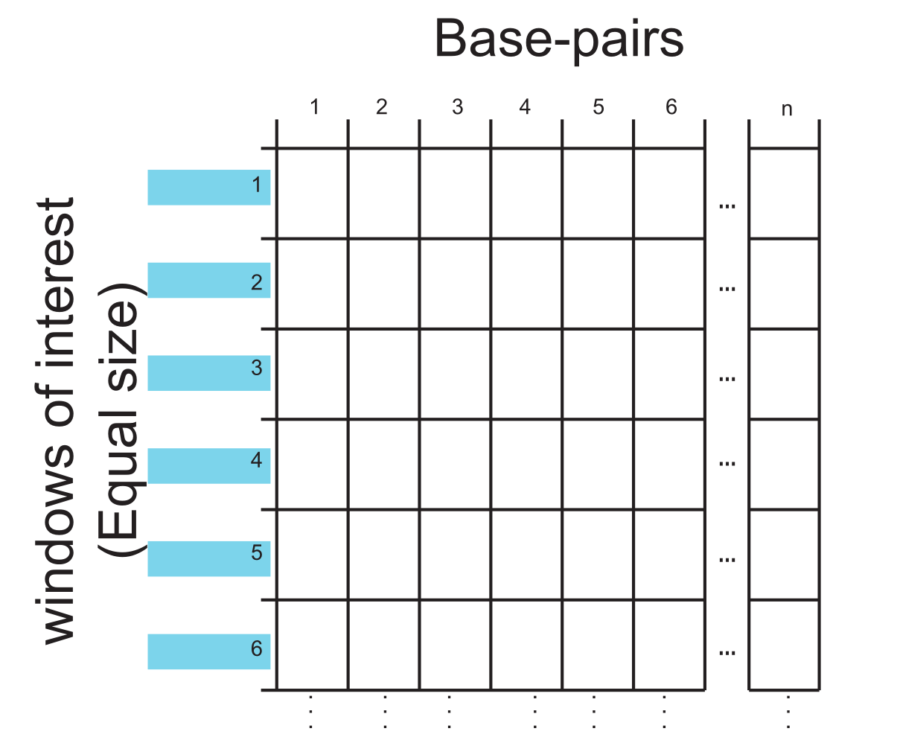

```{r setup, include=FALSE}
library(learnr)     # 0.10.1.9006 (github)
library(gradethis)  # 0.1.0.9004  (github)
library(testthat)   # 3.0.0 
library(tidyverse)  # 1.3.0
library(learnr.proto)

library(IRanges)
library(GenomicRanges)
#library(plyranges)
library(rtracklayer)
#library(VennDiagram)
library(GenomicFeatures)
#library(ComplexHeatmap) # for upset plot with GRanges, may be unloaded for fg3
library(genomation)
library(ggthemes)
#library(org.Hs.eg.db)


# load the txdb package which holds transcript-based gene models of hg38 genome  
library(TxDb.Hsapiens.UCSC.hg38.knownGene)
txdb <- TxDb.Hsapiens.UCSC.hg38.knownGene 
seqlevels(txdb) <- "chr19"

# configuration
knitr::opts_chunk$set(echo=FALSE, message=FALSE)
gradethis::gradethis_setup()

# data accessible to all exercises
rdata = system.file("extdata", "week2.Rdata", package = "learnr.proto")
load(rdata)
monocytes_all <- unlist(monocytes_list)
monocytes_all$chip <- names(monocytes_all)
monocytes_list <- GRangesList(monocytes_list, compress=FALSE)

# chr19_windows_1bp <- tileGenome(seqinfo(txdb), tilewidth = 10, cut.last.tile.in.chrom =TRUE)
tss_chr19 <- unique(promoters(genes(txdb), upstream=100, downstream=0)) 
tss_chr19  <- resize(tss_chr19, width = 1, fix = "end")
tss_chr19$name <- tss_chr19$gene_id
promoters_chr19 <- unique(promoters(genes(txdb), upstream=2000, downstream=200)) 
genes_chr19 <- unique(genes(txdb))

# sample of tss_chr19 and quantification_chr19 
# those those for which we have data in bigwig files, see extdata/prepdata.Rmd)
rdata = "/home/ctoenhake/learnr.proto/inst/extdata/week3.Rdata"
load(rdata)
rm(rdata)
quantification_chr19_sample <- quantification_chr19_sample %>% dplyr::rename(gene_id = entrezgene_id)

# # gene quantification chromosome 19  
 rdsfile <- system.file("extdata", "week2", "prepared_rds", "blueprint_c000s5_gene_quantification_chr19.rds", package = "learnr.proto")
quantification_chr19 <- readRDS(rdsfile)
quantification_chr19 <- quantification_chr19 %>% dplyr::rename(gene_id = entrezgene_id)
```

`r colorize("week3.RData in learnr.proto still contains the old version with granges objects of chr21, didn't get it updated to the nwe version (in /home/ctoenhake/learnr.proto/inst/extdata). So copyied the newer version into the library.", col = "red")`  

```{r timeout1, context="server"}
isolate({
  # obtain the session id
  # source 1: https://shiny.rstudio.com/reference/shiny/latest/session.html
  # source 2: https://stackoverflow.com/questions/18900955/get-environment-identifier-in-r
  session_id <- sub('<environment: (.*)>', '\\1', capture.output(session$userData))
  
  # # send the session ID to the log (indicates the tutorial is loaded)
  # write(paste0("Session ID: ", session_id), stderr())
  
  # send the session ID to the javascript chunk
  session$sendCustomMessage("session_id", session_id)
})

# stop the tutorial when "input[[session_id]]" is updated
observeEvent(input[[session_id]], ignoreNULL=TRUE, {
  write(paste0("\nTutorial terminated due to inactivity.\nRestart to continue where you left off!\n"), stderr())
  stopApp()
})
```

```{js timeout2}
// This chunk stops the tutorial if it has been idle for too long

// Situation: We need to stop inactive tutorials to prevent the server from grinding to a halt.
// Problem: refreshing the tutorial and closing the browser send the same signal to shiny.
// since we cannot distinguish the two, this signal cannot be used to stop the tutorial.
// Solution: Use a timeout system. 
// Method: this chunk will update shiny variable "input[[session_id]]" 
//   when the session has been running idle for longer than "timeoutSec" seconds.
// This signal is then be used by Shiny (server-side) to stop the session.

// source1: https://community.rstudio.com/t/keeping-track-of-idle-time-during-app-usage/1735
// source2: https://bookdown.org/yihui/rmarkdown/language-engines.html#javascript-and-css
$(function() {
  var timeoutSec = 15*60;
  var idleTimer;

  // receive this session's ID
  Shiny.addCustomMessageHandler("session_id", function(s_id) {
    session_id = s_id;  // assigns the variable globally
  });

  // assign session ID as reactive variable "input[[session_id]]" 
  function onTimeout() {
    alert("Tutorial stopped due to inactivity.\nRestart to continue where you left off!")
    Shiny.setInputValue(session_id, "TRUE");
  }

  function startIdleTimer() {
    if (idleTimer) clearTimeout(idleTimer);
    idleTimer = setTimeout(onTimeout, timeoutSec * 1000);
  }
  
  $(document).on('shiny:message shiny:inputchanged', startIdleTimer);

})();
```

## 3.1 Introduction   
In week 2 we quantified and visualized the overlap between histone peaks and promoters and examined the association with gene expression. Although informative, we have been ignoring the actual ChIP-seq signal strengths altogether.  
<br>
This week you will investigate the relationship between histone PTMs and gene expression further by including ChIP-seq signals in your analyses. You will generate plots displaying the distribution of ChIP-seq signal around certain genomic positions, here a set of promoter regions to answer common questions like: "*What is the signal of the mark around the TSS?*", "*What is the relationship between histone ChIP-seq signal intensity and gene expression?*".  
<br>
These plots include an average signal profile, also called density plot, and a heatmap representation. You could use dplyr-related functions and ggplot-ting to achieve this but it is much more convenient to use dedicated tools for these tasks.   
<br>
We have chosen for the [genomation](https://github.com/BIMSBbioinfo/genomation) package for this purpose because it is compatible with the file types that we have available. (Side note: there are a number of other packages to analyze ChIP-seq data we well. Incl. ChIPpeakAnno and ChIPseeker.)   
<br>
We have installed and loaded this package for you with the following code:  
```{r install_genomation, echo = T, eval =FALSE}
BiocManager::install("genomation")
library(genomation)
```

### Tutorial specs  
The exercises in this tutorial are similar to those in fg2. A brief reminder:  

- For some longer coding exercises, we left blanks as "___" that indicate where in the code you should fill in a function, object or variable. Make sure fill out all the blanks before Answer submission, they will otherwise result in errors.  
- Hit `Hint` (when provided) for clues.  
- Hit `Run Code` to test your code and preview the output.  
- Hit `Submit Answer` (if present) to submit the code. As 'submitting' not always shows the code output, we advise to use `Run Code` first. Upon hitting `Submit Answer` and when code-checking is enabled and your submitted code is different from the solution code, R will give automatic feedback that helps you correct your code.  
- Hit `Start Over` to remove any adjustments you made and start again.   
- Try to keep yourself from hitting `Solution` (when provided). This is option is sometimes provided when your code is evaluated. Only use it when you do not understand the automatic feedback given by R.   

Although we ask for specific answers or completion of specific code, you are encouraged to test your own code and use `Run Code` and `Start Over` extensively. I.e., remove the pre-coded code and write your own code for a different graph or different summary of the data. Use `Run Code` to preview the results. Unfortunately these self-thought of codes can not be evaluated. For the evaluation you need to use our pre-coded code. Hit `Start Over` to get this pre-coded code.  

### 3.1.1 Learning Objectives  

> At the end of week 3 you are able to:  
> 
1. Identify the nearest TSS to a histone ChIP-seq peak.  
3. Plot the distribution of distances between ChIP-seq peaks and the nearest TSS.      
2. Import coverage data from bigwig files into r.  
4. Plot the average histone ChIP-seq signal around a genomic feature like the TSS (= density plot).  
5. Plot the relationship between ChIP-seq signal at the TSS and gene expression.   
6. Optionally, test for significance of the observed association.  
7. Summarize ChIP-seq signal in a heatmap figure.  
8. Order the heatmap of (7) by gene expression.  
9. Cluster the heatmap of (7) based on ChIP-seq signals of different marks.  
10. Optionally, back-analyze chromHmm output, in other words, heatmap summary of signal intensities of the different marks in chromHMM defined regions. Regions are labelled 1-12, can you, using the sig
  
<!-- ### large domain H3K27me3   -->
<!-- - overlap met H3K4me1 -->
<!-- - welke genen zijn bivalent   -->

<!-- ## structure -->
<!-- 1.  -->
<!-- 2. gemiddelde H3K4me3 signaal rond TSS -->
<!-- 3. groepering naar genexpressielevel per quantile voor H3K4me3 -- shows relatie met gen expresssie -->
<!-- 4. Hoe zit dat bij H3K27me3 (niet bij heel hoge expressie, breed signaal, je pakt maar een stukje) -->
<!-- 5. Hoe zit dit er uit als we elk datapunt bekijken in dotplot/scatterplot -- shows geen 100% vertaling/relatie, waarneming hieruit het is een trend en geen harde waarheid komt (deels) door invloed van andere marks = combinatorial markings.  -->
<!-- 6. Heatmap van histone marks at TSS random. Dan geordend op genexpressie niveau.   -->

<!-- <br> -->

## 3.2 Identify nearby TSSs  
### 3.2.1 Identify the nearest TSS   
First, let's identify the nearest TSS and plot the distance between a histone mark and its nearest TSS (in contrast to identifying strict overlap as in fg3).  
### Exercise 1    
Identify the nearest TSS for each H3K4me3 peak in monocytes.   

> **Exercise 1a**: Recap, which of the commands below imports the peaks table into a GRanges object?  

```{r qimport}
question("Which function imports the H3K4me3 peaks into a GRanges object?",
         answer("import(\"C000S5H2.ERX547984.H3K4me3.bwa.GRCh38.20150527.chr19.bed\", format = \"narrowPeak\")", correct =TRUE),
         answer("import(\"C000S5H2.ERX547984.H3K4me3.bwa.GRCh38.20150527.chr19.bed\", format = \"BED\")", message = "BED is not the right format."),
         answer("import(\"C000S5H2.ERX547984.H3K4me3.bwa.GRCh38.20150527.chr19.bed\", format = \"broadPeak\")", message = "check the file format."),
         answer("read.table(\"C000S5H2.ERX547984.H3K4me3.bwa.GRCh38.20150527.chr19.bed\", format = \"broadPeak\")", message = "read.table parses the data into a data.frame while we asked for a GRanges object."),
         allow_retry =TRUE,
         random_answer_order =TRUE)
```

### Exercise 1b  
To identify the nearest TSS, you use the function:   

`distance2NearestFeature(g.idh = [GRanges object withe peaks], tss = [GRanges object with TSSs])`  

The output is a data.frame reporting for each range in the `g.idh` object:

- its nearest TSS  
- the name of the corresponding peak and TSS  
- the distance between them. 

The fact that the output is a data.frame makes it easy for us to summarize the results with dplyr and ggplot2.      

<!-- 1. target.row = index of the peak in the GRanges object with peaks.   -->
<!-- 2. dist.to.feature = distance to the nearest TSS, negative when the peak is *upstream* of the TSS.    -->
<!-- 3. feature.name = the Entrez gene id of the corresponding gene, given in the column "names" of object `tss_chr19`.    -->
<!-- 4. feature.strand = strand of the TSS.    -->

> **Exercise 1b**: Identify the nearest TSS for each H3K4me3 ChIP-seq peak.  
> 
- TSS locations are stored in object `tss_chr19`.  
- H3K4me3 peaks in monocytes are stored in `monocytes_h3k4me3`.   
- Print the head of the resulting object to the console using `head()`.     

```{r q1_distancetss, exercise =TRUE, exercise.lines = 5, exercise.eval =FALSE, error = T}
# Identify the nearest TSS for each H3K4me3 peak  
dist_h3k4me3_to_tss <- __(g.idh = __, tss = __)

# Show the resulting object 

```

```{r q1_distancetss-hint-1}
# use the function
distance2NearestFeature()
```

```{r q1_distancetss-hint-2}
# within distance2NearestFeature define g.idh as:
g.idh = monocytes_h3k4me3
```

```{r q1_distancetss-hint-3}
# and tss as:
tss = tss_chr19
```

```{r q1_distancetss-hint-4}
# finish with
head(dist_h3k4me3_to_tss)
```

```{r q1_distancetss-check}
grade_result(
  pass_if(~identical(.result, head(distance2NearestFeature(monocytes_h3k4me3, tss_chr19))))
)
```

The `dist_h3k4me3_to_tss` reports for each H3K4me3 peak a nearest TSS. In total `r length(unique(distance2NearestFeature(monocytes_h3k4me3, tss_chr19)$feature.name))` different TSSs are reported, meaning that some peaks are assigned to the same TSS. *Which variable reports the distance between the peak and its nearest TSS?*       
<br>

>#### **Optional check**:  
<details><summary>Curious to check the matches in the genome browser?:</summary>   
<br>
You may want to check some of the matches. For example to check that positive distances are indeed peaks that are located *downstream* the TSS. To do so...  
1. View a part of the output of `dist_h3k4me3_to_tss`. For example, peaks with `dist.to.feature` above 1kb, sorted by distance, showing only the top 5 of the output by running: `dist_h3k4me3_to_tss %>% filter(dist.to.feature >= 1000) %>% arrange(dist.to.feature) %>% slice_head(n=5)`   
2. The first row reports:     
  `r distance2NearestFeature(monocytes_h3k4me3, tss_chr19) %>% filter(dist.to.feature >= 1000) %>% arrange(dist.to.feature) %>% slice_head(n=2) %>% slice_tail(n=1)`  
3. You can either look up the gene id ('feature.name' variable) in the [ncbi gene database](https://www.ncbi.nlm.nih.gov/gene/) and use the gene symbol to navigate to the right location in the UCSC genome browser.  
3. Or subset `monocytes_h3k4me3` with the given index in the 'target.index' column (805): `monocytes_h3k4me3[805]`.  
4. Go to the UCSC Genome Browser.  
5. Upload the monocytes trackhub (same as fg1): `http://mbdata.science.ru.nl/ctoenhake/edu/trackhub_monocytes/hub.txt`.    
  + Go to the tab "My Data" in the top menu.  
  + Select "Track Hubs".   
  + In the "My hubs" tab you can paste the above URL.  
  + You need to change the visibility of the tracks with "monocyte_H3K4me3_peaks" from "hide" to "pack". This can be done below the browser view. Remember to hit `Refresh`.  
6. Navigate to the gene from step 3 or the genomic region of step 4.  
  + In this example: `chr19:11577771-11577970`.    
7. Zoom out and observe or measure the location of the peak in relation to the TSS of the gene given in step 3. The name of the peak is given in the output of step 4.   
8. This confirms that **positive dist.to.feature values indicate that the H3K4me3 peaks is located *downstream* the TSS**.  
</details>  

### 3.2.2 Plot distances between ChIP peaks and features  
Having identified the nearest TSS for each H3K4me3 peak, you willsummarize the distances between H3K4me3 peaks and TSSs.  
### Exercise 2   

> **Exercise 2a:** Print a summary of the distances reported in `dist_h3k4me3_to_tss` using the `summary()` function.
> 
> * Tip: Look at the output from exercise 1b to identify the variable that stores the distances.   

```{r prepare_q2a, echo =FALSE}
 dist_h3k4me3_to_tss <- distance2NearestFeature(monocytes_h3k4me3, tss_chr19)
```

```{r q2a_summary, exercise =TRUE, exercise.eval =FALSE, error = T, exercise.setup = "prepare_q2a"}
# print a summary of the distances

```

```{r q2a_summary-hint-1}
# We want a summary of 
dist_h3k4me3_to_tss$dist.to.feature
```

```{r q2a_summary-check}
grade_result(
  pass_if(~identical(.result,summary(dist_h3k4me3_to_tss$dist.to.feature)))
)
```

### Exercise 2b  

> **Exercise 2b:** Plot the distances from `dist_h3k4me3_to_tss` using ggplot() and geom_histogram() and answer the multiple-choice question below.     
>
> * With the summary of exercise 2a in mind, play around with the `binwidth  =` parameter in `geom_histogram()`. 

>#### **Refresher**: histograms   
<details><summary>Click here for a quick explainer on histograms and the importance of the bin width or bandwidth.</summary>   
**Histograms** visualize the distribution of a single variable. Events are grouped into bins with comparable values and the number of events per bin is counted and these counts are visualized.  
<br>
Because histograms are made by binning the data, the bin width is a critical parameter that will affect the appearance of the graph. Choosing a bin width that is too small will result in a overly busy and peaky histogram making it difficult to discern the main trends. If the bin width is too large, then smaller features of the distribution may dissapear.  
<br>
In practice, if you generate a histogram, always explore multiple bin widths besides the default settings.   
<br>
In geom_histogram(), the bin width can be set by:  
> 
- Specify the parameter "binwidth", eg `binwidth = 5`   
- Specify the parameter "breaks", eg `breaks=seq(20, 50, by=2)` or `breaks=c(0,100,200)`  
</details>  

```{r q2b_plotdistances, exercise =TRUE, exercise.eval =FALSE, error = T, exercise.setup = "prepare_q2a"}
# plot the distances as histogram with ggplot
ggplot(___)+
  geom_histogram(aes(x= ___), binwidth = __)
```

```{r q2b_plotdistances-hint-1}
# use the output from exercise 1b as the input for ggplot
```

```{r q2b_plotdistances-hint-2}
# plot the distance on the x axis
```

```{r q2b_plotdistances-hint-3}
# ie 
ggplot(dist_h3k4me3_to_tss)+
  geom_histogram(aes(x=dist.to.feature))
```

```{r q2b_plotdistances-hint-4}
# try binwidths of 10kb or 100kb, for example:
ggplot(dist_h3k4me3_to_tss)+
  geom_histogram(aes(x=dist.to.feature), binwidth = 1000)
```

```{r q2b_plotdistances_mc}
question("Which of the following statments are correct?",
         answer("Over 50% of the datapoints fall within 10kb up- or downstream the TSS", correct = T, message = "Indeed, over 50% of H3K4me3 peaks are within +/- 10kb of the TSS. But also notice the  outliers we are having: peaks are assigned to TSSs that are over 100kb away! These might be peaks in enhancers that are due to cross-reactivity of the antibody or chromosomal looping."),
         answer("Less than 50% of the datapoints fall within 10kb up- or downstream the TSS", message= "Review the output of question 2a. Take a carefull look at the 1st and 3rd Quartile values."),
         answer("A binwidth of 100kb, givs us the nicest histogram with sufficient detail but not too peaky.", message = "Try again, 100kb is a bit too large in this case."),
         answer("A binwidth of 10kb, givs us the nicest histogram with sufficient detail but not too peaky.", correct=TRUE),
         allow_retry=TRUE
         )
```

## 3.3 Investigating ChIP-seq signal strength     
Distance and overlap may tell you which gene and/or regulatory element the mark is most likely associated with. As we for example observed in fg2: the presence and absence of H3K4me3 and H3K27me3 at a gene's promoter is associated with gene expression. But there is more to it!  

### 3.3.1 ChIP-seq signal strength    
Not only the presence or absence but the actual signal from ChIP-seq marks can be associated with the expression level of the gene in question. Such associations between ChIP-seq signal strength and gene expression - being it positive or negative associations - point to a functional relationship. Think of the ChIP-seq mark recruiting basal transcription factors or the deposition of marks by proteins recruited by the transcriptional machinery in elongation mode.  
<br>
In both cases you will observe a positive association between ChIP-seq signal strength and gene expression. In research, such observations (or the absence thereof) can help you decide on the direction and design of follow-up experiments.   
<br>
These relationships between signal intensity and gene expression may have already been discussed in your Epigenomics lectures. Let's look at how they look in real data.   

### 3.3.2 Importing ChIP-seq signal strength in r   
The ChIP-seq signal can be obtained from the data stored in .bam files or from .bigwig files. Remember from week 1, .bam files contain records of read alignments with 1 line per read. The .bigwig files do not store individual reads but the coverage across the genome, often normalized per million mapped reads.   
<br>
Not all packages and functions are compatible with both file types and the resulting plots may look differ in resolution in part because .bam files - as they store read information -  give you more freedom to define how coverage is calculated. However, as BLUEPRINT only provides the .bigwig files we will use those today and not the .bam files.   
<!-- REF: https://www.bioconductor.org/packages/release/bioc/vignettes/genomation/inst/doc/GenomationManual.html#4_Extraction_and_visualization_of_genomic_data   -->
<br>
We limited the data stored in the bigWig files to a 20kb window around the TSSs of a randomly selected 30% of genes on chromosome 19. This was done to reduce the size of these files (bigWig but also .bam files are huge!) and speed up the tutorial a bit. We have made sure that this random selection still reflects the genome-wide relationships.  

### Exercise 3  
You will plot the H3K4me3 ChIP-seq signal strength around the TSSS in a density plot.  

>#### **Background info**: Density plots  
<details><summary>What is a density plot?</summary>   
**Density plots** visualize the estimated, underlying probability distribution by drawing an appropriate continous curve. The most commonly used method for to estimate this curve is called the *kernel density estimation*. In kernel density estimation, we draw a continuous curve (the kernel) with a small width (controlled by a parameter called bandwidth) at the location of each data point, and then we add up all these curves to obtain the final density estimate.  
<br>
Just as is the case with histograms, the exact visual appearance of a density plot depends on the kernel and bandwidth choices. The bandwidth is related to the binwidth in histograms. The choice of kernel affects the shape of the density curve (eg. gaussian like for Gaussian kernel but stepwise with a rectangular kernel).  
<br>
In general, the more data points there are in the data set, the less the choice of the kernel matters. Therefore, density plots tend to be quite reliable and informative for large data sets but can be misleading for data sets of only a few points.
<br>
Density curvuse are usually scaled such that the area under the curve equals 1.  
<br>
Kernel density estimates have one major pitfall: they have the tendency to extrapolate the curve towards regions that are non-existing (eg. into negative age when one plots a kernal density distribution of ages within a country).   
<br>
See for a more extended discussion on histograms and density plots Chapter 7 of Fundamentals of Data Visualization by Claus O. Wilke [ref](https://clauswilke.com/dataviz/histograms-density-plots.html).  
</details>  

A trick that prevents loading complete bigWig files in your environment is to load only the the regions of interest; in this case the window around the TSS. You load the signal in a "ScoreMatrix" object with the following function from the genomation package:  

`ScoreMatrix(target = [path to bigwig file], windows = [regions of interest], type = "bigWig", strand.aware = [TRUE/FALSE])`   

* To take the strand of the TSS into account, we set `strand.aware` to TRUE.   
* Every row in the resulting ScoreMatrix object corresponds to a window of the [regions of interest].  
* Every column in the resulting ScoreMatrix object is a bp within that window.   

{width=50%}\  
<br>
The object `tss_chr19_sample` contains the TSSs (1bp) of which we also have data in the bigwig files. The window is currently 1bp but we want to plot the signal *around* the TSS. To do so, we resize these 1bp intervals with the function:  

`resize(x = [GRanges object], width = [desired width], fix = ["start", "end" or "center"])`.   

* As we want to have a window *around* the TSS we set the `fix =` parameter to "center".    

> **Exercise 3a**: Run the code below to obtain the H3K4me3 signal in a +/-7.5kb window around the TSSs. Hit "Run Code" to view the structure of the resulting ScoreMatrix object.   

`r colorize("The system.file fucntion contains the old subdir name, I corrected it, it is corrected on git, but did not get it installed in my local environment. ", col = "red")`  

```{r q3a_h3k4me3_scores, exercise=TRUE, exercise.eval=FALSE, error=TRUE}
# define the window size  
window <- 15000

# resize the tss interval to this window.
tss_window <- resize(tss_chr19_sample, width = window, fix = "center")

# path to bigwig file (in this case stored in the folder "extdata" of the library "learnr.proto" which contains data specific to this tutorial)
bw_h3k4me3 <- file.path("/home", "ctoenhake", "learnr.proto","inst", "extdata", "week3", "bw_chr19_tss_sample", "C000S5H2.ERX547984.H3K4me3.bwa.GRCh38.20150528.chr19_chr19tss_0.4ofGenes_15kb.bw")

# create H3K4me3 ScoreMatrix for these intervals.
# strand.aware =TRUE takes into account the strand of the TSS. 
scores_h3k4me3_tss <- ScoreMatrix(target = bw_h3k4me3, windows = tss_window, type = 'bigWig', strand.aware =TRUE)  

# what structure is scores_h3k4me3? Hit "Run code" to view the result. 
str(scores_h3k4me3_tss)
```
<br>
The object `scores_h3k4me3_tss` is of formal class ScoreMatrix, which is related to a basic matrix but - as it says - "more formal". In other words, it has special functions to retrieve and set the data. We won't go into the details of these differences with basic matrices but focus on how we can use this result.  

### 3.3.3 Density plot of H3K4me3 signal around the TSS  
Using this ScoreMatrix you can plot the average H3K4me3 signal in these windows. To do so, use the function:   

`plotMeta(mat = [score matrix object])`.  

> **Exercise 3b**: Run the code below to view the resulting plot.  
>  
* Define the x-coordinates with the `xcoord = ` parameter to set the TSS at 0. If you remove this setting you will see that the x-axis is labeled from 0 to 15000.   

```{r example_densityplot, exercise =TRUE, exercise.eval=FALSE, error=TRUE, exercise.setup = "q3a_h3k4me3_scores"}
# plot density plot
plotMeta(scores_h3k4me3_tss, xcoord = c(-7500, 7500))
```
Clearly, you could have focused our plot on the region +/- 5kb around the TSS as the signal remains near 0 read per million outside that region.   

### Exercise 3c  

```{r mc_strandawareness}
question("Which command would you change and how, to make sure that the signal is limited to +/-5kb around the TSSs in the density plot?",
         answer("Change the xcoord parameter in 'plotMeta', set it to c(-5000, 5000)."),
         answer("Filter the ScoreMatrix 'scores_h3k4me3_tss' for columns c(-5000, 5000)."),
         answer("Change the width parameter in 'resize', set it to 10000.", correct = T, message =  "Let's make this plot!"),
         allow_retry = T,
         random_answer_order = T)
```

> **Exercise 3c**:  Repeat the calculations of the window, scores and plot but now make sure you plot a window +/- 5kb.  
* You can copy-paste and adjust the code used in exercise 3a.  

```{r q3c_h3k4me3_scores, exercise.lines=15, exercise =TRUE, exercise.eval=FALSE, error=TRUE}
# 1. define the window size  


# 2. resize the interval tss_chr19_sample to this window


# 3. path to bigwig file 
bw_h3k4me3 <- file.path("/home", "ctoenhake", "learnr.proto","inst", "extdata", "week3", "bw_chr19_tss_sample", "C000S5H2.ERX547984.H3K4me3.bwa.GRCh38.20150528.chr19_chr19tss_0.4ofGenes_15kb.bw")

# 4. create H3K4me3 ScoreMatrix for these intervals.


# 5. generate the density plot


```


```{r q3c_h3k4me3_scores-solution}
# define the windows:  
window <- 10000

# resize the tss interval to this window.
tss_window <- resize(tss_chr19_sample, width = window, fix = "center")

# path to bigwig file (in this case stored in the folder "extdata" of the library "learnr.proto" which contains data specific to this tutorial)
bw_h3k4me3 <- file.path("/home", "ctoenhake", "learnr.proto","inst", "extdata", "week3", "bw_chr19_tss_sample", "C000S5H2.ERX547984.H3K4me3.bwa.GRCh38.20150528.chr19_chr19tss_0.4ofGenes_15kb.bw")

# create H3K4me3 ScoreMatrix for these intervals.
scores_h3k4me3_tss <- ScoreMatrix(target = bw_h3k4me3, windows = tss_window, type = 'bigWig', strand.aware =TRUE)  

# generate the density plot
plotMeta(scores_h3k4me3_tss, xcoord = c(-5000, 5000) )
```

```{r mc_densityplotshape}
quiz(caption = "", 
     question("Is H3K4me3 signal equally strong before and after the TSS or is there a difference?",
              answer("H3K4me3 signal appears equal up- and downstream the TSS"),
              answer("H3K4me3 signal is lower downstream the TSS compared to upstream  "),
              answer("H3K4me3 signal is higher downstream the TSS", correct = T, message = "H3K4me3 signal is generally higher downstream the TSS."),
              allow_retry = T),
     question("What would the plot show, in case you would have set 'strand.aware=FALSE' in the 'ScoreMatrix()' function? Tip: You can adjust the code and try it.",
              answer("H3K4me3 signal appearing equal up- and downstream the TSS", correct = T, message = "As TSS are randomly distributed over strands, setting strand.aware to FALSE will lead to a plot where H3K4me3 signal appears equally strong before and after the TSS while in reality it is stronger downstream the TSS."),
              answer("H3K4me3 signal would appear lower downstream the TSS compared to upstream.", message = "Realize that randomly distributed over strands while the H3K4me3 signal around the TSS is related to the directionality."),
              answer("H3K4me3 signal would appear higher downstream the TSS", message = "Realize that randomly distributed over strands while the H3K4me3 signal around the TSS is related to the directionality."),
              allow_retry = T),
     question("What could explain the slight decrease in signal at pos. 0?", 
              answer("The nucleosome depleted region found at the TSS of transcribed genes.", correct = T),
              answer("The binding of specific TFs at the TSS."),
              answer("The TSS itself is marked by H3K4ac instaed of H3K4me3"),
              allow_retry = T)
)
```

### 3.3.4 Add H3K27me3 signal   
So far we have examined the signal of a 'narrowPeak' ChIP. Now, let's add the H3K27me3 signal to our plot.  

### Exercise 4   

> **Exercise 4**: Generate a density plot of the H3K37me3 signal +/- 5kb around the TSSs with H3K4me3 (code check).  

```{r h3k37me3_signal_tss, exercise=TRUE, exercise.eval=FALSE, error=TRUE, exercise.lines=9, exercise.setup="q3c_h3k4me3_scores"}
# 1. Path to bigwig file 
bw_h3k27me3 <- file.path("/home", "ctoenhake", "learnr.proto", "inst", "extdata", "week3", "bw_chr19_tss_sample", "C000S5H2.ERX547983.H3K27me3.bwa.GRCh38.20150528.chr19_chr19tss_0.4ofGenes_15kb.bw")

# 2. Create H3K27me3 ScoreMatrix for these intervals.
scores_h3k27me3_tss <- ScoreMatrix(___)  

# 3. Generate the H3K27me3 density plot

```

```{r h3k37me3_signal_tss-hint-1}
# You can copy-paste the ScoreMatrix code from the exercise above and adjust the parameter 'targets' 
```

```{r h3k37me3_signal_tss-hint-2}
# Eg 
ScoreMatrix(target = bw_h3k27me3, windows = tss_window, .....)  
```

```{r h3k37me3_signal_tss-hint3}
# Warning: the next hint holds the solution!
```

```{r h3k37me3_signal_tss-solution}
# 1. path to bigwig file (in this case stored in the folder "extdata" of the library "learnr.proto" which contains data specific to this tutorial)
bw_h3k27me3 <- file.path("/home", "ctoenhake", "learnr.proto", "inst", "extdata", "week3", "bw_chr19_tss_sample", "C000S5H2.ERX547983.H3K27me3.bwa.GRCh38.20150528.chr19_chr19tss_0.4ofGenes_15kb.bw")

# 2. create H3K27me3 ScoreMatrix for the TSS windows with H3K4me3
scores_h3k27me3_tss <- ScoreMatrix(target = bw_h3k27me3, windows = tss_window, type = 'bigWig', strand.aware =TRUE)  

# 3. generate the H3K27me3 density plot
plotMeta(scores_h3k27me3_tss, xcoord = c(-5000, 5000))
```

```{r h3k37me3_signal_tss-code-check}
grade_code()
```

Observe the difference in y-axis values between the density plot of H3K4me3 and H3K27me3. This reflects the different nature of these marks with H3K4me3 having a much larger range (as you might have observed in the genome browser). 
<br>
Lastly, you can combine density plots of two marks with by:    

1. Generate a "ScoreMatrixList" object with:   
  `new("ScoreMatrixList", list([object1_name]=[ScoreMatrix_1], [object2_name]=[ScoreMatrix_2], ..., [objectN_name]=[ScoreMatrix_N]))`  
2. Provide plotMeta with this "ScoreMatrixList":   
  `plotMeta([ScoreMatrixList_object], overlay =TRUE, profile.names = [vector of custom names, used in legend])`  

This is done in the following example:  

```{r prepare_overlay_density, echo=FALSE}
window <- 10000
tss_window <- resize(tss_chr19_sample, width = window, fix = "center")
# scores for h3k27me3
bw_h3k4me3 <- file.path("/home", "ctoenhake", "learnr.proto","inst", "extdata", "week3", "bw_chr19_tss_sample", "C000S5H2.ERX547984.H3K4me3.bwa.GRCh38.20150528.chr19_chr19tss_0.4ofGenes_15kb.bw")
scores_h3k4me3_tss <- ScoreMatrix(target = bw_h3k4me3, windows = tss_window, type = 'bigWig', strand.aware =TRUE)  
# scores for h3k27me3
bw_h3k27me3 <- file.path("/home", "ctoenhake", "learnr.proto", "inst", "extdata", "week3", "bw_chr19_tss_sample", "C000S5H2.ERX547983.H3K27me3.bwa.GRCh38.20150528.chr19_chr19tss_0.4ofGenes_15kb.bw")
scores_h3k27me3_tss <- ScoreMatrix(target = bw_h3k27me3, windows = tss_window, type = 'bigWig', strand.aware =TRUE)  
```

```{r overlay_density, exercise=TRUE, exercise.eval=FALSE, error=TRUE, exercise.setup="prepare_overlay_density"}
# generate ScoreMartixList from two ScoreMatrix objects:
scores_h3k4me3_h3k27me3_tss <- new("ScoreMatrixList", list(k4me3=scores_h3k4me3_tss, k27me3=scores_h3k27me3_tss))

# generate density plot
plotMeta(scores_h3k4me3_h3k27me3_tss, xcoord = c(-5000, 5000), overlay =TRUE, profile.names = c("H3K4me3", "H3K27me3"))
```

Observe the much lower average signal for H3K27me3 compared to H3K4me3 around the TSS. This reflects the small proportion of promoters that have H3K27me3 marking in combination with the different enrichment profiles of these marks (narrow, sharp peak with high enrichment vs broad domain).  
<br>
This density plot shows the *average* ChIP-seq signal around the TSS. Is this signal the same for low and high expressed genes? You will  examine that in the coming section.  

## 3.4 Signal vs gene expression  
You will investigate the the relationship between H3K4me3 signal (as reads per million extracted from the BigWig file) in a defined window around the TSS and gene expression (as FPKM). 

### 3.4.1 Average H3K4me3 signal per gene expression quartile  
To investigate this relationship you will:  

a. Calculate the average H3K4me3 signal in a 5kb window around the TSS.  
b. Convert the output to a data.frame.  
c. Combine the data.frame with H3K4me3 signal scores with those containing gene expression values for the same TSSs.  
d. Group genes based on their gene expression in 4 quartiles and plot the H3K4me3 signal per group in a boxplot.  

### Exercise 5a  
To calculate the average H3K4me3 signal a defined window around the TSS. Let's take 10kb. You can obtain these values relatively quickly with a modified version of the 'ScoreMatrix' function: `ScoreMatrixBin()`.   
<br>
As the name suggests, this function does not calculate the coverage for each bp in the given windows, but for each **bin**. If we set the `bin.num=` parameter to `1`, it will output the average signal for each window.  
<br>
Note that this function is also useful when working with windows of varying size like  genes, in those cases we set `bin.num` to 50 or 100.    

> **Exercise 5a**: Calculate the average H3K4me3 signal in a window of +/- 2.5kb around the TSS (code check).  
> 
> * `tss_chr19_sample` is the GRanges object with TSS locations for which we have signal in the BigWig available files.  
> * Use `resize()` to resize the window in `tss_chr19_sample` to 5kb.  


```{r q5a_prepare}
# scores for h3k4me3
bw_h3k4me3 <- file.path("/home", "ctoenhake", "learnr.proto","inst", "extdata", "week3", "bw_chr19_tss_sample", "C000S5H2.ERX547984.H3K4me3.bwa.GRCh38.20150528.chr19_chr19tss_0.4ofGenes_15kb.bw")
```

```{r q5a_signal_vs_fpkm_allgenes, eval = F, echo = F}
# bw_h3k4me3 <- file.path("/home", "ctoenhake", "learnr.proto","inst", "extdata", "week3", "bw_chr19", "C000S5H2.ERX547984.H3K4me3.bwa.GRCh38.20150528.chr19.bw")
# window <- 5000
# tss_window <- resize(tss_chr19, width = window, fix = "center")
# average_score_h3k4me3_tss <- ScoreMatrixBin(target = bw_h3k4me3, windows = tss_window, type = 'bigWig', bin.num = 1, strand.aware =TRUE)  # gives the average score over the complete window. And not the sum of 1bp bin windows. 
# scores_as_matrix <- as(average_score_h3k4me3_tss, "matrix")
# scores_as_df <- as.data.frame(scores_as_matrix)
# scores_as_df$gene_id <- tss_window$gene_id
# h3K4me3_and_rnaquant <- merge(scores_as_df, quantification_chr19, by.x = "gene_id", by.y = "entrezgene_id")
# h3K4me3_and_rnaquant %>% 
#   mutate(expression_group = ntile(FPKM, 4)) %>% 
#   ggplot(.)+ 
#   geom_boxplot(mapping=aes(x = as.factor(expression_group), y = V1))+
#   scale_y_continuous(limits = c(0,100), breaks = c(0,25,50,70,100))
# h3K4me3_and_rnaquant %>% 
#   mutate(expression_group = ntile(FPKM, 4)) %>% 
#   ggplot(.)+ 
#   geom_point(mapping=aes(col = as.factor(expression_group), x = log2(FPKM+1) ,y = V1)) 


```

```{r q5a_signalVSfpkm, exercise=TRUE, exercise.eval=FALSE, error=TRUE, exercise.setup="q5a_prepare"}
# Re-size the window in "tss_chr_sample" to 5kb
tss_chr19_sample_window <- resize(___, width = ___, fix = "center")

# Obtain the average H3K4me3 core for each window in "tss_chr19_sample_window"
average_h3k4me3_tss <- ScoreMatrixBin(target = ___, 
                                             windows = ___, 
                                             bin.num = ___, 
                                             type = 'bigWig', strand.aware =TRUE)  
```

```{r q5a_signalVSfpkm-solution}
# Resize the window in "tss_chr_sample" to 10kb
tss_chr19_sample_window <- resize(tss_chr19_sample, width = 5000, fix = "center")

# Obtain the average H3K4me3 core for each window in "tss_chr19_sample_window"
average_h3k4me3_tss <- ScoreMatrixBin(target = bw_h3k4me3, 
                                             windows = tss_chr19_sample_window, 
                                             bin.num = 1, 
                                             type = 'bigWig', strand.aware =TRUE)  
```

```{r q5a_signalVSfpkm-code-check}
#saveRDS(average_h3k4me3_tss, file = file.path("/home", "ctoenhake", "learnr.proto","inst", "extdata", "week3", "prepared_rds", "scorematrix_q5_average_scores_h3k4me3_tss_10kbwindow.rds"))

grade_code()
```

### Exercise 5b  
Next, transform the resulting 'ScoreMatrix' object into a data.frame to facilitate data manipulation with dplyr and plotting with ggplot2. You can transform:  

* a 'ScoreMatrix' into a basic matrix with: `matrix_object <- as([ScoreMatrix_object], "matrix")`  
* a matrix into data.frame with: `dataframe_object <- as.data.frame([matrix_object])`.    

> **Exercise 5b**: Transform the `average_h3k4me3_tss` into a data.frame.   

```{r q5b_prepare}
# scores from ex 5
average_h3k4me3_tss <- readRDS(file = file.path("/home", "ctoenhake", "learnr.proto","inst", "extdata", "week3", "prepared_rds", "scorematrix_q5_average_scores_h3k4me3_tss_10kbwindow.rds"))
```

```{r q5b_signalVSfpkm, exercise=TRUE, exercise.eval=FALSE, error=TRUE, exercise.setup="q5b_prepare"}
# transform average_h3k4me3_tss into a matrix
scores_as_matrix <- as(___, "matrix")

# and the matrix into a data.frame 
average_h3k4me3_tss_df <- as.data.frame(___)

# Print the head of the resulting data.frame  
# What is the name of the variable with the H3K4me3 scores?  
head(__)
```

```{r q5b_signalVSfpkm-solution}
# transform average_h3k4me3_tss into a matrix
scores_as_matrix <- as(average_h3k4me3_tss, "matrix")

# and the matrix into a data.frame 
average_h3k4me3_tss_df <- as.data.frame(scores_as_matrix)

# Print the head of the resulting data.frame  
# What is the name of the variable with the H3K4me3 scores?  
head(average_h3k4me3_tss_df)
```

```{r q5b_signalVSfpkm-check}
grade_result(
  pass_if(~identical(.result, head(as.data.frame(as(average_h3k4me3_tss, "matrix")))))
)
```
<br>
'V1' is not an informative variable name and we are lacking the corresponding geneID! 
<br>
In the code below we therefore:... 

* renamed 'V1' using `rename()` from dplyr;  
* added the variable 'gene_id' (matching those in the windows we used in the `ScoreMatrixBin()` function).  

```{r rename_example, echo=TRUE, eval=FALSE}
average_h3k4me3_tss_df <- as.data.frame(as(average_h3k4me3_tss, "matrix")) %>% 
  rename(H3K4me3_rpm = V1)
average_h3k4me3_tss_df$gene_id <- tss_chr19_sample$gene_id
```

### Exercise 5c  
Now, the data from `average_h3k4me3_tss_df` and `quantification_chr19` to get a data.frame with the H3K4me3 signal at the TSS and the corresponding gene expression.   
<br>
To join two data.frames you can use the following function from dplyr:   

```{r inner_joing , echo=TRUE, eval=FALSE}
inner_join(x = [dataframe 1], y = [dataframe 2], by = [variable to join by])
```

This function outputs a data.frame with all rows in `x` and `y` that match for the variable defined  by `by=`.   

> **Exercise 5c**: Join `average_h3k4me3_tss_df` and `quantification_chr19` (code check). 
>
> * Join these two data.frames by the variable "gene_id". 
> * Because we enable code checking, you have to explicitly define `x = ` and `y=` parameters. 


```{r q5c_prepare}
# scores from ex 5
average_h3k4me3_tss <- readRDS(file = file.path("/home", "ctoenhake", "learnr.proto","inst", "extdata", "week3", "prepared_rds", "scorematrix_q5_average_scores_h3k4me3_tss_10kbwindow.rds"))

average_h3k4me3_tss_df <- as.data.frame(as(average_h3k4me3_tss, "matrix")) 
average_h3k4me3_tss_df <- average_h3k4me3_tss_df %>% dplyr::rename(H3K4me3 = V1)
average_h3k4me3_tss_df$gene_id <- tss_chr19_sample$gene_id
```

```{r q5c_signalVSfpkm, exercise=TRUE, exercise.eval=FALSE, error=TRUE, exercise.setup="q5b_prepare"}
# Join `average_h3k4me3_tss_df` and `quantification_chr19`.  
h3k4me3_and_fpkm <- ____
```

```{r q5c_signalVSfpkm-solution}
h3k4me3_and_fpkm <- inner_join(x = average_h3k4me3_tss_df, y = quantification_chr19, by = "gene_id")
```

```{r q5c_signalVSfpkm-code-check}
grade_code()
```

### Exercise 5d  
> **Exercise 5d**: To investigate the relationship between H3K4me3 signal and gene expression, plot the H3K4me3 signal (y-axis) for genes grouped by 
>
> * Join these two data.frames by the variable "gene_id"  


<!-- h3K4me3_and_rnaquant_04 <- merge(scores_as_df_04, quantification_chr19_sample, by.x = "gene_id", by.y = "entrezgene_id") -->
<!-- h3K4me3_and_rnaquant_04 %>%  -->
<!--   mutate(expression_group = ntile(FPKM, 4)) %>%  -->
<!--   ggplot(.)+  -->
<!--   geom_boxplot(mapping=aes(x = as.factor(expression_group), y = V1))+ -->
<!--   scale_y_continuous(limits = c(0,100), breaks = c(0,25,50,70,100)) -->
<!-- h3K4me3_and_rnaquant_04 %>%  -->
<!--   mutate(expression_group = ntile(FPKM, 4)) %>%  -->
<!--   ggplot(.)+  -->
<!--   geom_point(mapping=aes(col = as.factor(expression_group), x = log2(FPKM+1) ,y = V1))  -->


```{r q6_03sampled, eval = F}
# scores for h3k4me3
bw_h3k4me3 <- file.path("/home", "ctoenhake", "learnr.proto","inst", "extdata", "week3", "bw_chr19_tss_sample", "C000S5H2.ERX547984.H3K4me3.bwa.GRCh38.20150528.chr19_chr19tss_0.3ofGenes_20kb_window.bw")
rdata = file.path("/home", "ctoenhake", "learnr.proto","inst", "extdata", "week3_03sample.Rdata")
load(rdata)

window <- 5000
tss_window_03sample <- resize(tss_chr19_sample, width = window, fix = "center")
average_score_h3k4me3_tss_03 <- ScoreMatrixBin(target = bw_h3k4me3, windows = tss_window_03sample, type = 'bigWig', bin.num = 1, strand.aware =TRUE)  # gives the average score over the complete window. And not the sum of 1bp bin windows. 
scores_as_matrix_03 <- as(average_score_h3k4me3_tss_03, "matrix")
scores_as_df_03 <- as.data.frame(scores_as_matrix_03)
scores_as_df_03$gene_id <- tss_window_03sample$gene_id
h3K4me3_and_rnaquant_03 <- merge(scores_as_df_03, quantification_chr19_sample, by.x = "gene_id", by.y = "entrezgene_id")
h3K4me3_and_rnaquant_03 %>% 
  mutate(expression_group = ntile(FPKM, 4)) %>% 
  ggplot(.)+ 
  geom_boxplot(mapping=aes(x = as.factor(expression_group), y = V1))+
  scale_y_continuous(limits = c(0,100), breaks = c(0,25,50,70,100))
h3K4me3_and_rnaquant_03 %>% 
  mutate(expression_group = ntile(FPKM, 4)) %>% 
  ggplot(.)+ 
  geom_point(mapping=aes(col = as.factor(expression_group), x = log2(FPKM+1) ,y = V1)) 

```


```{r making correlation, eval = F}
h3K4me3_and_rnaquant <- merge(scores_as_df, quantification_chr19, by.x = "gene_id", by.y = "entrezgene_id")
h3K4me3_and_rnaquant %>%
  mutate(expression_group = ntile(FPKM, 4)) %>%
  ggplot(.)+
  geom_boxplot(mapping=aes(x = as.factor(expression_group), y = V1))


scores_h3k4me3_tss_10kb <- ScoreMatrix(target = bw_h3k4me3, windows = tss_window, type = 'bigWig',strand.aware =TRUE)
scores_as_df_10kb <- as.data.frame(tss_window$gene_id)
colnames(scores_as_df_10kb) <- "gene_id"
scores_as_df_10kb$mean_h3k4me3 <- apply(as(scores_h3k4me3_tss_10kb, "matrix"), 1, mean)
scores_as_df_10kb$sum_h3k4me3 <- apply(as(scores_h3k4me3_tss_10kb, "matrix"), 1, sum)
scores10kb_and_quant <- merge(scores_as_df_10kb, quantification_chr19, by.x = "gene_id", by.y = "entrezgene_id")
cor(log10(scores10kb_and_quant$FPKM+1), scores10kb_and_quant$sum_h3k4me3)
cor(log10(scores10kb_and_quant$FPKM+1), scores10kb_and_quant$mean_h3k4me3)

head(scores_as_df_10kb)
```

### 3.4.1 H3K4me3 signal vs gene expression  
Plot the relationship between ChIP-seq signal at the TSS and gene expression per gene expression quantile.

### 3.4.2 Scatter visualization of this relationship  
For each TSS we have a ChIP-seq signal and gene expression signal. Plot in scatter plot.  

### 3.4.3 What about H3K27me3 signal vs. gene experession?  


## 3.4 Heatmaps  

<!-- ```{r example_densityplot, exercise =TRUE, exercise.eval=FALSE, error=TRUE, exercise.setup = "example_scores"} -->
<!-- # plot density plot -->
<!-- plotMeta(scores_h3k4me3_tss, xcoord = c(-5000, 5000)) -->
<!-- plotMeta(scores_h3k4me3_tss_all, xcoord = c(-5000, 5000)) -->

<!-- # plot heatmap -->
<!-- heatMatrix(scores_h3k4me3_tss, xcoord = c(-5000, 5000), order = T) -->
<!-- heatMatrix(scores_h3k4me3_tss_all, xcoord = c(-5000, 5000), order = T) -->

<!-- # k-means clustering -->
<!-- cl1 <- function(x) kmeans(x, centers=3)$cluster -->
<!-- set.seed(1000) -->
<!-- heatMatrix(mat=scores_h3k4me3_tss_all,legend.name="tpm",winsorize=c(0,99),xlab="region around TSS", -->
<!--          xcoords=c(-5000:4999),clustfun=cl1, -->
<!--          cex.legend=0.8,main="H3K4me3 signal on promoters",cex.lab=1, -->
<!--          cex.axis=0.9,grid=FALSE, -->
<!--          user.order=c(1,3,2)) -->

<!-- # hierarchical clustering -->
<!-- cl2 <- function(x) cutree(hclust(dist(x), method="complete"), k=3) -->
<!-- set.seed(1000) -->
<!-- heatMatrix(mat=scores_h3k4me3_tss_all,legend.name="tpm",winsorize=c(0,99),xlab="region around TSS", -->
<!--          xcoords=c(-5000:4999),clustfun=cl2, -->
<!--          cex.legend=0.8,main="H3K4me3 signal on promoters",cex.lab=1, -->
<!--          cex.axis=0.9,grid=FALSE) -->
<!-- ``` -->

### 3.4.1 Heatmap of 1 mark  
Summarize H3K4me3 ChIP-seq signal at all TSSs in a heatmap.  

### 3.4.2 Ordering a heatmap  
By gene expression of corresponding gene  

### 3.4.3 Clustering a heatmap  
By k-means or hierarchical clustering. 
Perhaps add background info section on clustering (?)  

### 3.4.4 Heatmap of all available histone marks  
Heatmap of all marks at the TSSs.   

### 3.4.5
Heatmap of all marks at DNaseI summits.   

## 3.5 ChromHMM  
Back-analyze chromHmm output, in other words, heatmap summary of signal intensities of the different marks in chromHMM defined regions. Regions are labelled 1-12, can you, using the sig

Chromatin states - re-occurring, co-localization of histone marks and factors - mapping of epigenomic marks, such as histone modifications, histone variants, regions of open chromatin, and related marks, has emerged as a powerful means to annotate genomes, to identify putative regulatory elements, and to study their changing activity across different cell types and in human disease1,2,3,4. Individual marks can be studied in isolation, either through aggregation of their genome-wide signal tracks relative to a set of predetermined annotations5, such as transcription start sites or exon boundaries, or by discovery of narrow peaks or broader domains in which the mark is present in greater frequency than that of the surrounding regions6. However, additional information can be gained by studying combinations of multiple marks in their spatial context. Such patterns, termed 'chromatin states', often capture known classes of genomic elements, such as promoters, enhancers, and transcribed, repressed, and repetitive regions7, and can also capture novel classes or subclasses of elements. (https://www.nature.com/articles/nprot.2017.124)

State1.- Repressed Polycomb High signal H3K27me3 -A 
State2.- Repressed Polycomb Low signal H3K27me3 - A
state3.- Low signal
State4.- Heterochromatin High Signal H3K9me3 - B
State5.- Transcription High signal H3K36me3 - C 
State6.- Transcription Low signal H3K36me3 -C
State7.- Genic Enhancer High Signal H3K4me1 & H3K36me3
State8.- Enhancer High Signal H3K4me1
State9.- Active Enhancer High Signal H3K4me1 & H3K27Ac - D
State10.- Distal Active Promoter (2Kb) High Signal H3K4me3 & H3K27Ac & H3K4me1 - D
State11.- Active TSS High Signal H3K4me3 & H3K4me1 - E 
state12.- Active TSS High Signal H3K4me3 & H3K27Ac - E

### Exercise chromhmm    
```{r chromhmm, eval =FALSE}
#library(pheatmap)
library(RColorBrewer)
chromhmm_file <- system.file("extdata", "week3",  "C000S5H1_12_12_Blueprint_release_201608_dense_chr19.bed", package = "learnr.proto")
chromhmm <- rtracklayer::import(chromhmm_file)
# 12 states - which is what?  
table(chromhmm$name)  
chromhmm_list <- split(chromhmm, chromhmm$name,drop=TRUE)

mono_list <- GRangesList(monocytes_list, compress =FALSE)

chrommhmm_anno_list <- annotateWithFeatures(mono_list,chromhmm_list)
heatTargetAnnotation(chrommhmm_anno_list)+
  coord_flip()+
  scale_fill_gradient(low = "white", high = "blue")
  
mat=heatTargetAnnotation(chrommhmm_anno_list,plot=FALSE)


#pheatmap(mat = mat, 
#         color = c("white", brewer.pal("Reds", n =9)),
#         cluster_cols =FALSE)

      
#BiocManager::install("pheatmap")

```