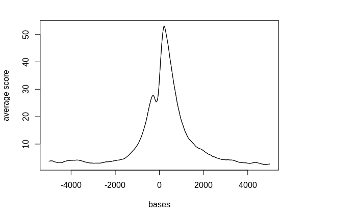
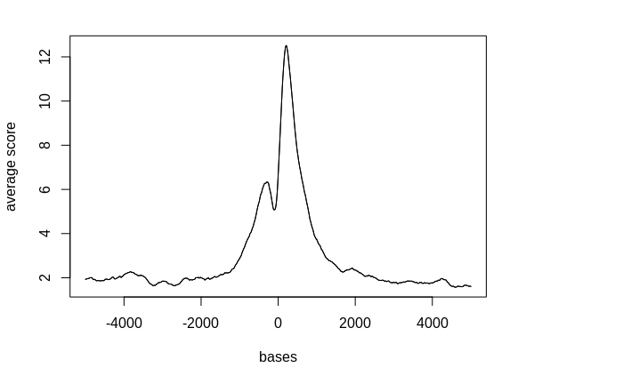
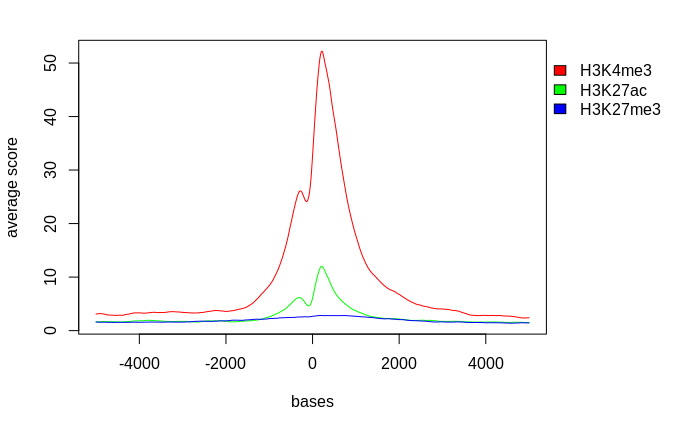
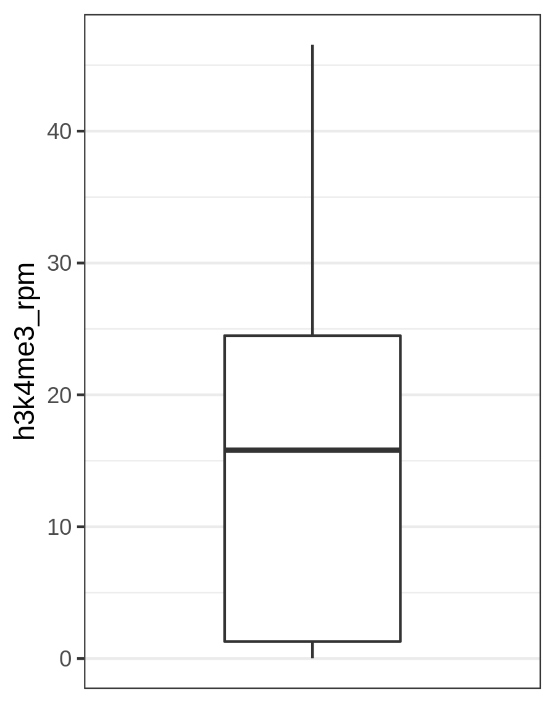
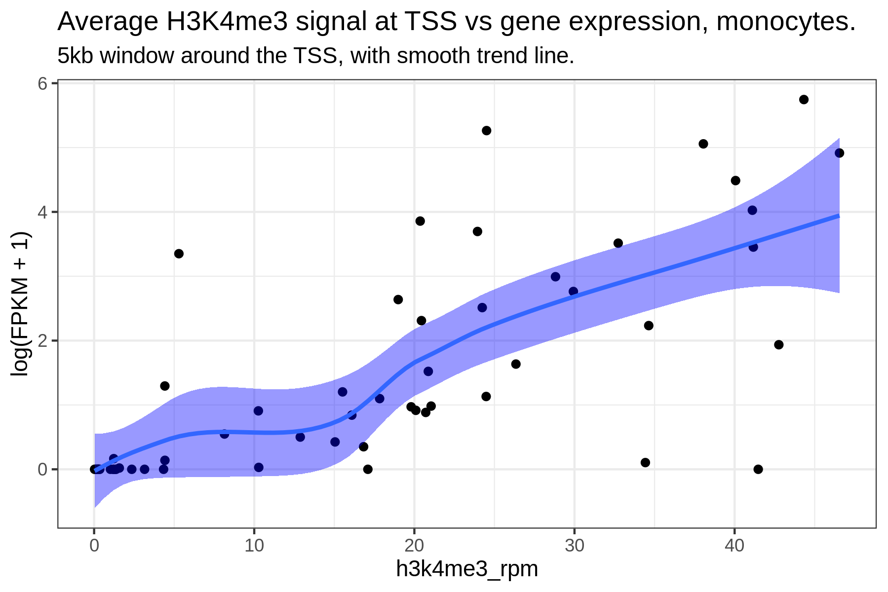
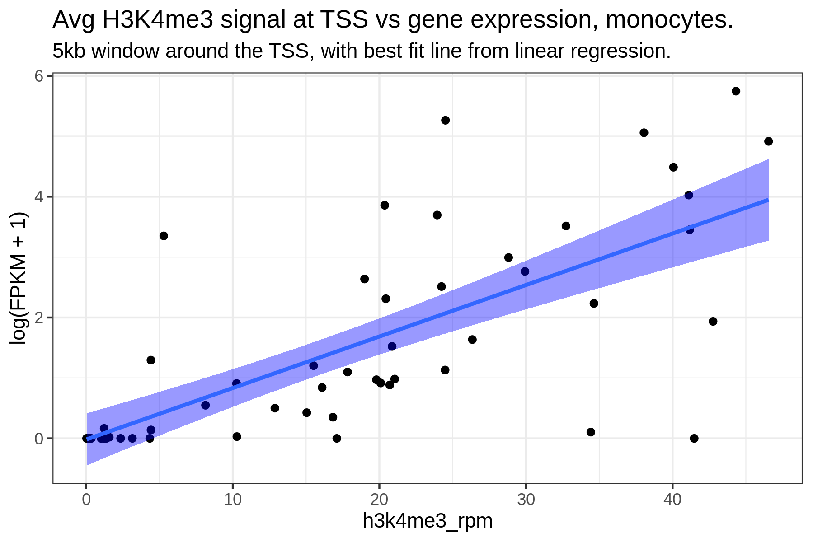
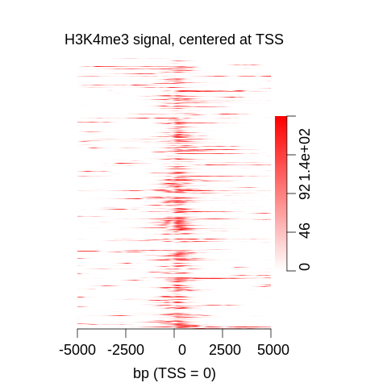
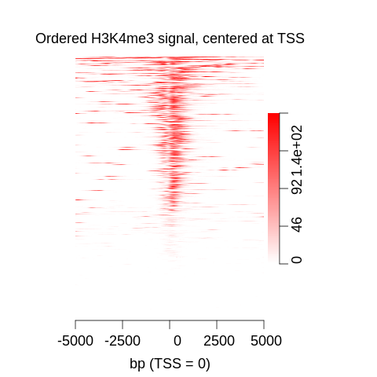
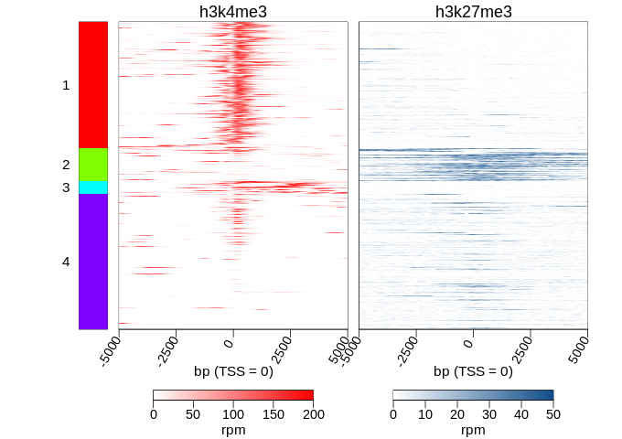
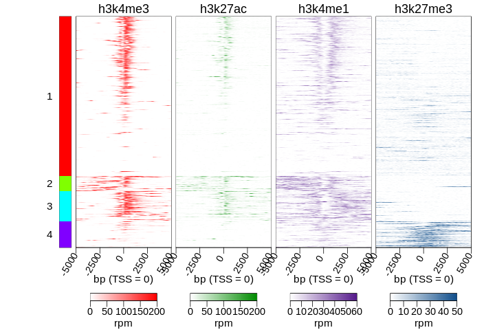

```{r setup, include=FALSE}
suppressPackageStartupMessages({
  library(learnr)     # 0.10.1.9006 (github)
  library(gradethis)  # 0.1.0.9004  (github)
  library(testthat)   # 3.0.0 
  library(tidyverse)  # 1.3.0
  library(learnr.proto)
 
  library(IRanges)
  library(GenomicRanges)
  library(rtracklayer)
  library(GenomicFeatures)
  library(genomation)
  library(ggthemes)

  # configuration
  options("tutorial.storage"="local")  # save progress in ~/.local/share/R/ see https://bit.ly/3oNP3kF
  knitr::opts_chunk$set(echo=FALSE, message=FALSE)
  gradethis::gradethis_setup()
  
  # data accessible to all exercises
  # see extdata/prepdata.Rmd --> section "week 3"
  # tss_chr19_60genes and quantification_chr19_sample correspond to the windows of which we have data in the bigWig files
  rdata = system.file("extdata", "week3.Rdata", package = "learnr.proto")
  load(rdata)
  rm(rdata)  
  
  ## bw file locations, see extdata/prepdata.Rmd for how these were generated. 
   bw_h3k4me3_60genes <- system.file("extdata", "week3", "bw_chr19_tss_sample", "C000S5H2.ERX547984.H3K4me3.bwa.GRCh38.20150528.chr19_chr19tss_60Genes_10kb.bw", package = "learnr.proto")
   bw_h3k4me1_60genes <- system.file("extdata", "week3", "bw_chr19_tss_sample", "C000S5H2.ERX547981.H3K4me1.bwa.GRCh38.20150528.chr19_chr19tss_60Genes_10kb.bw", package = "learnr.proto")
   bw_h3k27me3_60genes <- system.file("extdata", "week3", "bw_chr19_tss_sample", "C000S5H2.ERX547983.H3K27me3.bwa.GRCh38.20150528.chr19_chr19tss_60Genes_10kb.bw", package = "learnr.proto")
   bw_h3k27ac_60genes <- system.file("extdata", "week3", "bw_chr19_tss_sample", "C000S5H2.ERX547980.H3K27ac.bwa.GRCh38.20150528.chr19_chr19tss_60Genes_10kb.bw", package = "learnr.proto")

  ## color palettes for heatmaps
  # color palette for h3k4me3
  colors_h3k4me3 <- colorRampPalette(c ("white", "red"))(100)
  # color palette for h3k4me1
  colors_h3k4me1 <- colorRampPalette(c ("white", "purple4"))(100)
  # color palette for h3k27ac
  colors_h3k27ac <- colorRampPalette(c ("white", "green4"))(100)
  # color palette for h3k27me3
  colors_h3k27me3 <- colorRampPalette(c ("white", "dodgerblue4"))(100)
})
```

```{r stop_when_browser_closes, context="server"}
# stop the app when the browser is closed (or refreshed*)
#   *there is **no way** to distinguish between refresh and browser (tab) closing
# this is required as closing the browser window prevents the timeout below from working.
session$onSessionEnded(stopApp)
```

```{r timeout1, context="server"}
# The timeout chunks stop the tutorial if it has been idle for too long
# Their purpose is to keep the server running smoothly

# Method: 
# This chunk (timeout1) sends a unique identifier "session_id" to timeout2.
# When the session has been running idle for longer than "timeoutSec" seconds,
# timeout2 will update shiny variable "input[[session_id]]" .
# This signal is then be used in timeout1 to stop the session.

# obtain the session's ID and send it to the javascript chunk
isolate({
  session_id <- sub('<environment: (.*)>', '\\1', capture.output(session$userData))
  session$sendCustomMessage("session_id", session_id)
})

# stop the tutorial when "input[[session_id]]" is updated
observeEvent(input[[session_id]], ignoreNULL=T, {
  write(paste0("\nTutorial terminated due to inactivity.\nRestart to continue where you left off!\n"), stderr())
  stopApp()
})

# source 1: https://shiny.rstudio.com/reference/shiny/latest/session.html
# source 2: https://stackoverflow.com/questions/18900955/get-environment-identifier-in-r
```

```{js timeout2}
$(function() {
  var timeoutSec = 20*60;  // <-- change as desired
  var idleTimer;

  // receive this session's ID
  Shiny.addCustomMessageHandler("session_id", function(s_id) {
    session_id = s_id;  // assigns the variable globally
  });

  // update "input[[session_id]]" when called
  function onTimeout() {
    alert("Tutorial stopped due to inactivity.\nRestart to continue where you left off!")
    Shiny.setInputValue(session_id, "TRUE");
  }

  function startIdleTimer() {
    if (idleTimer) clearTimeout(idleTimer);
    idleTimer = setTimeout(onTimeout, timeoutSec * 1000);
  }
  
  // (re)set timeout upon user input
  $(document).on('shiny:message shiny:inputchanged', startIdleTimer);

})();

// source 1: https://community.rstudio.com/t/keeping-track-of-idle-time-during-app-usage/1735
// source 2: https://bookdown.org/yihui/rmarkdown/language-engines.html#javascript-and-css
```

```{js open_links_in_new_tab}
// open all links starting with http(s) in a new tab
$(function() {
  var links = document.getElementsByTagName('a');
  for (var i = 0; i < links.length; i++) {
    if (/^(https?:)?\/\//.test(links[i].getAttribute('href'))) {
      links[i].target = '_blank';
    }
  }
})();

// source: https://yihui.org/en/2018/09/target-blank/
```

```{r log_user, context="server"}
# log the first time a user starts this tutorial.

tutorial = "fg3"
log_path = "/scratch/fg_log"  # make this dir and set 777 permissions!

if (file.access(log_path, 7)[[1]] == 0 ){
  date = Sys.Date()
  user = basename(path.expand("~"))
  log_name = paste0(tutorial, "_", user, "_", date)
  log_file = file.path(log_path, log_name)
  
  logs = list.files(log_path)  # all currently existing logs
  substring = paste0(tutorial, "_", user)  # date is unimportant
  log_exists = any(lapply(logs, startsWith, substring) == TRUE)
  if (!log_exists){
    invisible(file.create(log_file))
    system(paste0("chmod 777 ", log_file))
  }
}
```


## Attendance

Please fill in your name and student number below and hit "Submit Answer" (the button will then disappear). At the end of the tutorial, print your answers and upload the PDF to Brightspace.

```{r who_are_you, echo=FALSE}
question_text(
  "Enter your name & student number",
  placeholder = "name s123456",
  answer("Little nosey, aren't we?", correct=TRUE),
  incorrect=NULL,  # hide the red button
  allow_retry = FALSE  # prevent cheating
)

# alternative:
# https://stackoverflow.com/questions/63894794/create-an-open-ended-question-with-learnrtutorial-in-r
```

## 3.1 Introduction   
### 3.1.1 Recap fg2  
In week 2 we quantified and visualized the overlap between histone peaks and promoters and examined the association between the presence/absence of a histone mark and gene expression.   

### 3.1.2 This week's topic  
This week you will investigate the ChIP-seq data further by including the actual signal from the bigwig files in your analysis. You will generate plots displaying the distribution of the ChIP-seq signal around certain genomic positions, here a set of transcription start sites to answer common questions like: "*What is the signal of the mark around the TSS?*", "*What is the relationship between histone ChIP-seq signal intensity and gene expression?*", and "*What are the chromatin states in my dataset?*".  
<br>
The plots that display the ChIP-seq signal around the TSS include an average signal profile and a heatmap. You could use dplyr-related functions and ggplot-ting to achieve this but it is much more convenient to use functions from dedicated packages for these tasks.   
<br>
We have chosen for the [genomation](https://github.com/BIMSBbioinfo/genomation) package for this purpose because it is compatible with the file types that we have available. (Side note: there are a number of other packages to analyze ChIP-seq data we well. Incl. ChIPpeakAnno and ChIPseeker.)   
<br>
We have installed and loaded this package for you with the following code:  
```{r install_genomation, echo = T, eval =FALSE}
BiocManager::install("genomation")
library(genomation)
```

##### Used resources   

- Data were obtained from the [BLUEPRINT data portal](http://dcc.blueprint-epigenome.eu/#/home).    
- Akalin A, Franke V, Vlahovicek K, Mason C, Schubeler D (2014). “genomation: a toolkit to summarize, annotate and visualize genomic intervals.” Bioinformatics. doi: 10.1093/bioinformatics/btu775.  
- [Genomation package vignette](http://bioconductor.org/packages/release/bioc/vignettes/genomation/inst/doc/GenomationManual.html).   
- [ChromHMM Tutorial by Jason Ernst](https://www.genome.gov/Multimedia/Slides/ENCODE_ASHGTutorial_Oct2015/07_Ernst.pdf)  

### 3.1.3 Learning Objectives  

> At the end of week 3 you are able to:  
> 
1. Identify the nearest TSS to a histone ChIP-seq peak.  
3. Plot the distribution of distances between ChIP-seq peaks and the nearest TSS.      
2. Import coverage data from bigWig files into r.  
4. Plot the average histone ChIP-seq signal around a genomic feature like the TSS.  
5. Plot the relationship between the average ChIP-seq signal at the TSS and gene expression.   
6. Plot ChIP-seq signal around a genomic feature in a heatmap figure.  
7. Order the heatmap of (6) by gene expression.  
8. Cluster the heatmap of (6) based on ChIP-seq signals of different marks.  
9. Annotate the clusters identified in a ChromHMM heatmap based on histone PTM ChIP-seq data. 

### 3.1.4 Tutorial specs  

(These are the same as last week.)  

- **Answers will be saved** each time you close your session and will be loaded if you restart the tutorial. Unless you hit `Start over` at the bottom of the table-of-contents.      

- At the end of the tutorial you are instructed to **print a pdf report of the tutorial** (incl. your answers).   

- To reserve server space to *active* running tutorials, and stop those that aren't actively used anymore, **we set a time limit to 25 minutes** meaning that if your tutorial has been idle for over 25 minutes, you will see the warning "Tutorial stopped due to inactivity. Restart to continue where you left off!". When you see this warning, you should close the browser with the tutorial and restart the tutorial. As progress is saved, you can continue where you left once you restart the tutorial.   

- Links to reference material and used resources are formatted with `r colorize("light blue font", col = "dodgerblue")`. It is advised to open these links using the "right-mouse click \-\-\> Open in a new browser tab" strategy. If you click on the links straight away, you are directed away from the tutorial.   

- Reading of references and background material **is not required and not taken into account when estimating the time-required** for this tutorial!   

### 3.1.5 About the exercises  

(These are the same as last week.)    

* In this tutorial you will have multiple-choice and check-the-box questions like in fg1 but also **complete-the-code exercises**. The latter are sometimes evaluated on the printed object or summary (e.g a the top part of an object). At other times, the code itself is checked. When the code is evaluated we added "(code check)" to the question. In these cases, R will give custom feedback that helps you correct your code.      

* Due to technical reasons, when you hit Submit Answer of "(code check)" exercises, the output (if there is any) will not be printed. Eg a plot won't be shown. To visualize the plot, you must you use `Run Code`.  

* For short lines of code, you have to decide which function or object to use and how to write this in code. For some longer lines of codes, we left blanks as '\_\_\_' that indicate where in the code you should fill in a function, object or variable. Make sure fill out all the blanks before Answer submission, they will otherwise result in errors.  

* Hit `Hint` (when provided) for clues. Due to technical reasons **you can't go back to previous hints, so make sure you read them well.**        

* Hit `Run Code` to test your code and preview the output (but make sure no '\_' are left).  

* Hit `Submit Answer` (if present) to submit the code for evaluation (make sure no '\_' are left).      

* Try to keep yourself from hitting `Solution` (when provided). Only use it when you do not understand the automatic feedback given by R.   

* Hit `Start Over` in the header of the exercise to remove any adjustments you made and start again.   

Although we ask for specific answers or completion of specific code, you are free to test your own code and use `Run Code` and `Start Over`. I.e., remove the pre-coded code and write your own code for a different graph or different summary of the data. Use `Run Code` to preview the results. Unfortunately these newly created codes can not be evaluated. For the evaluation you need to use our pre-coded code. Hit `Start Over` to get this pre-coded code.  
<br>

### 3.1.6 Need help?  
You are allocated to Breakout rooms in Zoom (or you can select one yourself). Either way, use the Breakout rooms to discuss questions and difficulties with your peers. If you still have question, use the "raise hand" option to notify the host of the session.     

## 3.2 Identify nearby TSSs  
### 3.2.1 Identify the nearest TSS   
First, let's identify the nearest TSS and plot the distance between a histone mark and its nearest TSS (in contrast to identifying strict overlap as in **fg2**). In an attempt to speed up the tutorial, we have reduced the size of the dataset by randomly selecting 100 H3K4me3 peaks (on chromosome 19).      

### Exercise 1a    

> **Exercise 1a**: Recap, which of the commands below imports the peaks table into a GRanges object?  

```{r q1_mc_import}
question("Which function imports the H3K4me3 peaks into a GRanges object?",
         answer("import(\"h3k4me3_peaks.chr19.bed\", format = \"narrowPeak\")", correct =TRUE),
         answer("import(\"h3k4me3_peaks.chr19.bed\", format = \"BED\")", message = "BED is not the right format."),
         answer("import(\"h3k4me3_peaks.chr19.bed\", format = \"broadPeak\")", message = "check the file format."),
         answer("read.table(\"h3k4me3_peaks.chr19.bed\", format = \"broadPeak\")", message = "read.table parses the data into a data.frame while we asked for a GRanges object."),
         allow_retry =TRUE,
         random_answer_order =TRUE)
```

### Exercise 1b  
To identify the nearest TSS, you use the `distance2NearestFeature()` function:   

```{r nearestfeature_example, eval=FALSE, echo=TRUE}
distance2NearestFeature(g.idh = [chip_peaks_in_GRanges], 
                        tss = [TSSs_in_GRanges])  
```

> **Exercise 1b**: Identify the nearest TSS for each H3K4me3 ChIP-seq peak in your dataset.  
> 
- H3K4me3 peaks in monocytes are stored in `monocytes_h3k4me3_sample`.   
- TSS locations are stored in object `tss_chr19_ex1`.  
- Print the first five rows of the resulting object using `head()`.     

```{r q1_distancetss, exercise=TRUE, exercise.lines = 5, exercise.eval=FALSE, error=TRUE}
# 1. Identify the nearest TSS for each H3K4me3 peak  
dist_h3k4me3_to_tss <- __(g.idh = __, tss = __)

# 2. Print the first few lines of 'dist_h3k4me3_to_tss' with head()
___
```

```{r q1_distancetss-hint-1}
# use the function distance2NearestFeature()
```

```{r q1_distancetss-hint-2}
# within distance2NearestFeature define g.idh as:
g.idh = monocytes_h3k4me3_sample
```

```{r q1_distancetss-hint-3}
# and tss as:
tss = tss_chr19_ex1
```

```{r q1_distancetss-hint-4}
# finish with 
# head(dist_h3k4me3_to_tss)
```

```{r q1_distancetss-check}
grade_result(
  pass_if(~identical(.result, head(distance2NearestFeature(monocytes_h3k4me3_sample, tss_chr19_ex1)))),
  correct = "This object, 'dist_h3k4me3_to_tss' is a data.frame reporting for each H3K4me3 peak its nearest TSS, the name (Entrez gene ID) of the corresponding gene, and the distance between them. Which variable reports the distance?"
)
```

* **Important to note**: there are negative and positive distances reported in `dist_h3k4me3_to_tss$dist.to.feature`. Negative values indicate that the H3K4me3 peak is located **upstream** the TSS, positive values refer to H3K4me3 peaks located **downstream** the TSS.   


### 3.2.2 Summarize distances between ChIP peaks and features  
Let's summarize the reported distances between H3K4me3 peaks and their nearest TSS.    

### Exercise 2a   

> **Exercise 2a:** Print a summary of the distances reported in `dist_h3k4me3_to_tss` using the `summary()` function.
> 
> * Tip: Look at the output of exercise 1b to identify the variable that stores the distances.   

```{r prepare_q2a, echo =FALSE}
 dist_h3k4me3_to_tss <- distance2NearestFeature(monocytes_h3k4me3_sample, tss_chr19_ex1)
```

```{r q2a_summary, exercise =TRUE, exercise.eval =FALSE, error = T, exercise.setup = "prepare_q2a"}
# print a summary of the distances

```

```{r q2a_summary-hint-1}
# We want a summary of 
dist_h3k4me3_to_tss$dist.to.feature
```

```{r q2a_summary-check}
grade_result(
  pass_if(~identical(.result,summary(dist_h3k4me3_to_tss$dist.to.feature))),
  correct = "Examine the reported values, within what range of the TSS are 50% of the peaks located (1st Quartile - 3rd Quartile)?"
)
```

```{r q2a_plotdistances_mc}
question("Which of the following statments are correct?" ,
         answer("Over 50% of the datapoints fall within 10kb up- or downstream the TSS", correct = T, message = "Indeed, over 50% of H3K4me3 peaks are within +/- 10kb of the TSS. But also notice the  outliers: some peaks are assigned to TSSs that are over 100kb away! Although H3K4me3 is generally enriched at promoters, it thus also found further away from the promoter. These 'distant' H3K4me3 peaks may be truely H3K4me3 enriched sites but may also be H3K4me1 peaks in enhancers that are detected in this ChIP due to cross-reactivity of the H3K4me3 antibody. Alterantively, through chromosomal looping between enhancer and promoter, these regions might be co-immunoprecipitated with the H3K4me3 ChIP."),
         answer("Less than 50% of the datapoints fall within 10kb up- or downstream the TSS", message= "Review the output of question 2a. Take a carefull look at the 1st and 3rd Quartile values."),
         allow_retry=TRUE)
```


### Exercise 2b  

> **Exercise 2b:** Plot the distances from `dist_h3k4me3_to_tss` using ggplot() and geom_histogram().  

>#### **Refresher**: histograms   
<details><summary>Click here for a quick explainer on histograms and the importance of the **binwidth** paramter.</summary>   
**Histograms** visualize the distribution of a single variable. Events are grouped into bins with comparable values and the number of events per bin is counted and these counts are visualized.  
<br>
Because histograms are made by binning the data, the bin width is a critical parameter that will affect the appearance of the graph. Choosing a bin width that is too small will result in a overly busy and peaky histogram making it difficult to discern the main trends. If the bin width is too large, then smaller features of the distribution may dissapear.  
<br>
In practice, if you generate a histogram, always explore multiple bin widths besides the default settings.   
<br>
In geom_histogram(), the bin width can be set by:  
> 
- Specify the parameter "binwidth", eg `binwidth = 5`   
- Specify the parameter number of bins with the "bins" paramter, eg. 10, 50 or 100.  
</details>  

```{r q2b_plotdistances, exercise =TRUE, exercise.eval =FALSE, error = T, exercise.setup = "prepare_q2a"}
# plot the distances reported in 'dist_h3k4me3_to_tss' as histogram with ggplot
ggplot(data = ___)+
  ___(aes(x = ___), bins = 25)+
  scale_x_continuous(limits=c(-1e5, 1e5)) # set limits to exclude outliers from the plot
```

```{r q2b_plotdistances-hint-1}
# use the output from exercise 1b as the input for ggplot
```

```{r q2b_plotdistances-hint-2}
# use the geom_histogram function
```

```{r q2b_plotdistances-hint-3}
# set the variable with the distance on the x axis

```

```{r q2b_plotdistances-hint-4}
# eg
  geom_histogram(aes(x=dist.to.feature), bins = 25)
```

```{r q2b_plotdistances-solution}
ggplot(data = dist_h3k4me3_to_tss)+
  geom_histogram(aes(x = dist.to.feature), bins = 25)+
  scale_x_continuous(limits=c(-1e5, 1e5))
```

```{r q2b_plotdistances-code-check}
grade_code()
```


## 3.3 ChIP-seq signal strength   
### 3.3.1 ChIP-seq signal introduction  
Distance and overlap may tell you which gene the mark is most likely associated with. For example, in fg2 we observed that the presence and absence of H3K4me3 and H3K27me3 at a gene's promoter are associated with its level of gene expression. But there is more to it!  
<br>
Not only the presence or absence but the actual signal from ChIP-seq marks can be associated with the expression level of the gene in question. Such associations between ChIP-seq signal strength and gene expression - being it positive or negative associations - point to a functional relationship. Think of the histone PTM recruiting basal transcription factors thereby promoting transcription (as is the case for H3K4me3) or - the other way around - the placing of marks by proteins recruited to the transcriptional machinery in elongation mode (as is the case for H3K36me3).  
<br>
In both cases you will observe a positive association between ChIP-seq signal strength and gene expression. In research, such observations (or the absence thereof) provide valuable insights in the function of a mark and can help you design follow-up experiments.   
<br>
Let's look at these relationships in real data.   

### 3.3.2 Importing ChIP-seq signal in r   
ChIP-seq signal can be obtained from BAM files or bigWig files. Remember from week 1, BAM files contain records of read alignments with 1 line per read. The bigWig files do not store individual reads but the coverage across the genome, often normalized per million mapped reads.   
<br>
Not all packages and functions are compatible with both file types and the resulting plots may look slightly different in part because BAM files - as they store read information -  give you more freedom to define how coverage is calculated. You will use the data from bigWig files today as those are provided by the BLUEPRINT project.     
<!-- REF: https://www.bioconductor.org/packages/release/bioc/vignettes/genomation/inst/doc/GenomationManual.html#4_Extraction_and_visualization_of_genomic_data   -->
<br>
We limited the data stored in the bigWig files to a **10kb window around the TSSs of 60 genes on chromosome 19 (genes were randomly selected)**. This was done to reduce the size of these files (bigWig and BAM files are huge!) and speed up the tutorial a bit. By taking a *random* selection, the relationships present in the genome-wide dataset should till hold in the sampled dataset. However, because of this decision you can't make plots of windows wider than 10kb and the plots may have low resolution. For certain exercises we therefore prepared similar plots in advance using *all TSSs* on chromosome 19 (having more regions increases the resolution and helps you identify the trends and relationships in the data).  


### Exercise 3  
You will plot the average H3K4me3 ChIP-seq signal strength around the TSS.  

A trick that prevents loading complete bigWig files in your environment is to load only the the regions of interest; in this case the window around the TSS. You load the signal into r with the `ScoreMatrix()` function from the genomation package:  

```{r scorematrixcode, eval=FALSE, echo=TRUE}
ScoreMatrix(target = [path_to_bigWig_file], 
            windows = [GRanges_object_with_windows_of_interest],  # 'windows' can also be called 'intervals' or 'regions'
            type = "bigWig", 
            strand.aware = [TRUE/FALSE], 
            ...)
```

* To take the strand of the TSS into account, we set `strand.aware=TRUE`.   
* Every row in the resulting ScoreMatrix object corresponds to a window of the `[GRanges_object_with_intervals_of_interest]`.  
* Every column in the resulting ScoreMatrix object is a bp within that window (see the image below).   
* `...` means that there are additional, optional arguments, some of which we will come back to later on in the tutorial.  

  {width=50%}\   
  *Modified from the [Genomation vignette](https://www.bioconductor.org/packages/release/bioc/vignettes/genomation/inst/doc/GenomationManual.html#1_Introduction): "genomation: a toolkit for annotation and visualization of genomic data", version 2020-10-27.*

<br>   
The GRanges object `tss_chr19_60genes` contains the TSSs (1bp) of which we also have data in the bigWig files. The window is currently 1bp but we want to plot the signal *around* the TSS. You thus need to resize these 1bp intervals to the window that you are interested in. You can achieve this with the `resize()` function from the GenomicRanges package:  

```{r resizexcode, eval=FALSE, echo=TRUE}
resize(x = [GRanges_object], width = [desired_width], fix = ["start", "end" or "center"])
```

* If we want a window of 20kb around the TSS, use `width = 200001` (20kb window + 1bp for the TSS itself).  
* As we want to have a window *around* the TSS we set the `fix = "center"`.  

<br>

> **Exercise 3a**: Complete and then run the code below to obtain the H3K4me3 signal in a **10kb** window around the TSSs.  
>
> * The object `bw_h3k4me3_60genes` points to the H3K4me3 ChIP-seq bigWig file.  

```{r q3a_h3k4me3_scores, exercise=TRUE, exercise.eval=FALSE, error=TRUE}
# 1. Define the window size 
window <- ____ 

# 2. Resize the TSS interval to this window.
tss_window_60genes <- ____(x = tss_chr19_60genes, width = window, fix = "___")

# 3. Read in H3K4me3 ChIP-seq data from bigWig file in these TSS windows
scores_h3k4me3_tss <- ____(target = ____, windows = ___, type = 'bigWig', strand.aware =TRUE)  

# 4. What is the structure of `scores_h3k4me3_tss`?   
str(scores_h3k4me3_tss)
```

```{r q3a_h3k4me3_scores-hint-1}
# In step 1 you need to give a value
```

```{r q3a_h3k4me3_scores-hint-2}
# For step 1 we want a window of 10kb + 1bp for the TSS
```

```{r q3a_h3k4me3_scores-hint-3}
# thus step 1 should be
window <- 10001
```

```{r q3a_h3k4me3_scores-hint-4}
# use this function resize() to resize `tss_chr19_60genes`
```

```{r q3a_h3k4me3_scores-hint-5}
# use this function ScoreMatrix() to create the scorematrix
```

```{r q3a_h3k4me3_scores-hint-6}
# the target should be bw_h3k4me3_60genes
```

```{r q3a_h3k4me3_scores-hint-7}
# the windows should be the resized windows around the TSS
```


```{r q3a_h3k4me3_scores-check}
grade_result(pass_if(~identical(.result, str(ScoreMatrix(target = bw_h3k4me3_60genes, 
                                                    windows = resize(x = tss_chr19_60genes, width = 10001, fix = "center"), 
                                                    type = 'bigWig', strand.aware =TRUE)))))
```

```{r q3a_mc_h3k4me3_scores}
question("What is the 'class' of the resulting object 'scores_h3k4me3_tss'?",
         answer("ScoreMatrix", correct =TRUE, message = "The object `scores_h3k4me3_tss` is of formal class ScoreMatrix, which is related to a basic matrix but - as it says - 'more formal'. In other words, it has special functions to retrieve and set the data. We won't go into the details of these differences with basic matrices but focus on how we can use this result. What you will notice later on in the tutorial is that for some calculations and dplyr-manipulations we convert this ScoreMatrix to a matrix."),
         answer(".Data", message = "It is not a .Data. The '.Data' is a so-called slot within the 'scores_h3k4me3_tss' object but is not its class. Review the output of the 'str(scores_h3k4me3_tss)' again."),
         answer("List", message = "It is not a List. Review the output of the 'str(scores_h3k4me3_tss)' again."),
         answer("matrix", message = "It is not a matrix. Review the output of the 'str(scores_h3k4me3_tss)' again."),
         allow_retry =TRUE,
         random_answer_order =TRUE)
```

### 3.3.3 Plot the average H3K4me3 signal around the TSS   
You can plot the average H3K4me3 signal over this window with the `plotMeta()` function:  

```{r plotmeta_example, eval=FALSE, echo=TRUE}
plotMeta(mat = [ScoreMatrix_object], xcoords = c([start,end]), ...)
```  

* Use the `xcoords =` parameter to define relative base positions for the x-axis and set the TSS at base '0'.   
* `...` means that there are additional, optional arguments, some of which we will come back later on in the tutorial.   

### Exercise 3b  

> **Exercise 3b**: Plot the average H3K4me3 signal around the TSS with `plotMeta()`    

> * `scores_h3k4me3_tss` of exercise 3a is available.  
> * Note that we set `xcoords = c(-5000, 5000)` for you, as our window was 10kb.  

```{r prepare_q3b}
tss_window_60genes <- resize(tss_chr19_60genes, width = 10001, fix = "center")
scores_h3k4me3_tss <- ScoreMatrix(target = bw_h3k4me3_60genes, windows = tss_window_60genes, type = 'bigWig', strand.aware =TRUE) 
```

```{r q3b_h3k4me3plot, exercise =TRUE, exercise.eval=FALSE, error=TRUE, exercise.setup = "prepare_q3b"}
# Generate a plot showing the average H3K4me3 signal over a 10kb window around the TSS
___(mat = ___, xcoords = c(-5000, 5000))
```

```{r q3b_h3k4me3plot-hint-1}
# In the "mat =" parameter you should give the ScoreMatrix object which holds the scores to be plotted.....  
```

```{r q3b_h3k4me3plot-hint-2}
# ....in other words, the output of exercise 3a
```

```{r q3b_h3k4me3plot-hint-3}
# eg
___(mat = scores_h3k4me3_tss, ___)  
```

```{r q3b_h3k4me3plot-hint-4}
# the function to make the plot is plotMeta()
```

```{r q3b_h3k4me3plot-check}
# gradethis tries to save the plots.
# since users have no write permission, this goes wrong without this.
pdf(NULL)  

grade_result(
  pass_if(~identical(.result, plotMeta(mat = scores_h3k4me3_tss, xcoords = c(-5000, 5000)))),
  correct = "The signal you get with only  60 genes in the dataset is a bit noisy. Open the dropdown box of exercise 3c to view the same plot generated using all TSSs on chromosome 19. Use that example plot to answer the multiple choice questions.")
```

```{r q3b_h3k4me3plot_meake_exampleplot, eval=FALSE, echo=FALSE}
bw_h3k4me3 <- "/home/ctoenhake/learnr.proto/inst/extdata/week3/bw_chr19/C000S5H2.ERX547984.H3K4me3.bwa.GRCh38.20150528.chr19.bw"

library(TxDb.Hsapiens.UCSC.hg38.knownGene)
txdb <- TxDb.Hsapiens.UCSC.hg38.knownGene 
seqlevels(txdb) <- seqlevels0(txdb)
seqlevels(txdb) <- "chr19"
tss_chr19 <- unique(promoters(genes(txdb), upstream = 2000, downstream = 0 )) 
tss_chr19 <- resize(tss_chr19, width = 1, fix = "end")
tss_window <- resize(tss_chr19, width = 10001, fix = "center")

scores_h3k4me3_tss_chr19 <- ScoreMatrix(target = bw_h3k4me3, windows = tss_window, type = 'bigWig', strand.aware =TRUE) 
plotMeta(mat = scores_h3k4me3_tss_chr19, xcoords = c(-5000, 5000))
# save as "q3b_averageprofile_h3k4me3_tss.png"
```

### Exercise 3c  

> #### **Exercise 3c example result**     
<details><summary>Click here for the Average profile of H3K4me3 around all TSSs of chromosome 19.</summary>  
<br>
\  
<br>
</details>

<br>

>**Exercise 3c**: Use the example plot above to answer the following questions.    

```{r q3c_mc_densityplot}
quiz(caption="",
  question("Which function would you change and how, to make sure that the signal in the plot is limited to +/-3kb around the TSSs?",
         answer("Change the xcoords parameter in 'plotMeta', set it to c(-3000, 3000).", message = "Changing the xcoords parameter only changes the thickmarks on the x-axis but does not change the actual window size of the interval."),
         answer("Filter the ScoreMatrix 'scores_h3k4me3_tss' for columns c(-3000, 3000).", message = "We could filter the matrix indeed but these are not the correct columns as there are no 'negative' columns."),
         answer("Change the width parameter in 'resize', set it to 6001.", correct = TRUE),
         allow_retry = TRUE,
         random_answer_order = TRUE), 
     question("Is H3K4me3 signal equally strong up- and downstream the TSS or is there a difference?",
              answer("H3K4me3 signal appears equal up- and downstream the TSS.", message = "Look at the plot, the y-axis gives the H3K4me3 signal, the TSS is located at x=0."),
              answer("H3K4me3 signal is lower downstream the TSS compared to upstream.", message = "Review what is 'upstream' and what is 'downstream'."),
              answer("H3K4me3 signal is higher downstream the TSS compared to upstream.", correct = TRUE, message = "Indeed, H3K4me3 signal is on average higher downstream the TSS."),
              allow_retry = TRUE,
         random_answer_order =TRUE),
  question("Where, approximately, is the average H3k4me3 signal the strongest?",
           answer("2kb upstream the TSS", message = "Review what is 'upstream' and what is 'downstream' and look carefully at the x-axis scale."),
           answer("200bp upstream the TSS", message = "Review what is 'upstream' and what is 'downstream'."),
           answer("At the TSS", message = "The TSS is at position '0' and at that position we actually see a dip in the H3k4me3 signal."),
           answer("200bp downstream the TSS", correct = TRUE, message = "This peak marks the first nucleosome downstream the TSS. This is of all nucleosomes found in and around the gene body, the one with the tightest positioning. This peak is characteristic for H3K4me3 marking around the TSS, you will see it in other human datasets as well."),
           answer("2kb downstream the TSS", message = "Not 2kb, take a second look at the x-axis scale."),
           allow_retry = TRUE),
     question("What would the plot show, in case you would have set 'strand.aware=FALSE' in the 'ScoreMatrix()' function? Tip: You can add this adjusted ScoreMatrix() function to the chunk of 3b and plot the scores with plotMeta in that same chunk.",
              answer("H3K4me3 signal appearing equal up- and downstream the TSS", correct = TRUE, message = "As TSS are randomly distributed over strands, setting strand.aware to FALSE will lead to a plot where H3K4me3 signal appears equally strong before and after the TSS while in reality it is stronger downstream the TSS."),
              answer("H3K4me3 signal would appear lower downstream the TSS compared to upstream.", message = "Realize that randomly distributed over strands while the H3K4me3 signal around the TSS is related to the directionality."),
               answer("H3K4me3 signal would appear higher downstream the TSS", message = "Realize that randomly distributed over strands while the H3K4me3 signal around the TSS is related to the directionality."),
              allow_retry = TRUE,
         random_answer_order =TRUE),
     question("What could explain the slight decrease in signal at pos. 0?", 
              answer("The nucleosome depleted region found upstream the TSS", correct = TRUE, message = "This region varies in size. The physical properties of the DNA, transcription factors and chromatin remodellers influence its formation and size."),
              answer("The binding of specific TFs at the TSS."),
              answer("The TSS itself is marked by H3K4ac instead of H3K4me3"),
              allow_retry = TRUE,
         random_answer_order =TRUE)
)
```

### 3.3.4 Plot average H3K27ac signal     
Let's look at another promoter mark: does H3K27ac show the same shape and signal strength?  

### Exercise 4   

> **Exercise 4**: Generate a plot of the average H3K27ac signal in a **10kb** window around the TSS.  
> 
> * `tss_chr19_60genes` contains the TSS of which we have signal in the BigWig file, but these TSSs are 1bp wide and we need a 10kb window.  
> * The object `bw_h3k27ac_60genes` directs to the H3K27ac ChIP-seq bigWig file.  

```{r q4_h3k27ac_density, exercise=TRUE, exercise.eval=FALSE, error=TRUE}
# 1. resize the tss interval to this 10kb+1bpTSS
tss_window_60genes <- ___(x = ___, width = ____, fix = "___")

# 2. Create H3K27ac ScoreMatrix for the 10kb TSS windows.
scores_h3k27ac_tss <- ___(target = ___,
                          windows = ___,
                          type = 'bigWig', 
                          strand.aware =TRUE)  

# 3. Generate the plot with average H3K27ac scores 
# Make sure you match every '(' with a ')'
___(mat = ___, xcoords = ___)
```

```{r q4_h3k27ac_density-hint-1}
# Look for the function you need in step 1 back at exercise 3a
```

```{r q4_h3k27ac_density-hint-2}
# "target =" should direct to the bigWig file. 
```

```{r q4_h3k27ac_density-hint-3}
# Eg 
ScoreMatrix(target = bw_h3k27ac_60genes, .....)  
```

```{r q4_h3k27ac_density-hint-4}
# And the "windows =" to the GRanges object with the intervals
```

```{r q4_h3k27ac_density-hint-5}
# Eg 
ScoreMatrix(target = bw_h3k27ac_60genes, windows = tss_window_60genes, ....)  
```

```{r q4_h3k27ac_density-hint-6}
# You can copy-paste and adjust the plotMeta() function from exercise 3b to make the plot. 
```

<!-- ```{r q4_h3k27ac_density-solution} -->
<!-- # create H3K27ac ScoreMatrix for the 10kb TSS windows. -->
<!-- scores_h3k27ac_tss <- ScoreMatrix(target = bw_h3k4me1_60genes, windows = tss_window, type = 'bigWig', strand.aware =TRUE)   -->

<!-- # Generate the plot with average H3K27ac scores t -->
<!-- plotMeta(scores_h3k27ac_tss, xcoords = c(-5000, 5000)) -->
<!-- ``` -->


```{r q4_h3k27ac_density-check}
# gradethis tries to save the plots.
# since users have no write permission, this goes wrong without this.
pdf(NULL)

grade_result(pass_if(~identical(.result,plotMeta(mat = ScoreMatrix(target = bw_h3k27ac_60genes,
                                                                   windows = resize(x = tss_chr19_60genes, width = 10001, fix = "center"), 
                                                                   type = 'bigWig', strand.aware =TRUE) , xcoords = c(-5000, 5000)))),
             correct = "Looks a bit bumpy doesn't it? For exercise 4b we also prepared a plot using all TSSs on chromosome 19 in advance.")
```

### Exercise 4b  

```{r q4_h3k27acplot_make_exampleplot, eval=FALSE, echo=FALSE}
bw_h3k27ac <- "/home/ctoenhake/learnr.proto/inst/extdata/week3/bw_chr19/C000S5H2.ERX547980.H3K27ac.bwa.GRCh38.20150528.chr19.bw"

library(TxDb.Hsapiens.UCSC.hg38.knownGene)
txdb <- TxDb.Hsapiens.UCSC.hg38.knownGene 
seqlevels(txdb) <- seqlevels0(txdb)
seqlevels(txdb) <- "chr19"
tss_chr19 <- unique(promoters(genes(txdb), upstream = 2000, downstream = 0 )) 
tss_chr19 <- resize(tss_chr19, width = 1, fix = "end")
tss_window <- resize(tss_chr19, width = 10001, fix = "center")

scores_h3k27ac_tss_chr19 <- ScoreMatrix(target = bw_h3k27ac, windows = tss_window, type = 'bigWig', strand.aware =TRUE) 
plotMeta(mat = scores_h3k27ac_tss_chr19, xcoords = c(-5000, 5000))
# save as "q4_averageprofile_h3k27ac_tss.png"
```

> #### **Exercise 4b example result**     
<details><summary>Click here for the Average profile of H3K27ac around all TSSs of chromosome 19.</summary>  
Use this example plot and the example result of Exercise 3c to answer the multiple choice questions below.  
<br>
\  
<br>
</details>

<br>

```{r q4_h3k27ac_density_mc}
question("Compared to the average score profile of H3K4me3, the H3K27ac profile ... (select the correct statement)",
         answer("shows, on average, stronger signal scores around the TSS.", message = "The signal scores are plotted on the y-axis of the plot. Compare the values in plot from ex 3 with t he latest plot. Tip, look at the scale of  the y-axis."),
         answer("shows, on average, weaker signal scores around the TSS.", correct = T, message = "Comparing two profiles is easeier when plot them in one plot. Let's do that!"),
         answer("shows, on average, a wider region of enrichment around the TSS.", message = "Based on these two plots, the H3K27ac is not clearly wider on average than H3K4me3. Tip, look at the scale of  the y-axis."),
         answer("shows, on average, a more narrow region of enrichment around the TSS.", message = "Based on these two plots, the H3K27ac is not clearly narrower on average than H3K4me3. Tip, look at the scale of  the y-axis."),
         allow_retry=TRUE,
         random_answer_order=TRUE
         )
```

### 3.3.5 Multiple profiles in one plot  
We can observe differences and similarities between two ChIP-seq datasets with respect to their peak strength and peak shape better when we plot them in one plot. This can be achieved by generating a "ScoreMatrixList" object and providing that to the `plotMeta()` function:    

```{r example_scorematrixlist, echo=TRUE, eval=FALSE}
# 1. Generate a "ScoreMatrixList" object:   
ScoreMatrixList_object <- new("ScoreMatrixList",list([object1_name]=[ScoreMatrix_1], ..., [objectN_name]=[ScoreMatrix_N]))

# 2. Provide plotMeta with this "ScoreMatrixList":   
plotMeta(mat = ScoreMatrixList_object, 
         xcoords = c([start,end]),
         overlay = [TRUE/FALSE], 
         profile.names = [vector of names, used in the legend])
```

* The first argument in `new()` tells which type of object we want to make.  
* The second argument in `new()` is a list of ScoreMatrices with a custom name for each.  
* With `overlay=TRUE` the two density profiles are plotted in one plot.   
* With `overlay=FALSE` the two density profiles are plotted in separate plots with the same x- and y-axis limits and scales.  
* In `profile.names =` you can give a character vector of names, for every object in the ScoreMatrixList. These names will be used for the legend.   

### Exercise 5  

> **Exercise 5**: Complete the code below to generate one plot with the average signal profiles of H3K4me3 and H3K27ac in a 10kb window around the TSS.  
>
> * The objects `scores_h3k4me3_tss` and `scores_h3k27ac_tss` of Exercise 3  ([3.3.2 Importing ChIP-seq signal in r]) and Exercise 4 ([3.3.4 Plot average H3K27ac signal]) are available to you.   

```{r prepare_q5, echo=FALSE}
tss_window_60genes <- resize(x = tss_chr19_60genes, width = 10001, fix = "center")
# scores for h3k4me3
scores_h3k4me3_tss <- ScoreMatrix(target = bw_h3k4me3_60genes, windows = tss_window_60genes, type = 'bigWig', strand.aware =TRUE) 

# scores for h3k27me3 
scores_h3k27ac_tss <- ScoreMatrix(target = bw_h3k27ac_60genes, windows = tss_window_60genes, type = 'bigWig', strand.aware =TRUE)  
```

```{r q5_overlay, exercise=TRUE, exercise.eval=FALSE, error=TRUE, exercise.setup="prepare_q5"}
# 1. generate a ScoreMatrixList of "scores_h3k4me3_tss" and "scores_h3k27ac_tss" 
# (of exercise 3 and 4)
scores_h3k4me3_h3k27ac <- ___("___", list(h3k4me3=___,
                                          h3k27ac=___))

# 2. generate 1 plot wit the average signal of H3K4me3 and H3K27ac
___(___ = scores_h3k4me3_h3k27ac,
         ___ = c(-5000, 5000),
         overlay = ___,
         profile.names = c("H3K4me3", "H3K27ac"))
```

```{r q5_overlay-hint-1}
# Look at the example above for how to create a ScoreMatrixList object
```

```{r q5_overlay-hint-2}
# In (1), place the objects "scores_h3k4me3_tss" and "scores_h3k27ac_tss" at the correct 'blank' locations. 
```

```{r q5_overlay-hint-3}
# (2) is similar to plotting functions of ex. 3 and 4 
# do you set 'overlay=' to TRUE or FALSE?
```

<!-- ```{r q5_overlay-solution} -->
<!-- scores_h3k4me3_h3k27ac <- new("ScoreMatrixList", list(h3k4me3=scores_h3k4me3_tss, h3k27ac=scores_h3k27ac_tss)) -->

<!-- plotMeta(scores_h3k4me3_h3k27ac, xcoords = c(-5000, 5000), overlay = TRUE, profile.names = c("H3K4me3", "H3K27ac")) -->
<!-- ``` -->

```{r q5_overlay-check}
# gradethis tries to save the plots.
# since users have no write permission, this goes wrong without this.
pdf(NULL)

grade_result(pass_if(~identical(.result, 
                                plotMeta(mat = new("ScoreMatrixList", list(h3k4me3=scores_h3k4me3_tss, h3k27ac=scores_h3k27ac_tss)), 
                                                  xcoords = c(-5000, 5000), 
                                                  overlay = TRUE,
                                                  profile.names = c("H3K4me3", "H3K27ac"))
                                )),
             correct = "Even though our dataset is limited to 60 TSSs, we can clearly see the differences between the average signals of H3K4me3 and H3K27ac at the TSS.")
```


### 3.3.6 Add H3K27me3 signal    
So far you have examined the average enrichment of ChIP marks with very narrow peaks. Let's add a mark that showed a 'broad' ChIP peaks in the genome browser: **H3K27me3**.   

### Exercise 6a  

> **Exercise 6a**:   
>
> 1. Generate a ScoreMatrix object with the H3K37me3 signal in a **10kb** window around the TSS. 
> 2. Make a new ScoreMatrixList object with scores of H3K4me3, H3K27ac and H3K27me3 (*because of technical reasons, the datasets must be in this specific order for your answer to be graded as correct*).  
> 3. Plot these three profiles with `plotMeta()`.  
> 
> * The object `bw_h3k27me3_60genes` directs to the location of the H3K27me3 bigWig file.   
> * The object `tss_window_60genes` of Exercise 3a ([3.3.2 Importing ChIP-seq signal in r]) is available again.     
> * The scores of H3K4me3 and H3K27ac are available in resp. `scores_h3k4me3_tss` and `scores_h3k27ac_tss`.  

```{r prepare_6a, echo=FALSE}
tss_window_60genes <- resize(x = tss_chr19_60genes, width = 10001, fix = "center")

# scores for h3k4me3
scores_h3k4me3_tss <- ScoreMatrix(target = bw_h3k4me3_60genes, windows = tss_window_60genes, type = 'bigWig', strand.aware =TRUE) 

# scores for h3k27ac  
scores_h3k27ac_tss <- ScoreMatrix(target = bw_h3k27ac_60genes, windows = tss_window_60genes, type = 'bigWig', strand.aware =TRUE)
```


```{r q6a_addh3k37me3, exercise=TRUE, exercise.eval=FALSE, error=TRUE, exercise.setup="prepare_6a"}
# 1. Create H3K27me3 ScoreMatrix for the 10kb windows around the TSS.
scores_h3k27me3_tss <- ____(target = ___, windows = ___, 
                            type = 'bigWig', strand.aware = ___)  

# 2. Create a new ScoreMatrixList object  
scores_h3k4me3_h3k27ac_h3k27me3 <- ___("____", list(h3k4me3=__, 
                                                    h3k27ac=__, 
                                                    h3k27me3=__))

# 3. Plot the average scores of these 3 marks with plotMeta()
___(___ = ____,  # use this line for the object with scores
         ___ = ____, # use this line for the x axis coordinates
         ___ = ____, # use this line for getting 1 plot with 3 profiles
         profile.names = c("H3K4me3", "H3K27ac", "H3K27me3"))
````

```{r q6a_addh3k37me3-hint-1}
# in step 1: Look at exercises 3 and 4 to help you with the ScoreMatrix() function
```

```{r q6a_addh3k37me3-hint-2}
# in step 2: Look at exercise 5 if you do not know how to "create" the ScoreMatrixList object
```

```{r q6a_addh3k37me3-hint-3}
# in step 3: Look at exercise 5 if you do not know how to "plot" the ScoreMatrixList object
```

```{r q6a_addh3k37me3-hint-4}
# Start step 2 with
scores_h3k4me3_h3k27ac_h3k27me3 <- new("ScoreMatrixList", list(h3k4me3=scores_h3k4me3_tss, ___ ))
```

```{r q6a_addh3k37me3-hint-5}
# Complete step 2:
scores_h3k4me3_h3k27ac_h3k27me3 <- new("ScoreMatrixList", list(h3k4me3=scores_h3k4me3_tss, h3k27ac=scores_h3k27ac_tss, h3k27me3=scores_h3k27me3_tss))
```

```{r q6a_addh3k37me3-hint-6}
# Start step 3 with
plotMeta(scores_h3k4me3_h3k27ac_h3k27me3, xcoords = c(-5000, 5000), overlay = TRUE, profile.names = ___)
```


<!-- ```{r q6a_addh3k37me3-solution} -->
<!-- # Create H3K27me3 ScoreMatrix for the 10kb windows around the TSS. -->
<!-- scores_h3k27me3_tss <- ScoreMatrix(target = bw_h3k27me3_60genes, windows = tss_window_60genes, type = 'bigWig', strand.aware =TRUE)   -->

<!-- # Create a new ScoreMatrixList object   -->
<!-- scores_h3k4me3_h3k27ac_h3k27me3 <- new("ScoreMatrixList", list(h3k4me3=scores_h3k4me3_tss, h3k27ac=scores_h3k27ac_tss, h3k27me3=scores_h3k27me3_tss)) -->

<!-- # Plot the average scores of these 3 marks with plotMeta() -->
<!-- plotMeta(scores_h3k4me3_h3k27ac_h3k27me3, xcoords = c(-5000, 5000), overlay = TRUE, profile.names = c("H3K4me3", "H3K27ac", "H3K27me3")) -->
<!-- ``` -->


```{r q6a_addh3k37me3-check}
# gradethis tries to save the plots.
# since users have no write permission, this goes wrong without this.
pdf(NULL)

grade_result(pass_if(~identical(.result,
                                plotMeta(mat = new("ScoreMatrixList", list(h3k4me3=scores_h3k4me3_tss, 
                                                                           h3k27ac=scores_h3k27ac_tss, 
                                                                           h3k27me3=ScoreMatrix(target = bw_h3k27me3_60genes, windows = tss_window_60genes, type = 'bigWig', strand.aware =TRUE))), 
                                         xcoords = c(-5000, 5000), 
                                         overlay = TRUE, 
                                         profile.names = c("H3K4me3", "H3K27ac", "H3K27me3"))
                                )),
             correct = "Hmmm... looks like our sampling procedure was a bit too stringent. We hardly see any H3K27me3 signal! We therefore prepared a similar plot in advance with all the TSSs on chromosome 19. You will use that plot in exercise 6b.")
```

### Exercise 6b   

```{r q6a_addh3k37me3_make_exampleplot, eval=FALSE, echo=FALSE}
library(TxDb.Hsapiens.UCSC.hg38.knownGene)
txdb <- TxDb.Hsapiens.UCSC.hg38.knownGene 
seqlevels(txdb) <- seqlevels0(txdb)
seqlevels(txdb) <- "chr19"
tss_chr19 <- unique(promoters(genes(txdb), upstream = 2000, downstream = 0 )) 
tss_chr19 <- resize(tss_chr19, width = 1, fix = "end")
tss_window <- resize(tss_chr19, width = 10001, fix = "center")

bw_h3k4me3 <- "/home/ctoenhake/learnr.proto/inst/extdata/week3/bw_chr19/C000S5H2.ERX547984.H3K4me3.bwa.GRCh38.20150528.chr19.bw"
bw_h3k27ac <- "/home/ctoenhake/learnr.proto/inst/extdata/week3/bw_chr19/C000S5H2.ERX547980.H3K27ac.bwa.GRCh38.20150528.chr19.bw"
bw_h3k27me3 <- "/home/ctoenhake/learnr.proto/inst/extdata/week3/bw_chr19/C000S5H2.ERX547983.H3K27me3.bwa.GRCh38.20150528.chr19.bw"

scores_h3k4me3_tss_chr19 <- ScoreMatrix(target = bw_h3k4me3, windows = tss_window, type = 'bigWig', strand.aware =TRUE) 
scores_h3k27ac_tss_chr19 <- ScoreMatrix(target = bw_h3k27ac, windows = tss_window, type = 'bigWig', strand.aware =TRUE) 
scores_h3k27me3_tss_chr19 <- ScoreMatrix(target = bw_h3k27me3, windows = tss_window, type = 'bigWig', strand.aware =TRUE) 

scores_h3k4me3_h3k27ac_h3k27me3_chr19 <- new("ScoreMatrixList", list(h3k4me3=scores_h3k4me3_tss_chr19, h3k27ac=scores_h3k27ac_tss_chr19, h3k27me3=scores_h3k27me3_tss_chr19))

plotMeta(scores_h3k4me3_h3k27ac_h3k27me3_chr19, xcoords = c(-5000, 5000), overlay = TRUE, profile.names = c("H3K4me3", "H3K27ac", "H3K27me3"))
# save as "q6_averageprofile_overlay_tss.png"
```

> #### **Exercise 6b example result**     
<details><summary>Click here for the average profile plot of H3K4me3, H3K27ac & H3K27me3 around all TSSs of chromosome 19.</summary>  
Use this example plot to answer the multiple choice questions below.  
<br>
\    
<br>
</details>

<br>

```{r q6b_addh3k37me3_mc}
question("What can you conclude from the above plot?",
         answer("1: H3K4me3 scores are always higher than the H3K27ac scores.", message = "These plots display the *average* scores, there might still be TSS whith only H3K27ac or with a H3K27ac signal that is higher than H3K4me3, you can't say that from this plot."),
         answer("2: There are more TSSs overlapping a H3K4me3 peak than TSSs overlapping a H3K27ac peak.", message = "This plot does not display how many TSS overlap with a ChIP peak."),
         answer("3: There are no H3K27me3 peaks overlapping TSSs used to make this plot.", message = "The H3K27me3 signal is generally broad, spanning 10s of kbs and does not reach such high scores as H3k4me3. In this plot we see a slight enrichment of H3K27me3 over the TSS, these could well represent a few TSSs with H3K27me3 signal."),
         answer("4: There are no TSSs with both H3K4me3 and H3K27me3", message = "Although the average H3K27me3 signal is low due to that hsitone mark not showing high enrichments and that likely only a few TSSs in this dataset have this mark, that does not mean that H3K27me3 is not found at promoters that have H3K4me3."),
         answer("None of the statements 1, 2, 3 or 4 are correct", correct = TRUE, message = "This plot shows the 'average' ChIP-seq signal around the TSS but not the extend of overlap among the different marks. Nor does it show the variation in signal strenght that can be found for a particular mark, only the average signal. You will ook at the variation in signal strength next, using H3K4me3 as a test case. And regarding the H3K27me3, the H3K27me3 signal is generally broad, spanning 10s of kbs and does not reach such high scores as H3k4me3. In this plot we see a slight enrichment of H3K27me3 over the TSS, these could well represent a few TSSs with H3K27me3 signal."),
         answer("Statements 1, 2,3 and 4 are all correct"),
         allow_retry=TRUE)
```


## 3.4 ChIP-seq signal vs. gene expression  
In this section you will investigate:   

- The variation in H3K4me3 signal (as reads per million extracted from the bigWig file) in a defined window around the TSS.  
- And the relation between this signal and gene expression (as FPKM).   

### 3.4.1 Average H3K4me3 signal per gene expression quartile  
To investigate this relationship you will:  

a. Calculate the average H3K4me3 signal in a **5kb** window around the TSS.  
b. Convert the output of (a) in to a data.frame.  
c. Add the gene expression values for the corresponding genes to the data.frame.    
d. Group genes based on their gene expression in 4 quartiles and plot the H3K4me3 signal per group in a boxplot.  

### Exercise 7a  
To calculate the average H3K4me3 signal in a defined window around the TSS you can use a modified version of the `ScoreMatrix()` function you used in section 3.3: the `ScoreMatrixBin()` function.  As the name suggests, this function does not calculate the coverage for each bp in the given windows, but it will chop the windows into `n` number of **bins**. 

```{r scorematrixbincode, eval=FALSE, echo=TRUE}
ScoreMatrixBin(target = [path_to_bigwig_file], 
               windows = [GRanges_object_with_windows_of_interest], # 'windows' can also be called 'intervals' or 'regions'
               bin.num = n,
               type = "bigWig", 
               strand.aware = [TRUE/FALSE])
```

* The number of bins can be set with the `bin.num=` parameter. Setting this to  `bin.num=1`, will give the average signal for each window.   
* Side note: this function is also useful when working with windows of varying size like genes, in those cases we set `bin.num` to 50 or 100.  
<br>

> **Exercise 7a**: Calculate the average H3K4me3 signal in a window of 5kb around the TSS (code check).  
> 
> * `tss_chr19_60genes` is the GRanges object with TSS locations for which we have signal in the bigWig files.  
> * Resize the window in `tss_chr19_60genes` to 5kb.  
> * `bw_h3k4me3_60genes` directs to the H3K4me3 ChIP-seq bigWig file.  

```{r q7a_signalfpkm, exercise=TRUE, exercise.eval=FALSE, error=TRUE}
# Re-size the window to 5kb bp around the TSS.  
tss_window_60genes <- ___(___ = ___, width = ___, fix = "____")

# Obtain the average H3K4me3 score for each 5kb window 
average_h3k4me3_tss <- ____(___ = bw_h3k4me3_60genes,
                            windows = ___,
                            bin.num = ___,
                            strand.aware = ___,
                            type = 'bigWig')  
```

```{r q7a_signalfpkm-solution}
tss_window_60genes <- resize(x = tss_chr19_60genes, width = 5001, fix = "center")
average_h3k4me3_tss <- ScoreMatrixBin(target = bw_h3k4me3_60genes,
                                      windows = tss_window_60genes,
                                      bin.num = 1, 
                                      strand.aware =TRUE,
                                      type = 'bigWig')  
```

```{r q7a_signalfpkm-code-check}
grade_code()
```

### Exercise 7b  
Next, transform the resulting 'ScoreMatrix' object to a data.frame to facilitate data manipulation with dplyr and plotting with ggplot2. You can transform:  

* a 'ScoreMatrix' to a basic matrix with: `matrix_object <- as([ScoreMatrix_object], "matrix")`  
* a matrix to data.frame with: `dataframe_object <- as.data.frame([matrix_object])`.    

> **Exercise 7b**: Transform the `average_h3k4me3_tss` to a data.frame.  
>
> * Use the  output of the `head()` argument to find the name of the variable with the H3K4me3 scores.   

```{r q7b_prepare}
# scores from ex 7a
tss_window_60genes <- resize(x = tss_chr19_60genes, width = 5001, fix = "center")
average_h3k4me3_tss <- ScoreMatrixBin(target = bw_h3k4me3_60genes,
                                      windows = tss_window_60genes,
                                      bin.num = 1, 
                                      strand.aware =TRUE,
                                      type = 'bigWig')  
```

```{r q7b_signalvsfpkm, exercise=TRUE, exercise.eval=FALSE, error=TRUE, exercise.setup="q7b_prepare"}
# transform average_h3k4me3_tss into a matrix
scores_as_matrix <- as(___, "___")

# and the matrix into a data.frame 
average_h3k4me3_tss_df <- as.data.frame(___)

# Print the head of the resulting data.frame  
# What is the name of the variable with the H3K4me3 scores?  
___(___)
```

```{r q7b_signalvsfpkm-hint-1}
# Look at the description below the exercise to determine how to complete the code
```

```{r q7b_signalvsfpkm-hint-2}
# To transform average_h3k4me3_tss into a matrix you should use:
scores_as_matrix <- as(average_h3k4me3_tss, "matrix")
```

```{r q7b_signalvsfpkm-hint-3}
# To transform the matrix into a data.frame you should use: 
average_h3k4me3_tss_df <- as.data.frame(scores_as_matrix)
```

```{r q7b_signalvsfpkm-hint-4}
# Print the head using the function head() of:

```

```{r q7b_signalvsfpkm-hint-5}
# Eg
head(average_h3k4me3_tss_df)
```

<!-- ```{r q7b_signalvsfpkm-solution} -->
<!-- # transform average_h3k4me3_tss into a matrix -->
<!-- scores_as_matrix <- as(average_h3k4me3_tss, "matrix") -->

<!-- # and the matrix into a data.frame  -->
<!-- average_h3k4me3_tss_df <- as.data.frame(scores_as_matrix) -->

<!-- # Print the head of the resulting data.frame   -->
<!-- # What is the name of the variable with the H3K4me3 scores?   -->
<!-- head(average_h3k4me3_tss_df) -->
<!-- ``` -->

```{r q7b_signalvsfpkm-check}
grade_result(
  pass_if(~identical(.result, head(as.data.frame(as(average_h3k4me3_tss, "matrix"))))),
  correct = "V1 is not an informative variable name and we are lacking the corresponding geneID! In the code below we therefore renamed 'V1' and added the variable 'gene_id'."
)
```

### Modify the output of Exercise 7b  

1. Rename 'V1' to 'h3k4me3_rpm' using `dplyr::rename()`. We use `dplyr::rename` formulation because multiple packages have a `rename()` function, this way R knows we want to use the rename function from the dplyr package.  
```{r rename_example, echo=TRUE, eval=FALSE}
average_h3k4me3_tss_df <- as.data.frame(as(average_h3k4me3_tss, "matrix")) %>% 
  dplyr::rename(h3k4me3_rpm = V1)
```

2. Copy the column 'gene_id' from the object `tss_chr19_60genes` to our dataframe with average H3K4me3 scores. This is possible because these objects have the same row order.  
```{r addgeneid, echo=TRUE, eval=FALSE}
average_h3k4me3_tss_df$gene_id <- tss_chr19_60genes$gene_id
```
<br>
We visualize the range of average H3K4me3 scores in this 5kb window by running: 
```{r h3k4me3_boxplot_example, echo=TRUE, eval=FALSE}
ggplot(data = average_h3k4me3_tss_df) + 
  geom_boxplot(mapping = aes(y = h3k4me3_rpm))+
  scale_x_discrete(labels=NULL)+ # remove labels from the x-axis, as we have one boxplot they are not informative
  theme_bw()
```

```{r h3k4me3_boxplot_example2, eval=FALSE, echo=FALSE, fig.width=3, fig.height=3.8}
# when I made the tutorial, I saved the figure. The code to make the boxplot is shown below, it is not run but the image from this chunk is shown. 
tss_window_60genes <- resize(x = tss_chr19_60genes, width = 5001, fix = "center")
average_h3k4me3_tss <- ScoreMatrixBin(target = bw_h3k4me3_60genes,
                                      windows = tss_window_60genes,
                                      bin.num = 1, 
                                      strand.aware =TRUE,
                                      type = 'bigWig')  
average_h3k4me3_tss_df <- as.data.frame(as(average_h3k4me3_tss, "matrix")) 
average_h3k4me3_tss_df <- average_h3k4me3_tss_df %>% dplyr::rename(h3k4me3_rpm = V1)
average_h3k4me3_tss_df$gene_id <- tss_chr19_60genes$gene_id

ggplot(data = average_h3k4me3_tss_df) + 
  geom_boxplot(mapping = aes(y = h3k4me3_rpm))+
  scale_x_discrete(labels=NULL)+ # remove labels from the x-axis, as we have one boxplot they are not informative
  theme_bw()
ggsave(filename= "images/q7b_boxplot_average_h3k4me3_tss_5kbwindow.png")
```

{width=30%}\    

This boxplot nicely shows the variation in H3K4me3 signal at the TSS.  
<br>
Let's look at the association between these different H3K4me3 levels and gene expression.  

### Exercise 7c  

To generate this boxplot for groups of genes grouped by gene expression into 4 equally sized bins (quartiles), you need to:    

1. add the gene expression data to `average_h3k4me3_tss_df` and   
2. define a new categorical variable that groups genes into quartiles.  

#### Step 1. Adding gene expression values to `average_h3k4me3_tss_df`.  
The gene expression data are stored in the metadata of `tss_chr19_60genes`:  
```{r show_tss_chr19_60genes, eval=TRUE, echo=TRUE}
head(tss_chr19_60genes)
```

```{r geneexpressionmeasure_mc}
question("What does FPKM stand for?",
         answer("Fraction of reads per kilobase per megabase reads", message = "The F is not fro fraction, neither is th eM for meagabase reads."),
         answer("Fragments per kilo reads per megabases", message = "The M is not for megabases and the K is not for kilo reads."),
         answer("Fraction of reads per kilobase per million", message = "The F is not for Fraction."),
         answer("Fragments per kilobase per million reads", correct=TRUE),
         answer("Reads per kilobase per million reads"),
         allow_retry=TRUE,
         random_answer_order=TRUE)
```

#### Step 2. Defining a new categorical variable that groups genes into quartiles by gene expression.  
You can group rows of a data.frame into groups of equal size using `ntile()` from dplyr:  
```{r ntile_example, echo=TRUE, eval=FALSE}
ntile(x = [variable_to_use_for_grouping] , n = [number_of_groups])
```
<br>
By running `ntile()` within `mutate()` you can define the new variable. For example, below we group TSSs into quartiles based on the corresponding gene expression stored in the metadata of `tss_chr19_60genes`:   
```{r ntile_example2, echo=TRUE, eval=TRUE}
# group genes in quartiles by FPKM
# count genes per group with group_by() and tally
as.data.frame(mcols(tss_chr19_60genes)) %>% 
  mutate(group_in_quartiles = factor(ntile(x = FPKM , n = 4))) %>% 
  group_by( group_in_quartiles ) %>% 
  tally
```

* *Tip*: instead of printing the output of `mutate()` to the console, you can pipe it directly into ggplot2.   

> **Exercise 7c**: Plot the H3K4me3 signal (y-axis) for genes grouped by gene expression (FPKM) quantile (x-axis) in a boxplot using ggplot.  
> 
> 1. Add FPKM values to `average_h3k4me3_tss_df`.  
> 2. Define a new categorical variable that groups genes into quartiles based on FPKM values.   
>  
> * Pipe the output of (2) into the ggplot command.     
> * Hit "Subit Answer" to get your code evaluated (but this won't return the plot).  

```{r q7c_prepare}
# scores from ex 7a
tss_window_60genes <- resize(x = tss_chr19_60genes, width = 5001, fix = "center")
average_h3k4me3_tss <- ScoreMatrixBin(target = bw_h3k4me3_60genes,
                                      windows = tss_window_60genes,
                                      bin.num = 1, 
                                      strand.aware =TRUE,
                                      type = 'bigWig') 

# convert to df and rename and add variables for signal and gene_id
average_h3k4me3_tss_df <- as.data.frame(as(average_h3k4me3_tss, "matrix")) 
average_h3k4me3_tss_df <- average_h3k4me3_tss_df %>% dplyr::rename(h3k4me3_rpm = V1)
average_h3k4me3_tss_df$gene_id <- tss_chr19_60genes$gene_id
```

```{r q7c_signalfpkm, exercise=TRUE, exercise.eval=FALSE, error=TRUE, exercise.setup="q7c_prepare"}
# 1. Add gene expression values to `average_h3k4me3_tss_df`  
average_h3k4me3_tss_df$FPKM <- _____

# 2. Define a new variable that groups genes in quartiles by FPKM values  
# 3. pipe the output into your ggplot boxplot  
average_h3k4me3_tss_df %>%
  ____(gene_group = factor(ntile(x = ___, n= ___))) %>% 
  ____(.)+
  ___(mapping=aes(x = ___, y = ____))+
  theme_bw()+
  labs(title = "Average H3K4me3 signal at TSS per gene group.",
       subtitle = "5kb window around the TSS, gene groups by FPKM quartiles.")
```

```{r q7c_signalfpkm-hint-1}
# Review the description below exercise 7b for how to assign the FPKM values
```

```{r q7c_signalfpkm-hint-2}
# FPKM values are stored in 'FPKM' of object tss_chr19_60genes
tss_chr19_60genes$FPKM
```

```{r q7c_signalfpkm-hint-3}
# For step 2, you first need to define a new variable "gene_group"
```

```{r q7c_signalfpkm-hint-4}
# You define a new variable with the function mutate()
```

```{r q7c_signalfpkm-hint-5}
# Finish the ntile() function as described above in "Step 2. How to define a new categorical variable that groups genes into 4 bins of equal size by gene expression."
```

```{r q7c_signalfpkm-hint-6}
# In this case you need to use
ntile(x=FPKM, n=4)
```

```{r q7c_signalfpkm-hint-7}
# Pipe the output of mutate into ggplot(.). Because you use the pipe, you can leave the data parameter as '.'
```

```{r q7c_signalfpkm-hint-8}
# Use the geom_boxplot() command and put the gene_group variable on the x-axis 
```

```{r q7c_signalfpkm-hint-9}
# In this case you need to use
geom_boxplot(mapping=aes(x = gene_group, y = h3k4me3_rpm))
```

```{r q7c_signalfpkm-solution}
# 1. Add gene expression values to `average_h3k4me3_tss_df`  
average_h3k4me3_tss_df$FPKM <- tss_chr19_60genes$FPKM

# 2. Define a new variable that groups genes in quartiles by FPKM values  
# 3. pipe the output into your ggplot boxplot  
average_h3k4me3_tss_df %>%
  mutate(gene_group = factor(ntile(x=FPKM, n=4))) %>% 
  ggplot(.)+
  geom_boxplot(mapping=aes(x = gene_group, y = h3k4me3_rpm))+
  theme_bw()+
  labs(title = "Average H3K4me3 signal at TSS per gene group.",
       subtitle = "5kb window around the TSS, gene groups by FPKM quartiles.")
```

```{r q7c_signalfpkm-code-check}
grade_code(
  correct = "Make sure you also print the plot using Run Code, which you will need to answer the questions below.")
```


```{r q7c_signalfpkm_mc}
quiz(caption = "", 
     question("Is there a positive, negative or no association between average H3K4me3 signal at the TSS and gene expression of the corresponding gene?",
              answer("Positive", correct = TRUE, message = "Indeed, the higher positioning of the boxplots for genes with higher expression levels (higher gene group number) indicates a positive association between thees two variables."),
              answer("Negative", message = "Gene groups with in a higher category are genes with higher reported expression levels."),
              answer("Neither positive or negative"),
              allow_retry=TRUE),
     question("What type of plot would help you investigate this association further?",
              answer("Histogram"),
              answer("Scatter plot", correct=TRUE, message = "Let's make this plot!"), 
              answer("Violin plot"),
              random_answer_order=TRUE,
              allow_retry=TRUE)
)
```

### Exercise 7d  

> **Exercise 7d**: Repeat the plot of exercise 7c but this time plot a scatter plot (code check).  
>
> * The object with average H3K4me3 scores and gene expression you made in Exercise 7c is available to you.  
> * Plot H3K4me3 signal on the x-axis.  
> * Plot gene expression as `log(FPKM+1)` on the y-axis (because of the broad range of RNA-seq we log the FPKM values, to prevent taking a log(0) we add 1 to all FPKM values).   
> * Hit "Submit Answer" to get your code evaluated (but this won't return the plot).   

```{r q7d_prepare}
# scores from ex 7a
tss_window_60genes <- resize(x = tss_chr19_60genes, width = 5001, fix = "center")
average_h3k4me3_tss <- ScoreMatrixBin(target = bw_h3k4me3_60genes,
                                      windows = tss_window_60genes,
                                      bin.num = 1, 
                                      strand.aware =TRUE,
                                      type = 'bigWig') 
# convert to df and rename and add variables for signal and gene_id
average_h3k4me3_tss_df <- as.data.frame(as(average_h3k4me3_tss, "matrix")) 
average_h3k4me3_tss_df <- average_h3k4me3_tss_df %>% dplyr::rename(h3k4me3_rpm = V1)
average_h3k4me3_tss_df$gene_id <- tss_chr19_60genes$gene_id
average_h3k4me3_tss_df$FPKM  <- tss_chr19_60genes$FPKM
```

```{r q7d_signalfpkm, exercise=TRUE, exercise.eval=FALSE, error=TRUE, exercise.setup="q7d_prepare"}
# Make scatter plot of H3K4me3 signal by gene expression  
___(data = ____)+
   ___(____=aes(x = ___, y = ___))+
  theme_bw()+
  labs(title = "Average H3K4me3 signal at TSS versus gene expression in monocytes.",
       subtitle = "5kb window around the TSS")
```

```{r q7d_signalfpkm-hint-1}
# start you plot with ggplot(data = )
```

```{r q7d_signalfpkm-hint-2}
# Use the same object as used in exercise 7c
```

```{r q7d_signalfpkm-hint-3}
# ie
ggplot(data = average_h3k4me3_tss_df)
```

```{r q7d_signalfpkm-hint-4}
# The independent variable should reflect the signal of the chromatin mark
```

```{r q7d_signalfpkm-hint-5}
# The dependent the gene expression level
```

```{r q7d_signalfpkm-hint-6}
# define x = h3k4me3_rpm
```

```{r q7d_signalfpkm-hint-7}
# define y = log(FPKM+1)
```

```{r q7d_signalfpkm-hint-8}
# to make a scatter plot use 
geom_point()
```

```{r q7d_signalfpkm-solution}
ggplot(data = average_h3k4me3_tss_df)+  
  geom_point(mapping=aes(x = h3k4me3_rpm, y = log(FPKM+1)))+
  theme_bw()+
  labs(title = "Average H3K4me3 signal at TSS versus gene expression in monocytes.",
       subtitle = "5kb window around the TSS")
```

```{r q7d_signalfpkm-code-check}
grade_code(correct = "Make sure you also print the plot using Run Code.")
```

### Exercise 7e  
It can sometimes be hard to identify the trend based on points alone. In those cases we may wish to add a smoothing or *trend* line to the plot. Trend or smoothing lines can be added with `geom_smooth()`, which also adds a confidence interval of the smooth:   
<br>
```{r scatter_defaulttrend_example, eval=FALSE, echo=TRUE}
ggplot(data = average_h3k4me3_tss_df, mapping=aes(y = h3k4me3_rpm, x = log(FPKM+1)))+    
  geom_point()+  
  geom_smooth(fill = "blue")+ 
  theme_bw()+
  labs(title = "Average H3K4me3 signal at TSS versus gene expression in monocytes .", 
       subtitle = "5kb window around the TSS, with smooth trend line.")  
```
<br>
{width=65%}\   
<br>  
You can use different methods to draw the trend line. For example, `methods = "lm"` fits a linear model and plots the line of best fit:    
<br>
```{r scatter_lmfit_example, eval=FALSE, echo=TRUE}
ggplot(data = average_h3k4me3_tss_df, mapping=aes(y = h3k4me3_rpm, x = log(FPKM+1)))+
  geom_point()+   
  geom_smooth(method = "lm", fill = "blue")+    
  theme_bw()+`   
  labs(title = "Average H3K4me3 signal at TSS versus gene expression in monocytes .",   
       subtitle = "5kb window around the TSS, with best fit line from linear regression.")
```
<br>
{width=65%}\   
<br>

> **Background info**: For further reading on smooth-lines: [Section 2.6.1 in ggplot2: elegant graphics for data analysis](https://ggplot2-book.org/getting-started.html?q=smooth#smooth) and a [short tutorial on smoothing with ggplot2 by Adam J Sullivan](http://statseducation.com/Introduction-to-R/modules/graphics/smoothing/).   


```{r make_plots_q7e, eval=FALSE, echo=FALSE, fig.height=4, fig.width=6}
# I used this code to make the plots used above.
ggplot(data = average_h3k4me3_tss_df, mapping=aes(x = h3k4me3_rpm, y = log(FPKM+1)))+  
  geom_point()+
  geom_smooth(fill = "blue")+
  theme_bw()+
  labs(title = "Average H3K4me3 signal at TSS vs gene expression, monocytes.", 
       subtitle = "5kb window around the TSS, with smooth trend line.")
ggsave(filename= "images/q7e_scatterplot_average_h3k4me3_tss_5kbwindow_vs_fpkm_incl_default_smoothline.png")

ggplot(data = average_h3k4me3_tss_df, mapping=aes(x = h3k4me3_rpm, y = log(FPKM+1)))+  
  geom_point()+
  geom_smooth(fill = "blue", method = "lm")+
  theme_bw()+
  labs(title = "Avg H3K4me3 signal at TSS vs gene expression, monocytes.",   
       subtitle = "5kb window around the TSS, with best fit line from linear regression.")
ggsave(filename= "images/q7e_scatterplot_average_h3k4me3_tss_5kbwindow_vs_fpkm_incl_lm_fitline.png")
```

```{r q7e_signalfpkm_mc}
question("Use the trend lines in the two plots above, what can you say about the strength of the relationship between H3K4me3 and gene expression?",
         answer("This is a strong 1-to-1 relationship: The H3k4me3 signal at the TSS is a good predictor for gene expression levels."),
         answer("This is a strong 1-to-1 relationship with gene expression levels being negatively associated with H3K4me3 signal at the TSS."),
         answer("The scatterplot shows that there is no relationship between H3K4me3 signal and gene expression levels."),
         answer("None of the above.", correct = TRUE, message = "Observe that the positive association between H3K4me3 signal at the TSS and gene expression is a **trend and not a 1-to-1 relationship!** Additional factors influence gene expression levels including the presence of other marks, the presence of TFs and post-transcriptional mechanisms."),
         answer("All of the above"),
         allow_retry=TRUE)
```

### 3.4.2 H3K27me3 signal vs. gene expression  
What relationship would we observe when we took a mark associated with gene silencing?  

### Exercise 8  

>**Exercise 8**: Plot the average **H3K7me3** signal at the TSS by gene expression quantile.    
> 
> * Again, take the **5kb** window around th TSS.  
> * `bw_h3k27me3_60genes` points to the H3K27me3 ChIP-seq bigWig file.  
> * You can copy-paste and adjust the code from Exercise 7a, Exercise 7b, and Exercise 7c.  

**8a: step 1**  
```{r q8a_h3k27me3, exercise=TRUE, exercise.eval=FALSE, error=TRUE, exercise.lines=4}
# 1. Resize the window in "tss_chr19_60genes" to 5kb
tss_window_60genes <- ___(x = tss_chr19_60genes, width = ___, fix = "___")
```

```{r q8a_h3k27me3-hint}
# Copy-paste-and-adjust the code of Exercise 7a.     
# Remember to take a window of 5kb + 1 bp for the TSS.  
```

```{r q8a_h3k27me3-solution}
# Resize the window in "tss_chr19_60genes" to 5kb
tss_window_60genes <- resize(x = tss_chr19_60genes, width = 5001, fix = "center")
```

```{r q8a_h3k27me3-code-check}
grade_code()
```

```{r prepare_q8b}
tss_window_60genes <- resize(x = tss_chr19_60genes, width = 5001, fix = "center")
```

**8b: step 2**  
```{r q8b_h3k27me3, exercise=TRUE, exercise.eval=FALSE, error=TRUE, exercise.setup="prepare_q8b"}
# Obtain the average H3K27me3 core for each window in "tss_window_60genes"
average_h3k27me3_tss <- ScoreMatrixBin(target = ___,
                                       windows = ___,
                                       bin.num = ___,
                                       type = 'bigWig', 
                                       strand.aware = ___)
```

```{r q8b_h3k27me3-hint}
# Copy-paste-and-adjust the code of Exercise 7a  
```

```{r q8b_h3k27me3-solution}
average_h3k27me3_tss <- ScoreMatrixBin(target = bw_h3k27me3_60genes,
                                       windows = tss_window_60genes,
                                       bin.num = 1,
                                       type = 'bigWig', 
                                       strand.aware =TRUE)
```

```{r q8b_h3k27me3-code-check}
grade_code()
```

```{r prepare_q8c}
tss_window_60genes <- resize(x = tss_chr19_60genes, width = 5001, fix = "center")
average_h3k27me3_tss <- ScoreMatrixBin(target = bw_h3k27me3_60genes, windows = tss_window_60genes,bin.num = 1,type = 'bigWig',strand.aware =TRUE)
average_h3k27me3_tss_matrix <- as(average_h3k27me3_tss, "matrix")
average_h3k27me3_tss_df <- as.data.frame(average_h3k27me3_tss_matrix)
```
 
**8c: step 3**  
```{r q8c_h3k27me3, exercise=TRUE, exercise.eval=FALSE, error=TRUE, exercise.setup="prepare_q8c"}
# Convert the output of step 8b to a data.frame 
average_h3k27me3_tss_matrix <- as(___, "___")
average_h3k27me3_tss_df <- ___
```

```{r q8c_h3k27me3-hint}
# Use the function `as.data.frame()`in the second comand.
```

```{r q8c_h3k27me3-solution}
average_h3k27me3_tss_matrix <- as(average_h3k27me3_tss, "matrix")
average_h3k27me3_tss_df <- as.data.frame(average_h3k27me3_tss_matrix)
```

```{r q8c_h3k27me3-code-check}
grade_code()
```

**8d: step 4**  
```{r q8d_h3k27me3, exercise=TRUE, exercise.eval=FALSE, error=TRUE, exercise.setup="prepare_q8c"}
# and add a column with 'gene_id'
average_h3k27me3_tss_df$gene_id <- ____
# and a column with 'FPKM' values  
average_h3k27me3_tss_df$FPKM <- ____
# use dplyr::rename to rename 'V1' to 'h3k27me3_rpm'
average_h3k27me3_tss_df <- average_h3k27me3_tss_df %>% dplyr::rename(__)
```

```{r q8d_h3k27me3-hint}
# Use the 'gene_id' and 'FPKM' columns from the object "tss_chr19_60genes"
```

```{r q8d_h3k27me3-solution}
average_h3k27me3_tss_df$gene_id <- tss_chr19_60genes$gene_id
average_h3k27me3_tss_df$FPKM <- tss_chr19_60genes$FPKM
average_h3k27me3_tss_df <- average_h3k27me3_tss_df %>% dplyr::rename(h3k27me3_rpm = V1)
```

```{r q8d_h3k27me3-code-check}
grade_code()
```

```{r prepare_q8e}
tss_window_60genes <- resize(x= tss_chr19_60genes, width = 5001, fix = "center")
average_h3k27me3_tss <- ScoreMatrixBin(target = bw_h3k27me3_60genes, windows = tss_window_60genes, bin.num = 1,type = 'bigWig',strand.aware =TRUE)
average_h3k27me3_tss_matrix <- as(average_h3k27me3_tss, "matrix")
average_h3k27me3_tss_df <- as.data.frame(average_h3k27me3_tss_matrix)
average_h3k27me3_tss_df$gene_id <- tss_chr19_60genes$gene_id
average_h3k27me3_tss_df$FPKM <- tss_chr19_60genes$FPKM
average_h3k27me3_tss_df <- average_h3k27me3_tss_df %>% dplyr::rename(h3k27me3_rpm = V1)
```

**8e: step 5 (code check)** 
```{r q8e_h3k27me3, exercise=TRUE, exercise.eval=FALSE, error=TRUE, exercise.setup="prepare_q8e"}
# finally, plot the H3K27me3 signal (y-axis) per gene group 
# where genes are divided in four quantiles of gene expression (x-axis) 
average_h3k27me3_tss_df %>%  
  ___(gene_group = ____) %>% 
  ggplot(.)+  
  ___(mapping=aes(x = ___, y = ___))+ 
  theme_bw()
```

```{r q8e_h3k27me3-hint-1}
# Copy paste and adjust the code of exercise 7c. 
# And/or use the additional hints....
```

```{r q8e_h3k27me3-hint-2}
# use mutate() to define new variable: 
average_h3k27me3_tss_df %>% 
  mutate(gene_group = ) 
```

```{r q8e_h3k27me3-hint-3}
# use ntile() within mutate() to define the quantiles
# remember to define the output of ntile() as factor!
```

```{r q8e_h3k27me3-hint-4}
# Your mutate should look like:
mutate(gene_group = factor(ntile(x=FPKM, n=4))) # you can also leave out 'x=' and/or 'n=' in this function.
```

```{r q8e_h3k27me3-hint-5}
# use geom_boxplot() to make your plot  
```

```{r q8e_h3k27me3-hint-6}
# your geom_boxplot should look like:
geom_boxplot(mapping=aes(x = gene_group, y = h3k27me3_rpm))
```

```{r q8e_h3k27me3-solution}
average_h3k27me3_tss_df %>%  
  mutate(gene_group = factor(ntile(FPKM, n=4))) %>% 
  ggplot(.)+  
  geom_boxplot(mapping=aes(x = gene_group, y = h3k27me3_rpm))+ 
  theme_bw()
```

```{r q8e_h3k27me3-code-check}
grade_code(
   correct = "Wonderful! Hit 'Run Code' (if you hadn't already done so) to view the plot."
)
```

Hmmm, this does not look at all like the boxplot with H3K4me3 signal per gene group. What would the scatter plot show?  

### 3.4.3 Scatterplot of H3K27me3 signal vs gene expression   

> **Exercise 8f:** make the scatterplot of H3K27me signal (x-axis) versus gene expression (log(FPKM+1) on the y-axis).  

```{r prepare_q8f}
tss_window_60genes <- resize(x= tss_chr19_60genes, width = 5001, fix = "center")
average_h3k27me3_tss <- ScoreMatrixBin(target = bw_h3k27me3_60genes, windows = tss_window_60genes,bin.num = 1,type = 'bigWig',strand.aware =TRUE)
average_h3k27me3_tss_matrix <- as(average_h3k27me3_tss, "matrix")
average_h3k27me3_tss_df <- as.data.frame(average_h3k27me3_tss_matrix)
average_h3k27me3_tss_df$gene_id <- tss_chr19_60genes$gene_id
average_h3k27me3_tss_df$FPKM <- tss_chr19_60genes$FPKM
average_h3k27me3_tss_df <- average_h3k27me3_tss_df %>% dplyr::rename(h3k27me3_rpm = V1)
```

```{r q8f_h3k27me3, exercise=TRUE, exercise.eval=FALSE, error=TRUE, exercise.setup="prepare_q8f"}
# Make your scatterplot
___(___ = average_h3k27me3_tss_df)+
  ___(___ = aes(___ = h3k27me3_rpm, ___ = log(FPKM+1)))+ 
  theme_bw()
```

```{r q8f_h3k27me3-hint-1}
# Copy paste and adjust the code of exercise 7d. 
# And/or use the additional hints....
```

```{r q8f_h3k27me3-hint-2}
# use geom_point() to make your plot  
```

```{r q8f_h3k27me3-hint-3}
# your geom_point should start with the parameter 'mapping ='
```

```{r q8f_h3k27me3-hint-4}
# and should look like: 
geom_point(mapping = aes(x = h3k27me3_rpm, y = log(FPKM+1)))+ 
# warning: the next hint is the solution!
```

```{r q8f_h3k27me3-solution}
ggplot(average_h3k27me3_tss_df)+  
  geom_point(mapping = aes(x = h3k27me3_rpm, y = log(FPKM+1)))+ 
  theme_bw()
```

```{r q8f_h3k27me3-code-check}
grade_code(
   correct = "Wonderful! Hit 'Run Code' (if you hadn't already done so) to view the plot."
)
```

```{r h3k27me3_mc}
question("What statement best describes the relationship between H3K27me3 and gene expression? (With gene expression defined as log(FPKM+1))",
         answer("The data show a linear relationship."),
         answer("The data show an inverse linear relationship."),
         answer("The data show a non-linear relationship.", correct=TRUE, message = "Indeed. What you can clearly see in this graph is that the mere presence of H3K27me3 at the TSS translates to gene silencing for the majority of TSSs. This appears irrespecitve of the H3K27me3 level. We observe a few outliers of TSSs that are marked by H3K27me3 but still show some extend of gene expression. These may be due to the expression different transcript isoforms, expressed from a different TSS. Or due to TSSs marked by H3K27me3 in a fraction of the cell population."),
         answer("I need a smoothing line to answer this question"),
         allow_retry=TRUE)
```

## 3.5 Heatmaps  
### 3.5.1 Intermediate summary and introducing heatmaps   
In fg2 you observed that H3K4me3 peaks occur more often than expected at the promoter, that the presence of H3K4me3 and/or H3K27me3 at the promoter are associated with the gene's expression level; and that at a chromosome 19-wide scale\*, some combinations of marks co-occur more than others (\*this is also the case genome-wide).  
<br>
The average signal plots of [3.3 ChIP-seq signal strength] showed you that different histone marks have different *average* signals strengths and that this profile is, for some marks, directional suggesting a functional relationship with gene expression. These plots clearly visualized the *average* signal but did not tell you anything about the variation in signal strength nor did it show a relationship with gene expression measurements.     
<br>
Finally, in the box- and scatter plots of [3.4 ChIP-seq signal vs. gene expression] you observed that the ChIP-seq signal strength at the TSS can be associated with a gene's expression level although this is never a hard, 1-to-1 relationship.  
<br>

#### Introducing heatmaps of ChIP-seq data   
A method to summarize the (co-)occurrence ChIPped marks at a genomic feature like the TSS and signal strength, is a heatmap. In heatmaps of genomics data, each row represents an interval, often aligned at the genomic feature in the center. The signal strength at each bp or within each bin is encoded by a color scale (eg. white for background signal, bright red for maximum signal).    
<br>
If we order this heatmap by the gene's expression level, it can visualize the relationship with gene expression, albeit in a crude manner.   
<br>
Importantly, by plotting heatmaps of different histone marks side-by-side, and then clustering the rows such that similarly marked regions are grouped together, we can identify patterns of histone mark co-occurences that occur more often or less often than others (eg H3K4me3 and H3K27ac co-occurrence at the TSS).  
<br>
You will start by making a heatmap of 1 mark: H3K4me3 signal at the TSS.  

### 3.5.2 Heatmap of 1 mark     
To make a heatmap of the H3K4me3 signal around the TSS, you can use the same ScoreMatrix as you used for the average signal plot in section [3.3.2 Importing ChIP-seq signal in r]. But this time, use the `heatMatrix()` function for plotting:   

```{r heatmatrix_example, eval=FALSE, echo=TRUE}
heatMatrix(mat = [ScoreMatrix_object], 
           col = [vector_with_color_pallette], 
           xcoords = c([start,end]),
           legend.name="rpm", 
           winsorize=c(0,999),
           main=[custom_title],
           xlab=[custom_x-axis_label],
           .....)
```  

* The `xcoords =` parameter sets relative base positions for the x-axis and sets the TSS at position '0', same as for the `plotMeta()` function.    
* Use `col =` to define your own color palette. The default palette is a rainbow color scheme (blue-green-yellow-orange-red) but for the heatmaps we advise you to use a color palette from white-to-[color] to represent the background-to-maximum signal measured in these ChIPs.  
* with `legend.name=` you can define a label for the legend, we use 'rpm' as it stands for reads per million.  
* with `winsorize=` you can determine the upper and lower percentile values and limit the extreme values. Eg. `winsorize=c(0,99)` will limit the values to only the 99th percentile of the matrix, everything above this value will be equalized to the value of the 99th percentile. We will set this parameter to `c(0,999)` to limit the extreme outliers.  
* `...` means that there are additional, optional arguments, some of which we will come back to soon.   

> #### Background info: defining your color palette with `colorRampPalette()`  
> <details><summary>**Click here** if you want to learn more about how we made the color palettes for the heatmaps.</summary>   
> There are many R packages out there that help you generate color palettes (eg.. [RColorBrewer](https://colorbrewer2.org/#), [viridis](https://cran.r-project.org/web/packages/viridis/vignettes/intro-to-viridis.html) and more see this [Comprehensive list of color palettes in r by Emil Hvitfeldt](https://github.com/EmilHvitfeldt/r-color-palettes)). We worked with the `colorRampPalette()` function for the coming heatmaps.  
<br>
`colorRampPalette()` takes a vector of colors as input and returns a function that you can subsequently call using the argument `n=`. This function will return a palette with `n` entries extrapolating the vector of colors given to `colorRampPalette()`.   
<br>
> Here's an example of a red-to-blue palette with 4 colors applied to the boxplot of Exercise 7d (section [3.4.1 Average H3K4me3 signal per gene expression quartile]):   
<br>
Create palette function:
`palette_function <- colorRampPalette(c("red", "blue"))`  
<br>
Invoke palette_function to create a palette with 4 colors evenly spaced between red and blue:  
`my_palette <- palette_function(n=4)`     
<br>
Plot the boxplot of exercise 7d with these colors 
`expression_and_h3k4me3 %>%`    
  `mutate(gene_group = factor(ntile(FPKM, n=4))) %>%`   
  `ggplot(.)+`  
  `geom_boxplot(mapping=aes(x = gene_group, y = h3k4me3_rpm, fill = gene_group))+`  
  `scale_fill_manual(values = my_palette)+`  
  `theme_bw()+`  
  `labs(title = "Average H3K4me3 signal at TSS per gene group.",`  
        `subtitle = "5kb window around the TSS, gene groups by gene expression quantiles")`   
<br>
> {width=80%}\     
<br>
> Instead of creating the palette function, you can also define `n` immediately after calling `colorRampPalette()`, see the following example:   
`my_palette <- colorRampPalette(c('red', 'blue'))(4)`  
> <br>
> Using the above function we prepared the color palettes for H3K4me3, H3K4me1, H3K27ac and H3K27me3:  
`colors_h3k4me3 <- colorRampPalette(c ("white", "red"))(100)`
`colors_h3k4me1 <- colorRampPalette(c ("white", "purple4"))(100)`
`colors_h3k27ac <- colorRampPalette(c ("white", "green4"))(100)`
`colors_h3k27me3 <- colorRampPalette(c ("white", "dodgerblue4"))(100)`
</details>    

<!-- ```{r create_colpal_example_forsaving, eval=FALSE, echo=FALSE} -->
<!-- # I used this chunk to prepare and save the plot in advance.   -->
<!-- # Create function -->
<!-- palette_function <- colorRampPalette(c('red', 'blue')) -->
<!-- # Invoke palette_function to create a palette with four entries. -->
<!-- my_palette <- palette_function(4)    -->
<!-- # Plot the boxplot of exercise 7d with these colors  -->
<!-- expression_and_h3k4me3 %>%   -->
<!--   mutate(gene_group = factor(ntile(FPKM, n=4))) %>%  -->
<!--   ggplot(.)+ -->
<!--   geom_boxplot(mapping=aes(x = gene_group, y = h3k4me3_rpm, fill = gene_group))+ -->
<!--   scale_fill_manual(values = my_palette)+ -->
<!--   theme_bw()+ -->
<!--   labs( -->
<!--     title = "Average H3K4me3 signal at TSS per gene group.", -->
<!--   subtitle = "5kb window around the TSS, gene groups by gene expression quantiles." -->
<!--   ) -->
<!-- ggsave(filename= "images/boxplot_average_h3k4me3_tss_5kbwindow_genegroup_withcolors.png") -->
<!-- ``` -->

### Exercise 9a  

>**Exercise 9a**: Generate a heatmap of the H3K4me3 ChIP-seq signal in a 10kb window around the TSS on a white-to-red color scale.  
> 
> * `tss_chr19_60genes` contains the TSSs of which we have data in the available bigWig files.  
> * Rembember that the TSSs are 1bp wide and should be resized.  
> * `bw_h3k4me3_60genes` points to the H3K4me3 ChIP-seq bigWig file.   
> * Review previous exercises (eg Exercise 5, section [3.3.5 Multiple profiles in one plot]) for how to resize your tss window and generate the ScoreMatrix object.  
> * We created a colorpalette for you using `colorRampPalette()`.   
> * In case you are interested in the effect of using for example a different window size, or different color settings, you can adjust the code accordingly but then hit "Run Code".    
> * **Coffee time**: Due to the file size, it may take 10-20 sec to run this plot.  

```{r q9_heatmap1mark, exercise =TRUE, exercise.eval=FALSE, error=TRUE, exercise.lines=16}
# 1. obtain 10kb windows around the TSS (add 1 bp for the TSS itself)
tss_window_60genes <- ____

# 2. generate the ScoreMatrix again 
scores_h3k4me3_tss <- ScoreMatrix(___)

# 3. define the color palette
colors_h3k4me3 <- colorRampPalette(c("white", "red"))(100)

# 4. plot the H3K4me3 heatmap
___(mat = ___, 
    col = colors_h3k4me3,
    xcoords = c(-5000, 5000),
    legend.name="rpm",winsorize=c(0,999),
    main = "H3K4me3 signal, centered at TSS",
    xlab = "bp (TSS = 0)")
```

```{r q9_heatmap1mark-hint-1}
# Complete step 1 using the function 
resize(x = ___, width = ___, fix =  "___") 
```

```{r q9_heatmap1mark-hint-2}
# Review exercise 3 to complete step 1 and step 2
```

```{r q9_heatmap1mark-hint-3}
# Ues the function 'heaetMatrix()' to make the heatmap
```

```{r q9_heatmap1mark-hint-4}
# obtain 10kb windows around the TSS you should use
tss_window_60genes <- resize(x = tss_chr19_60genes, width = 10001, fix = "center")
```

```{r q9_heatmap1mark-hint-5}
# to generate the scorematrix, you should use the ScoreMatrix() function as you did in section 3.3

```

```{r q9_heatmap1mark-hint-6}
# ScoreMatrix(target = ___,windows =  ___, type = '___', strand.aware =___) 
```

```{r q9_heatmap1mark-hint-7}
# ScoreMatrix(target = bw_h3k4me3_60genes, windows = tss_window_60genes, type = 'bigWig',strand.aware =TRUE)
```

```{r q9_heatmap1mark-hint-8}
# the heatMatrix() function should look like:
heatMatrix(mat =  scores_h3k4me3_tss, 
           col = colors_h3k4me3,
           xcoords = c(-5000, 5000),
           legend.name="rpm",winsorize=c(0,999),
           main = "H3K4me3 signal, centered at TSS", 
           xlab = "bp (TSS = 0)")
```

```{r q9_heatmap1mark-solution}
# obtain 10kb windows around the TSS
tss_window_60genes <- resize(tss_chr19_60genes, width = 10001, fix = "center")

# generate the scorematrix again
scores_h3k4me3_tss <- ScoreMatrix(target = bw_h3k4me3_60genes,
                                  windows = tss_window_60genes,
                                  type = 'bigWig',
                                  strand.aware =TRUE)

# define your color palette
colors_h3k4me3 <- colorRampPalette(c("white", "red"))(100)

# plot the H3K4me3 heatmap
heatMatrix(mat = scores_h3k4me3_tss,
           xcoords = c(-5000, 5000),
           col = colors_h3k4me3,
           main = "H3K4me3 signal, centered at TSS",
           xlab = "bp (TSS = 0)")
```

```{r q9_heatmap1mark-check}
# gradethis tries to save the plots.
# since users have no write permission, this goes wrong without this.
pdf(NULL)

grade_result(
 pass_if(~identical(.result, heatMatrix(mat = ScoreMatrix(target = bw_h3k4me3_60genes,
                                                          windows = resize(x=tss_chr19_60genes, width = 10001, fix = "center"),
                                                          type = 'bigWig',strand.aware =TRUE), 
                                        col = colors_h3k4me3,
                                        xcoords = c(-5000, 5000),
                                        legend.name="rpm",winsorize=c(0,999),
                                        main = "H3K4me3 signal, centered at TSS",
                                        xlab = "bp (TSS = 0)"))),
 correct = "Unfortunately, due to the small file size patterns, it might be difficult to discern any clear patterns. Use the heatmap in the drop-down box below to answer exercise 9b."
)
```

### Exercise 9b  

```{r q9b_exampleplot, eval=FALSE, echo=FALSE}
# obtain 10kb windows around the TSS
library(TxDb.Hsapiens.UCSC.hg38.knownGene)
txdb <- TxDb.Hsapiens.UCSC.hg38.knownGene 
seqlevels(txdb) <- seqlevels0(txdb)
seqlevels(txdb) <- "chr19"
tss_chr19 <- unique(promoters(genes(txdb), upstream = 2000, downstream = 0 )) 
tss_chr19 <- resize(tss_chr19, width = 1, fix = "end")
tss_window <- resize(tss_chr19, width = 10001, fix = "center")

bw_h3k4me3 <- "/home/ctoenhake/learnr.proto/inst/extdata/week3/bw_chr19/C000S5H2.ERX547984.H3K4me3.bwa.GRCh38.20150528.chr19.bw"

# generate the scorematrix again
scores_h3k4me3_tss_chr19 <- ScoreMatrix(target = bw_h3k4me3,
                                  windows = tss_window,
                                  type = 'bigWig',
                                  strand.aware =TRUE)

# define your color palette
colors_h3k4me3 <- colorRampPalette(c("white", "red"))(100)

# plot the H3K4me3 heatmap
png(filename= "images/q9b_heatmap_h3k4me3signal.png", width = 480, height = 480, units = "px", pointsize = 18)
heatMatrix(mat = scores_h3k4me3_tss_chr19,
           xcoords = c(-5000, 5000),
           col = colors_h3k4me3,
           main = "H3K4me3 signal, centered at TSS",
           xlab = "bp (TSS = 0)")
dev.off()
```

> #### **Exercise 9b example result**     
<details><summary>Click here for the heatmap of H3K4me3 singal in a 10kb window around all TSSs of chromosome 19.</summary>  
<br>
\  
<br>
</details>

<br>

```{r q9_heatmap1mark_mc}
question("Are the rows (=intervals around the TSS) in this example heatmap from top-to-bottom, ordered by H3K4me3 signal or gene expression of the corresponding gene?",
         answer("Yes, by H3K4me3 signal.", message = "A brigher red signal indicates a higher H3K4me3 signal, are the lines with bright red signal really all on top and those without at the bottom?"),
         answer("Yes, by gene expression of the corresponding gene.", message = "Remember, H3K4me3 signal is associated with gene expression levels and you would expect that ordering the heatmap by gene expression would reflect that if this ordering was applied."),         
         answer("No, the rows are not ordered.", correct = T, message = "You can use the argument 'order = TRUE/FALSE' within heatMatrix() to order the heatmap by the sum of H3K4me3 signal in each row. To order the heatmap by gene expression, we have to order the windows up front."),
         allow_retry = T)
```

### 3.5.3 Heatmap of H3K4me3 ordered by signal  
You will first order your heatmap by the H3K4me3 ChIP-seq signal by adding the setting `order=TRUE` to your `heatMatrix()` command.  

### Exercise 10a   

>**Exercise 10a**: Repeat the heatmap of section [3.5.2 Heatmap of 1 mark] but this time ensure that it is ordered by H3K4me3 signal (code-check).   
>
> * `scores_h3k4me3_tss` and `colors_h3k4me3` generated in exercise 9 are available to you.  
> * Due to technical reasons you must follow the order of parameters that we refer to with '#' in the exercise, otherwise your submitted code won't be evaluated as correct.    
> * Hit "Submit Answer" to have your code checked, this won't plot the heatmap.  

```{r prepare_q10, echo=FALSE}
# obtain 10kb windows around the TSS you should use
tss_window_60genes <- resize(x = tss_chr19_60genes, width = 10001, fix = "center")
# to generate the scorematrix, you should use
scores_h3k4me3_tss <- ScoreMatrix(target = bw_h3k4me3_60genes, 
                                  windows = tss_window_60genes, 
                                  type = 'bigWig', 
                                  strand.aware =TRUE) 
# define your color palette
colors_h3k4me3 <- colorRampPalette(c("white", "red"))(100)
```

```{r q10_heatmap1mark, exercise =TRUE, exercise.eval=FALSE, error=TRUE, exercise.setup="prepare_q10"}
# plot the H3K4me3 heatmap, order by H3K4me3 signal
# make sure you use the order of paramters as indicated behind the '#'-signs
____(___ = ___, # use this line for the H3K4me3 scores 
     ___ = ___, # use this line for the color palette
     ___ = ___, # use this line to instruct ordering of the rows by H3K4me3 signal
     ___ = ___, # use this line for the relative x-axis coordinates
     legend.name="rpm",winsorize=c(0,999),
     main = "Ordered H3K4me3 signal, centered at TSS", 
     xlab = "bp (TSS = 0)")
```

```{r q10_heatmap1mark-hint-1}
# you need the function heatMatrix()
```

```{r q10_heatmap1mark-hint-2}
# the first parameter, the one with scores is called 'mat'
```

```{r q10_heatmap1mark-hint-3}
# the second parameter, the one with the color palette is called 'col'
```

```{r q10_heatmap1mark-hint-4}
# the third parameter, the one with the ordering is called 'order'
```

```{r q10_heatmap1mark-hint-5}
# the fourth parameter, the one with the relative x-axis coordinates is called 'xcoords'
```

```{r q10_heatmap1mark-solution}
# plot the H3K4me3 heatmap, order by H3K4me3 signal
heatMatrix(mat = scores_h3k4me3_tss, 
           col = colors_h3k4me3, 
           order = TRUE, 
           xcoords = c(-5000, 5000),
           legend.name="rpm",winsorize=c(0,999),
           main = "Ordered H3K4me3 signal, centered at TSS", 
           xlab = "bp (TSS = 0)")
```

```{r q10_heatmap1mark-code-check}
grade_code(correct = "Hit `Run Code` to view the ordered heatmap and answer the following questions.")
```

### Exercise 10b   
In the heatmap of exercise 10a (using only 60 TSSs!) we can already identify some trends but it might not provide you with sufficient resolution to answer the following questions. We therefore also generated the same plot using all TSSs on chromosome 19. You can use that plot to answer the multiple-choice questions below.  

```{r q10b_exampleplot, eval=FALSE, echo=FALSE}
# obtain 10kb windows around the TSS
library(TxDb.Hsapiens.UCSC.hg38.knownGene)
txdb <- TxDb.Hsapiens.UCSC.hg38.knownGene 
seqlevels(txdb) <- seqlevels0(txdb)
seqlevels(txdb) <- "chr19"
tss_chr19 <- unique(promoters(genes(txdb), upstream = 2000, downstream = 0 )) 
tss_chr19 <- resize(tss_chr19, width = 1, fix = "end")
tss_window <- resize(tss_chr19, width = 10001, fix = "center")

bw_h3k4me3 <- "/home/ctoenhake/learnr.proto/inst/extdata/week3/bw_chr19/C000S5H2.ERX547984.H3K4me3.bwa.GRCh38.20150528.chr19.bw"

# generate the scorematrix again
scores_h3k4me3_tss_chr19 <- ScoreMatrix(target = bw_h3k4me3,
                                  windows = tss_window,
                                  type = 'bigWig',
                                  strand.aware =TRUE)

# define your color palette
colors_h3k4me3 <- colorRampPalette(c("white", "red"))(100)

# plot the H3K4me3 heatmap
png(filename= "images/q10b_heatmap_h3k4me3signal_ordered.png", width = 480, height = 480, units = "px", pointsize = 18)
heatMatrix(mat = scores_h3k4me3_tss_chr19,
           xcoords = c(-5000, 5000),
           col = colors_h3k4me3,
           order = TRUE,
           main = "Ordered H3K4me3 signal, centered at TSS",
           xlab = "bp (TSS = 0)")
dev.off()
```

> #### **Exercise 10b example result**     
<details><summary>Click here for the heatmap of H3K4me3 around all TSSs of chromosome 19, ordered by H3K4me3 signal.</summary>  
<br>
\  
<br>
</details>

<br>


```{r q10b_heatmap1mark_mc}
quiz(caption="",
     question("Based on the ±top half of the heatmap, is the H3K4me3 enrichment equally broad up- and downstream the TSS?",
              answer("H3K4me3 signal is equal in width up- and downstream the TSS.", message = "Look at the red color scale."),
              answer("H3K4me3 signal is narrower downstream the TSS compared to upstream.", message = "Review what is 'upstream' and what is 'downstream'."),
              answer("H3K4me3 signal is broader downstream the TSS compared to upstream.", correct = T, message = "Indeed, H3K4me3 signal is broader downstream the TSS. You might have noticed this as well in the average signal plots of section 3.3."),
              allow_retry = TRUE,
              random_answer_order = TRUE),
     question("Which percentage of TSS windows (in this heatmap) have H3K4me3 near the TSS? Choose the % that is closest to your approximation.",
              answer("100%"),
              answer("70%", correct = TRUE, "Thanks to the ordering by H3K4em3 signal this can be estimated."),
              answer("30%"),
              answer("10%"),
              allow_retry = TRUE),
     question("What could explain the slight decrease in signal at pos. 0?", 
              answer("The nucleosome depleted region found at the TSS of transcribed genes.", correct = T),
              answer("The binding of specific TFs at the TSS."),
              answer("The TSS itself is marked by H3K4ac instaed of H3K4me3"),
              allow_retry = TRUE,
              random_answer_order = TRUE)
     
)
```


### 3.5.4 Heatmap of 1 mark ordered by gene expression   
Instead of ordering the heatmap by the plotted signal, we can also order it by the expression of the corresponding gene. To do so, we need to provide an ordered object to the `windows =` parameter in the `ScoreMatrix()` function.  
<br>
To order (or '*sort*') a GRanges object, you use the `sort()` function:  
```{r sort_granges, eval=FALSE, echo=TRUE}
sort(x = [GRanges_object], by = ~[variable_to_sort_on], decreasing =[TRUE/FALSE])
```

### Exercise 11  

>**Exercise 11**: Sort `tss_window_60genes` by high-to-low FPKM values using the `sort()` function. The resulting object `tss_window_60genes_sorted` will be used to make the heatmap.   
>
> * `tss_window_60genes` is the object you generated in [Exercise 9].  


```{r prepare_q11, echo=FALSE}
# obtain 10kb windows around the TSS you should use
tss_window_60genes <- resize(x = tss_chr19_60genes, width = 10001, fix = "center")
# define your color palette
colors_h3k4me3 <- colorRampPalette(c("white", "red"))(100)
```

```{r q11_heatmapfpkmorder, exercise =TRUE, exercise.eval=FALSE, error=TRUE, exercise.setup="prepare_q11"}
# 1. order tss_window by high-to-low FPKM values
tss_window_60genes_sorted  <- ____

# 2. generate the ScoreMatrix  
scores_h3k4me3_tss <- ScoreMatrix(target = bw_h3k4me3_60genes, windows = tss_window_60genes_sorted, 
                                  type = 'bigWig', strand.aware =TRUE) 
# 3. plot the H3K4me3 heatmap
heatMatrix(mat = scores_h3k4me3_tss, xcoords = c(-5000, 5000), 
           col = colors_h3k4me3, xlab = "bp (TSS = 0)",
           legend.name="rpm",winsorize=c(0,999),
           main = "H3K4me3 signal ordered by gene expression, centered at TSS")
```

```{r q11_heatmapfpkmorder-hint-1} 
# high-to-low means we want to sort in a "decreasing" mode Thus, set `decreasing=TRUE`. 
```

```{r q11_heatmapfpkmorder-hint-2} 
# Do not forget the `~` sign in the `by=` argument Thus, set `by=~FPKM`.  
```

```{r q11_heatmapfpkmorder-hint-3} 
# The next hint is the solution! Be brave and try to correct the code before looking at the solution.
```


```{r q11_heatmapfpkmorder-hint-4} 
# You should use
tss_window_60genes_sorted  <- sort(x = tss_window_60genes, by = ~FPKM, decreasing =TRUE)
```

<!-- ```{r q11_heatmapfpkmorder-solution} -->
<!-- # 1. order tss_chr19_60genes by high-to-low FPKM values -->
<!-- tss_window_sorted  <- sort(tss_window, by = ~FPKM, decreasing =TRUE) -->

<!-- # 2. generate the ScoreMatrix -->
<!-- scores_h3k4me3_tss <- ScoreMatrix(target = bw_h3k4me3_60genes, windows = tss_window_sorted, -->
<!--                                   type = 'bigWig', strand.aware =TRUE) -->
<!-- # 3. plot the H3K4me3 heatmap -->
<!-- heatMatrix(mat = scores_h3k4me3_tss, xcoords = c(-5000, 5000), -->
<!--            col = colors_h3k4me3, xlab = "bp (TSS = 0)",legend.name="rpm",winsorize=c(0,999),-->
<!--            main = "H3K4me3 signal, ordered by gene expression, centered at TSS") -->
<!-- ``` -->

```{r q11_heatmapfpkmorder-check}
# gradethis tries to save the plots.
# since users have no write permission, this goes wrong without this.
pdf(NULL)

grade_result(pass_if(~identical(.result,
                                heatMatrix(mat = ScoreMatrix(target = bw_h3k4me3_60genes, 
                                                             windows = sort(x = tss_window_60genes_sorted, by = ~FPKM, decreasing =TRUE),
                                                             type = 'bigWig', 
                                                             strand.aware =TRUE), 
                                           xcoords = c(-5000, 5000),
                                           col = colors_h3k4me3,legend.name="rpm",winsorize=c(0,999), 
                                           xlab = "bp (TSS = 0)",
                                           main = "H3K4me3 signal ordered by gene expression, centered at TSS")
                                )),
             correct = "Compare this plot with the plot you made in Exercise 10. Observe that ordering the regions by gene expression results in a plot that resembles - but is not identical! - to the one from exercise 10. Can you explain for yourself why these plots resemble but are not exact copies of oneanother? Tip, look at the scatterplots made at the end of exercise 7d.")
```

### 3.5.5 Same order, different mark   
### Exercise 12  

> **Exercise 12**: Make a heatmap of the **H3K27me3** signal in a 10kb window around the TSS using the same (top-to-bottom) ordering of the regions as used for the heatmap of section [3.5.4 Heatmap of 1 mark ordered by gene expression] (code check). 

> * `tss_window_60genes_sorted` from Exercise 11 is available to you.  
> * `bw_h3k27me3_60genes` points to the locations of the bigWig file of the H3K27me3 ChIP.  
> * `colors_h3k27me3` is the color palette you can use in this heatmap (white-to-blue).  
> * Hit "Run Code" to view the plot (plotting heatmaps may take 5-10 sec).  
> * Hit "Submit Answer" to submit your code for evaluation.

```{r prepare_q12, echo=FALSE}
# obtain 10kb windows around the TSS you should use
tss_window_60genes <- resize(x = tss_chr19_60genes, width = 10001, fix = "center")
# order tss_window by high-to-low FPKM values
tss_window_60genes_sorted  <- sort(x = tss_window_60genes, by = ~FPKM, decreasing =TRUE)

```

```{r q12b_h3k27me3_heatmapfpkmorder, exercise =TRUE, exercise.eval=FALSE, error=TRUE, exercise.setup="prepare_q12"}
# 1. Generate the ScoreMatrix for H3K27me3
scores_h3k27me3_tss <- ___(___ = ___,
                                   windows = ___,
                                   type = 'bigWig',
                                   strand.aware =TRUE) 

# 2. plot the heatmap for H3K27me3 signal
___(mat = ___,
    col = ___,
    xcoords = c(-5000, 5000),
    legend.name="rpm",winsorize=c(0,999),
    xlab = "bp (TSS = 0)",
    main = "H3K27me3 signal ordered by gene expression, centered at TSS")
```

```{r q12b_h3k27me3_heatmapfpkmorder-hint-1} 
# To generate the scorematrix use the function
ScoreMatrix()
```

```{r q12b_h3k27me3_heatmapfpkmorder-hint-2} 
# Generate the heatmap with 
heatMatrix()
```

```{r q12b_h3k27me3_heatmapfpkmorder-hint-3} 
# The next hint is the solution! Be brave and try to correct the code before looking at the solution.
```

```{r q12b_h3k27me3_heatmapfpkmorder-solution}
# 1. Generate the ScoreMatrix for H3K27me3
scores_h3k27me3_tss <- ScoreMatrix(target = bw_h3k27me3_60genes,
                                   windows = tss_window_60genes_sorted,
                                   type = 'bigWig',
                                   strand.aware =TRUE) 

# 2. plot the heatmap for H3K27me3 signal
heatMatrix(mat = scores_h3k27me3_tss,
    col = colors_h3k27me3,
    xcoords = c(-5000, 5000),
    legend.name="rpm",winsorize=c(0,999),
    xlab = "bp (TSS = 0)",
    main = "H3K27me3 signal ordered by gene expression, centered at TSS")
```

```{r q12b_h3k27me3_heatmapfpkmorder-code-check}
grade_code(correct = "Also hit 'Run Code' to view the heatmap. You will see that only a couple (±8) regions have H3K27me3 signal in this sampled set of TSSs. In the following sections, we have generated similar plots for you using all TSSs on chromosome 19. In those plots it is easier to identify clusters of TSSs with H3K27me3 signal." )
```

### 3.5.6 Heatmaps of multiple histone marks, ordered by gene expression.  
Using the heatmaps of exercise 11 and exercise 12 we can TSSs covered by either H3K4me3 or H3K27me3, by both marks or by neither of the two. This is easier if we plot the heatmaps side-by-side. To do so is similar to making a profile plot of the average signal of multiple marks (see [3.3.5 Multiple profiles in one plot]).   
<br>
Start by  making a "ScoreMatrixList" object:    
```{r example_scorematrixlist_repeat, echo=TRUE, eval=FALSE}
# 1. Generate a "ScoreMatrixList" object:   
ScoreMatrixList_object <- new("ScoreMatrixList",list([object1_name]=[ScoreMatrix_1], ..., [objectN_name]=[ScoreMatrix_N]))
```
<br>
Then, provide the resulting "ScoreMatrixList" object to the `multiHeatMatrxi()` function:
```{r example_multiheatmatrix, echo=TRUE, eval=FALSE}
# 2. Plot multiple heatmaps side-by-side using scores from a "ScoreMatrixList" object.  
multiHeatMatrix(sml = [ScoreMatrixList_object],
                col = [list_or_vector_of_color_pallette(s)],
                xcoords = c([start,end]),
                legend.name="rpm",
                winsorize=c(0,999),
                order = TRUE/FALSE,  
                clustfun = [function_for_clustering_the_rows_in_sml],
                matrix.main=[vector_of_names_plotted_above_each_heatmap], # if left empty the names of the matrices in ScoreMatrixList are used
                xlab=[custom_x-axis_label],
                ....)
```

* `col=` can be given a single color palette as a vector or a list of color palettes. When a vector is provided, all individual heatmaps will get the same color scale. When a list is provided, the length must match the number of heatmaps plotted and will give each heatmap a different color scale.   
* With `order=TRUE` the matrix will be ordered based on the sum-per-row in descending order, default setting is `FALSE`.   
* In `clustfun =` you can provide a function to cluster the rows, this is optional.   

### Exercise 13    

> **Exercise 13**: Complete the code below to generate side-by-side heatmaps of H3K4me3 and H3K27me3 in a 10kb window around the TSS.   
> 
> * The objects `scores_h3k4me3_tss` and `scores_h3k27me3_tss` of Exercise 11 and Exercise 12 are available to you.   
> * `colors_list` is the list of the color palettes `colors_h3k4me3` and `colors_h3k27me3`.  
> * Hit "Submit answer" to submit the completed code for grading.  

```{r prepare_q13, echo=FALSE}
# obtain 10kb windows around the TSS you should use
tss_window_60genes <- resize(x = tss_chr19_60genes, width = 10001, fix = "center")
# order tss_window by high-to-low FPKM values
tss_window_60genes_sorted  <- sort(tss_window_60genes, by = ~FPKM, decreasing =TRUE)
# scores h43k3me3
scores_h3k4me3_tss <- ScoreMatrix(target = bw_h3k4me3_60genes, windows = tss_window_60genes_sorted, type = 'bigWig',strand.aware =TRUE) 
# scores h3k27me3
scores_h3k27me3_tss <- ScoreMatrix(target = bw_h3k27me3_60genes, windows = tss_window_60genes_sorted, type = 'bigWig',strand.aware =TRUE) 
# list of color palettes
colors_list<- list(colors_h3k4me3,colors_h3k27me3)
```

```{r q13a_multiheatmap, exercise =TRUE, exercise.eval=FALSE, error=TRUE, exercise.setup="prepare_q13"}
# 1. create the ScoreMatrixList of `scores_h3k4me3_tss` and `scores_h3k27me3_tss`  
scores_h3k4me3_h3k27me3 <- new("ScoreMatrixList",list(h3k4me3=____, h3k27me3=____))

# 2. plot H3K4me3 and H3K27me3 signals in side-by-side heatmaps
___(sml =___,
    col = ___,
    xcoords = c(-5000, 5000),
    legend.name="rpm",
    winsorize=c(0,999),
    xlab = "bp (TSS = 0)",
    cex.lab = 0.85) # we add this setting to prevent the x-axis label to get masked by the legend.
```

```{r q13a_multiheatmap-hint-1} 
# Generate the side-by-side heatmap with the function
multiHeatMatrix()
```

```{r q13a_multiheatmap-hint-2} 
# The next hint is the solution! Be brave and try to correct the code before looking at the solution.
```

```{r q13a_multiheatmap-solution}
# create the ScoreMatrixList of `scores_h3k4me3_tss` and `scores_h3k27me3_tss`  
scores_h3k4me3_h3k27me3 <- new("ScoreMatrixList",list(h3k4me3=scores_h3k4me3_tss, h3k27me3=scores_h3k27me3_tss))

# plot H3K4me3 and H3K27me3 signals in side-by-side heatmaps
multiHeatMatrix(scores_h3k4me3_h3k27me3, col = colors_list, xcoords = c(-5000, 5000), legend.name="rpm", winsorize=c(0,999), xlab = "bp (TSS = 0)", cex.lab = 0.85)
```

```{r q13a_multiheatmap-code-check}
grade_code(
  correct = "Make sure you also hit 'Run Code' to view the resulting heatmap (this may take 5-10sec). In the next exercise we will group similarly marked TSS windows together.")
```

### 3.5.7 Clustering side-by-side heatmaps  
You can cluster the windows (=rows) in a heatmap such that windows with the same type and intensity of marking, are grouped together. For example regions with high H3K4me3 signal and no H3K27me3 signal could be a cluster. To cluster the heatmap you use the `clustfun=` parameter. Without going into detail of discussing different clustering methods (that would give us enough material for another tutorial), here is a basic template you can use for kmeans-clustering. k-means takes data points as input and groups them into k clusters.    
```{r kemansclustering, echo=TRUE, eval=FALSE}
kmeans_function <- function(x) kmeans(x, centers = [k])$cluster
```

* `[k]` should be replaced by an integer value (eg 2,3,4,6 etc.) and determines the number of clusters that will be generated.  

### Exercise 14  

> **Exercise 14a**: Complete the code below to generate side-by-side heatmaps of H3K4me3 and H3K27me3 in a 10kb window around the TSS, clustered with kmeans clustering into **4 clusters**.   
> 
> * The object `scores_h3k4me3_h3k27me3` of Exercise 13 is available to you.   
> * `colors_list` is the list of the color palettes `colors_h3k4me3` and `colors_h3k27me3`.  
> * Hit "Run Code" to view the resulting plot (this may take 5-10sec).   
> * Hit "Submit Answer" to submit the completed code for grading.  
> * Finally, compare your heatmap with the heatmap in the drop-down box with **Exercise 14b**.   

```{r prepare_q14, echo=FALSE}
# obtain 10kb windows around the TSS you should use
tss_window_60genes <- resize(x = tss_chr19_60genes, width = 10001, fix = "center")
# order tss_window by high-to-low FPKM values
tss_window_60genes_sorted  <- sort(tss_window_60genes, by = ~FPKM, decreasing =TRUE)
# scores h43k3me3
scores_h3k4me3_tss <- ScoreMatrix(target = bw_h3k4me3_60genes, windows = tss_window_60genes_sorted, type = 'bigWig',strand.aware =TRUE) 
# scores h3k27me3
scores_h3k27me3_tss <- ScoreMatrix(target = bw_h3k27me3_60genes, windows = tss_window_60genes_sorted, type = 'bigWig',strand.aware =TRUE) 
# create the ScoreMatrixList of `scores_h3k4me3_tss` and `scores_h3k27me3_tss`  
scores_h3k4me3_h3k27me3 <- new("ScoreMatrixList",list(h3k4me3=scores_h3k4me3_tss, h3k27me3=scores_h3k27me3_tss))
# list of color palettes
colors_list<- list(colors_h3k4me3,colors_h3k27me3)
```

```{r q14_multiheatmap, exercise =TRUE, exercise.eval=FALSE, error=TRUE, exercise.setup="prepare_q14"}
# 1. Use the template above to define the function used to cluster the regions
kmeans_function <- ____

# 2. plot H3K4me3 and H3K27me3 signals in side-by-side heatmaps, clustered by kmeans clustering in 4 clusters
# scores are stored in `scores_h3k4me3_h3k27me3`
___(sml =___,
    clustfun = ___,
    col = ___,
    xcoords = ___,
    legend.name="rpm",
    winsorize=c(0,999),
    xlab = "bp (TSS = 0)",
    cex.lab = 0.85)
```

```{r q14_multiheatmap-hint-1}
# Start your function with 
kmeans_function <- function(x)
```

```{r q14_multiheatmap-hint-2}
# eg 
kmeans_function <- function(x) kmeans(x, ___
```

```{r q14_multiheatmap-hint-3}
kmeans_function <- function(x) kmeans(x, centers = ["your desired number of clusters, see the exercise"])___
```

```{r q14_multiheatmap-hint-4}
kmeans_function <- function(x) kmeans(x, centers = 4)$cluster
# Warning, the next hint is the solution!
```

```{r q14_multiheatmap-solution}
# define the function used to cluster the regions
kmeans_function <- function(x) kmeans(x, centers = 4)$cluster

# plot H3K4me3 and H3K27me3 signals in side-by-side heatmaps, clustered by kmeans clustering in 4 clusters
# scores are stored in `scores_h3k4me3_h3k27me3`
multiHeatMatrix(sml=scores_h3k4me3_h3k27me3,
    clustfun = kmeans_function,
    col = colors_list,
    xcoords = c(-5000, 5000),
    legend.name="rpm",
    winsorize=c(0,999),
    xlab = "bp (TSS = 0)",
    cex.lab = 0.85)
```

```{r q14_multiheatmap-code-check}
grade_code(
  correct = "Make sure you also print the heatmap by using `Run Code`. Due to technical reasons the rows are clustered slightly different, every time you run this code. Thus, you will get a slightly different order of the clusters and slightly different sizes of the clusters compared to your fellow students. Nevertheless, as the data based on which the heatmap was generated did not change, you should get the similar clusters.")
```

### Exercise 14b  

```{r q14b_exampleplot, eval=FALSE, echo=FALSE}
# obtain 10kb windows around the TSS
library(TxDb.Hsapiens.UCSC.hg38.knownGene)
txdb <- TxDb.Hsapiens.UCSC.hg38.knownGene 
seqlevels(txdb) <- seqlevels0(txdb)
seqlevels(txdb) <- "chr19"
tss_chr19 <- unique(promoters(genes(txdb), upstream = 2000, downstream = 0 )) 
tss_chr19 <- resize(tss_chr19, width = 1, fix = "end")
tss_window <- resize(tss_chr19, width = 10001, fix = "center")

# order tss_window by high-to-low FPKM values
rdsfile <- system.file("extdata", "week2", "prepared_rds", "blueprint_c000s5_gene_quantification_chr19.rds", package = "learnr.proto")
quantification_chr19 <- readRDS(rdsfile)
tss_window <- tss_window %>% filter(gene_id %in% quantification_chr19$entrezgene_id)
FPKM_tssorder<- as.vector(NA)
for(i in 1:length(tss_window)) {
  FPKM_tssorder[i] <- quantification_chr19[which(quantification_chr19[, "entrezgene_id"] == tss_window$gene_id[i]),]$FPKM
  }
tss_window$FPKM <- FPKM_tssorder
rm(FPKM_tssorder)
tss_window_sorted  <- sort(tss_window, by = ~FPKM, decreasing =TRUE)

# bw files
bw_h3k4me3 <- "/home/ctoenhake/learnr.proto/inst/extdata/week3/bw_chr19/C000S5H2.ERX547984.H3K4me3.bwa.GRCh38.20150528.chr19.bw"
bw_h3k27me3 <- "/home/ctoenhake/learnr.proto/inst/extdata/week3/bw_chr19/C000S5H2.ERX547983.H3K27me3.bwa.GRCh38.20150528.chr19.bw"

# generate scores
scores_h3k4me3_tss_chr19 <- ScoreMatrix(target = bw_h3k4me3, windows = tss_window_sorted, type = 'bigWig',strand.aware =TRUE) 
scores_h3k27me3_tss_chr19 <- ScoreMatrix(target = bw_h3k27me3, windows = tss_window_sorted, type = 'bigWig',strand.aware =TRUE) 
scores_h3k4me3_h3k27me3_chr19<- new("ScoreMatrixList",list(h3k4me3=scores_h3k4me3_tss_chr19, h3k27me3=scores_h3k27me3_tss_chr19))

# list of color palettes
colors_list<- list(colors_h3k4me3,colors_h3k27me3)


# plot the H3K4me3 heatmap
png(filename= "images/q14b_heatmap_h3k4me3_h3k27me3_signal_fpkmordered.png", width = 680, height = 480, units = "px", pointsize = 18)
multiHeatMatrix(sml=scores_h3k4me3_h3k27me3_chr19,
    clustfun = kmeans_function,
    col = colors_list,
    xcoords = c(-5000, 5000),
    legend.name="rpm",
    winsorize=c(0,999),
    xlab = "bp (TSS = 0)",
    cex.lab = 0.85)
dev.off()
```

> **Exercise 14b**: Compare your side-by-side heatmap with the one in this drop-down box.   
<details><summary>**Click here** to show the example heatmap.</summary>  
> Can you map clusters 1-4 in the example to clusters in your own side-by-side heatmap? As you used only 60 genes and because clustering will give a slightly different output each time it is run, you might see slightly different clusters in your heatmap.        
<br>

</details>  

```{r q14b_heatmap_mc}
quiz(caption = "",
     question("Which 2 clusters in the example heatmap of exercise 14b contain the regions with the highest H3K4me3 signal?",
              answer("cluster 1", correct = TRUE),
              answer("cluster 2"),
              answer("cluster 3", correct = TRUE),
              answer("cluster 4"),
              allow_retry=TRUE),
     question("Why are these regions with high H3K4me3 signal not put in the same cluster? (select the two most likely explanations).",
              answer("They differ considerably with respect to the location of the H3K4me3 signal.", correct = TRUE),
              answer("They differ considerably with respect to height of the H3K4me3 signal."),
              answer("Becaus we set the number of clusters to be formed to 4, this allowed these regions to be put in different clusters."),
              answer("They differ considerably with respect to H3K27me3 signal."),
              allow_retry = TRUE,
              random_answer_order = TRUE),
     question("Which cluster in the example heatmap contains the H3K27me3 marked promoters?",
              answer("cluster 1"),
              answer("cluster 2", correct = TRUE),
              answer("cluster 3"),
              answer("cluster 4"),
              allow_retry=TRUE),
          question("What combination of marks are typically found at bivalent promoters?",
              answer("H3K27me1 and H3K9me3"),
              answer("H3K27me3 and H3K27ac"),
              answer("H3K9me3 and H3K27me3"),
              answer("H3K4me3 and H3K27me3", correct = TRUE),
              answer("H3K4me3 and H3K9me3"),
              random_answer_order = TRUE,
              allow_retry=TRUE),
     question("What are the 2 most likely explanations for not observing a cluster of bivalent promoters in the example heatmap?",
              answer("There are no bivalent promoters in our dataset"),
              answer("The region we are looking at is too narrow to study the broad H3K37me3 domains."),
              answer("Because we down-sampled the data to chromosome 19, they are with too few to form a seperate cluster.", correct = TRUE),
              answer("The number of clusters we chose is too low to put the infrequent bivelent promoters in a seperate cluster", correct = TRUE),
              allow_retry=TRUE,
              random_answer_order = TRUE)
     
     )
```


### 3.5.8 A clustered heatmap with 4 marks       
Finally, let's ***go crazy*** and make *clustered* heatmap using ChIP-seq data of 4 different histone marks: H3K4me3, H3K27ac, H3K4me1 and H3K27me3.    
<br>
<iframe src="https://giphy.com/embed/S5yqNNTQlEZfqQ7InC" width="384" height="215.2" frameBorder="0" class="giphy-embed" allowFullScreen></iframe><p><a href="https://giphy.com/gifs/drake-lets-go-S5yqNNTQlEZfqQ7InC">via GIPHY</a></p>

### Exercise 15  

> **Exercise 15a:** Generate ScoreMatrix objects for H3K27ac and H3K4me1 in these windows.  
>  
> * The object `tss_window_60genes_sorted` of [Exercise 11] is available to you.   
> * `bw_h3k27ac_60genes` and `bw_h3k4me1_60genes` point to the locations of the respective bigWig files.   

```{r prepare_q15a, echo=FALSE}
# obtain 10kb windows around the TSS you should use
tss_window_60genes <- resize(x = tss_chr19_60genes, width = 10001, fix = "center")
# order tss_window by high-to-low FPKM values
tss_window_60genes_sorted  <- sort(tss_window_60genes, by = ~FPKM, decreasing =TRUE)
```

```{r q15a, exercise =TRUE, exercise.eval=FALSE, error=TRUE, exercise.setup="prepare_q15a"}
# 1. make the ScoreMatrix  for H3K27ac
scores_h3k27ac_tss <- ___(target = ___, windows = ___, type = 'bigWig',strand.aware =TRUE)

# 2. make the ScoreMatrix for H3K4me1
scores_h3k4me1_tss <- ___(target = ___, windows = ___, type = 'bigWig',strand.aware =TRUE)
```

```{r q15a-solution}
scores_h3k27ac_tss <- ScoreMatrix(target = bw_h3k27ac_60genes, windows = tss_window_60genes_sorted, type = 'bigWig',strand.aware =TRUE)
scores_h3k4me1_tss <- ScoreMatrix(target = bw_h3k4me1_60genes, windows = tss_window_60genes_sorted, type = 'bigWig',strand.aware =TRUE) 
```

```{r q15a-code-check}
grade_code()
```


> **Exercise 15b:** Generate ScoreMatrixList object of (in this order) H3K4me3, H3K27ac, H3K4me1 and H3K27me3 scores and plot this in a heatmap clustered by kmeans clustering in 4 clusters. 
>
> * Besides the objects you generated in Exercise 15a, the objects with thee scores you generated in Exercise 11 and Exercise 12 are available to you as well.  
> * Due to technical reasons, your parameters of step 4 must be in the order as indicated after the '#'-sign.    
> * Hit "Submit Answer" to submit your completed code for grading (this won't output the heatmap).   


```{r prepare_q15b, echo=FALSE}
# obtain 10kb windows around the TSS you should use
tss_window_60genes <- resize(x = tss_chr19_60genes, width = 10001, fix = "center")
# order tss_window by high-to-low FPKM values
tss_window_60genes_sorted  <- sort(tss_window_60genes, by = ~FPKM, decreasing =TRUE)
# scores h43k3me3
scores_h3k4me3_tss <- ScoreMatrix(target = bw_h3k4me3_60genes, windows = tss_window_60genes_sorted, type = 'bigWig',strand.aware =TRUE) 
# scores H3K27ac
scores_h3k27ac_tss <- ScoreMatrix(target = bw_h3k27ac_60genes, windows = tss_window_60genes_sorted, type = 'bigWig',strand.aware =TRUE)
#scores_h3k4me1
scores_h3k4me1_tss <- ScoreMatrix(target = bw_h3k4me1_60genes, windows = tss_window_60genes_sorted, type = 'bigWig',strand.aware =TRUE) 
# scores h3k27me3
scores_h3k27me3_tss <- ScoreMatrix(target = bw_h3k27me3_60genes, windows = tss_window_60genes_sorted, type = 'bigWig',strand.aware =TRUE) 
```

```{r q15b, exercise =TRUE, exercise.eval=FALSE, error=TRUE, exercise.setup="prepare_q15b", exercise.lines=17}
# 1. create the list of the individual ScoreMatrix objects
scores_list <- ___("___", list(h3k4me3=scores_h3k4me3_tss, h3k27ac=scores_h3k27ac_tss,
                                          h3k4me1=scores_h3k4me1_tss, h3k27me3=scores_h3k27me3_tss))

# 2. place all the color palettes in a list
colors_list <- list(colors_h3k4me3, colors_h3k27ac, colors_h3k4me1, colors_h3k27me3)

# 3. define function for clustering
kmeans_function <- ____

# 4. generate the heatmap
____(___ = ___, # use this line to define the score objects
     ___ = ___, # use this line to set the color panel  
     ___ = ___, # use this line to set the clustering
     ___ = c(___, ___),  # use this line for the relative coordinates of the x-axis
     ___= "___",
     winsorize=c(0,999), xlab = "bp (TSS = 0)", cex.lab = 0.85)
```

```{r q15b-solution}
# create the ScoreMatrixList of the individual ScoreMatrix objects
scores_list <- new("ScoreMatrixList", list(h3k4me3=scores_h3k4me3_tss, h3k27ac=scores_h3k27ac_tss,
                                          h3k4me1=scores_h3k4me1_tss, h3k27me3=scores_h3k27me3_tss))

# place all the color palettes in a list
colors_list <- list(colors_h3k4me3, colors_h3k27ac, colors_h3k4me1, colors_h3k27me3)

# define function for clustering
kmeans_function <- function(x) kmeans(x, centers = 4)$cluster

# generate the heatmap
multiHeatMatrix(sml=scores_list,
                col = colors_list,
                clustfun = kmeans_function,
                xcoords = c(-5000, 5000),
                legend.name="rpm",
                winsorize=c(0,999), xlab = "bp (TSS = 0)", cex.lab = 0.85)
```

```{r q15b-code-check}
grade_code(correct = "Make sure you also print the heatmap by using `Run Code`. No worries if your heatmap is not identical to the one from you peers. Due to the nature of the clustering altgorithm it outputs a slightly different pattern each time you run the code. But although the outputs are unlikely 100% identical, they should be similar as they are based on the same data. For example, there is a good chance that your clusters are numbered differently, And/or that they differ slightly in size. Or, in ±10% of the runs, we observed that the regions with high H3K27me3 signal were split up in two seperate clusters and you may observe that. Nevertheless, you should still be able to discern the general trends.")
```

### Exercise 15c  

```{r q15c_exampleplot, eval=FALSE, echo=FALSE}
# obtain 10kb windows around the TSS
library(TxDb.Hsapiens.UCSC.hg38.knownGene)
txdb <- TxDb.Hsapiens.UCSC.hg38.knownGene 
seqlevels(txdb) <- seqlevels0(txdb)
seqlevels(txdb) <- "chr19"
tss_chr19 <- unique(promoters(genes(txdb), upstream = 2000, downstream = 0 )) 
tss_chr19 <- resize(tss_chr19, width = 1, fix = "end")
tss_window <- resize(tss_chr19, width = 10001, fix = "center")

# order tss_window by high-to-low FPKM values
rdsfile <- system.file("extdata", "week2", "prepared_rds", "blueprint_c000s5_gene_quantification_chr19.rds", package = "learnr.proto")
quantification_chr19 <- readRDS(rdsfile)
tss_window <- tss_window %>% filter(gene_id %in% quantification_chr19$entrezgene_id)
FPKM_tssorder<- as.vector(NA)
for(i in 1:length(tss_window)) {
  FPKM_tssorder[i] <- quantification_chr19[which(quantification_chr19[, "entrezgene_id"] == tss_window$gene_id[i]),]$FPKM
  }
tss_window$FPKM <- FPKM_tssorder
rm(FPKM_tssorder)
tss_window_sorted  <- sort(tss_window, by = ~FPKM, decreasing =TRUE)

# bw files
bw_h3k4me3 <- "/home/ctoenhake/learnr.proto/inst/extdata/week3/bw_chr19/C000S5H2.ERX547984.H3K4me3.bwa.GRCh38.20150528.chr19.bw"
bw_h3k4me1 <- "/home/ctoenhake/learnr.proto/inst/extdata/week3/bw_chr19/C000S5H2.ERX547981.H3K4me1.bwa.GRCh38.20150528.chr19.bw"
bw_h3k27me3 <-"/home/ctoenhake/learnr.proto/inst/extdata/week3/bw_chr19/C000S5H2.ERX547983.H3K27me3.bwa.GRCh38.20150528.chr19.bw"
bw_h3k27ac <- "/home/ctoenhake/learnr.proto/inst/extdata/week3/bw_chr19/C000S5H2.ERX547980.H3K27ac.bwa.GRCh38.20150528.chr19.bw"

# generate scores
scores_h3k4me3_tss_chr19 <- ScoreMatrix(target = bw_h3k4me3, windows = tss_window_sorted, type = 'bigWig',strand.aware =TRUE) 
scores_h3k27me3_tss_chr19 <- ScoreMatrix(target = bw_h3k27me3, windows = tss_window_sorted, type = 'bigWig',strand.aware =TRUE) 
scores_h3k27ac_tss_chr19 <- ScoreMatrix(target = bw_h3k27ac, windows = tss_window_sorted, type = 'bigWig',strand.aware =TRUE) 
scores_h3k4me1_tss_chr19 <- ScoreMatrix(target = bw_h3k4me1, windows = tss_window_sorted, type = 'bigWig',strand.aware =TRUE) 

scores_list_chr19 <- new("ScoreMatrixList", list(h3k4me3=scores_h3k4me3_tss_chr19, h3k27ac=scores_h3k27ac_tss_chr19,
                                          h3k4me1=scores_h3k4me1_tss_chr19, h3k27me3=scores_h3k27me3_tss_chr19))

# place all the color palettes in a list
colors_list <- list(colors_h3k4me3, colors_h3k27ac, colors_h3k4me1, colors_h3k27me3)

# define function for clustering
kmeans_function <- function(x) kmeans(x, centers = 4)$cluster

# generate the heatmap
png(filename= "images/q15c_heatmap_h3k4me3_h3k27ac_h2k4me1_h3k27me3_signal_fpkmordered.png", width = 720, height = 480, units = "px", pointsize = 18)
multiHeatMatrix(sml=scores_list_chr19,
                col = colors_list,
                clustfun = kmeans_function,
                xcoords = c(-5000, 5000),
                legend.name="rpm",
                winsorize=c(0,999), xlab = "bp (TSS = 0)", cex.lab = 0.85)
dev.off()
```

> **Exercise 15c**: Compare your heatmap with this one....   
<details><summary>Click here to open the drop-down box.</summary> 
><br>
\  
<br>
</details>

<br>

```{r q15c_heatmap_mc}
quiz(caption = "",
     question("Compare the example heatmap of exercise 15c with the one of exercise 14b, to which clusters are the regions assigned that were assigned to cluster 1 in exercise 14b?",
              answer("cluster 1", correct = TRUE),
              answer("cluster 2"),
              answer("cluster 3", correct = TRUE, message = "Besides the H3K4me3 signal itself, clustering was influenced by the shape ans signal of the other marks. Observe the difference in H3K4me1 signal between cluster 1 and 4. Cluster 1 contains regions with relatively narrow H3K4me1 signal around the TSS. Cluster 4 shows a broaded H3K4me1 signal."),
              answer("cluster 4"),
              allow_retry=TRUE),
     question("Which two marks most resemble each other, based on the example heatmap of exercise 15c?",
              answer("H3K4me1 and H3K27ac"),
              answer("H3K4me1 and H3K27me3"),
              answer("H3K4me4 and H3K27ac", correct = TRUE, message = "The pattern of H3K4me3 and H3K27ac signals are much alike but compared to the H3K4me3 signal, H3K27ac is less high and is found at fewer TSSs. This is in line with the average signal plot of exercise 4."),
              answer("H3K27me3 and H3K27ac"),
              allow_retry = TRUE,
              random_answer_order = TRUE),
     question("Which cluster in the heatmap example of exercise 15c represents active enhancers?",
              answer("cluster 1"),
              answer("cluster 2"),
              answer("cluster 3"),
              answer("cluster 4"),
              answer("none of the clusters", correct = TRUE, message = "Because we focus on a +/-5kb window  around the TSS, these heatmaps do not contain enhancer regions that are oustide this range."),
              allow_retry=TRUE),
     question("Which cluster in the example heatmap of exercise 1c contains the promoters repressed by polycomb?",
              answer("cluster 1"),
              answer("cluster 2"),
              answer("cluster 3"),
              answer("cluster 4", correct = TRUE, message = "H3K27me3 covered TSSs remain grouped in cluster 4 in this heatmap but, as mentioned, when rerunning the code we observed that in ±10% of the cases these regions were distributed over two clusters. Sidenote: this observation also means that we should have increased the number of clusters; there are apparantly more than 4 patterns in this dataset."), 
              answer("none of the clusters"),
              allow_retry=TRUE)
     )
```


## 3.6 Chromatin states   
### Introducing ChromHMM  
In exercise 15c you already practiced annotating the different TSS regions based on their relative and regional histone markings.   
<br>
If we would have had data of not only the TSS but of the whole gene and of more histone marks (eg H3K36me3 and H3K9me3), you would also be able to identify transcribed regions, enhancers and regions repressed not by polycomb.     
<br>
This is where [ChromHMM](http://compbio.mit.edu/ChromHMM/) comes in play. "**ChromHMM is software for learning and characterizing chromatin states.**"   
<br>
Chromatin states are patterns of spatially re-occurring, co-localizing histone marks and (transcription) factors. that capture known genomic elements  such as promoters, enhancers, and transcribed, repressed, and repetitive regions, and can also capture novel classes or subclasses of elements (Adapted from [Ernst J & Kellis M., 2017 Nat prot](https://www.nature.com/articles/nprot.2017.124)).  
<br>
ChromHMM learns the significant combinatorial and spatial patterns of chromatin marks de novo from the data. This reveals the functional elements without looking at the sequence.   

### Exercise 16  
ChromHMM analysis was also performed using the monocyte ChIP-seq data you have worked with and 90 other samples (ref: [BLUEPRINT secondary analysis](http://dcc.blueprint-epigenome.eu/#/md/secondary_analysis). The following heatmap summarizes the identified spatial combinations of marks:  

- Each row corresponds to a different chromatin state.    
- Each column corresponds to a different mark.  
- The darker blue color corresponds to a greater probability of observing the corresponding mark in that state.  

<br>
{width=75%}\  
<!-- Image was downloaded from [BLUEPRINT secondary analysis](http://dcc.blueprint-epigenome.eu/#/md/secondary_analysis). Go to FTP link of ChromHmm Segmentation of ChIP-Seq data. Select 'emissions_12_Blueprint_release.ALL.20150128.png'  -->

As you can see, some of the states have not (yet) been annotated (A-F). Which of the annotations in the table below is the correct one?  

State | Annotation 1 | Annotation 2 | Annotation 3 | Annotation 4    
:--:|:----------:|:----------:|:----------:|:----------:  
A | Repressed not by polycomb | Repressed by polycomb | Repressed by polycomb | Repressed by polycomb       
B | Repressed by polycomb | Repressed not by polycomb | Repressed not by polycomb | Repressed not by polycomb
C | Gene body | Inactive enhancer | Gene body | Gene body  
D | Active TSS | Active enhancer | Active enhancer | Inactive enhancer 
E | Active enhancer | Gene body |  Inactive enhancer | Active enhancer
F | Inactive enhancer | Active TSS | Active TSS | Active TSS  

<details><summary>***Click here for a hint***</summary> 

- Inactive enhancer is marked by H3K4me1 only.  
- Active enhancer has H3K4me1 and H3K27ac signal.  
- Active TSS has high H3K4me3 & H3K27Ac signal.  
- Gene body is marked by H3K36me3.  
- Repressed Polycomb should have H3K27me3 signal.  
- Repressed not by polycomb should have high H3K9me3 signal.  
</details>  
<br>

```{r q16_recognizing_patterns}
question("The likely annotation is ... ",
         answer("Annotation 1", message = "The 'Repressed not by polycomb' state is marked by H3K9me3 and the 'Repressed by polycomb' by H3K27me3 and not the other way around."),
         answer("Annotation 2", message = "C, D and E are not correctly annotated in this one."),
         answer("Annotation 3", message = "D and E should be swapped"),
         answer("Annotation 4", correct = T),
         allow_retry = TRUE)
```

## Finish  
### Almost there...        
> **You have one last challenge to go**: Hit the `Print page` button to save a progress report of the tutorial (incl. your answers) as pdf to your local drive.   
> 
> * It is important that you have visited each topic within the tutorial for all of the content to be populated.   
> * Thus, if you see empty sections in your pdf file, revisit each section and print the report again.  
> * Hit `Continue` after you saved your pdf file.     

```{js print2pdf1, context="server"}
// the following 2 chunks print the completed sections of the tutorial to PDF
// uses "css/print2pdf.css"
$(document).on('shiny:inputchanged', function(event) {
  if (event.name === 'print2pdf') {
    window.print();
  }
});
```

```{r print2pdf2}
# button can be placed anywhere in the tutorial
# suggested at the end of the tutorial as the tutorial should be completed first
actionButton("print2pdf", "Print page", style="opacity: .7; color: #000;")
```


### Well done!  
Congratulations! You have performed a quantitative analysis of the ChIP-seq signal at the TSS, analyzed its association with gene expression and the combinatorial patterns that occur among different histone marks at the TSS. You have completed this tutorial. Well done!   

<br>

<center>
<iframe src="https://giphy.com/embed/KJCsv8KcpwHjG" width="960" height="528" frameBorder="0" class="giphy-embed" allowFullScreen></iframe><p><a href="https://giphy.com/gifs/clap-KJCsv8KcpwHjG">via GIPHY</a></p>
</center>

