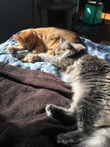

```{r setup, include=FALSE}
# # for Shiny Server
# learnr.dashboard::set_lib_paths("/home/siebrenf/miniconda3/envs/learnr/lib/R/library")

# packages
library(learnr)     # 0.10.1.9006 (github)
library(gradethis)  # 0.1.0.9004  (github)
library(testthat)   # 3.0.0 
library(tidyverse)  # 1.3.0
#library(ggplot2)    # 3.3.2

# configuration
knitr::opts_chunk$set(echo = FALSE)
# when using gradethis, additional options are passed to tutorial_options()
gradethis::gradethis_setup(
  exercise.timelimit = 30,  # max code execution time (sec)
)
# tutorial_options(
#   exercise.timelimit = 30,  # max code execution time (sec)
#   # exercise.checker = NULL
# )

# number of open tutorial windows (1 variable per tutorial)
# TODO: check if this works for multiple users, or if the variable must contain a user-ID
# instances <- reactiveValues(test = 0)
```

```{r, context="server"}
# isolate({
#   val <- instances$test + 1
#   instances$test <- val
# })
#
# session$onSessionEnded(function(){
#   isolate({
#     val <- instances$test - 1
#     instances$test <- val
#
#     if (instances$test < 1) {
#       cat("\nBrowser closed. Terminating...")
#       stopApp()
#     }
#   })
# })

# # idle timer: https://community.rstudio.com/t/keeping-track-of-idle-time-during-app-usage/1735
# (function() {
#   var timeoutWarningMsecs = 5 * 1000;
#   var idleTimer;
#
#   function onTimeout() {
#     alert('warning: session is about to time out!');
#   }
#
#   function startIdleTimer() {
#     if (idleTimer) clearTimeout(idleTimer);
#     idleTimer = setTimeout(onTimeout, timeoutWarningMsecs);
#   }
#
#   $(document).on('shiny:message shiny:inputchanged', startIdleTimer);
#
# })();
```


## embedding

### local image:



### online image:


### Some math: 

$a^2 + b^2 = c^2$.

### single line code:

`ls()`

### multi line code:

```
ls()

ls again: ls()
```

### A video:

{width="90%"}

## Exercises

default exercise code block:

```{r name, exercise=TRUE}

```

### exercise code block, more lines, and output is pre-evaluated:

```{r name2, exercise=TRUE, exercise.lines = 5, exercise.eval=TRUE}
head(mtcars)
```

### Exercise with Hint

*Here's an exercise where the chunk is pre-evaulated via the `exercise.eval` option (so the user can see the default output we'd like them to customize). We also add a "hint" to the correct solution via the chunk immediate below labeled `print-limit-hint`.*

Modify the following code to limit the number of rows printed to 5:

```{r print-limit, exercise=TRUE, exercise.eval=TRUE}
mtcars
```

```{r print-limit-hint}
head(mtcars)
```

### multiple hints

```{r add, exercise=TRUE}
1+1
```

```{r add-hint-1}
"it's 2"
```

```{r add-hint-2}
2
```

### exercise with a text hint

what is the 1st letter of the alphabet

```{r letter, exercise=TRUE}

```

only 1 text hint possible

<div id="letter-hint">
**Hint:** It's `a`.
</div>

### gradethis code checking

* Submit `1+1` to receive a correct grade.

```{r exercise1, exercise = TRUE}
1+1
```
 
```{r exercise1-check}
grade_result(
  pass_if(~identical(.result, 2))
)
```

adds a random remark when submitting

### custom code checking (setup chunk species checking method)

You can use the `count` function to count the number of observations in each level of a categorical variable.

How many automatic and how many manual transmission cars are in the data?

```{r filter, exercise=TRUE}

```

```{r filter-solution}
mtcars %>%
  count(am)
```

```{r filter-check}
"Great job!"
```

## Quiz

*You can include any number of single or multiple choice questions as a quiz. Use the `question` function to define a question and the `quiz` function for grouping multiple questions together.*

Some questions to verify that you understand the purposes of various base and recommended R packages:

```{r quiz}
quiz(
  question("Which package contains functions for installing other R packages?",
    answer("base"),
    answer("tools"),
    answer("utils", correct = TRUE),
    answer("codetools")
  ),
  question("Which of the R packages listed below are used to create plots?",
    answer("lattice", correct = TRUE),
    answer("tools"),
    answer("stats"),
    answer("grid", correct = TRUE)
  )
)
```

### question with retry ON

```{r var-types}
question(
  "Which of the following is a numerical variable?",
  answer("zip code", message = "Zip code is recoded using numbers, but it's not a numerical variable."),
  answer("height"),
  answer("handedness", correct = TRUE),
  allow_retry = TRUE,
  correct = "Fantastico!"
)
```

## Shiny

```{r, echo = FALSE}
sliderInput(
  "binwidth", 
  "Binwidth:", 
  min = 1, max = 30, value = 3
  )
plotOutput("hist")
```

```{r, context = "server"}
output$hist <- renderPlot({
  ggplot(data = mtcars, aes(x = mpg)) +
    geom_histogram(binwidth = input$binwidth) +
    labs(
      x = "Miles per gallon",
      y = "Frequency",
      title = "Distribution of MPG"
    )
})
```
